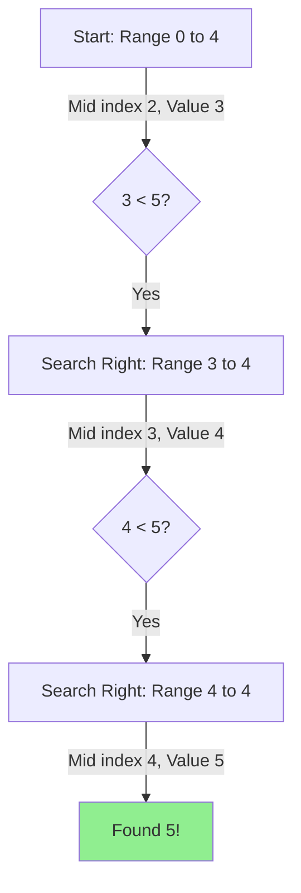

## Problem

> [BOJ 1920. 수 찾기](https://www.acmicpc.net/problem/1920)

N개의 정수 $A[1], A[2], \dots, A[N]$이 주어져 있을 때, 이 안에 $X$라는 정수가 존재하는지 알아내는 프로그램을 작성하시오.

```
Input:
5
4 1 5 2 3
5
1 3 7 9 5

Output:
1
1
0
0
1
```

---

## Initial Thought (Failed)

가장 직관적인 방법은 리스트 $A$를 처음부터 끝까지 순회하며 $X$를 찾는 것입니다 (**Linear Search**).

- **시간 복잡도**: $O(N)$
- $M$개의 쿼리를 처리해야 하므로 전체 복잡도는 $O(N \times M)$이 됩니다.
- 문제 조건에서 $N, M \le 100,000$이므로, $10^{10}$번의 연산이 발생하여 **시간 초과 (Time Limit Exceeded)**가 발생합니다.

---

## Key Insight

탐색 시간을 줄이기 위해서는 탐색 범위를 획기적으로 줄여야 합니다. 이를 위해 **이분 탐색 (Binary Search)** 또는 **해시 집합 (Hash Set)**을 사용할 수 있습니다.

> **이분 탐색 (Binary Search)**은 정렬된 데이터에서 탐색 범위를 절반씩 줄여나가며 값을 찾습니다.

---

## Step-by-Step: Finding `5`

`4 1 5 2 3` 배열에서 `5`를 찾는 과정을 이분 탐색으로 시각화해 보겠습니다. 먼저 배열을 **정렬**해야 합니다: `[1, 2, 3, 4, 5]`



1.  **정렬**: 데이터를 오름차순으로 정렬합니다. ($O(N \log N)$)
2.  **이분 탐색**: 각 쿼리에 대해 $O(\log N)$만에 값을 찾습니다.

---

## Solution

```python
import sys
from bisect import bisect_left

input = sys.stdin.readline

# 1. 입력 받기
N = int(input())
ns = list(map(int, input().split()))
M = int(input())
ms = list(map(int, input().split()))

# 2. 이분 탐색을 위한 정렬
ns.sort()

# 3. 각 쿼리 수행
for m in ms:
    # bisect_left: 정렬된 리스트에서 m이 들어갈 가장 왼쪽 인덱스 반환
    idx = bisect_left(ns, m)
    
    # 인덱스가 유효하고, 실제 값이 m과 일치하는지 확인
    if idx < N and ns[idx] == m:
        print(1)
    else:
        print(0)
    # end if
# end for
```

---

## Complexity

- **Time Complexity**: $O((N+M) \log N)$
    - 정렬: $O(N \log N)$
    - $M$번의 탐색: $M \times O(\log N)$
- **Space Complexity**: $O(N)$
    - 데이터를 저장할 리스트 공간

---

## Key Takeaways

| Point | Description |
|-------|-------------|
| **Linear Search** | $O(N)$으로 너무 느려 $N \ge 10^5$일 때 사용 불가 |
| **Binary Search** | 정렬된 데이터에서 $O(\log N)$으로 매우 빠름 |
| **Bisect Library** | Python의 `bisect_left`를 사용하면 구현 실수를 줄일 수 있음 |
