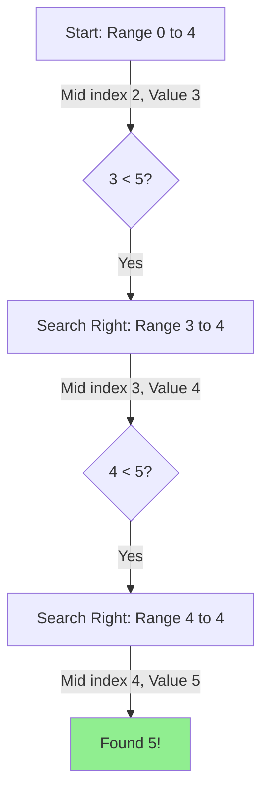

## Problem

> [BOJ 1920. Finding a Number](https://www.acmicpc.net/problem/1920)

Given $N$ integers $A[1], A[2], \dots, A[N]$, write a program that determines whether a given integer $X$ exists among them.

```
Input:
5
4 1 5 2 3
5
1 3 7 9 5

Output:
1
1
0
0
1
```

---

## Initial Thought (Failed)

The most intuitive approach is to traverse list $A$ from start to end to find $X$ (**Linear Search**).

- **Time Complexity**: $O(N)$
- Since we need to process $M$ queries, the overall complexity becomes $O(N \times M)$.
- Given the problem constraints $N, M \le 100,000$, this results in $10^{10}$ operations, causing a **Time Limit Exceeded**.

---

## Key Insight

To reduce the search time, we need to drastically narrow the search range. For this, we can use **Binary Search** or a **Hash Set**.

> **Binary Search** finds a value in sorted data by halving the search range at each step.

---

## Step-by-Step: Finding `5`

Let's visualize the process of finding `5` in the array `4 1 5 2 3` using binary search. First, we need to **sort** the array: `[1, 2, 3, 4, 5]`


```mermaid
graph TD
    A["Start: Range 0 to 4"] -->|Mid index 2, Value 3| B{"3 &lt; 5?"}
    B -- Yes --> C["Search Right: Range 3 to 4"]
    C -->|Mid index 3, Value 4| D{"4 &lt; 5?"}
    D -- Yes --> E["Search Right: Range 4 to 4"]
    E -->|Mid index 4, Value 5| F["Found 5!"]
    style F fill:#90EE90
```

1.  **Sort**: Sort the data in ascending order. ($O(N \log N)$)
2.  **Binary Search**: Find the value for each query in $O(\log N)$.

---

## Solution

```python
import sys
from bisect import bisect_left

input = sys.stdin.readline

# 1. Read input
N = int(input())
ns = list(map(int, input().split()))
M = int(input())
ms = list(map(int, input().split()))

# 2. Sort for binary search
ns.sort()

# 3. Process each query
for m in ms:
    # bisect_left: returns the leftmost index where m would be inserted in the sorted list
    idx = bisect_left(ns, m)
    
    # Check that the index is valid and the actual value matches m
    if idx < N and ns[idx] == m:
        print(1)
    else:
        print(0)
    # end if
# end for
```

---

## Complexity

- **Time Complexity**: $O((N+M) \log N)$
    - Sorting: $O(N \log N)$
    - $M$ searches: $M \times O(\log N)$
- **Space Complexity**: $O(N + M)$
    - List space to store the $N$ data values and the $M$ queries

---

## Key Takeaways

| Point | Description |
|-------|-------------|
| **Linear Search** | One lookup is $O(N)$; in this problem, $M$ independent queries make it $O(NM)$ and too slow at the maximum constraints |
| **Binary Search** | Very fast at $O(\log N)$ on sorted data |
| **Bisect Library** | Using Python's `bisect_left` reduces implementation mistakes |
