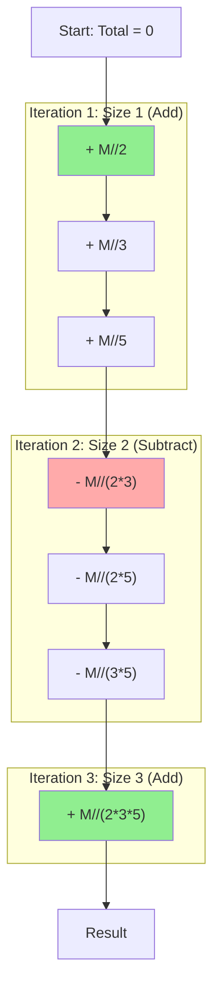

## Problem

> [BOJ 17436. Multiples of Primes](https://www.acmicpc.net/problem/17436)

You are given $N$ primes and a natural number $M$. Among the natural numbers up to $M$, count how many are divisible by at least one of the $N$ primes.

- $1 \le N \le 10$
- $1 \le M \le 10^{12}$
- The primes are at most $100$

```
Input:
2 10
2 3

Output:
7
```
*(Explanation: 2, 3, 4, 6, 8, 9, 10. Total 7 numbers divisible by 2 or 3.)*

---

## Initial Thought (Failed)

The simplest approach is to check every number from $1$ to $M$ (**Brute Force**).

- **Time Complexity**: $O(M)$
- Since $M \le 10^{12}$, iterating one by one is far too slow — at ~$10^6$ operations/sec (typical for Python) that is on the order of **10 days**, and only minutes even at C++ speed (~$10^9$/sec). A **mathematical approach** is absolutely required.

---

## Key Insight

We need the **Inclusion-Exclusion Principle**, which computes the size of a union of sets.

$$
|A \cup B| = |A| + |B| - |A \cap B|
$$
$$
|A \cup B \cup C| = (|A| + |B| + |C|) - (|A \cap B| + |A \cap C| + |B \cap C|) + (|A \cap B \cap C|)
$$

In other words:
1.  **Add** the count divisible by a single prime,
2.  **Subtract** the count divisible by the product (LCM) of two primes,
3.  **Add** the count divisible by the product of three primes...
and repeat.

---

## Step-by-Step Analysis

For $N=3$, primes $\{2, 3, 5\}$, and $M=30$:



1.  **Generate combinations**: Enumerate all $2^N$ subsets of the primes.
2.  **Determine the sign**: `+` if the subset size is odd, `-` if it is even.
3.  **Accumulate the count**: `total += sign * (M // LCM)`

---

## Solution

```python
import sys
import math
from itertools import combinations

input = sys.stdin.read
data = input().split()

# Process input
N = int(data[0])
M = int(data[1])
primes = list(map(int, data[2:]))

def lcm(a, b):
    # If a and b are primes this is simply a*b, but we use the general formula
    return a * b // math.gcd(a, b)
# end def

def solve():
    total_count = 0
    
    # Generate all combinations of choosing 1 to N primes
    for i in range(1, N + 1):
        for comb in combinations(primes, i):
            # Compute the least common multiple (LCM) of the chosen primes
            current_lcm = 1
            for p in comb:
                current_lcm = lcm(current_lcm, p)
                # Pruning: if the LCM exceeds M, there is nothing more to count
                if current_lcm > M:
                    break
                # end if
            # end for
            
            if current_lcm > M:
                continue
            # end if
            
            # Inclusion-exclusion: add for odd-sized sets, subtract for even-sized
            term = M // current_lcm
            if i % 2 == 1:
                total_count += term
            else:
                total_count -= term
            # end if
        # end for
    # end for
    
    print(total_count)
# end def

solve()
```

---

## Complexity

- **Time Complexity**: $O(2^N \cdot N)$
    - We iterate over all $2^N$ combinations that can be formed from $N$ primes.
    - Since $N=10$, this is about $2^{10} \approx 1000$ iterations, which is fast enough.
- **Space Complexity**: $O(N)$
    - The recursion stack or memory used to generate combinations

---

## Key Takeaways

| Point | Description |
|-------|-------------|
| **Inclusion-Exclusion** | A formula that handles overcounting when computing the size of a union |
| **Logic** | Add odd-sized sets and subtract even-sized sets |
| **Optimization** | Skip subsets whose LCM exceeds $M$ (the term $\lfloor M/\text{LCM}\rfloor$ is then 0) to avoid unnecessary computation — no overflow concern, since Python ints are arbitrary-precision |

