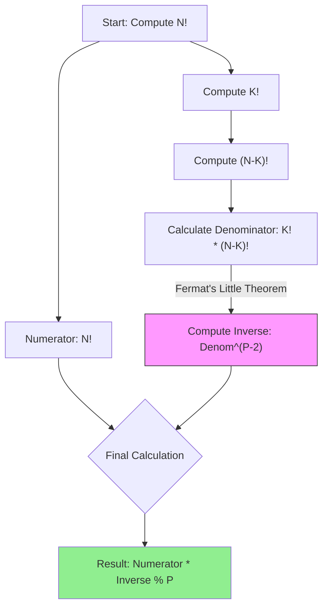

## Problem

> [BOJ 11401. 이항 계수 3](https://www.acmicpc.net/problem/11401)

자연수 $N$과 정수 $K$가 주어졌을 때 이항 계수 $\binom{N}{K}$를 $1,000,000,007$로 나눈 나머지를 구하는 프로그램을 작성하시오.

- $1 \le N \le 4,000,000$
- $0 \le K \le N$

```
Input:
5 2

Output:
10
```

---

## Initial Thought (Failed)

이항 계수의 정의는 다음과 같습니다.

$$
\binom{N}{K} = \frac{N!}{K!(N-K)!}
$$

**1. Dynamic Programming (Pascal's Triangle):**
$\binom{N}{K} = \binom{N-1}{K-1} + \binom{N-1}{K}$ 공식을 쓰면 $O(N^2)$의 시간과 메모리가 필요합니다. $N=4,000,000$이므로 **메모리 초과 (Memory Limit Exceeded)**가 발생합니다.

**2. Naive Division:**
팩토리얼을 직접 계산해서 나눗셈을 하려고 하면, 모듈러 연산의 성질에 의해 $(A / B) \pmod P \neq (A \pmod P) / (B \pmod P)$이므로 **오답**이 됩니다.

---

## Key Insight

나눗셈을 곱셈으로 바꾸기 위해 **모듈러 곱셈 역원 (Modular Multiplicative Inverse)**을 사용해야 합니다.

$$
(A / B) \pmod P \iff A \times B^{-1} \pmod P
$$

여기서 $P = 1,000,000,007$은 **소수(Prime)**이므로, **페르마의 소정리 (Fermat's Little Theorem)**를 사용할 수 있습니다.

> **Fermat's Little Theorem**: $B^{P-1} \equiv 1 \pmod P$
> 
> $\therefore B^{P-2} \equiv B^{-1} \pmod P$

즉, 분모의 $B = K!(N-K)!$에 대해 $B^{P-2}$를 곱하면 됩니다.

---

## Step-by-Step Analysis

계산 과정을 시각화하면 다음과 같습니다.



1.  **팩토리얼 계산**: $O(N)$으로 전처리하거나 그때그때 계산합니다.
2.  **거듭제곱 계산**: $P-2$승을 할 때 **분할 정복을 이용한 거듭제곱 (Exponentiation by Squaring)**을 사용하여 $O(\log P)$만에 계산합니다.

---

## Solution

```python
import sys
input = sys.stdin.readline

MOD = 1000000007

def power(base, exp):
    """
    분할 정복을 이용한 거듭제곱 (Exponentiation by Squaring)
    Time complexity: O(log exp)
    Result: (base^exp) % MOD
    """
    res = 1
    while exp > 0:
        if exp % 2 == 1:
            res = (res * base) % MOD
        # end if
        base = (base * base) % MOD
        exp //= 2
    # end while
    return res
# end def

def solve():
    n, k = map(int, input().split())
    
    # 팩토리얼 계산 (O(N))
    # N이 크므로 미리 계산하거나 순차적으로 계산
    fact = [1] * (n + 1)
    for i in range(2, n + 1):
        fact[i] = (fact[i-1] * i) % MOD
    # end for
    
    numerator = fact[n]
    denominator = (fact[k] * fact[n-k]) % MOD
    
    # 페르마의 소정리를 이용한 역원 계산
    # denominator^(MOD-2) % MOD
    inverse_denominator = power(denominator, MOD - 2)
    
    print((numerator * inverse_denominator) % MOD)
# end def

solve()
```

---

## Complexity

- **Time Complexity**: $O(N + \log P)$
    - 팩토리얼 전처리: $O(N)$
    - 거듭제곱(역원) 계산: $O(\log P)$
- **Space Complexity**: $O(N)$
    - 팩토리얼 저장을 위한 배열

---

## Key Takeaways

| Point | Description |
|-------|-------------|
| **Division in Modular** | 나눗셈은 직접 할 수 없고, **곱셈 역원**을 곱해야 함 |
| **Fermat's Little Theorem** | $P$가 소수일 때, 역원은 $B^{P-2} \pmod P$로 구할 수 있음 |
| **Fast Exponentiation** | 큰 지수의 거듭제곱은 분할 정복으로 $O(\log P)$에 해결 |

