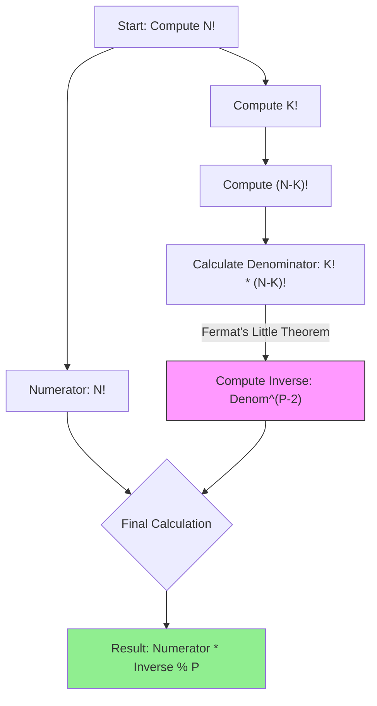

## Problem

> [BOJ 11401. Binomial Coefficient 3](https://www.acmicpc.net/problem/11401)

Given a natural number $N$ and an integer $K$, write a program that computes the binomial coefficient $\binom{N}{K}$ modulo $1,000,000,007$.

- $1 \le N \le 4,000,000$
- $0 \le K \le N$

```
Input:
5 2

Output:
10
```

---

## Initial Thought (Failed)

The binomial coefficient is defined as follows.

$$
\binom{N}{K} = \frac{N!}{K!(N-K)!}
$$

**1. Dynamic Programming (Pascal's Triangle):**
Using the formula $\binom{N}{K} = \binom{N-1}{K-1} + \binom{N-1}{K}$ requires $O(N^2)$ time and memory. Since $N=4,000,000$, this causes a **Memory Limit Exceeded**.

**2. Naive Division:**
If we compute the factorials directly and then divide, by the properties of modular arithmetic $(A / B) \pmod P \neq (A \pmod P) / (B \pmod P)$, so the result is **incorrect**.

---

## Key Insight

To convert division into multiplication, we need to use the **Modular Multiplicative Inverse**.

$$
(A / B) \pmod P \iff A \times B^{-1} \pmod P
$$

Here, $P = 1,000,000,007$ is **prime**, so we can use **Fermat's Little Theorem**.

> **Fermat's Little Theorem**: $B^{P-1} \equiv 1 \pmod P$
> 
> $\therefore B^{P-2} \equiv B^{-1} \pmod P$

In other words, for the denominator $B = K!(N-K)!$, it suffices to multiply by $B^{P-2}$.

---

## Step-by-Step Analysis

The computation process can be visualized as follows.


```mermaid
graph TD
    A["Start: Compute N!"] --> B["Compute K!"]
    B --> C["Compute (N-K)!"]
    C --> D["Calculate Denominator: K! * (N-K)!"]
    D -->|Fermat's Little Theorem| E["Compute Inverse: Denom^(P-2)"]
    A --> F["Numerator: N!"]
    F --> G{"Final Calculation"}
    E --> G
    G --> H["Result: Numerator * Inverse % P"]
    style E fill:#f9f,stroke:#333
    style H fill:#90EE90
```

1.  **Factorial computation**: Precompute in $O(N)$, or compute on the fly.
2.  **Exponentiation**: When raising to the power $P-2$, use **Exponentiation by Squaring** to compute it in $O(\log P)$.

---

## Solution

```python
import sys
input = sys.stdin.readline

MOD = 1000000007

def power(base, exp):
    """
    Exponentiation by Squaring
    Time complexity: O(log exp)
    Result: (base^exp) % MOD
    """
    res = 1
    while exp > 0:
        if exp % 2 == 1:
            res = (res * base) % MOD
        # end if
        base = (base * base) % MOD
        exp //= 2
    # end while
    return res
# end def

def solve():
    n, k = map(int, input().split())
    
    # Factorial computation (O(N))
    # Since N is large, precompute or compute sequentially
    fact = [1] * (n + 1)
    for i in range(2, n + 1):
        fact[i] = (fact[i-1] * i) % MOD
    # end for
    
    numerator = fact[n]
    denominator = (fact[k] * fact[n-k]) % MOD
    
    # Inverse computation using Fermat's Little Theorem
    # denominator^(MOD-2) % MOD
    inverse_denominator = power(denominator, MOD - 2)
    
    print((numerator * inverse_denominator) % MOD)
# end def

solve()
```

---

## Complexity

- **Time Complexity**: $O(N + \log P)$
    - Factorial precomputation: $O(N)$
    - Exponentiation (inverse) computation: $O(\log P)$
- **Space Complexity**: $O(N)$
    - Array to store the factorials

---

## Key Takeaways

| Point | Description |
|-------|-------------|
| **Division in Modular** | Division cannot be done directly; you must multiply by the **multiplicative inverse** |
| **Fermat's Little Theorem** | When $P$ is prime, the inverse can be found as $B^{P-2} \pmod P$ |
| **Fast Exponentiation** | Raising to a large exponent is solved in $O(\log P)$ via divide and conquer |

