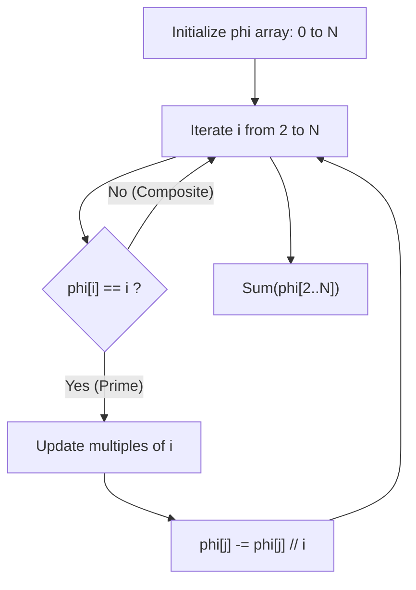

## Problem

> [BOJ 23832. Coprime Graph](https://www.acmicpc.net/problem/23832)

The coprime graph consists of $N$ vertices numbered from $1$ to $N$. Two distinct vertices are connected directly by a single edge if and only if their numbers are coprime.

Given the number of vertices $N$, find the number of edges that must be created.

- $2 \le N \le 50,000$

```
Input:
5

Output:
9
```

The number of edges equals the number of coprime pairs $(i, j)$ with $1 \le i < j \le N$, which is $\sum_{i=2}^{N} \phi(i)$. For $N = 5$: $\phi(2) + \phi(3) + \phi(4) + \phi(5) = 1 + 2 + 2 + 4 = 9$. Counting directly, the coprime pairs among $\{1, 2, 3, 4, 5\}$ are $(1,2), (1,3), (1,4), (1,5), (2,3), (2,5), (3,4), (3,5), (4,5)$ — also $9$.

---

## Initial Thought (Failed)

The simplest approach is to compute the greatest common divisor (GCD) for every pair of vertices $(i, j)$ (**Brute Force**).

- **Time complexity**: $O(N^2 \log (\min(N)))$
- When $N = 50,000$, we have $N^2 = 25 \times 10^8$, which causes **Time Limit Exceeded**.

---

## Key Insight

What we need to count is the number of pairs $(j, i)$ with $1 \le j < i \le N$ such that $\gcd(j, i) = 1$.
For a fixed $i$, the number of $j < i$ that are coprime to $i$ matches exactly the definition of **Euler's Totient Function** $\phi(i)$.

$$
\text{Total Edges} = \sum_{i=2}^{N} \phi(i)
$$
*(Note: $1$ is coprime to every number, but since an edge connects two vertices, there is no valid $j$ when $i = 1$, so we start from $i = 2$. Edges incident to vertex $1$ are already included in $\phi(i)$ for $i > 1$. For example, $\phi(2) = 1$ (the pair $1$–$2$), $\phi(3) = 2$ (the pairs $1$–$3$ and $2$–$3$), and so on.)*

---

## Step-by-Step Analysis

Rather than computing each $\phi(N)$ individually, it is more efficient to compute them all at once using a method similar to the **Sieve of Eratosthenes**.



1.  Initialize: `phi[i] = i`
2.  Whenever a prime $p$ is encountered, update the `phi` values of all multiples of $p$: $\phi(j) = \phi(j) \times (1 - 1/p) = \phi(j) - \phi(j)/p$

---

## Solution

```python
import sys
input = sys.stdin.readline

def count_coprime_edges(n):
    """
    Count the number of edges in the coprime graph
    Total edges = Sum of phi(i) for i in 2..N
    Time complexity: O(N log log N)
    """
    # 1. Initialize phi array
    # phi[i] stores the value of Euler's totient function for i
    phi = list(range(n + 1))
    
    # 2. Compute phi values using a sieve-like method
    for i in range(2, n + 1):
        # If phi[i] == i, it means i is a prime number
        if phi[i] == i:
            # Update all multiples of i
            for j in range(i, n + 1, i):
                phi[j] -= phi[j] // i
            # end for
        # end if
    # end for
    
    # 3. Sum all phi values
    return sum(phi[i] for i in range(2, n + 1))
# end def

n = int(input())
print(count_coprime_edges(n))
```

---

## Complexity

- **Time Complexity**: $O(N \log \log N)$
    - Same complexity as the Sieve of Eratosthenes
- **Space Complexity**: $O(N)$
    - Storage for the `phi` array

---

## Key Takeaways

| Point | Description |
|-------|-------------|
| **Euler's Totient Function** | $\phi(n)$: the count of positive integers up to $n$ that are coprime to $n$ |
| **Properties** | $\sum \phi(i)$ lets us quickly count the number of coprime pairs |
| **Sieve Method** | By applying the sieve principle used to find primes, a multiplicative function can be precomputed |

