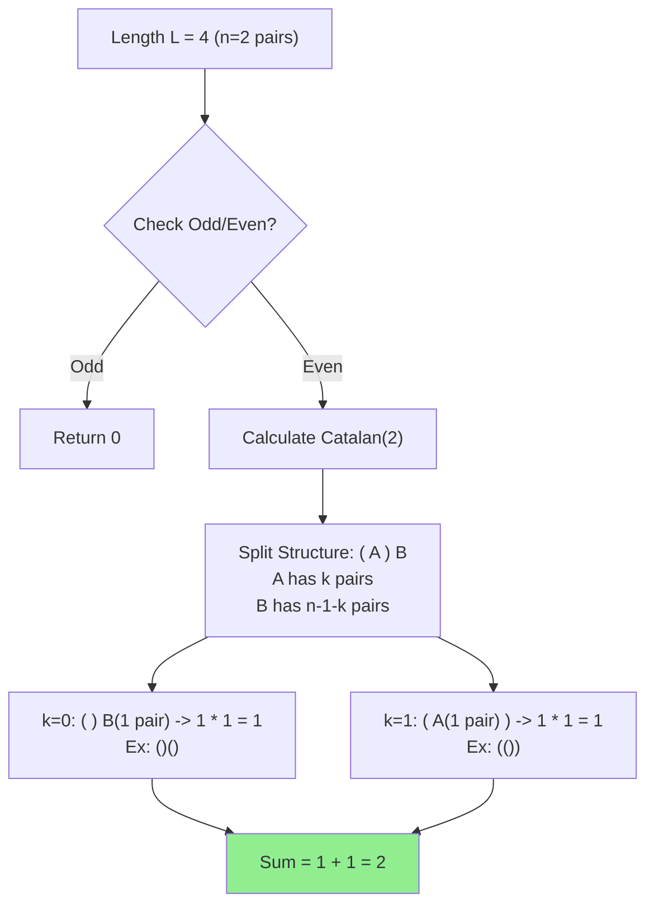

## Problem

> [BOJ 10422. 괄호](https://www.acmicpc.net/problem/10422)

길이가 $L$인 **올바른 괄호 문자열(VPS)**의 개수를 구하시오.
올바른 괄호 문자열은 `()`, `(())` 처럼 짝이 맞는 문자열을 말한다.

- $1 \le L \le 5000$
- 결과는 $1,000,000,007$로 나눈 나머지를 출력.

```
Input:
3
1
2
4

Output:
0
1
2
```

---

## Initial Thought (Failed)

길이가 $L$인 모든 문자열을 `(`와 `)`로 만들고 체크할까요?
- $2^L$ 개. $L=5000$이면 불가능합니다.

그럼 **DP**로 점화식을 세워볼까요?
- `dp[i]` = 길이가 `i`인 올바른 괄호 문자열의 개수.
- `(` 로 시작하고 `)` 로 끝나야 함.
- 마지막 `)`와 짝이 되는 첫 굳은 `(`의 위치를 찾아서 분할?
- `dp[i] = dp[0]*dp[i-2] + dp[2]*dp[i-4] ...`
- 식이 좀 복잡해집니다.

---

## Key Insight

이 문제는 **카탈란 수 (Catalan Number)**의 전형적인 예시입니다.
길이가 $L$인 올바른 괄호 문자열의 개수는 $\frac{L}{2}$쌍의 괄호로 만들 수 있는 올바른 문자열의 수와 같습니다.

- $L$이 홀수면: 0개 (짝이 안 맞음).
- $L=2n$이면: $C_n$ (카탈란 수).

$$
dp[n] = \sum_{k=0}^{n-1} dp[k] \times dp[n-1-k]
$$

여기서 $dp[n]$은 괄호 $n$쌍(길이 $2n$)인 경우입니다.
의미: 가장 바깥의 `( ... )` 쌍 안에 $k$쌍이 있고, 그 뒤에 $n-1-k$쌍이 있는 구조로 분할.

---

## Step-by-Step Analysis

$L=4$ (2쌍)일 때: `(())`, `()()` 총 2개.



1.  **전처리(Precomputation)**: $N=5000$이므로 $2500$쌍까지의 카탈란 수를 미리 구해둡니다.
2.  **DP Table**: $O(N^2)$으로 채웁니다. $N=2500$이면 $N^2 \approx 6 \times 10^6$으로 충분합니다.
3.  **Query**: 입력 $L$에 대해 $O(1)$로 출력.

---

## Solution

```python
import sys

# 미리 계산 (Precomputation)
MOD = 1000000007
MAX_L = 5000
MAX_N = MAX_L // 2 # 최대 괄호 쌍 개수

dp = [0] * (MAX_N + 1)
dp[0] = 1 # 0쌍인 경우 1가지 (공집합)

for n in range(1, MAX_N + 1):
    for k in range(n):
        # dp[n] += dp[k] * dp[n-1-k]
        dp[n] = (dp[n] + dp[k] * dp[n - 1 - k]) % MOD

input = sys.stdin.readline
T = int(input())

for _ in range(T):
    L = int(input())
    if L % 2 == 1:
        print(0)
    else:
        print(dp[L // 2])
```

---

## Complexity

- **Time Complexity**: $O(N^2)$ (전처리), $O(1)$ (쿼리)
    - $N = L/2$. 최대 $2500^2$ 연산.
- **Space Complexity**: $O(N)$
    - DP 테이블.

---

## Key Takeaways

| Point | Description |
|-------|-------------|
| **Catalan Number** | 괄호 쌍, 이진 트리 등 "올바른 구조"의 개수를 셀 때 등장 |
| **DP Relation** | $C_n = \sum C_k \times C_{n-1-k}$ |
| **Even Check** | 괄호 문제는 길이가 홀수일 때 불가능함을 먼저 체크 |

