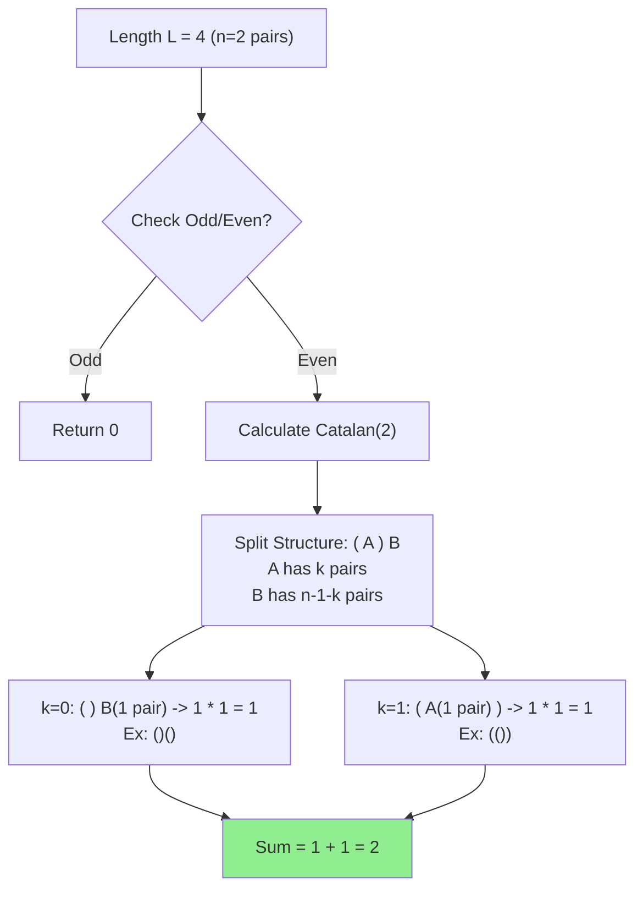

## Problem

> [BOJ 10422. Parentheses](https://www.acmicpc.net/problem/10422)

Count the number of **Valid Parenthesis Strings (VPS)** of length $L$.
A valid parenthesis string is one whose parentheses are properly matched, such as `()` or `(())`.

- $1 \le L \le 5000$
- Output the result modulo $1,000,000,007$.

```
Input:
3
1
2
4

Output:
0
1
2
```

---

## Initial Thought (Failed)

What if we generate every string of length $L$ over `(` and `)` and check each one?
- That gives $2^L$ strings. For $L=5000$ this is infeasible.

What about setting up a recurrence with **DP**?
- `dp[i]` = the number of valid parenthesis strings of length `i`.
- It must start with `(` and end with `)`.
- Split by finding the position of the opening `(` that matches the closing `)`?
- `dp[i] = dp[0]*dp[i-2] + dp[2]*dp[i-4] ...`
- The formula gets a bit complicated.

---

## Key Insight

This problem is a classic example of the **Catalan Number**.
The number of valid parenthesis strings of length $L$ equals the number of valid strings that can be formed with $\frac{L}{2}$ pairs of parentheses.

- If $L$ is odd: 0 (the parentheses cannot match).
- If $L=2n$: $C_n$ (the Catalan number).

$$
dp[n] = \sum_{k=0}^{n-1} dp[k] \times dp[n-1-k]
$$

Here $dp[n]$ is the case of $n$ pairs of parentheses (length $2n$).
Meaning: split the structure so that the outermost `( ... )` pair contains $k$ pairs inside, followed by $n-1-k$ pairs after it.

---

## Step-by-Step Analysis

For $L=4$ (2 pairs): `(())`, `()()` — 2 in total.


```mermaid
graph TD
    S1["Length L = 4 (n=2 pairs)"] --> C1{Check Odd/Even?}
    C1 -- Odd --> R1[Return 0]
    C1 -- Even --> D1["Calculate Catalan(2)"]
    
    D1 --> F1["Split Structure: ( A ) B <br> A has k pairs <br> B has n-1-k pairs"]
    
    F1 --> CA1["k=0: ( ) B(1 pair) -> 1 * 1 = 1 <br> Ex: ()()"]
    F1 --> CA2["k=1: ( A(1 pair) ) -> 1 * 1 = 1 <br> Ex: (())"]
    
    CA1 --> SUM["Sum = 1 + 1 = 2"]
    CA2 --> SUM
    style SUM fill:#90EE90
```

1.  **Precomputation**: Since $N=5000$, precompute the Catalan numbers up to $2500$ pairs.
2.  **DP Table**: Fill it in $O(N^2)$. For $N=2500$, $N^2 \approx 6 \times 10^6$, which is fast enough.
3.  **Query**: For each input $L$, output the answer in $O(1)$.

---

## Solution

```python
import sys

# Precomputation
MOD = 1000000007
MAX_L = 5000
MAX_N = MAX_L // 2 # maximum number of parenthesis pairs

dp = [0] * (MAX_N + 1)
dp[0] = 1 # 0 pairs: 1 way (the empty string)

for n in range(1, MAX_N + 1):
    for k in range(n):
        # dp[n] += dp[k] * dp[n-1-k]
        dp[n] = (dp[n] + dp[k] * dp[n - 1 - k]) % MOD

input = sys.stdin.readline
T = int(input())

for _ in range(T):
    L = int(input())
    if L % 2 == 1:
        print(0)
    else:
        print(dp[L // 2])
```

---

## Complexity

- **Time Complexity**: $O(N^2)$ (precomputation), $O(1)$ (query)
    - $N = L/2$. At most $2500^2$ operations.
- **Space Complexity**: $O(N)$
    - The DP table.

---

## Key Takeaways

| Point | Description |
|-------|-------------|
| **Catalan Number** | Appears when counting "valid structures" such as parenthesis pairs or binary trees |
| **DP Relation** | $C_n = \sum C_k \times C_{n-1-k}$ |
| **Even Check** | For parenthesis problems, first check that an odd length is impossible |

