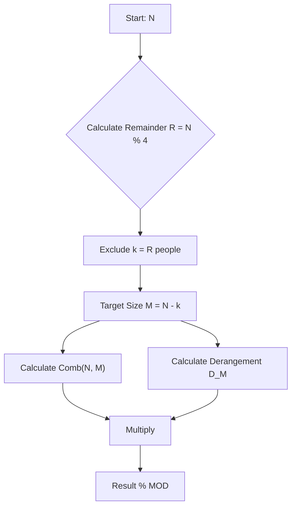

## Problem

> [BOJ 20443. Badminton Tournament](https://www.acmicpc.net/problem/20443)

There are $N$ participants.
1.  To make the number of participants a multiple of 4, randomly exclude $0 \sim 3$ people from the draw.
2.  Each remaining participant must draw a number tag that is not their own. (No one is matched with themselves.)

Find the total number of cases modulo $1,000,000,007$.

- $1 \le N \le 100$

```
Input:
4

Output:
9
```
*(Explanation: 4 is divisible by 4. k=0. M=4. Derangement D4 = 9.)*

---

## Initial Thought (Failed)

Can we simply generate all permutations and check whether `arr[i] != i`?

- **Number of permutations**: $N!$.
- When $N=100$, $100!$ is an astronomically large number that cannot be computed.

Therefore, we must use the **derangement** formula.

---

## Key Insight

This problem can be split into two stages.

1.  **Selection**: The number of ways to choose $M$ people out of $N$ that satisfy the condition, $\binom{N}{M}$.
    - Find $k \in \{0, 1, 2, 3\}$ such that $(N-k) \pmod 4 = 0$. Then $M = N-k$.
2.  **Derangement**: The number of ways the selected $M$ people all draw a number that is not their own, $D_M$.

$$
\text{Answer} = \binom{N}{M} \times D_M
$$

**Derangement recurrence**:
$$
D_n = (n-1)(D_{n-1} + D_{n-2})
$$

---

## Step-by-Step Analysis

When $N=5$:
1.  **Remainder check**: $5 \pmod 4 = 1$. So we must exclude $k=1$ person. Remaining count $M=4$.
2.  **Combination**: Choose 4 out of 5 people, $\binom{5}{4} = 5$.
3.  **Derangement**: $D_4 = 9$.
    - $D_1 = 0$
    - $D_2 = 1$ (21)
    - $D_3 = 2$ (231, 312)
    - $D_4 = 9$ (2143, 2341, 2413 ...)
4.  **Result**: $5 \times 9 = 45$.



---

## Solution

```python
import sys

# Read input
input = sys.stdin.readline
N = int(input())
MOD = 1000000007

# 1. Precompute the derangement counts with DP
# D[n] = (n-1) * (D[n-1] + D[n-2])
D = [0] * (N + 1)
D[0] = 1  # D[0] = 1: the derangement of the empty set (handles M = 0 when N in {1, 2, 3})
if N >= 2:
    D[2] = 1

for i in range(3, N + 1):
    D[i] = (i - 1) * (D[i - 1] + D[i - 2]) % MOD
# end for

# 2. Combination calculation function
# Since N is small (100), a Pascal's triangle or a simple loop would work without factorials,
# but here we do not need to worry about very large numbers, so we compute it directly (mind the modulo)
def combination(n, r):
    if r < 0 or r > n:
        return 0
    num = 1
    den = 1
    for i in range(r):
        num = num * (n - i)
        den = den * (i + 1)
    return (num // den) % MOD  # The division is exact, so integer-divide first and then take the modulo
# end def

# 3. Compute the answer
remainder = N % 4
M = N - remainder  # The largest count that is a multiple of 4

# Combination * derangement
comb_val = combination(N, M)
derange_val = D[M]

print((comb_val * derange_val) % MOD)
```

---

## Complexity

- **Time Complexity**: $O(N)$
    - Filling the $D_N$ table: $O(N)$.
    - Combination calculation: $O(N)$ — the code computes $\binom{N}{M}$ with $M = N - (N \bmod 4)$, so its loop runs $M$ times (not $O(1)$; it *could* be $O(1)$ via $\binom{N}{M} = \binom{N}{k}$ with $k = N \bmod 4 \le 3$, but the code passes $M$).
- **Space Complexity**: $O(N)$
    - The $D$ array.

---

## Key Takeaways

| Point | Description |
|-------|-------------|
| **Derangement ($!n$)** | The number of permutations in which no element stays in its own position |
| **Recurrence** | $D_n = (n-1)(D_{n-1} + D_{n-2})$ |
| **Modular Arithmetic** | Apply the modulo operation during intermediate steps as well to prevent overflow |

