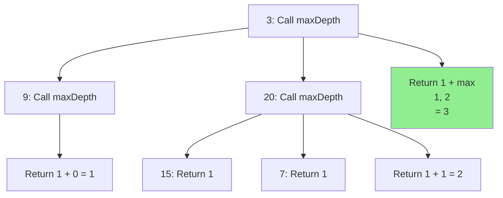

## Problem

> [LeetCode 104. Maximum Depth of Binary Tree](https://leetcode.com/problems/maximum-depth-of-binary-tree/)

Given the root of a binary tree, return its maximum depth (number of nodes along the longest path from root to leaf).

```
Input: root = [3,9,20,null,null,15,7]
Output: 3
```

---

## Initial Thought (Failed)

Can we just count the total nodes?
- No, depth is about the path. $N$ nodes could be a line (Depth $N$) or a balanced tree (Depth $\log N$).

Can we use **BFS (Level Order Traversal)**?
- Yes, BFS works fine. We can increment depth level by level.
- However, **DFS (Recursion)** is often shorter and more intuitive for depth problems.

---

## Key Insight

The depth of a tree is defined recursively:

$$
\text{Depth}(root) = 1 + \max(\text{Depth}(left), \text{Depth}(right))
$$

- **Base Case**: If root is `None`, depth is 0.
- **Recursive Step**: One step deeper than the deeper child.

---

## Step-by-Step Analysis

Tree: `3 -> [9, 20]`, `20 -> [15, 7]`



1.  Call `maxDepth(3)`
2.  -> `maxDepth(9)` returns 1.
3.  -> `maxDepth(20)` calls `maxDepth(15)` and `maxDepth(7)`, returns 2.
4.  Result: $1 + \max(1, 2) = 3$.

---

## Solution

```python
class Solution:
    def maxDepth(self, root: Optional[TreeNode]) -> int:
        # Base Case
        if root is None:
            return 0
        # end if
        
        # Recursive Step
        left_depth = self.maxDepth(root.left)
        right_depth = self.maxDepth(root.right)
        
        return 1 + max(left_depth, right_depth)
    # end def
```

---

## Complexity

- **Time Complexity**: $O(N)$
    - We must visit every node exactly once.
- **Space Complexity**: $O(H)$
    - Recursion stack depth is equal to the height of the tree ($H$).
    - Worst case (skewed): $O(N)$. Average (balanced): $O(\log N)$.

---

## Key Takeaways

| Point | Description |
|-------|-------------|
| **Recursion** | Tree problems usually have a simple recursive structure |
| **Base Case** | Always handle `None` nodes first |
| **DFS vs BFS** | Both work, but structural definitions favor DFS |
