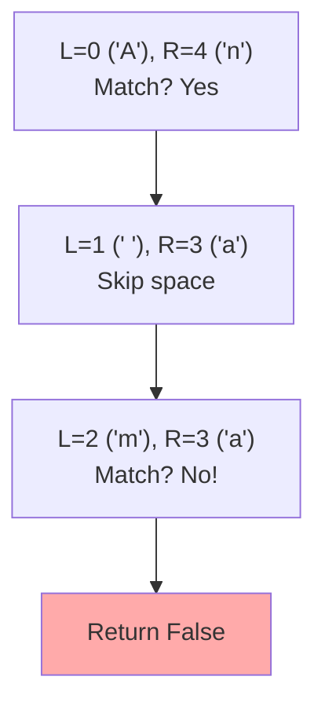

## Problem

> [LeetCode 125. Valid Palindrome](https://leetcode.com/problems/valid-palindrome/)

A phrase is a palindrome if, after converting all uppercase letters to lowercase and removing all non-alphanumeric characters, it reads the same forward and backward.

```
Input: s = "A man, a plan, a canal: Panama"
Output: true
Explanation: "amanaplanacanalpanama" is a palindrome.
```

---

## Initial Thought (Failed)

Create a new string with only filtered characters and check if it equals its reverse.

- `clean_s = [c.lower() for c in s if c.isalnum()]`
- `return clean_s == clean_s[::-1]`

**Is this bad?** No, it works. But it requires **$O(N)$ extra space** to store the cleaned string. Can we do it with **$O(1)$ space**?

---

## Key Insight

We can simply compare characters from the **outside in** using **Two Pointers**.

- `left` pointer starts at 0.
- `right` pointer starts at `len(s) - 1`.
- Skip non-alphanumeric characters.
- Stop if characters don't match.

---

## Step-by-Step Analysis

`s = "A man"`



(Oops, wait. `s="A man"`. `A` vs `n`. Fail immediately. The diagram logic works.)

Let's trace `s = "A b A"`:
1.  L at 'A', R at 'A'. Match. Move L->1, R->1.
2.  L at ' ', R at ' '. Skip.
3.  L at 'b', R at 'b'. Match.
4.  L > R. Success.

---

## Solution

```python
class Solution:
    def isPalindrome(self, s: str) -> bool:
        left, right = 0, len(s) - 1
        
        while left < right:
            # 1. Skip non-alphanumeric from left
            while left < right and not s[left].isalnum():
                left += 1
            # end while
            
            # 2. Skip non-alphanumeric from right
            while left < right and not s[right].isalnum():
                right -= 1
            # end while
            
            # 3. Compare (case-insensitive)
            if s[left].lower() != s[right].lower():
                return False
            # end if
            
            left += 1
            right -= 1
        # end while
        
        return True
    # end def
```

---

## Complexity

- **Time Complexity**: $O(N)$
    - We iterate through the string at most once.
- **Space Complexity**: $O(1)$
    - We only use two integer variables. No extra string creation.

---

## Key Takeaways

| Point | Description |
|-------|-------------|
| **Two Pointers** | Standard technique for meeting-in-the-middle or comparing ends |
| **In-Place** | Avoiding extra memory allocation is a key optimization |
| **Handling Noise** | Skipping invalid characters allows checking logic to remain clean |
