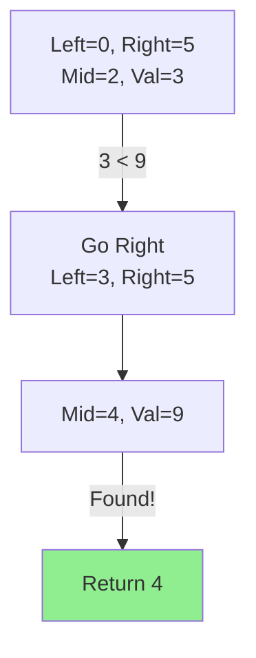

## Problem

> [LeetCode 704. Binary Search](https://leetcode.com/problems/binary-search/)

Given a sorted array of integers `nums` and an integer `target`, return the index of `target` if it exists, otherwise return `-1`.

**Constraint**: $O(\log N)$ runtime complexity.

```
Input: nums = [-1,0,3,5,9,12], target = 9
Output: 4
```

---

## Initial Thought (Failed)

Iterate from start to end and check each element (**Linear Search**).

- **Time Complexity**: $O(N)$.
- This does not satisfy the constraint of $O(\log N)$. LINEAR IS TOO SLOW.

---

## Key Insight

Since the array is **sorted**, we can exploit this property.
If we check the middle element:
- `nums[mid] == target`: Found it!
- `nums[mid] > target`: Target must be in the **left** half.
- `nums[mid] < target`: Target must be in the **right** half.

This eliminates half of the search space in every step (**Binary Search**).

---

## Step-by-Step Analysis

`nums = [-1, 0, 3, 5, 9, 12]`, `target = 9`



1.  $L=0, R=5$. $M=2$. `nums[2]=3`. $3 < 9$. New $L=3$.
2.  $L=3, R=5$. $M=4$. `nums[4]=9`. $9 == 9$. Found.

---

## Solution

```python
class Solution:
    def search(self, nums: List[int], target: int) -> int:
        left, right = 0, len(nums) - 1
        
        while left <= right:
            mid = left + (right - left) // 2
            
            if nums[mid] == target:
                return mid
            elif nums[mid] > target:
                right = mid - 1
            else:
                left = mid + 1
            # end if
        # end while
        
        return -1
    # end def
```

---

## Complexity

- **Time Complexity**: $O(\log N)$
    - Search space is divided by 2 each time. $\log_2 N$.
- **Space Complexity**: $O(1)$
    - Iterative approach uses constant memory. Recursive uses $O(\log N)$ stack.

---

## Key Takeaways

| Point | Description |
|-------|-------------|
| **Sorted Array** | The key condition enabling Binary Search |
| **Overflow** | `left + (right - left) // 2` prevents integer overflow vs `(l+r)//2` |
| **Loop Condition** | `left <= right` is crucial to include the last element |
