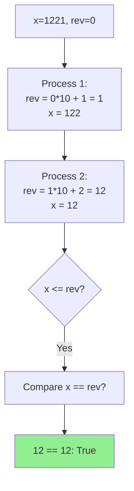

## Problem

> [LeetCode 9. Palindrome Number](https://leetcode.com/problems/palindrome-number/)

Given an integer `x`, return `true` if it's a palindrome (reads the same backward).

```
Input: x = 121
Output: true
```

---

## Initial Thought (Failed)

Convert the integer to a string and check if it reads the same backwards.
- `s = str(x)`
- `return s == s[::-1]`

**Why avoid this?**
- It uses **extra space** proportional to the number of digits.
- The problem often asks (as a follow-up) to do it without converting to string.

---

## Key Insight

We can construct the **reverse** of the number mathematically.
However, reversing the *entire* number might cause **integer overflow** (in languages with fixed integer sizes).

**Better Idea**: Revert only **half** of the number!
- Given `1221`.
- Right Half Reversed: `12`. Remaining Left Half: `12`.
- `12 == 12`.

---

## Step-by-Step Analysis

`x = 1221`



1.  Stop loop when `x <= reversed_half`.
2.  If even length (`1221`), `x == reversed_half`.
3.  If odd length (`121`), `x == reversed_half // 10` (ignore middle digit).

---

## Solution

```python
class Solution:
    def isPalindrome(self, x: int) -> bool:
        # Edge cases: Negative numbers or numbers ending with 0 (except 0)
        if x < 0 or (x % 10 == 0 and x != 0):
            return False
        # end if
        
        reversed_half = 0
        while x > reversed_half:
            reversed_half = reversed_half * 10 + x % 10
            x //= 10
        # end while
        
        # Even length vs Odd length
        return x == reversed_half or x == reversed_half // 10
    # end def
```

---

## Complexity

- **Time Complexity**: $O(\log_{10} N)$
    - We iterate through half the number of digits.
- **Space Complexity**: $O(1)$
    - No strings, just integers.

---

## Key Takeaways

| Point | Description |
|-------|-------------|
| **Math Reversal** | `rev = rev * 10 + digit` pattern |
| **Half Execution** | Stopping halfway avoids overflow and redundant checks |
| **Edge Cases** | Negative numbers and logic for trailing zeros |
