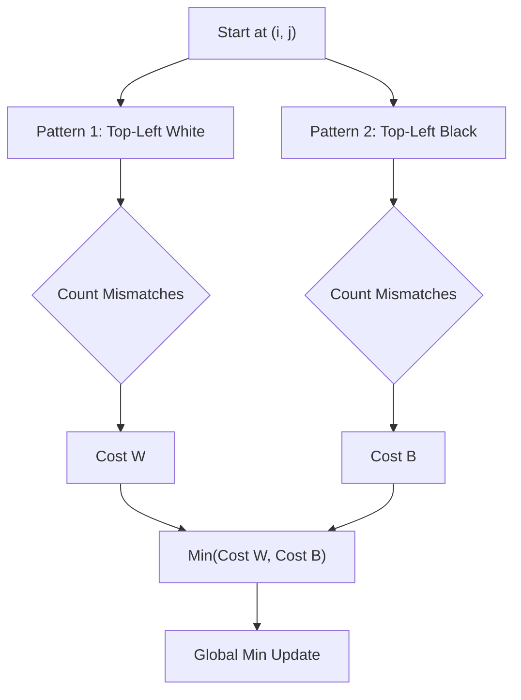

## Problem

> [BOJ 1018. Repainting the Chessboard](https://www.acmicpc.net/problem/1018)

Jimin wants to cut an $N \times M$ board into an $8 \times 8$ chessboard.
A chessboard must be painted with black and white alternating.

Find the minimum number of squares that have to be repainted.

- $8 \le N, M \le 50$

```
Input:
10 13
BBBBBBBBWBWBW
BBBBBBBBBWBWB
...

Output:
12
```

---

## Initial Thought (Failed)

Could this be solved with a greedy algorithm?
What if we decide on the fly whether repainting the current cell is worthwhile?

- It does not work. Leaving the first cell unpainted might be optimal, or painting it might be optimal. You can only tell once the entire $8 \times 8$ pattern is completed.

---

## Key Insight

There are **only two** possible patterns for an $8 \times 8$ chessboard!

1.  The case where the **top-left starts with white (W)**
2.  The case where the **top-left starts with black (B)**

Since the input size is very small at $N, M \le 50$, a **Brute Force (exhaustive search)** approach is feasible: **cut out every possible $8 \times 8$ region** and compare it against the two patterns.

---

## Step-by-Step Analysis

When $(i, j)$ is taken as the starting point for forming an $8 \times 8$ chessboard:



1.  **Iterate**: Loop over starting points $(i, j)$ up to row $N-7$ and column $M-7$.
2.  **Check**: From each starting point, scan inside the $8 \times 8$ region.
3.  **Count**: Verify whether the color matches based on `(row + col) % 2`.

---

## Solution

```python
import sys

# Read input
input = sys.stdin.readline
N, M = map(int, input().split())
board = [input().strip() for _ in range(N)]

min_repaint = float('inf')

# 1. Iterate over every possible 8x8 starting point
for i in range(N - 7):
    for j in range(M - 7):
        cost_start_w = 0
        cost_start_b = 0
        
        # 2. Inspect inside the 8x8 region
        for x in range(i, i + 8):
            for y in range(j, j + 8):
                current_color = board[x][y]
                
                # The expected color is determined by whether (x + y) is even or odd
                is_even_sum = (x + y) % 2 == 0
                
                # Case 1: Start with 'W' (Even sum -> W, Odd sum -> B)
                if is_even_sum:
                    if current_color != 'W': cost_start_w += 1
                    if current_color != 'B': cost_start_b += 1
                else:
                    if current_color != 'B': cost_start_w += 1
                    if current_color != 'W': cost_start_b += 1
                # end if
            # end for
        # end for
        
        min_repaint = min(min_repaint, cost_start_w, cost_start_b)
    # end for
# end for

print(min_repaint)
```

---

## Complexity

- **Time Complexity**: $O(NM)$
    - Precisely, $(N-7)(M-7) \times 64$ operations.
    - The maximum operation count is $\approx 43 \times 43 \times 64 \approx 120,000$, which is very small.
- **Space Complexity**: $O(NM)$
    - Storage for the board.

---

## Key Takeaways

| Point | Description |
|-------|-------------|
| **Brute Force** | The most reliable solution when the input size is small |
| **Chessboard Pattern** | Use `(r+c) % 2` to easily check the checkered pattern |
| **Search Space** | Explore all $(N-7) \times (M-7)$ sub-chessboards |

