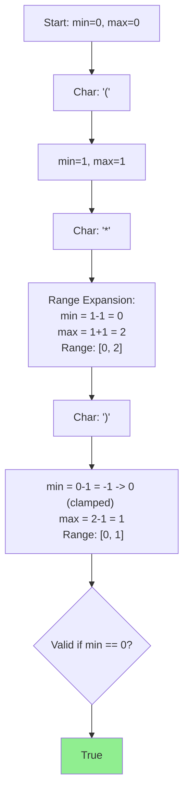

## Problem

> [LeetCode 678. Valid Parenthesis String](https://leetcode.com/problems/valid-parenthesis-string/)

Given a string containing `(`, `)`, and `*`, determine if it's valid. The `*` can be treated as `(`, `)`, or empty.

```
Input: s = "(*)"
Output: true
```

---

## Initial Thought (Failed)

Use **Recursion** (DFS) for every `*`.
- When `*` is met, branch into 3 cases: `(`, `)`, or ``.
- **Complexity**: $3^K$ where $K$ is the number of asterisks.
- This is exponential and will TLE for $N=100$.

How about a **Stack**?
- `*` complicates the stack because we don't know the future. We can't greedily pop.

---

## Key Insight

Instead of tracking the *exact* number of open parentheses, we should track the **possible range** of open parentheses count: `[min_open, max_open]`.

- `(`: Increments both min and max.
- `)`: Decrements both min and max.
- `*`:
    - Can act as `)`: Decrement min.
    - Can act as `(`: Increment max.
    - Can act as empty: No change to logical "center" (effectively captured by range).

---

## Step-by-Step Analysis

`s = "(*)"`



1.  If `max < 0`: Too many closing parentheses. Fail.
2.  If `min < 0`: Force it to 0 (we can't have negative open count, `*` treated as `)` was too aggressive, treat as empty instead).
3.  End: Check if `min == 0` (can we close everything?).

---

## Solution

```python
class Solution:
    def checkValidString(self, s: str) -> bool:
        min_open = 0
        max_open = 0
        
        for char in s:
            if char == '(':
                min_open += 1
                max_open += 1
            elif char == ')':
                min_open -= 1
                max_open -= 1
            else:  # char == '*'
                min_open -= 1  # Treat as ')'
                max_open += 1  # Treat as '('
            # end if
            
            if max_open < 0:
                return False  # Too many ')'
            
            min_open = max(min_open, 0)  # Can't drop below 0
        # end for
        
        return min_open == 0
    # end def
```

---

## Complexity

- **Time Complexity**: $O(N)$
    - Single pass through string.
- **Space Complexity**: $O(1)$
    - Only variables.

---

## Key Takeaways

| Point | Description |
|-------|-------------|
| **Range Tracking** | Handling uncertainty (`*`) by maintaining intervals |
| **Clamp** | `min_open` logic prevents invalid states (negative open count) |
