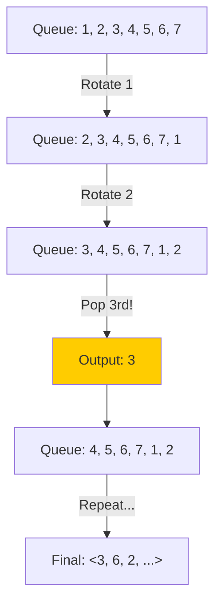

## Problem

> [BOJ 11866. 요세푸스 문제 0](https://www.acmicpc.net/problem/11866)

1번부터 $N$번까지 $N$명의 사람이 원을 이루면서 앉아있고, 양의 정수 $K(\le N)$가 주어진다. 순서대로 $K$번째 사람을 제거한다. 한 사람이 제거되면 남은 사람들로 이루어진 원을 따라 이 과정을 계속해 나간다.

$(N, K)$-요세푸스 순열을 구하시오.

```
Input:
7 3

Output:
<3, 6, 2, 7, 5, 1, 4>
```

---

## Initial Thought (Failed)

배열(List)을 사용해서 모듈러 연산으로 인덱스를 계산하며 제거하면 어떨까요?

- `current_index = (current_index + K - 1) % len(list)`
- `list.pop(current_index)`

이 방식은 직관적이지만, 배열의 중간 요소를 삭제(`pop`)하는 연산은 $O(N)$의 비용이 듭니다. 전체 시간 복잡도는 $O(N^2)$이 됩니다. $N$이 작을 때는 상관없지만, 구조적으로 비효율적입니다.

---

## Key Insight

원형으로 앉아있다는 것은, 끝과 시작이 연결되어 있다는 뜻입니다. 이를 선형 자료구조인 **큐(Queue)**로 모델링할 수 있습니다.

> "맨 앞의 사람을 맨 뒤로 보낸다" = **회전(Rotation)**

$K$번째 사람을 제거하기 위해, 앞의 $K-1$명을 뒤로 보내고, $K$번째 사람을 큐에서 완전히 빼내면 됩니다.

---

## Step-by-Step Analysis

$N=7, K=3$인 경우: `[1, 2, 3, 4, 5, 6, 7]`



1.  **Skip**: $K-1$번 `popleft` 후 `append`.
2.  **Delete**: $K$번째 `popleft` 후 결과 리스트에 저장.
3.  큐가 빌 때까지 반복.

---

## Solution

```python
import sys
from collections import deque

input = sys.stdin.readline
N, K = map(int, input().split())

# 1. 큐 초기화
queue = deque(range(1, N + 1))
result = []

while queue:
    # 2. K-1번 회전: 맨 앞 사람을 맨 뒤로 이동
    for _ in range(K - 1):
        queue.append(queue.popleft())
    # end for
    
    # 3. K번째 사람 제거
    result.append(queue.popleft())
# end while

# 출력 형식 맞추기: <3, 6, ...>
print('<' + ', '.join(map(str, result)) + '>')
```

---

## Complexity

- **Time Complexity**: $O(N \times K)$
    - 총 $N$명을 제거합니다.
    - 한 명 제거할 때마다 $K$번의 큐 연산($O(1)$)이 발생합니다.
- **Space Complexity**: $O(N)$
    - 큐에 $N$명의 데이터를 저장합니다.

---

## Key Takeaways

| Point | Description |
|-------|-------------|
| **Queue for Cycle** | 원형 문제는 큐의 Rotation(Pop front & Push back)으로 단순화 가능 |
| **Deque** | Python의 `collections.deque`는 양쪽 끝 접근이 $O(1)$로 효율적 |
| **Modulo Arithmetic** | 배열 인덱스로만 접근하면 코드가 복잡해질 수 있음 (off-by-one 에러 주의) |

