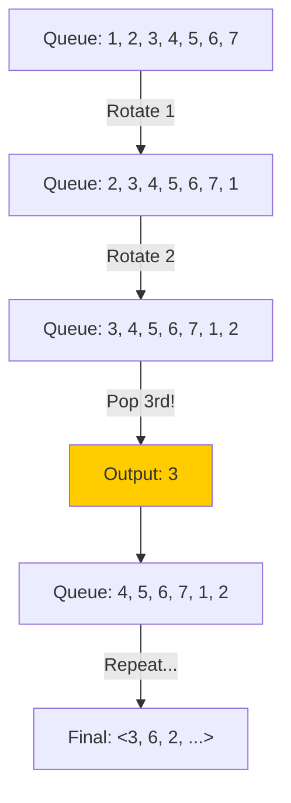

## Problem

> [BOJ 11866. Josephus Problem 0](https://www.acmicpc.net/problem/11866)

$N$ people numbered from $1$ to $N$ sit in a circle, and a positive integer $K(\le N)$ is given. Going around the circle, every $K$-th person is removed. Once a person is removed, the process continues around the circle formed by the remaining people.

Find the $(N, K)$-Josephus permutation.

```
Input:
7 3

Output:
<3, 6, 2, 7, 5, 1, 4>
```

---

## Initial Thought (Failed)

What if we use a list (array) and compute indices with modular arithmetic to remove elements?

- `current_index = (current_index + K - 1) % len(list)`
- `list.pop(current_index)`

This approach is intuitive, but removing (`pop`) an element from the middle of an array costs $O(N)$. The overall time complexity becomes $O(N^2)$. It's fine when $N$ is small, but it is structurally inefficient.

---

## Key Insight

Sitting in a circle means the end and the start are connected. We can model this with a **queue**, a linear data structure.

> "Move the person at the front to the back" = **Rotation**

To remove the $K$-th person, we send the first $K-1$ people to the back and then take the $K$-th person completely out of the queue.

---

## Step-by-Step Analysis

For $N=7, K=3$: `[1, 2, 3, 4, 5, 6, 7]`


```mermaid
graph TD
    Q1["Queue: 1, 2, 3, 4, 5, 6, 7"] -->|Rotate 1| Q2["Queue: 2, 3, 4, 5, 6, 7, 1"]
    Q2 -->|Rotate 2| Q3["Queue: 3, 4, 5, 6, 7, 1, 2"]
    Q3 -->|Pop 3rd!| O1["Output: 3"]
    O1 --> Q4["Queue: 4, 5, 6, 7, 1, 2"]
    Q4 -->|Repeat...| F["Final: &lt;3, 6, 2, ...&gt;"]
    style O1 fill:#ffcc00
```

1.  **Skip**: `popleft` $K-1$ times, then `append`.
2.  **Delete**: `popleft` the $K$-th person and store it in the result list.
3.  Repeat until the queue is empty.

---

## Solution

```python
import sys
from collections import deque

input = sys.stdin.readline
N, K = map(int, input().split())

# 1. Initialize the queue
queue = deque(range(1, N + 1))
result = []

while queue:
    # 2. Rotate K-1 times: move the front person to the back
    for _ in range(K - 1):
        queue.append(queue.popleft())
    # end for
    
    # 3. Remove the K-th person
    result.append(queue.popleft())
# end while

# Format the output: <3, 6, ...>
print('<' + ', '.join(map(str, result)) + '>')
```

---

## Complexity

- **Time Complexity**: $O(N \times K)$
    - We remove $N$ people in total.
    - Each removal involves $K$ queue operations ($O(1)$ each).
- **Space Complexity**: $O(N)$
    - The queue stores data for $N$ people.

---

## Key Takeaways

| Point | Description |
|-------|-------------|
| **Queue for Cycle** | Circular problems can be simplified using queue rotation (pop front & push back) |
| **Deque** | Python's `collections.deque` offers efficient $O(1)$ access at both ends |
| **Modulo Arithmetic** | Relying solely on array indices can make the code complex (watch out for off-by-one errors) |

