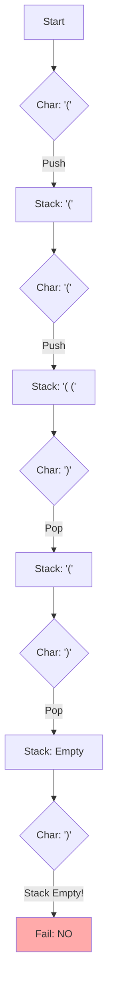

## Problem

> [BOJ 9012. Parentheses](https://www.acmicpc.net/problem/9012)

Determine whether a parenthesis string (PS) is a valid parenthesis string (VPS, Valid Parenthesis String).

```
Input:
6
(())())
(((()())()
(()())((()))
((()()(()))(((())))()
()()()()(()()())()
(()((())()(

Output:
NO
NO
YES
NO
YES
NO
```

---

## Initial Thought (Failed)

Couldn't we just **compare the counts** of opening parentheses `(` and closing parentheses `)`?

- Example: `)(`
    - Count of `(`: 1, count of `)`: 1 → equal.
    - But this is not a valid parenthesis string. A closing parenthesis cannot come first.

In other words, **order** matters.

---

## Key Insight

The most recently opened parenthesis must be closed first. This matches exactly the **LIFO (Last In First Out)** structure of a **Stack**.

- `(`: push onto the stack
- `)`: pop from the stack -> match the pair

---

## Step-by-Step Analysis

Input: `(()))(`



1.  If `)` appears while the stack is empty → **NO**.
2.  If the stack still has `(` left after reaching the end of the string → **NO**.
3.  If the stack is cleanly empty → **YES**.

---

## Solution

```python
import sys

# Read input
input = sys.stdin.readline
T = int(input())

for _ in range(T):
    ps = input().strip()
    stack = []
    valid = True
    
    for char in ps:
        if char == '(':
            stack.append(char)
        else:  # char == ')'
            if stack:
                stack.pop()
            else:
                # A closing parenthesis appeared while the stack was empty
                valid = False
                break
            # end if
        # end if
    # end for
    
    # 1. No error occurred along the way (valid == True)
    # 2. No parentheses must remain on the stack (not stack)
    if valid and not stack:
        print("YES")
    else:
        print("NO")
    # end if
# end for
```

---

## Complexity

- **Time Complexity**: $O(N)$
    - We traverse the string once for its full length. Stack operations are $O(1)$.
- **Space Complexity**: $O(N)$
    - In the worst case (all `(`), $N$ items pile up on the stack.

---

## Key Takeaways

| Point | Description |
|-------|-------------|
| **Stack** | Essential for pair-matching and order-dependent matching problems |
| **Corner Cases** | Check for `pop` on an empty stack, and for leftover items on the stack after finishing |
| **LIFO** | The last one in goes out first (Last In First Out) |

