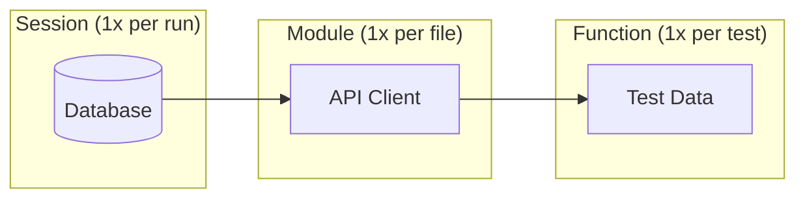
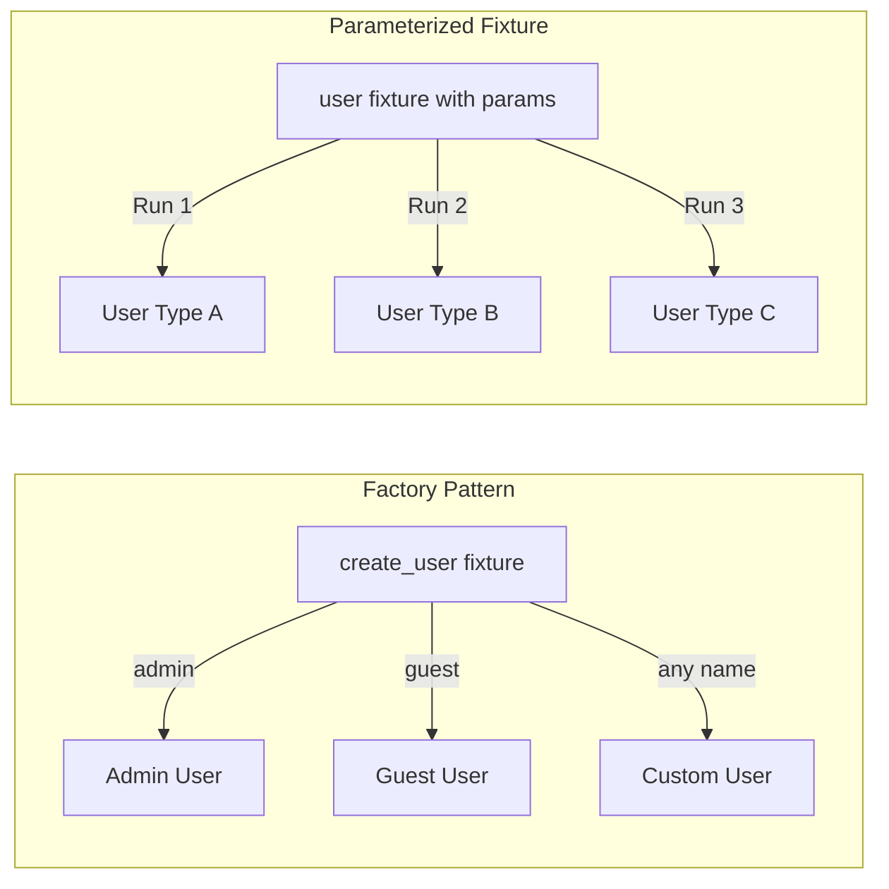
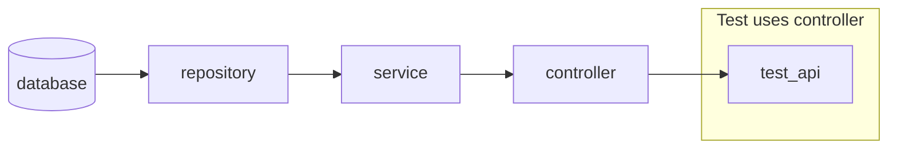
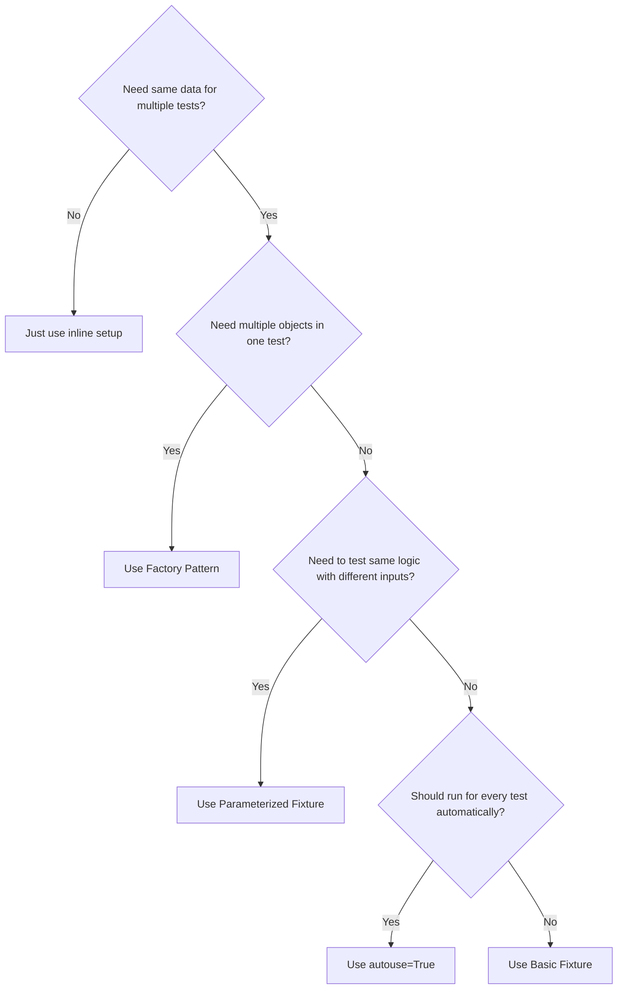

## Introduction

While refactoring a test suite with 200+ tests, I kept running into the same problems: duplicate setup code, slow tests due to repeated database connections, and tests that were impossible to read. This post documents the fixture patterns I learned to solve these issues.

## What is a Fixture?

A fixture is reusable setup/teardown code. Instead of repeating the same setup in every test, you define it once:

```python
import pytest

@pytest.fixture
def sample_user() -> dict:
    """Create a sample user for testing."""
    return {
        "id": 1,
        "name": "Test User",
        "email": "test@example.com"
    }
# end def

def test_user_has_email(sample_user: dict) -> None:
    """Test uses the fixture by adding it as a parameter."""
    assert "email" in sample_user
# end def
```

---

## Scope: Controlling Fixture Lifetime

The most confusing part of fixtures is **scope**. Here's when each scope runs:



**Scope Lifecycle:**
- **Session**: Created once when `pytest` starts, destroyed when all tests finish
- **Module**: Created once per test file, destroyed after file's tests complete
- **Function**: Created fresh for each test, destroyed after test finishes

### Scope Comparison

| Scope | Lifetime | Created | Destroyed | Use Case |
|-------|----------|---------|-----------|----------|
| `function` | Per test | Before each test | After each test | **Default.** Test data that must be fresh (e.g., mutable objects) |
| `class` | Per test class | Before first test in class | After last test in class | Shared state within a test class |
| `module` | Per file | Before first test in file | After last test in file | Expensive setup shared by related tests (e.g., API clients) |
| `session` | Entire run | Once at start | Once at end | Very expensive setup (e.g., database, Docker containers) |

### Real-World Example: When to Use Each Scope

```python
# session: Database takes 5 seconds to start
@pytest.fixture(scope="session")
def database():
    """Start database once for entire test run."""
    db = Database()
    db.migrate()  # 5 seconds
    yield db
    db.cleanup()
# end def

# module: API client authentication takes 1 second
@pytest.fixture(scope="module")
def api_client(database):
    """Shared API client for all tests in this file."""
    client = APIClient(database)
    client.authenticate()  # 1 second
    yield client
    client.logout()
# end def

# function (default): Test data must be fresh for each test
@pytest.fixture
def test_user(api_client):
    """Fresh user for each test (default scope)."""
    user = api_client.create_user(name="Test")
    yield user
    api_client.delete_user(user.id)  # Cleanup
# end def
```

**Result**: Instead of 5 + 1 = 6 seconds per test, the database starts once (5s) and API authenticates once per file (1s). A 100-test suite goes from 600s to ~15s.

---

## Factory vs Parameterized: Which Pattern to Use?

These two patterns look similar but solve different problems:



### Pattern Comparison

| Aspect | Factory | Parameterized |
|--------|---------|---------------|
| **Test runs** | Once | N times (once per param) |
| **Control** | Test decides what to create | Fixture decides all variations |
| **Use case** | Need different objects in same test | Test same logic with different inputs |
| **Output** | Function that creates objects | Each param value becomes a test |

### Factory Pattern: Multiple Objects in One Test

When you need **different objects within the same test**:

```python
@pytest.fixture
def create_order():
    """Factory: create orders with custom attributes."""
    orders = []
    
    def _create(product: str, quantity: int = 1) -> Order:
        order = Order(product=product, quantity=quantity)
        orders.append(order)
        return order
    # end def
    
    yield _create
    
    for order in orders:
        order.delete()
    # end for
# end def

def test_order_total(create_order) -> None:
    """Test needs multiple different orders."""
    laptop = create_order("Laptop", quantity=2)
    mouse = create_order("Mouse", quantity=5)
    
    assert laptop.total > mouse.total
# end def
```

### Parameterized Fixture: Same Test, Multiple Inputs

When you need to **run the same test with different inputs**:

```python
@pytest.fixture(params=[
    {"role": "admin", "can_delete": True},
    {"role": "editor", "can_delete": False},
    {"role": "viewer", "can_delete": False},
])
def user_permissions(request):
    """Each param becomes a separate test run."""
    return request.param
# end def

def test_delete_permission(user_permissions) -> None:
    """This test runs 3 times (once per role)."""
    role = user_permissions["role"]
    expected = user_permissions["can_delete"]
    
    user = User(role=role)
    assert user.can_delete() == expected
# end def
```

**Test output shows 3 tests:**
```
test_delete_permission[admin] PASSED
test_delete_permission[editor] PASSED
test_delete_permission[viewer] PASSED
```

---

## Fixture Composition: Building Complex Setups

Chain fixtures to build complex objects from simple parts:



```python
@pytest.fixture
def database():
    return Database()
# end def

@pytest.fixture
def repository(database):
    """Depends on database fixture."""
    return UserRepository(database)
# end def

@pytest.fixture
def service(repository):
    """Depends on repository fixture."""
    return UserService(repository)
# end def

def test_user_creation(service) -> None:
    """Test only requests 'service', but automatically gets database + repository."""
    user = service.create_user("Alice")
    assert user.name == "Alice"
# end def
```

---

## Autouse: When to Use (and When Not To)

`autouse=True` makes a fixture run for every test without explicitly requesting it.

| Use Case | Autouse? | Why |
|----------|----------|-----|
| Reset environment variables | Yes | Every test needs clean environment |
| Database transaction rollback | Yes | Every test needs isolation |
| Mock external API | **No** | Only some tests need mocking |
| Create test user | **No** | Not every test needs a user |

```python
@pytest.fixture(autouse=True)
def reset_environment():
    """Runs before EVERY test in this file."""
    os.environ["TEST_MODE"] = "true"
    yield
    os.environ.pop("TEST_MODE", None)
# end def
```

---

## conftest.py: Sharing Fixtures

Fixtures in `conftest.py` are automatically available to all tests in that directory and subdirectories:

```
tests/
├── conftest.py          # Available to ALL tests
├── unit/
│   ├── conftest.py      # Available to unit/ tests only
│   └── test_user.py
└── integration/
    ├── conftest.py      # Available to integration/ tests only
    └── test_api.py
```

---

## Pattern Decision Flowchart



---

## Summary

| Pattern | When to Use | Example |
|---------|-------------|---------|
| **Basic** | Simple reusable setup | `sample_user` fixture |
| **Scope** | Control when fixture is created/destroyed | `session` for DB, `function` for test data |
| **Factory** | Need multiple different objects in one test | `create_order("Laptop")`, `create_order("Mouse")` |
| **Parameterized** | Run same test with different inputs | Test 3 user roles with same logic |
| **Composition** | Build complex objects from simple parts | `service` depends on `repository` depends on `database` |
| **Autouse** | Must run for every test | Environment reset, transaction rollback |
