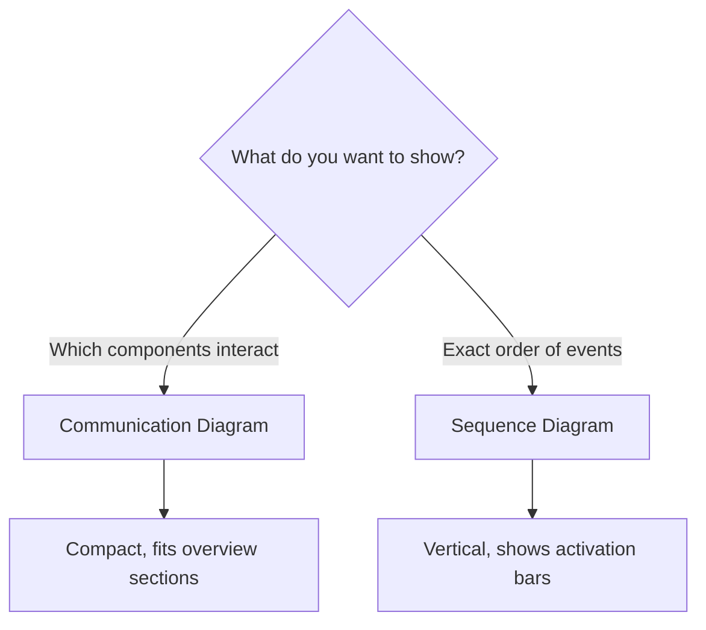
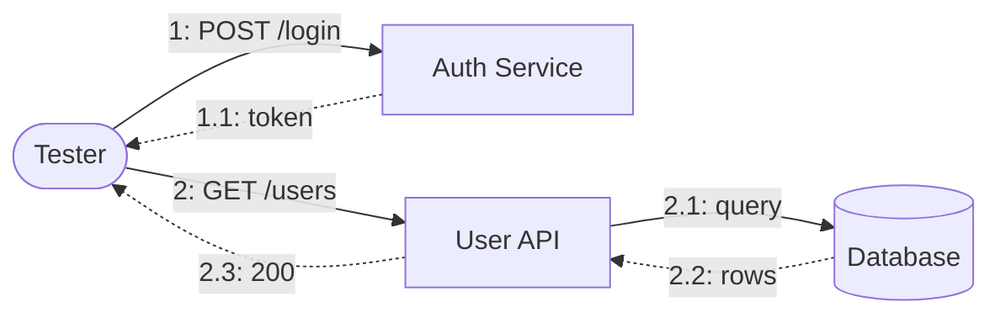
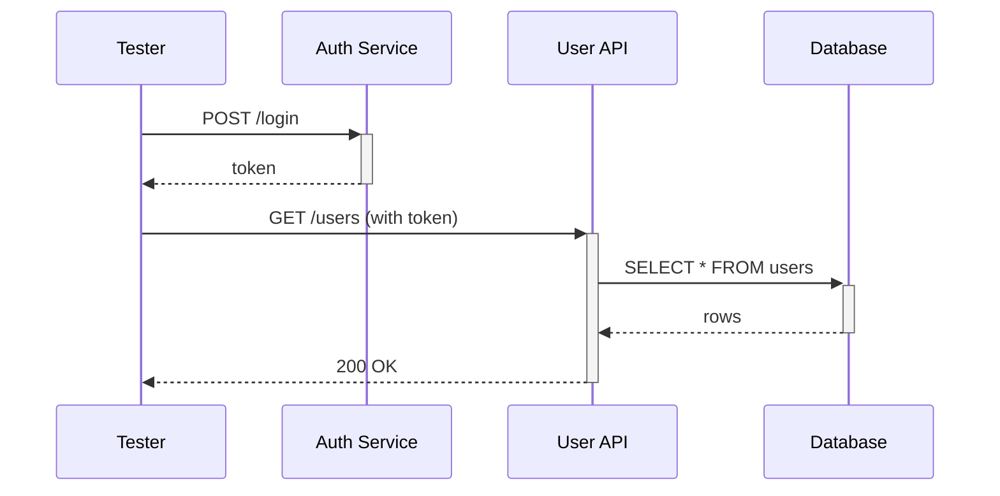
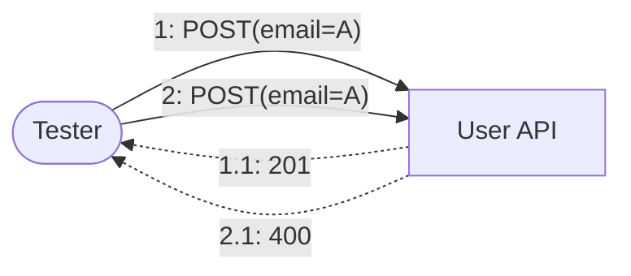
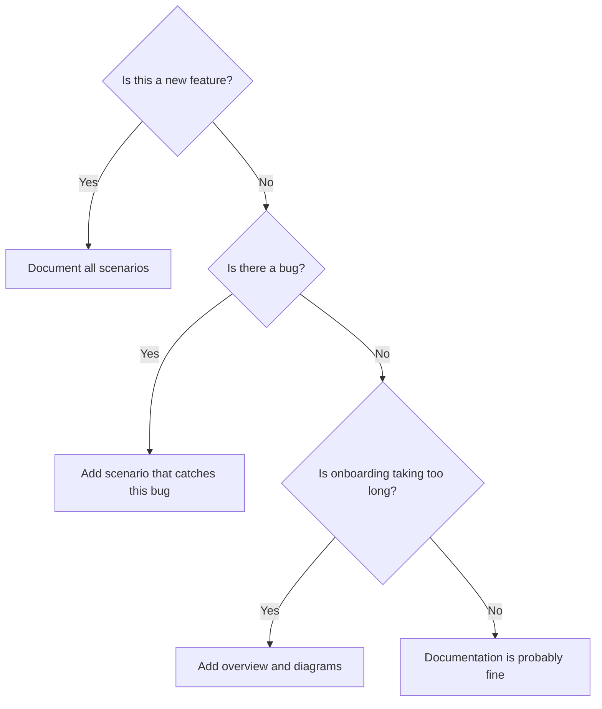

## Introduction

I was debugging a failing integration test and realized I had no idea what the test was supposed to do. The test name was `test_update_api_3` and the code was 200 lines of setup with no comments. After spending an hour understanding it, I decided to document all our test scenarios properly. This post is the result of that effort.

---

## Why Document Test Scenarios?

| Problem | How Documentation Solves It |
|---------|----------------------------|
| "What does this test do?" | Overview section with purpose and coverage |
| "Why is this test failing?" | Diagram shows expected flow, easy to compare with actual |
| "Did we test this edge case?" | Scenario categories make coverage visible |
| "New dev takes 2 weeks to understand tests" | Structured docs reduce onboarding to 2 days |

---

## Communication vs Sequence Diagram: When to Use Which

Before diving into templates, decide which diagram type to use:



### Comparison Table

| Aspect | Communication Diagram | Sequence Diagram |
|--------|----------------------|------------------|
| **Focus** | Object relationships | Time ordering |
| **Layout** | Free-form (network) | Vertical timeline |
| **Message Numbering** | Hierarchical (1, 1.1, 1.2) | Implicit (top→bottom) |
| **Best For** | Overview, architecture | Detailed flows, debugging |
| **When to Use** | "Who talks to whom?" | "What happens when?" |

### Real Example: Same Scenario, Different Diagrams

**Scenario**: User login → Get user list

#### Communication Diagram (Overview)

Shows **which components interact**:



#### Sequence Diagram (Detailed)

Shows **exact order and timing**:



---

## Documentation Structure

### 1. Overview Section

Start with what matters most:

```markdown
# User Management API Tests

## Quick Stats
| Metric | Value |
|--------|-------|
| Total Scenarios | 15 |
| Happy Path | 5 |
| Error Handling | 6 |
| Edge Cases | 4 |

## Endpoints Covered
| Endpoint | Methods | Scenarios |
|----------|---------|-----------|
| /users | GET, POST | 7 |
| /users/{id} | GET, PUT, DELETE | 8 |
```

### 2. Scenario Categories

Group by **test purpose**, not by endpoint:

| Category | Description | Example Scenarios |
|----------|-------------|-------------------|
| **Happy Path** | Normal operations | Create user, Update profile |
| **Error Handling** | Expected failures | Invalid email format, Duplicate user |
| **Edge Cases** | Boundary conditions | Empty list, Max length input |
| **Security** | Auth/permission checks | Expired token, Forbidden access |

---

## Scenario Template

Every scenario should answer: **What? Why? How? Expected?**

```markdown
## Scenario: Create User with Duplicate Email

### What (Purpose)
Verify the API returns 400 when email already exists.

### Why (Business Context)
Prevents duplicate accounts, maintains data integrity.

### How (Steps)
1. Create user with email A → 201 Created
2. Create another user with email A → 400 Bad Request

### Expected Result
- Status: 400
- Body: `{"error": "Email already exists"}`

### Diagram
```



---

## Labeling Conventions

Consistent labels prevent confusion:

### Request Format
```
{sequence}: {METHOD} {endpoint}({params})
```

| Example | Meaning |
|---------|---------|
| `1: POST /users(name, email)` | First request: create user |
| `2: GET /users(id=123)` | Second request: get user by ID |
| `3: DELETE /users(id=123)` | Third request: delete user |

### Response Format
```
{sequence}.{sub}: {status}({key=value})
```

| Example | Meaning |
|---------|---------|
| `1.1: 201(id=123)` | Response to request 1: created with ID |
| `2.1: 404(error=not found)` | Response to request 2: not found |

---

## Decision Flowchart: What to Document



---

## Summary

| What to Document | How to Document |
|------------------|-----------------|
| API overview | Stats table + endpoint coverage |
| Component interactions | Communication diagram |
| Detailed flow | Sequence diagram |
| Individual scenarios | Template (What/Why/How/Expected) |
| Request/Response | Consistent labeling |

Good documentation turns "What does this test do?" into "I know exactly what this tests in 10 seconds."
