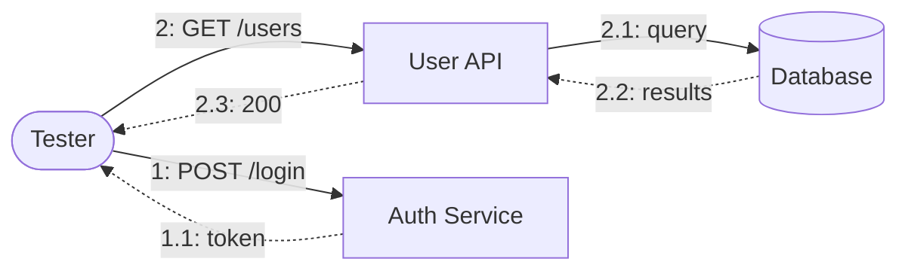
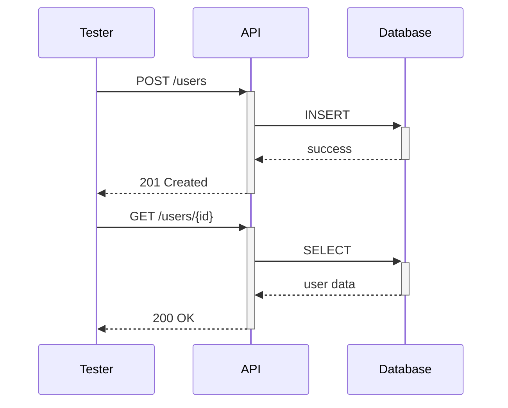

## Introduction

Clear test scenario documentation makes debugging easier and helps new team members understand the system. This post covers best practices for documenting API test scenarios using diagrams and structured formats.

## Why Document Test Scenarios?

- **Onboarding**: New developers understand the system faster
- **Debugging**: Quickly identify which scenarios are failing
- **Review**: Test coverage becomes visible
- **Maintenance**: Easier to update when APIs change

## Documentation Structure

### 1. Overview Section

Start with a high-level summary:

```markdown
# User Management API Tests

## Overview
- **Total Scenarios**: 15
- **Coverage**: CRUD operations, authentication, error handling
- **Dependencies**: Database, Auth Service

## API Endpoints Covered
| Endpoint | Method | Scenarios |
|----------|--------|-----------|
| /users | GET | 3 |
| /users | POST | 4 |
| /users/{id} | PUT | 4 |
| /users/{id} | DELETE | 4 |
```

### 2. Scenario Categories

Group scenarios logically:

```markdown
## Categories

1. **Happy Path** (5 scenarios)
   - Basic CRUD operations that should succeed

2. **Error Handling** (6 scenarios)
   - Invalid inputs, missing resources

3. **Edge Cases** (4 scenarios)
   - Boundary conditions, concurrent operations
```

## Diagram Best Practices

### Use Communication Diagrams for Overview

Show which components interact:



### Use Sequence Diagrams for Complex Flows

When order matters:



## Scenario Template

Use a consistent format for each scenario:

```markdown
## Scenario: Create User with Valid Data

### Purpose
Verify that a new user can be created with valid input.

### Preconditions
- Auth token is valid
- Email is unique in the system

### Steps
1. POST /users with valid payload
2. Verify response status is 201
3. GET /users/{id} to confirm creation

### Expected Results
- Status: 201 Created
- Response contains user ID
- User exists in database

### Diagram

​```mermaid
flowchart LR
    T([Tester])
    API[User API]
    
    T -->|"1: POST /users(name, email)"| API
    API -.->|"1.1: 201(id=123)"| T
​```
```

## Labeling Conventions

### Message Format

Use consistent notation:

```
{sequence}: {method} {endpoint}({parameters})
```

Examples:
- `1: POST /users(name, email)`
- `2: GET /users(id=123)`
- `3: DELETE /users(id=123)`

### Response Format

```
{sequence}.{sub}: {status}({key=value})
```

Examples:
- `1.1: 200(count=5)`
- `2.1: 404(error=not found)`
- `3.1: 201(id=123)`

### Conditional Notation

For different response types:

| Notation | Meaning |
|----------|---------|
| `<N개>` | Exactly N items |
| `<...>` | One or more items |
| `<>` | Empty result |
| `<조건>` | Items matching condition |

## Error Scenario Documentation

Document expected failures clearly:

```markdown
## Scenario: Create User with Duplicate Email

### Purpose
Verify proper error handling for duplicate emails.

### Steps
1. Create user with email A (succeeds)
2. Create another user with email A (fails)

### Expected Results
- Status: 400 Bad Request
- Error message indicates duplicate

### Diagram

​```mermaid
flowchart LR
    T([Tester])
    API[User API]
    
    T -->|"1: POST /users(email=A)"| API
    API -.->|"1.1: 201"| T
    T -->|"2: POST /users(email=A)"| API
    API -.->|"2.1: 400(error=duplicate)"| T
​```
```

## Tools and Automation

### Generate Diagrams from Tests

Consider generating diagrams programmatically:

```python
def generate_scenario_diagram(steps: list) -> str:
    """Generate Mermaid diagram from test steps."""
    lines = ["flowchart LR", "    T([Tester])"]
    
    apis = set()
    for step in steps:
        apis.add(step.api_name)
    
    for api in apis:
        lines.append(f"    {api}[{api}]")
    
    for i, step in enumerate(steps, 1):
        lines.append(f"    T -->|\"{i}: {step.method} {step.endpoint}\"| {step.api_name}")
        lines.append(f"    {step.api_name} -.->|\"{i}.1: {step.expected_status}\"| T")
    
    return "\n".join(lines)
```

### Version Control

- Keep documentation in the same repo as tests
- Update diagrams when API changes
- Review documentation changes in PRs

## Conclusion

Good test documentation includes:

1. **Overview**: High-level summary with coverage stats
2. **Categories**: Logical grouping of scenarios
3. **Diagrams**: Visual representation of flows
4. **Consistent Format**: Same template for all scenarios
5. **Automation**: Generate where possible

Clear documentation reduces debugging time and improves team collaboration!
