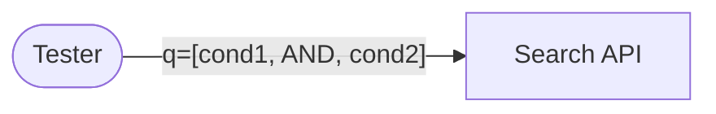

## Introduction

While documenting API test scenarios with Mermaid flowcharts, I encountered a frustrating issue. Some diagrams rendered perfectly, while others showed the dreaded error:

```text
Syntax error in text
mermaid version 11.12.2
```

The bizarre part? The diagrams looked **identical in structure**. This post documents the root causes and solutions for several hidden pitfalls in Mermaid diagram syntax.

## Problem 1: `AND` and `OR` as Reserved Keywords

### Symptom

I was creating search API diagrams with conditional queries:



This resulted in a syntax error, while similar diagrams using `IS`, `IN`, `NOT` worked fine:

```mermaid
flowchart LR
    Tester([Tester])
    API[Search API]
    
    Tester -->|"q=[col, IS, val]"| API  ✅ Works!
```

### Root Cause

`AND` and `OR` are **logical operators** in Mermaid's internal parser. Even when enclosed in quotes (`"..."`), they can interfere with parsing in certain contexts.

### Solution

Use underscores to escape the reserved keywords:

```markdown
<!-- Before (Error) -->
q=[cond1, AND, cond2]
q=[cond1, OR, cond2]

<!-- After (Works) -->
q=[cond1, _AND_, cond2]  ✅
q=[cond1, _OR_, cond2]   ✅
```

Alternatively, you can use symbols like `+` and `/`:

```markdown
q=cond1 + cond2   <!-- AND -->
q=cond1 / cond2   <!-- OR -->
```

## Problem 2: Angle Brackets Interpreted as HTML Tags

### Symptom

Some response messages with angle brackets failed:

```mermaid
flowchart LR
    A[API]
    T([Tester])
    
    A -.->|"200(rows=<row>)"| T      ❌ Error
    A -.->|"200(rows=<unchanged>)"| T  ❌ Error
```

But these worked:

```mermaid
flowchart LR
    A[API]
    T([Tester])
    
    A -.->|"200(rows=<1개>)"| T      ✅ Works
    A -.->|"200(rows=<원래값>)"| T    ✅ Works
```

### Root Cause Analysis

| Pattern | Result | Reason |
|---------|--------|--------|
| `<row>` | ❌ Error | Looks like HTML `<row>` tag |
| `<unchanged>` | ❌ Error | Looks like HTML `<unchanged>` tag |
| `<1개>` | ✅ Works | Contains number, not a valid tag |
| `<원래값>` | ✅ Works | Contains Korean, not a valid tag |

The Markdown PDF exporter (or underlying HTML renderer) interprets **English-only content in angle brackets** as potential HTML tags, breaking the Mermaid parser.

### Solution

Add non-English characters (Korean, numbers, symbols) to break the HTML tag pattern:

```markdown
<!-- Before (Error) -->
rows=<row>
rows=<unchanged>

<!-- After (Works) -->
rows=<해당row>
rows=<변경없음>
```

## Problem 3: The Infamous `<meta>` Tag

### Symptom

This diagram always failed, even with Korean characters nearby:

```mermaid
flowchart LR
    ML[Meta Listing API]
    T([Tester])
    
    ML -.->|"200(rows=<meta값유지>)"| T  ❌ Always Error!
```

### Root Cause

`<meta>` is a **valid HTML tag**! 

```html
<meta charset="UTF-8">
```

Even though `<meta값유지>` contains Korean, the parser sees `<meta` and interprets it as the start of an HTML meta tag, causing a parsing failure.

### Solution

Replace `meta` with its Korean equivalent:

```markdown
<!-- Before (Error) -->
rows=<meta값유지>

<!-- After (Works) -->
rows=<메타값유지>
```

## Summary: Mermaid + HTML Parsing Gotchas

| Issue | Trigger | Solution |
|-------|---------|----------|
| Reserved Keywords | `AND`, `OR` in message labels | Use `+`, `/` or `_AND_`, `_OR_` |
| HTML Tag Interpretation | `<english>` patterns | Add Korean/numbers: `<한글english>` |
| Actual HTML Tags | `<meta>`, `<div>`, `<span>`, etc. | Replace with Korean: `<메타>` |

## Conclusion

Mermaid is powerful for documentation, but its integration with HTML-based renderers (like VS Code's Markdown PDF extension) introduces hidden parsing conflicts.

**Key Takeaways:**
1. Avoid `AND`/`OR` keywords in message labels.
2. Don't use pure English words inside angle brackets.
3. Be especially careful with real HTML tag names like `<meta>`, `<div>`, `<span>`.

When in doubt, add a Korean character or number to break the pattern. This small trick saved hours of frustration!
