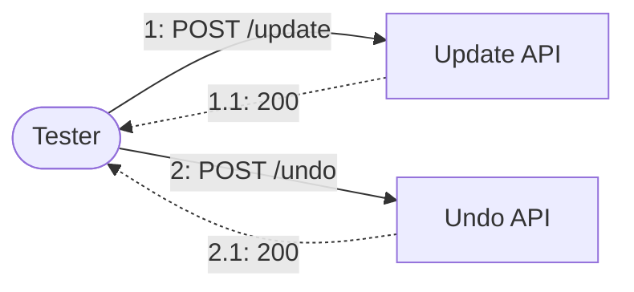
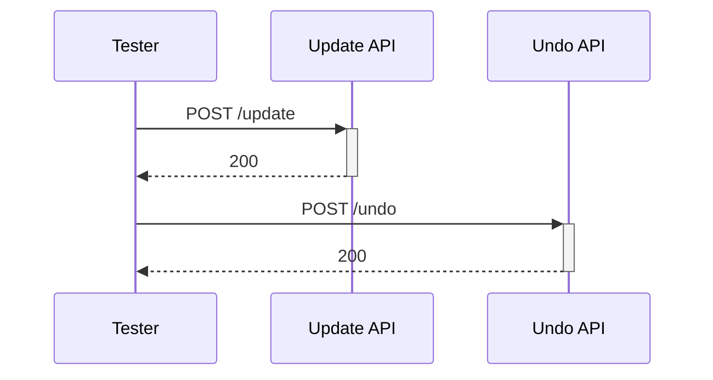
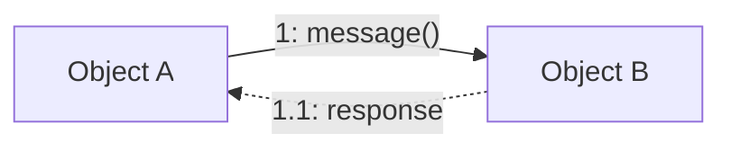

## Introduction

When documenting system interactions, two UML diagram types often come up: **Communication Diagrams** and **Sequence Diagrams**. Both show object interactions, but they emphasize different aspects. This post explains when to use each.

## Quick Comparison

| Aspect | Communication Diagram | Sequence Diagram |
|--------|----------------------|------------------|
| **Focus** | Object relationships | Time ordering |
| **Layout** | Free-form (network) | Vertical timeline |
| **Message Numbering** | Hierarchical (1.1, 1.2) | Implicit (top to bottom) |
| **Best For** | Architecture overview | Detailed flow |
| **Mermaid Support** | `flowchart` (workaround) | `sequenceDiagram` (native) |

## Communication Diagram

### Characteristics

- Objects arranged freely in a network layout
- Messages labeled with sequence numbers (1, 1.1, 1.2, 2, ...)
- Emphasizes **which objects communicate with which**
- Good for showing the "big picture"

### Example (Mermaid Workaround)



### When to Use

- **Architecture documentation**: Show which components interact
- **API overview**: Quick summary of endpoints involved
- **Testing scenarios**: Show test flow at a glance
- **Space-constrained documents**: More compact than sequence diagrams

## Sequence Diagram

### Characteristics

- Objects arranged horizontally at the top
- Time flows vertically downward
- Activation bars show when objects are "active"
- Emphasizes **the order of events**

### Example (Mermaid Native)



### When to Use

- **Detailed flow documentation**: Step-by-step process
- **Complex interactions**: Many back-and-forth messages
- **Async operations**: Show parallel/waiting states
- **Debugging**: Trace exact message order

## Decision Guide

```
Do you need to show...

├── Object relationships? → Communication Diagram
│   └── "Which components talk to which?"
│
├── Time-based flow? → Sequence Diagram
│   └── "What happens first, second, third?"
│
├── Compact overview? → Communication Diagram
│   └── Fits in a single view
│
└── Detailed interactions? → Sequence Diagram
    └── Shows activation, async, loops
```

## Practical Tips

### 1. Start with Communication, Detail with Sequence

For comprehensive documentation:
1. Use **Communication Diagram** for overview section
2. Use **Sequence Diagram** for detailed scenarios

### 2. Mermaid Limitations

Mermaid doesn't have native Communication Diagram support. Use `flowchart LR` as a workaround:



### 3. Numbering Convention

For Communication Diagrams, use hierarchical numbering:
- `1:` First message
- `1.1:` Response to message 1
- `2:` Second message
- `2.1:` Response to message 2

## Conclusion

| Use Case | Diagram Type |
|----------|--------------|
| Architecture overview | Communication |
| Test scenario summary | Communication |
| Detailed API flow | Sequence |
| Debugging/tracing | Sequence |

Both diagrams have their place. Choose based on whether you're emphasizing **structure** (Communication) or **time** (Sequence).
