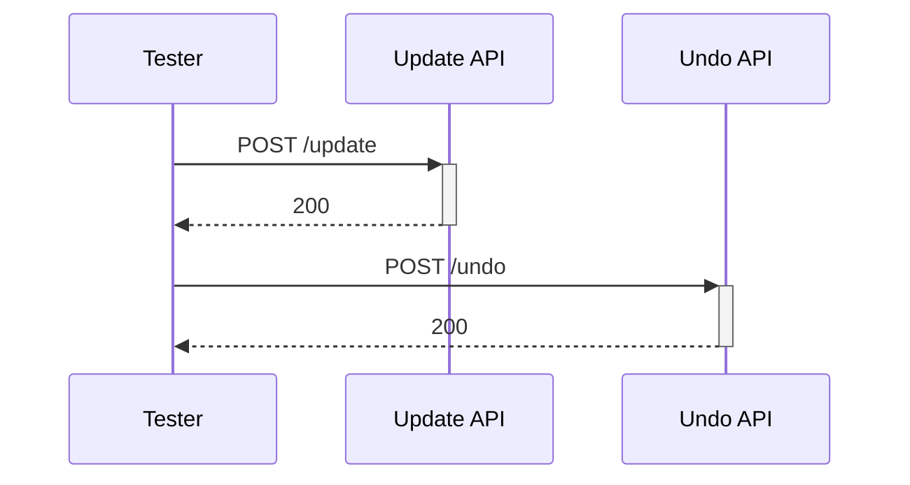
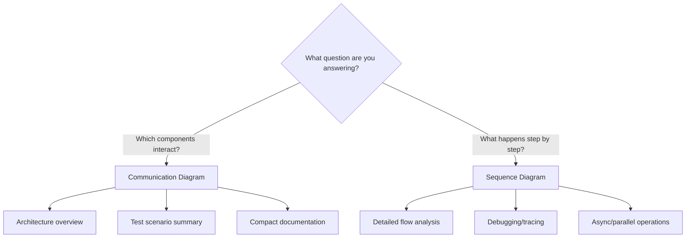
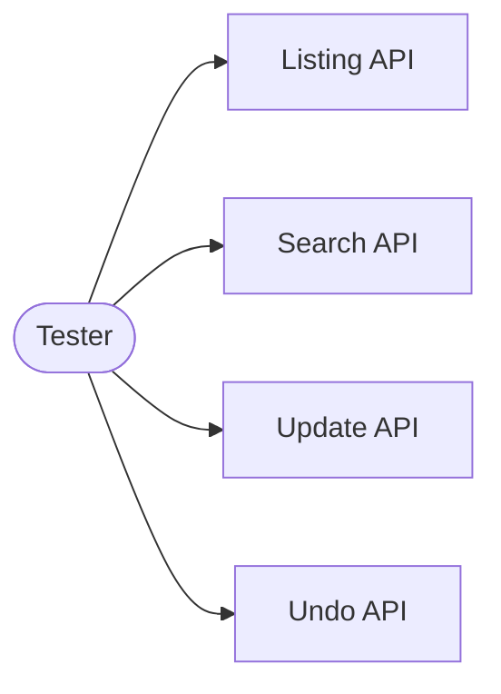
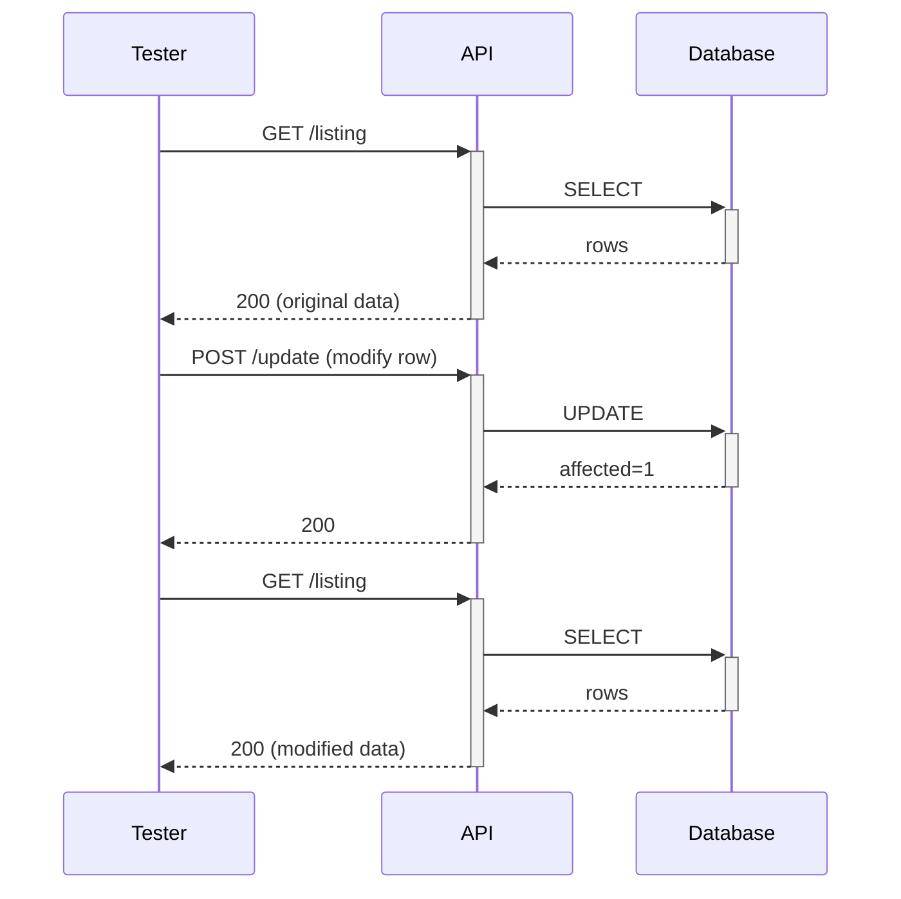

## Introduction

While writing test documentation, I kept switching between Communication and Sequence diagrams without a clear reason. One reviewer asked: "Why did you use a sequence diagram here but a communication diagram there?" I didn't have a good answer. After researching the UML spec and experimenting with both, I finally understood when to use each.

---

## Same Scenario, Different Diagrams

Let's visualize the same interaction both ways to see the difference:

**Scenario**: Tester calls Update API, then calls Undo API

### Communication Diagram

Focus: **Who talks to whom** (structure)


### Sequence Diagram

Focus: **What happens when** (time)



**Notice the difference?** Communication shows the network of relationships. Sequence shows the timeline with activation bars.

---

## When to Use Each



### Decision Table

| Question | Answer | Use |
|----------|--------|-----|
| "Which components are involved?" | Need to show connections | Communication |
| "What happens first, second, third?" | Need to show order | Sequence |
| "How does the whole system look?" | Architecture view | Communication |
| "Why did step 3 fail?" | Debug/trace | Sequence |
| "Space is limited" | Need compact diagram | Communication |
| "Many back-and-forth messages" | Complex interaction | Sequence |

---

## Detailed Comparison

| Aspect | Communication Diagram | Sequence Diagram |
|--------|----------------------|------------------|
| **Layout** | Free-form network | Vertical timeline |
| **Message Order** | Explicit numbers (1, 1.1, 2) | Implicit (top→bottom) |
| **Activation** | Not shown | Bars show active objects |
| **Loops/Alt** | Hard to show | Native support (`loop`, `alt`) |
| **Space** | Compact, fits overview | Grows vertically |
| **Mermaid** | Workaround (`flowchart`) | Native support |
| **Best For** | "Big picture" | "Step-by-step" |

---

## Real-World Use Cases

### 1. Test Scenario Overview (Communication)

When documenting test coverage, show all APIs involved:



### 2. Single Test Flow (Sequence)

When documenting one specific test, show the exact steps:



---

## Mermaid Tips

### Communication Diagram Workaround

Mermaid doesn't support Communication Diagrams natively. Use `flowchart LR`:

```markdown
​```mermaid
flowchart LR
    A[Object A]
    B[Object B]
    
    A -->|"1: request"| B
    B -.->|"1.1: response"| A
​```
```

**Conventions**:
- `-->` for request (solid arrow)
- `-.->` for response (dashed arrow)
- `"1: message"` for numbered labels

### Sequence Diagram Native

```markdown
​```mermaid
sequenceDiagram
    A->>+B: request
    B-->>-A: response
​```
```

**Conventions**:
- `->>` for sync call
- `-->>` for response
- `+/-` for activation bars

---

## Summary

| Situation | Use |
|-----------|-----|
| Overview documentation | Communication |
| Test scenario list | Communication |
| Detailed test flow | Sequence |
| Debugging failed test | Sequence |
| Architecture diagram | Communication |
| API interaction trace | Sequence |

**Rule of thumb**: Start with Communication for the overview, add Sequence for important details.
