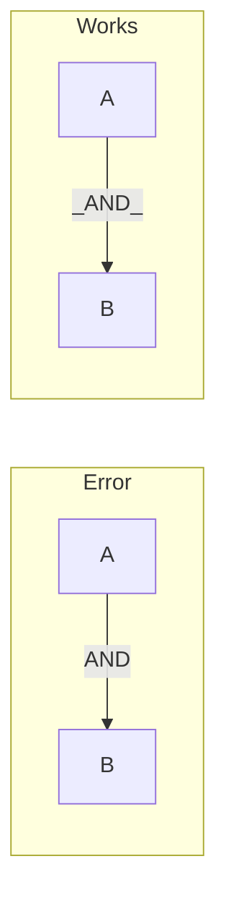
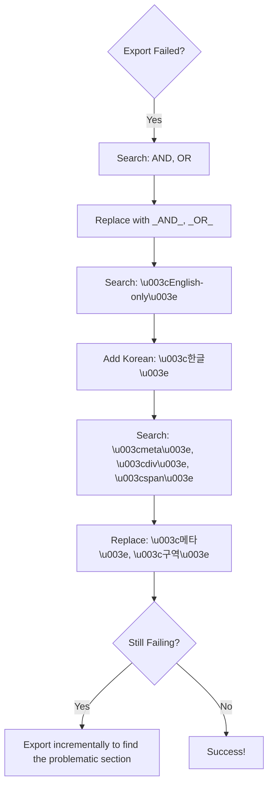
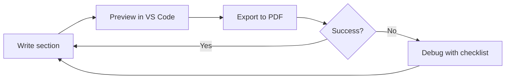

## Introduction

I spent 2 hours debugging a Mermaid diagram that worked perfectly in VS Code's preview but crashed during PDF export. The error message was just "Syntax error in text" with no line number. After multiple trial-and-error sessions, I compiled this list of gotchas that I wish I knew earlier.

---

## The Three Common Traps

Before diving into details, here's what causes 90% of PDF export failures:

| Trap | Problem | Solution |
|------|---------|----------|
| **Reserved Keywords** | `AND`, `OR` break the parser | Use `_AND_`, `_OR_` |
| **Angle Brackets** | `<row>` looks like HTML | Use `<해당row>` (add non-English) |
| **Real HTML Tags** | `<meta>`, `<div>` always fail | Use `<메타>`, `<구역>` |

---

## Trap #1: Reserved Keywords

Mermaid uses `AND`, `OR` as logical operators internally. Using them in labels can cause parsing issues.



### Affected Keywords

| Keyword | Status | Alternative |
|---------|--------|-------------|
| `AND` | Error | `_AND_` |
| `OR` | Error | `_OR_` |
| `NOT` | Usually OK | `_NOT_` (safer) |
| `IN` | Usually OK | `_IN_` (safer) |

---

## Trap #2: Angle Brackets = HTML?

The PDF exporter uses Puppeteer (headless Chrome). Content in angle brackets can be interpreted as HTML tags.

### Which Brackets Fail?

| Content | Result | Why |
|---------|--------|-----|
| `<row>` | Error | Looks like HTML tag |
| `<unchanged>` | Error | Looks like HTML tag |
| `<1개>` | Works | Number makes it invalid HTML |
| `<해당row>` | Works | Korean makes it invalid HTML |

### Fix: Add Non-English Characters

```markdown
Before (Error):
A -.->|"200(rows=<row>)"| T

After (Works):
A -.->|"200(rows=<해당row>)"| T
```

---

## Trap #3: Real HTML Tag Names

If your placeholder happens to be a real HTML tag name, it will **always** fail:

| Tag | Problem | Alternative |
|-----|---------|-------------|
| `<meta>` | Real HTML tag | `<메타>` or `META` |
| `<div>` | Real HTML tag | `<구역>` or `DIV` |
| `<span>` | Real HTML tag | `<범위>` or `SPAN` |
| `<br>` | Real HTML tag | Remove or use `/` |

---

## Quick Fix Checklist

Before exporting to PDF, search for these patterns:



---

## Configuration Tips

### Fix Korean Text Rendering

If Korean appears as boxes:

```json
{
  "markdown-pdf.styles": [
    "https://fonts.googleapis.com/css2?family=Noto+Sans+KR&display=swap"
  ]
}
```

### Page Layout Settings

```json
{
  "markdown-pdf.format": "A4",
  "markdown-pdf.margin.top": "20mm",
  "markdown-pdf.margin.bottom": "20mm",
  "markdown-pdf.margin.left": "15mm",
  "markdown-pdf.margin.right": "15mm"
}
```

---

## Workflow: Avoiding Export Pain



**Key**: Export after every few sections, not at the end. Finding the problematic line in a 200-line document is painful.

---

## Summary

| Problem | Quick Fix |
|---------|-----------|
| `AND`/`OR` errors | `_AND_`/`_OR_` |
| `<english>` fails | `<한글>` |
| `<meta>` fails | `<메타>` or `META` |
| Korean is broken | Add Noto Sans KR font |
| Export is slow | Split into smaller files |

The extension is powerful once you know the workarounds. Most issues come from Mermaid diagrams - fix those first!
