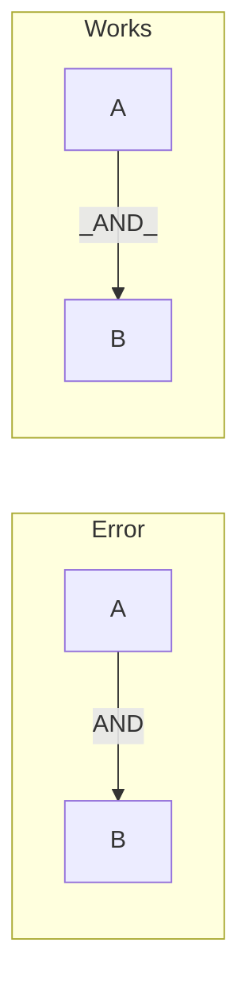
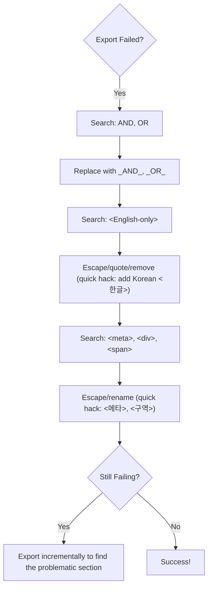
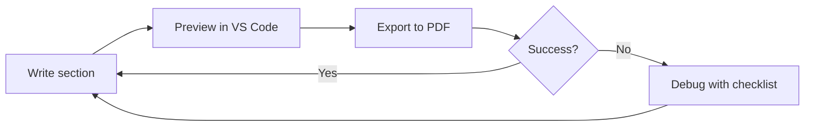

## Introduction

I spent 2 hours debugging a Mermaid diagram that worked perfectly in VS Code's preview but crashed during PDF export. The error message was just "Syntax error in text" with no line number. After multiple trial-and-error sessions, I compiled this list of gotchas that I wish I knew earlier.

> Most of this is an **empirical observation** from my VS Code Markdown-PDF (Chromium/Puppeteer) export pipeline, not documented Mermaid behavior: the renderer parses `<...>` as HTML, so a label like `<meta>` is read as an HTML tag and breaks the export. The only flowchart pitfalls Mermaid's docs warn about directly are the lowercase `end` keyword and edges starting with `o`/`x`.
{: .prompt-info }

---

## The Three Common Traps

Before diving into details, here are the most common causes of PDF export failures:

| Trap | Problem | Solution |
|------|---------|----------|
| **Parser-Breaking Tokens** | `AND`, `OR` can break edge labels | Use `_AND_`, `_OR_` |
| **Angle Brackets** | `<row>` looks like HTML | Escape as `&lt;row&gt;`, quote, or drop the brackets (quick hack: add non-English, e.g. `<해당row>`) |
| **Real HTML Tags** | `<meta>`, `<div>` consistently failed in my export pipeline | Escape as `&lt;meta&gt;`, quote, or rename (quick hack: `<메타>`, `<구역>`) |

---

## Trap #1: Tokens That Can Break the Parser in Edge Labels

Some uppercase tokens like `AND` and `OR` can confuse the Mermaid parser when they appear in edge labels, leading to "Syntax error in text". To be precise: Mermaid only officially reserves the lowercase keyword `end`. The behavior below is best treated as a practical, defensive workaround rather than a documented list of reserved operators.


```mermaid
flowchart LR
    subgraph "Error"
        A1[A] -->|"AND"| B1[B]
    end
    subgraph "Works"
        A2[A] -->|"_AND_"| B2[B]
    end
```

### Tokens to Watch For

| Token | Status | Alternative |
|---------|--------|-------------|
| `AND` | Error | `_AND_` |
| `OR` | Error | `_OR_` |
| `NOT` | Usually OK | `_NOT_` (safer) |
| `IN` | Usually OK | `_IN_` (safer) |

The most portable fix is to rephrase the whole edge label so the operator words never appear at all (e.g. `q: cond1 + cond2` or `q: all conditions`).

---

## Trap #2: Angle Brackets = HTML?

The PDF exporter uses Puppeteer (headless Chrome). Content in angle brackets can be interpreted as HTML tags.

### Which Brackets Fail?

| Content | Result | Why |
|---------|--------|-----|
| `<row>` | Error | Looks like HTML tag |
| `<unchanged>` | Error | Looks like HTML tag |
| `<1개>` | Works | Number makes it invalid HTML |
| `<해당row>` | Works | Korean makes it invalid HTML |

### Fix: Escape, Quote, or Remove the Brackets

The robust fix is to stop the brackets from looking like HTML: escape them as HTML entities (`&lt;`/`&gt;`), wrap the text in quotes, or just drop the angle brackets entirely.

```markdown
Before (Error):
A -.->|"200(rows=<row>)"| T

After (Works, escaped):
A -.->|"200(rows=&lt;row&gt;)"| T
```

As a secondary quick hack, adding a non-English character also makes the content invalid as HTML so the parser leaves it alone:

```markdown
A -.->|"200(rows=<해당row>)"| T
```

---

## Trap #3: Real HTML Tag Names

If your placeholder happens to be a real HTML tag name, it **consistently failed in my VS Code Markdown PDF (Puppeteer) export pipeline**. The reliable fix is the same as Trap #2: escape the brackets as `&lt;`/`&gt;`, quote the text, or drop the brackets and rename the placeholder. Adding a non-English token (the Korean form below) is a secondary quick hack.

| Tag | Problem | Alternative |
|-----|---------|-------------|
| `<meta>` | Real HTML tag | `&lt;meta&gt;`, `META` (quick hack: `<메타>`) |
| `<div>` | Real HTML tag | `&lt;div&gt;`, `DIV` (quick hack: `<구역>`) |
| `<span>` | Real HTML tag | `&lt;span&gt;`, `SPAN` (quick hack: `<범위>`) |
| `<br>` | Real HTML tag | Remove or use `/` |

---

## Quick Fix Checklist

Before exporting to PDF, search for these patterns:


```mermaid
flowchart TD
    Q1{Export Failed?}
    Q1 -->|Yes| C1["Search: AND, OR"]
    C1 --> F1["Replace with _AND_, _OR_"]
    
    F1 --> C2["Search: &lt;English-only&gt;"]
    C2 --> F2["Escape/quote/remove (quick hack: add Korean &lt;한글&gt;)"]
    
    F2 --> C3["Search: &lt;meta&gt;, &lt;div&gt;, &lt;span&gt;"]
    C3 --> F3["Escape/rename (quick hack: &lt;메타&gt;, &lt;구역&gt;)"]
    
    F3 --> Q2{Still Failing?}
    Q2 -->|Yes| A1["Export incrementally to find the problematic section"]
    Q2 -->|No| A2["Success!"]
```

---

## Configuration Tips

### Fix Korean Text Rendering

If Korean appears as boxes, use a **local** stylesheet plus a system-installed Korean font. A remote Google Fonts URL is unreliable for PDF export — the extension's docs note online CSS works for JPG/PNG but has problems with PDF, and `markdown-pdf.styles` expects local paths:

```json
{
  "markdown-pdf.styles": ["./korean.css"]
}
```

```css
/* korean.css */
body { font-family: 'Noto Sans KR', sans-serif; }
```

Install the **Noto Sans KR** font on the machine that runs the export (Chromium/Puppeteer uses installed system fonts for PDF). A bare `css2` Google Fonts URL only ships `@font-face` rules with no `body` `font-family`, so it wouldn't change the render font even if it loaded.

### Page Layout Settings

```json
{
  "markdown-pdf.format": "A4",
  "markdown-pdf.margin.top": "20mm",
  "markdown-pdf.margin.bottom": "20mm",
  "markdown-pdf.margin.left": "15mm",
  "markdown-pdf.margin.right": "15mm"
}
```

---

## Workflow: Avoiding Export Pain


```mermaid
flowchart LR
    W[Write section] --> P[Preview in VS Code]
    P --> E[Export to PDF]
    E --> Q{Success?}
    Q -->|Yes| W
    Q -->|No| D[Debug with checklist]
    D --> W
```

**Key**: Export after every few sections, not at the end. Finding the problematic line in a 200-line document is painful.

---

## Summary

| Problem | Quick Fix |
|---------|-----------|
| `AND`/`OR` errors | `_AND_`/`_OR_` |
| `<english>` fails | Escape `&lt;english&gt;`, quote, or remove (quick hack: `<한글>`) |
| `<meta>` fails | Escape `&lt;meta&gt;` or rename `META` (quick hack: `<메타>`) |
| Korean is broken | Add Noto Sans KR font |
| Export is slow | Split into smaller files |

The extension is powerful once you know the workarounds. Most issues come from Mermaid diagrams - fix those first!
