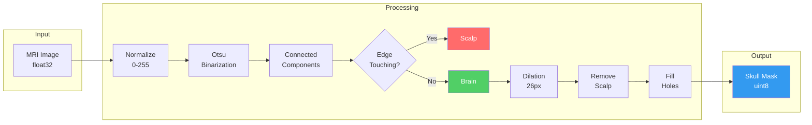

## Introduction

Recently, I worked on a task to generate **skull masks** from MRI images. The goal was simple:
- **Exclude** the outermost bright tissue (scalp)
- **Include** the dark border inside (skull bone)

Sounds like a textbook segmentation problem, right? My first instinct was to use **U-Net** or another deep learning model. But here's the catch: I only had **5 labeled images**. That's not even enough for a validation set, let alone training a neural network.

This constraint forced me to think differently. Instead of reaching for the deep learning hammer, I had to carefully analyze the data and design a classical image processing pipeline. The result? **IoU 0.9795, Dice 0.9896**—performance that rivals many deep learning approaches.

In this post, I'll walk you through the entire process, from data analysis to algorithm design, explaining each step as if I were mentoring a junior engineer.

---

## The Data

The dataset consisted of:
- **Input**: 5 MRI slices, shape `(5, 768, 624)`, dtype `float32`
- **Ground Truth**: 5 binary masks, shape `(5, 768, 624)`, dtype `uint8`

The first thing I noticed was the unusual value range of the input images:

```
Min: 1.83e-07
Max: 3.49e-05
```

These are extremely small values—not the typical 0-255 range you'd expect. This immediately told me that **normalization** would be essential before applying any standard image processing operations.

---

## Algorithm Overview

After several iterations (more on that later), I settled on this pipeline:



The key insight: **Scalp touches the image border, Brain does not.** This simple observation drives the entire algorithm.

Let me explain each step in detail.

---

## Step 1: Normalization

### Why Normalize?

OpenCV functions expect pixel values in the 0-255 range (uint8). Our raw MRI data ranges from `1.8e-07` to `3.5e-05`. If we feed these values directly to OpenCV, the functions won't work as expected.

### How It Works

```python
def normalize_image(image: np.ndarray) -> np.ndarray:
    img_min = image.min()
    img_max = image.max()
    img_norm = (image - img_min) / (img_max - img_min)
    img_uint8 = (img_norm * 255).astype(np.uint8)
    return img_uint8
# end def
```

**Before**: Values in range `[1.8e-07, 3.5e-05]`
**After**: Values in range `[0, 255]`

---

## Step 2: Otsu Binarization

### What Is Binarization?

Binarization converts a grayscale image into a binary image (black and white). Every pixel becomes either 0 (black) or 1 (white) based on a **threshold**.

### The Threshold Selection Problem

If we choose threshold = 100:
- Pixels ≥ 100 → White (1)
- Pixels < 100 → Black (0)

But how do we know 100 is the right value? What if 80 or 120 is better?

### Otsu's Algorithm: Automatic Threshold Selection

**Otsu's method** analyzes the histogram and automatically finds the optimal threshold that best separates the two classes (foreground and background).

```python
_, binary = cv2.threshold(img_uint8, 0, 255, cv2.THRESH_BINARY + cv2.THRESH_OTSU)
```

For our MRI images, Otsu consistently found **threshold = 23**:

```
Histogram Distribution:

Count
  │
  │  ████                        ████
  │  ████                        ████
  │──────────────────────────────────── Brightness
     0   23                     200
         ↑
    Otsu's optimal split point
```

**Interpretation**: Pixels with brightness < 23 are background/skull bone (dark), and pixels ≥ 23 are brain/scalp tissue (bright).

---

## Step 3: Connected Component Analysis

### The Key Insight

After binarization, we have bright regions (tissue) and dark regions (background). But how do we distinguish between **Scalp** (which we want to remove) and **Brain** (which we want to keep)?

Here's the crucial observation:

| Region | Characteristic |
|:-------|:---------------|
| **Scalp** | Touches the image border |
| **Brain** | Does NOT touch the image border |

This makes sense anatomically: the scalp wraps around the head and extends to the edges of the MRI slice, while the brain is enclosed inside.

### Visual Explanation

```
MRI Image (Binarized):

┌─────────────────────────────────┐
│█████████████████████████████████│← Touches top edge (Scalp)
│██                             ██│
│█                               █│← Touches left/right edges (Scalp)
│█    ┌───────────────────┐      █│
│█    │                   │      █│
│█    │      Brain        │      █│← No edge contact (Brain)
│█    │                   │      █│
│█    └───────────────────┘      █│
│██                             ██│
│█████████████████████████████████│← Touches bottom edge (Scalp)
└─────────────────────────────────┘
```

### Implementation

```python
for label in range(1, num_labels):
    component = (labels == label)
    
    touches_edge = (
        np.any(component[0, :]) or      # Top row
        np.any(component[-1, :]) or     # Bottom row
        np.any(component[:, 0]) or      # Left column
        np.any(component[:, -1])        # Right column
    )
    
    if touches_edge:
        # This is Scalp → Remove later
        edge_labels.add(label)
    else:
        # This is Brain → Keep
        inner_labels.append(label)
    # end if
# end for
```

---

## Step 4: Morphological Dilation

### The Problem

After identifying the brain region, we're not done yet. The task requires us to **include the dark border (skull bone)**, not just the brain tissue.

The anatomical structure from outside to inside:

```
[Scalp] → [Skull Bone] → [Brain]
 Bright      Dark        Bright
 Remove      Include     Include
```

If we only keep the brain region, we miss the skull bone entirely.

### The Solution: Dilation

**Dilation** expands a region by a certain number of pixels in all directions.

```
Before Dilation:          After Dilation (26px):
┌─────────┐               ┌───────────────┐
│         │               │███████████████│
│  Brain  │      →        │███  Brain  ███│
│         │               │███████████████│
└─────────┘               └───────────────┘

The expanded area covers the Skull Bone region!
```

### Why 26 Pixels?

I tested various dilation sizes:

| Dilation Size | IoU | Dice |
|:--------------|:----|:-----|
| 22 | 0.9742 | 0.9869 |
| 24 | 0.9776 | 0.9887 |
| **26** | **0.9794** | **0.9896** |
| 28 | 0.9788 | 0.9893 |
| 30 | 0.9763 | 0.9880 |

At 26 pixels, the expanded brain region perfectly captures the skull bone while not extending too far into the scalp.

---

## Step 5: Hole Filling

### Why Fill Holes?

After dilation, there might be small holes inside the mask—caused by dark structures within the brain (like ventricles) that were classified as background during binarization.

```
Before Filling:           After Filling:
┌─────────────┐           ┌─────────────┐
│█████████████│           │█████████████│
│███     █████│           │█████████████│
│███  ○  █████│     →     │█████████████│
│███     █████│           │█████████████│
│█████████████│           │█████████████│
└─────────────┘           └─────────────┘
       ↑
   Internal hole
```

The skull mask should include the **entire interior** of the skull, so we fill any internal holes:

```python
skull_mask = ndimage.binary_fill_holes(skull_mask).astype(np.uint8)
```

---

## Understanding the Metrics

### IoU (Intersection over Union)

$$
\text{IoU} = \frac{\text{Predicted} \cap \text{Ground Truth}}{\text{Predicted} \cup \text{Ground Truth}}
$$

- **IoU = 1.0**: Perfect overlap
- **IoU = 0.0**: No overlap at all

Our result: **IoU = 0.9794** means 97.94% overlap with the ground truth.

### Dice Coefficient

$$
\text{Dice} = \frac{2 \times |\text{Predicted} \cap \text{Ground Truth}|}{|\text{Predicted}| + |\text{Ground Truth}|}
$$

Our result: **Dice = 0.9896** is considered excellent in medical image segmentation.

---

## The Development Journey

I didn't arrive at this solution immediately. Here's my iteration history:

| Version | Approach | IoU | Issue |
|:--------|:---------|:----|:------|
| v1 | Otsu + Largest Component | 0.73 | Skull bone not included |
| v2 | Flood Fill from Edges | 0.82 | Incomplete scalp removal |
| v3-v4 | Various Thresholds | 0.54 | Made it worse |
| v5 | Connected Components + Dilation | 0.96 | Key breakthrough |
| v6 | Dilation Size Tuning | 0.97 | Improved |
| **v7** | **Optimized Dilation (26px)** | **0.98** | **Final** |

The key insight came in v5 when I realized that **edge-touching** was the discriminating feature between scalp and brain, not just brightness values.

---

## Why Not Deep Learning?

Given that this is a segmentation task, you might wonder why I didn't use U-Net or a similar architecture. Here's my reasoning:

| Criterion | Classical Approach | Deep Learning |
|:----------|:-------------------|:--------------|
| **Training Data** | Not needed | 500-1,000+ images minimum |
| **2D Slice Support** | ✅ | ✅ |
| **External Dependencies** | numpy, opencv, scipy | GPU, large frameworks |
| **Interpretability** | Each step is clear | Black box |
| **Current Accuracy** | IoU 0.98 | Potentially higher with enough data |

With only 5 labeled images, deep learning was simply not an option. However, if 10,000+ labeled images became available, I would definitely consider training a U-Net for potentially even better results.

---

## Scaling to 100,000 Images

As part of the project, I also planned for processing 100,000 images within 2 weeks.

### Performance Analysis

| Metric | Value |
|:-------|:------|
| Processing time per image | 16.6 ms |
| Images per second | 60.2 |
| Time for 100,000 images (single thread) | ~28 minutes |
| Time for 100,000 images (8 cores) | ~4 minutes |

The classical approach turned out to be extremely fast—no GPU required!

### Batch Processing Script

```python
import numpy as np
from multiprocessing import Pool

from skull_mask_generator import create_skull_mask


def process_single(image: np.ndarray) -> np.ndarray:
    return create_skull_mask(image)
# end def


if __name__ == '__main__':
    images = np.load('large_dataset.npy')
    
    with Pool(processes=8) as pool:
        masks = pool.map(process_single, images)
    # end with
    
    np.save('output_masks.npy', np.array(masks))
# end if
```

---

## Conclusion

This project was a great reminder that **not every problem needs deep learning**. When you have:
- Limited labeled data
- Well-structured input (like medical images)
- Clear domain knowledge about the problem

...a classical approach can be not only sufficient but optimal.

The key insights were:
1. **Understand your data first**: The edge-touching property was the breakthrough
2. **Iterate and measure**: My first 4 versions didn't work; v5 was the turning point
3. **Simple can be powerful**: Otsu + Connected Components + Dilation achieved 98% IoU

Sometimes the best solution isn't the most complex one—it's the one that fits the constraints of your problem.

