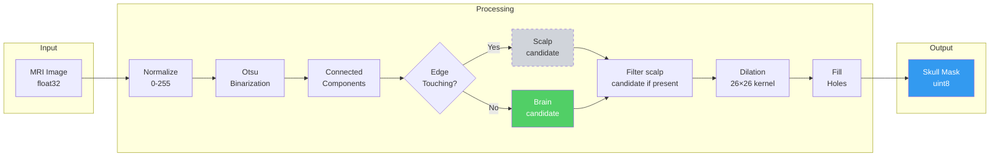

## Introduction

Recently, I worked on a task to generate **skull masks** from MRI images. The goal was simple:
- **Exclude** the outermost bright tissue (scalp)
- **Include** the dark border inside (skull bone)

My first instinct was **U-Net**. But I only had **5 labeled images**—not enough to train a robust model from scratch.

So I went with classical image processing instead. The result looked strong on the provided slices: **IoU 0.9795, Dice 0.9896**.

The important part is the caveat. My first explanation overemphasized an edge-touching scalp rule. A later review showed that, on these 5 slices, no bright connected component touched the image border at all. The baseline still worked, but the score was mainly carried by a simpler path: choose the largest internal bright component, dilate it once with a 26×26 elliptical kernel, then fill holes.

---

## The Data

The dataset consisted of:
- **Input**: 5 MRI slices, shape `(5, 768, 624)`, dtype `float32`
- **Ground Truth**: 5 binary masks, shape `(5, 768, 624)`, dtype `uint8`

The first thing I noticed was the unusual value range of the input images:

```
Min: 1.83e-07
Max: 3.49e-05
```

MRI intensity values are scanner- and reconstruction-dependent arbitrary units, so a small floating-point range is not inherently abnormal and 0–255 is not a medical-imaging reference range. Conversion is needed here for a narrower engineering reason: this pipeline feeds each slice to OpenCV's 8/16-bit Otsu path, so it maps the observed slice range to `uint8` first.

---

## Algorithm Overview

After several iterations (more on that later), I settled on this implementation:


```mermaid
flowchart LR
    subgraph Input
        A[MRI Image<br/>float32]
    end
    
    subgraph Processing
        B[Normalize<br/>0-255] --> C[Otsu<br/>Binarization]
        C --> D[Connected<br/>Components]
        D --> E{Edge<br/>Touching?}
        E -->|Yes| F[Scalp<br/>candidate]
        E -->|No| G[Brain<br/>candidate]
        F --> I[Filter scalp<br/>candidate if present]
        G --> I
        I --> H[Dilation<br/>26×26 kernel]
        H --> J[Fill<br/>Holes]
    end
    
    subgraph Output
        K[Skull Mask<br/>uint8]
    end
    
    A --> B
    J --> K
    
    style F fill:#d0d4da,color:#333,stroke-dasharray: 5 5
    style G fill:#51cf66,color:#fff
    style K fill:#339af0,color:#fff
```

The intended rule was: **edge-touching bright components can be scalp candidates, while non-edge components can be brain candidates**. In the actual 5-slice dataset, the edge-touching bright component counts were `[0, 0, 0, 0, 0]`. That means the scalp-candidate removal branch existed in the code, but these slices did not exercise it.

The load-bearing path for the reported score was:

1. normalize the image,
2. use Otsu thresholding to find bright tissue,
3. choose the largest internal bright connected component,
4. dilate it once with a `26×26` elliptical kernel (roughly 13 pixels of radial reach) to include the skull boundary,
5. fill internal holes.

The snippets below assume these imports:

```python
import numpy as np
import cv2
from scipy import ndimage
```

---

## Step 1: Normalization

### Why Normalize?

`cv2.threshold`/Otsu work on 8-bit (and 16-bit) single-channel images, so for this pipeline I normalized to 8-bit grayscale. Our raw MRI data ranges from `1.8e-07` to `3.5e-05`, and mapping it to a `[0, 255]` `uint8` range keeps the histogram-based threshold well-behaved.

### How It Works

```python
def normalize_image(image: np.ndarray) -> np.ndarray:
    img_min = image.min()
    img_max = image.max()
    if img_max == img_min:
        # Flat image: avoid division by zero
        return np.zeros_like(image, dtype=np.uint8)
    img_norm = (image - img_min) / (img_max - img_min)
    img_uint8 = (img_norm * 255).astype(np.uint8)
    return img_uint8
```

**Before**: Values in range `[1.8e-07, 3.5e-05]`
**After**: Values in range `[0, 255]`

---

## Step 2: Otsu Binarization

### What Is Binarization?

Binarization converts a grayscale image into a binary image (black and white). Every pixel becomes either 0 (black) or 1 (white) based on a **threshold**.

### The Threshold Selection Problem

If we choose threshold = 100:
- Pixels ≥ 100 → White (1)
- Pixels < 100 → Black (0)

But how do we know 100 is the right value? What if 80 or 120 is better?

### Otsu's Algorithm: Automatic Threshold Selection

**Otsu's method** analyzes the histogram and automatically finds the optimal threshold that best separates the two classes (foreground and background).

```python
_, binary = cv2.threshold(img_uint8, 0, 255, cv2.THRESH_BINARY + cv2.THRESH_OTSU)
```

Across these 5 slices, Otsu landed on **threshold = 23** each time (your own data may differ):

```
Histogram Distribution:

Count
  │
  │  ████                        ████
  │  ████                        ████
  │──────────────────────────────────── Brightness
     0   23                     200
         ↑
    Otsu's optimal split point
```

**Interpretation**: Pixels with brightness < 23 are background/skull bone (dark), and pixels ≥ 23 are brain/scalp tissue (bright).

---

## Step 3: Connected Components: The Intended Rule

### The Intended Rule

After binarization, we have bright regions (tissue) and dark regions (background). The intended connected-component rule was:

| Region candidate | Rule |
|:-----------------|:-----|
| **Scalp candidate** | A bright component that touches the image border |
| **Brain candidate** | A bright component that does not touch the image border |

This is a reasonable image-processing heuristic for some cropped slices: outer bright tissue may be connected to the border, while the brain candidate is enclosed inside.

But it did **not** fire on these 5 slices. After Otsu binarization, the number of edge-touching bright components per slice was:

```text
[0, 0, 0, 0, 0]
```

So in this dataset, connected components mainly provided a stable **largest internal bright component**. The scalp-candidate branch was present, but not validated by the sample.

### Illustrative Diagram

```
MRI Image (Binarized):

┌─────────────────────────────────┐
│█████████████████████████████████│← Border-touching bright component
│██                             ██│
│█                               █│← Scalp candidate in the intended rule
│█    ┌───────────────────┐      █│
│█    │                   │      █│
│█    │  Brain candidate  │      █│← No edge contact
│█    │                   │      █│
│█    └───────────────────┘      █│
│██                             ██│
│█████████████████████████████████│
└─────────────────────────────────┘
```

This diagram explains the intended rule. It is **not** what happened in the 5 provided slices, where no bright component touched the border.

### Implementation

```python
for label in range(1, num_labels):
    component = (labels == label)
    
    touches_edge = any(
        (
            np.any(component[0, :]),    # Top row
            np.any(component[-1, :]),   # Bottom row
            np.any(component[:, 0]),    # Left column
            np.any(component[:, -1]),   # Right column
        )
    )
    
    if touches_edge:
        # Scalp candidate: remove later if present
        edge_labels.add(label)
    else:
        # Brain candidate: keep for largest-component selection
        inner_labels.append(label)
```

A quick synthetic sanity check confirmed that a border-touching component is labeled as a scalp candidate. That is useful, but it is not the same as validating the path on real MRI slices.

---

## Step 4: Morphological Dilation

### The Problem

After identifying the brain region, we're not done yet. The task requires us to **include the dark border (skull bone)**, not just the brain tissue.

The anatomical structure from outside to inside:

```
[Scalp] → [Skull Bone] → [Brain]
 Bright      Dark        Bright
 Remove      Include     Include
```

If we only keep the brain region, we miss the skull bone entirely.

### The Solution: Dilation

**Dilation** expands a region according to its structuring element. This implementation applies one `26×26` elliptical kernel, which reaches roughly 13 pixels from the anchor; it does not expand the mask by 26 pixels on every side.

```
Before Dilation:          After Dilation (26×26 kernel):
┌─────────┐               ┌───────────────┐
│         │               │███████████████│
│  Brain  │      →        │███  Brain  ███│
│         │               │███████████████│
└─────────┘               └───────────────┘

The expanded area covers the Skull Bone region!
```

### Why a 26×26 Kernel?

I tested various dilation sizes:

| Kernel Width | IoU | Dice |
|:--------------|:----|:-----|
| 22 | 0.9742 | 0.9869 |
| 24 | 0.9776 | 0.9887 |
| **26** | **0.9794** | **0.9896** |
| 28 | 0.9788 | 0.9893 |
| 30 | 0.9763 | 0.9880 |

On these slices, a 26-pixel-wide kernel gave the best trade-off: the expanded brain candidate covered the skull boundary, while larger kernels over-expanded past the ground-truth boundary.

The table is the dilation sweep summary. The final all-slice reported score from the full pipeline is **IoU 0.9795, Dice 0.9896**; the small IoU difference comes from aggregation/rounding details in the sweep versus the final reported average.

---

## Step 5: Hole Filling

### Why Fill Holes?

After dilation, there might be small holes inside the mask—caused by dark structures within the brain (like ventricles) that were classified as background during binarization.

```
Before Filling:           After Filling:
┌─────────────┐           ┌─────────────┐
│█████████████│           │█████████████│
│███     █████│           │█████████████│
│███  ○  █████│     →     │█████████████│
│███     █████│           │█████████████│
│█████████████│           │█████████████│
└─────────────┘           └─────────────┘
       ↑
   Internal hole
```

The skull mask should include the **entire interior** of the skull, so we fill any internal holes:

```python
skull_mask = ndimage.binary_fill_holes(skull_mask).astype(np.uint8)
```

---

## Understanding the Metrics

### IoU (Intersection over Union)

$$
\text{IoU} = \frac{|\text{Predicted} \cap \text{Ground Truth}|}{|\text{Predicted} \cup \text{Ground Truth}|}
$$

- **IoU = 1.0**: Perfect overlap
- **IoU = 0.0**: No overlap at all

Our final all-slice result: **IoU = 0.9795** means the intersection is about 97.95% of the union with the ground truth on this tiny set.

### Dice Coefficient

$$
\text{Dice} = \frac{2 \times |\text{Predicted} \cap \text{Ground Truth}|}{|\text{Predicted}| + |\text{Ground Truth}|}
$$

Our result, **Dice = 0.9896**, is high overlap on these five tuned slices; it is not an external-validation result.

### A Note on Validation Limits

These numbers come from just 5 slices, and the dilation size was selected on the same small set. So the result describes how the pipeline fits this provided sample, not how it would generalize.

There is one more important limit: the scalp-candidate removal path was not exercised because the edge-touching bright component count was zero for every slice. Real deployment would need external validation on unseen scans, 3D/volume-level splits (so slices from the same volume don't leak between tuning and evaluation), and samples where border-touching scalp candidates actually occur. For details on `cv2.threshold` and Otsu behavior, see the [OpenCV imgproc misc docs](https://docs.opencv.org/4.x/d7/d1b/group__imgproc__misc.html).

---

## The Development Journey

I didn't arrive at this solution immediately. Here's my iteration history:

| Version | Approach | IoU | Issue |
|:--------|:---------|:----|:------|
| v1 | Otsu + Largest Component | 0.73 | Skull bone not included |
| v2 | Flood Fill from Edges | 0.82 | Border handling was unstable |
| v3-v4 | Various Thresholds | 0.54 | Made it worse |
| v5 | Connected Components + Dilation | 0.96 | Stable brain seed + skull-boundary coverage |
| v6 | Dilation Kernel Tuning | 0.97 | Improved |
| **v7** | **Optimized Dilation (26×26 kernel)** | **0.98** | **Final** |

The useful shift in v5 was not that the edge branch proved itself on this dataset. It was that connected components gave a stable bright brain candidate, and dilation expanded that candidate far enough to cover the dark skull boundary.

---

## Why Not Deep Learning?

Given that this is a segmentation task, you might wonder why I didn't use U-Net or a similar architecture. Here's my reasoning:

| Criterion | Classical Approach | Deep Learning |
|:----------|:-------------------|:--------------|
| **Training Data** | Not needed | typically many hundreds to thousands of images (rough rule of thumb) |
| **2D Slice Support** | ✅ | ✅ |
| **External Dependencies** | numpy, opencv, scipy | GPU, large frameworks |
| **Interpretability** | Each step is clear | Black box |
| **Internal 5-slice IoU** | 0.98 (5 slices) | Potentially higher with enough data |

With only 5 labeled images, deep learning was simply not an option. However, if a substantially larger labeled set (on the order of thousands of images or more) became available, I would consider training a U-Net for potentially even better results.

---

## Scaling to 100,000 Images

As part of the project, I also planned for processing 100,000 images within 2 weeks.

### Performance Estimate, Not an End-to-End Benchmark

The measured kernel time on the five provided slices was about **16.6 ms/image** in one process. The larger numbers below are arithmetic projections, not measurements on 100,000 files:

| Quantity | Value | Evidence level |
|:-------|:------|:---------------|
| Processing time per image | 16.6 ms | measured on 5 slices |
| Single-process throughput | 60.2 images/s | derived from 16.6 ms |
| 100,000 images, one process | ~28 minutes | ideal compute-only projection |
| 100,000 images, eight processes | ~3.5 minutes | ideal 8x projection; **not benchmarked** |

The eight-process estimate assumes perfect scaling and ignores process startup, serialization, storage throughput, and output writes. At shape `(100000, 768, 624)`, the input alone is about **192 GB** as `float32`; the output is another **48 GB** as `uint8`. End-to-end throughput therefore needs a representative shard benchmark on the target storage before making a four-minute claim.

### Batch Processing Script

```python
import numpy as np
from multiprocessing import Pool

from skull_mask_generator import create_skull_mask


_IMAGES = None
_DILATION_SIZE = 26


def init_worker(input_path: str, dilation_size: int) -> None:
    """Open the input array once per worker without loading it into RAM."""
    global _IMAGES, _DILATION_SIZE
    _IMAGES = np.load(input_path, mmap_mode="r")
    _DILATION_SIZE = dilation_size
# end def


def process_index(index: int) -> tuple[int, np.ndarray]:
    """Process one memmapped slice; only one uint8 mask is returned."""
    mask = create_skull_mask(_IMAGES[index], dilation_size=_DILATION_SIZE)
    return index, mask.astype(np.uint8, copy=False)
# end def


if __name__ == '__main__':
    input_path = 'large_dataset.npy'
    output_path = 'output_masks.npy'
    dilation_size = 26

    images = np.load(input_path, mmap_mode='r')
    if images.ndim != 3:
        raise ValueError(f'expected (N, H, W), got {images.shape}')

    masks = np.lib.format.open_memmap(
        output_path,
        mode='w+',
        dtype=np.uint8,
        shape=images.shape,
    )

    with Pool(
        processes=8,
        initializer=init_worker,
        initargs=(input_path, dilation_size),
    ) as pool:
        results = pool.imap_unordered(process_index, range(images.shape[0]), chunksize=8)
        for index, mask in results:
            masks[index] = mask
        # end for
    # end with

    masks.flush()
```

This design keeps the input and output on disk, sends integer indices to workers instead of pickling full `float32` slices, and writes each returned mask immediately. Memory stays bounded by the memmap page cache, worker state, and a small number of in-flight masks rather than scaling with all 100,000 images.

---

## Conclusion

**Key takeaways:**
1. **Classical baselines can be useful** when labeled data is tiny and the image structure is stable.
2. **A high score on 5 tuned slices is not deployment evidence.** It is a promising internal fit, not a generalization claim.
3. **A code path can exist without being validated.** Here, scalp-candidate removal was implemented, but the provided slices never triggered it.

Not every problem needs deep learning, but every strong-looking number needs a careful account of what was actually tested.
