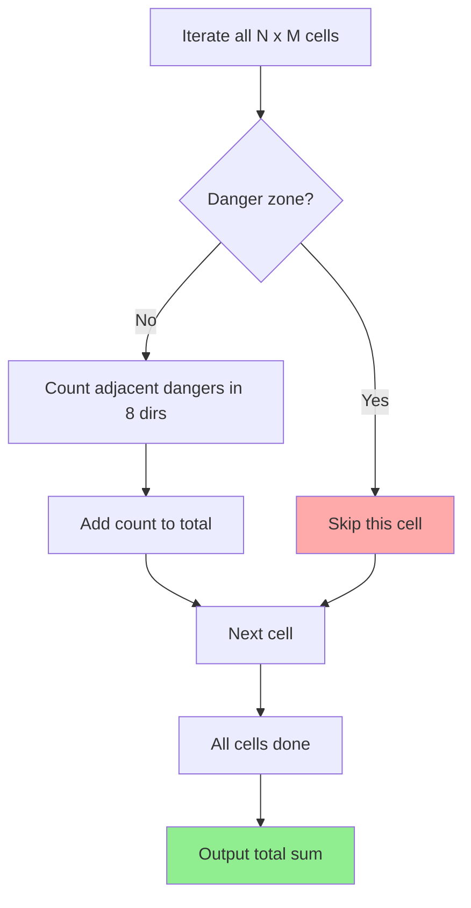

## Problem

$N \times M$ 크기의 격자판이 주어진다. 격자판의 각 칸에는 **위험 구역**이 표시되어 있거나 비어 있다.

- `0`: 안전한 빈 구역.
- `-1`: 위험 구역.
- 빈 구역에 **경고 표지판**을 설치할 수 있으며, 표지판의 숫자는 해당 칸의 **8방향**(상, 하, 좌, 우, 대각선) 주변에 있는 위험 구역의 개수이다.

모든 빈 구역에 경고 표지판을 설치했을 때, **표지판 숫자들의 총합**을 구하시오.

- $1 \le N, M \le 1{,}000$

```
Input:
4 4
0 0 0 0
0 0 -1 0
0 0 0 0
-1 0 0 0

Output:
11
```

---

## Initial Thought (Failed)

각 칸에서 주변 위험 구역 개수를 세는 것이니까, 반대로 **"각 위험 구역이 영향을 주는 8방향 칸의 개수"**를 더해도 같은 결과 아닌가?

맞다. 위험 구역 하나가 최대 8개의 칸에 +1을 기여하므로, 위험 구역 중심으로 계산할 수도 있다. 하지만:

- 결국 **모든 칸을 순회하면서 위험 구역인지 아닌지 판별**하는 것은 동일하다.
- 경계 조건 처리는 어느 쪽이든 필요하다.

어차피 $O(NM)$이므로, **가장 직관적인 방법(각 칸에서 8방향 탐색)**으로 풀자.

---

## Key Insight

이 문제의 핵심은 **2차원 격자에서의 8방향 탐색 패턴**이다.

> **방향 벡터(Direction Vector)**를 미리 정의하면, 반복문 하나로 8방향을 깔끔하게 처리할 수 있다.

```python
directions = (
    (-1, 0), (1, 0), (0, -1), (0, 1),
    (-1, -1), (-1, 1), (1, -1), (1, 1),
)
```

각 칸 $(r, c)$에서:
1.  위험 구역(`-1`)이면 **건너뛴다**.
2.  아니면, 8방향의 이웃 칸 중 **위험 구역(`-1`)인 칸의 개수**를 센다.
3.  그 개수를 총합에 더한다.

---

## Step-by-Step Analysis

$4 \times 4$ 격자판:

| | C0 | C1 | C2 | C3 |
|---|---|---|---|---|
| **R0** | 0 | 0 | 0 | 0 |
| **R1** | 0 | 0 | -1 | 0 |
| **R2** | 0 | 0 | 0 | 0 |
| **R3** | -1 | 0 | 0 | 0 |



경고 표지판 숫자를 채우면:

| | C0 | C1 | C2 | C3 |
|---|---|---|---|---|
| **R0** | 0 | 1 | 1 | 1 |
| **R1** | 0 | 1 | **-1** | 1 |
| **R2** | 1 | 2 | 1 | 1 |
| **R3** | **-1** | 1 | 0 | 0 |

- 예를 들어 (R2, C1) = 2인 이유: 8방향에 (R1, C2)=-1과 (R3, C0)=-1, 총 2개 위험 구역.

총합 = $0+1+1+1 + 0+1+1 + 1+2+1+1 + 1+0+0 = 11$

---

## Solution

```python
import sys


def main() -> None:
    """입력을 받아 경고 표지판 숫자의 총합을 계산하고 출력한다."""
    input = sys.stdin.readline

    # 1단계: 입력 받기
    n, m = map(int, input().split())

    board: list[list[int]] = []
    for _ in range(n):
        row: list[int] = list(map(int, input().split()))
        board.append(row)
    # end for

    # 2단계: 8방향 탐색을 위한 방향 벡터 정의
    directions: tuple[tuple[int, int], ...] = (
        (-1, 0), (1, 0), (0, -1), (0, 1),
        (-1, -1), (-1, 1), (1, -1), (1, 1),
    )

    # 3단계: 각 칸을 순회하며 경고 표지판 숫자 구하기
    total_warning_count: int = 0

    for row_index in range(n):
        for col_index in range(m):
            # 위험 구역(-1)은 건너뛴다.
            if board[row_index][col_index] == -1:
                continue
            # end if

            # 현재 칸 주변 8방향의 위험 구역 개수를 센다.
            danger_count: int = 0
            for d_row, d_col in directions:
                neighbor_row: int = row_index + d_row
                neighbor_col: int = col_index + d_col

                # 범위를 벗어나면 건너뛴다.
                if neighbor_row < 0 or neighbor_row >= n:
                    continue
                # end if
                if neighbor_col < 0 or neighbor_col >= m:
                    continue
                # end if

                # 주변 칸이 위험 구역(-1)이면 카운트 증가
                if board[neighbor_row][neighbor_col] == -1:
                    danger_count += 1
                # end if
            # end for

            total_warning_count += danger_count
        # end for
    # end for

    print(total_warning_count)
# end def


if __name__ == '__main__':
    main()
# end if
```

---

## Complexity

- **Time Complexity**: $O(N \times M)$
    - 모든 칸을 순회하며, 각 칸에서 최대 8번의 상수 연산만 수행한다.
    - 정확히는 $O(8 \times N \times M) = O(NM)$.
- **Space Complexity**: $O(NM)$
    - 입력 격자판을 저장하는 데에만 메모리를 사용한다.

---

## Key Takeaways

| Point | Description |
|-------|-------------|
| **Direction Vector** | 8방향(또는 4방향) 탐색 시 방향 벡터를 미리 정의하면 코드가 간결해짐 |
| **Boundary Check** | 격자 문제에서 인덱스 범위 확인은 필수, `0 <= r < N` 패턴 숙지 |
| **Dual Perspective** | "각 칸에서 주변 위험 구역 세기" vs "각 위험 구역에서 주변 칸에 +1"은 동치 |
