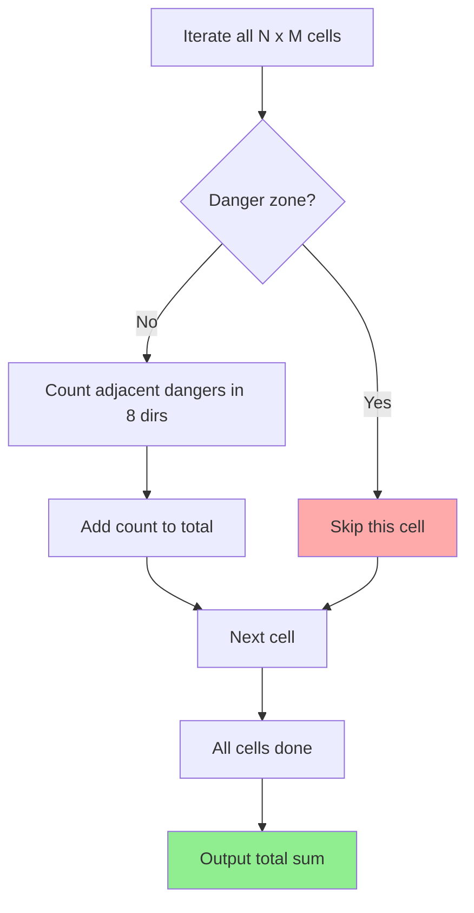

## Problem

You are given an $N \times M$ grid. Each cell of the grid is either marked as a **danger zone** or is empty.

- `0`: a safe, empty cell.
- `-1`: a danger zone.
- A **warning sign** can be placed on an empty cell, and the number on the sign equals the count of danger zones among the cell's **8 neighbors** (up, down, left, right, and the diagonals).

After placing warning signs on every empty cell, compute the **total sum of the numbers on all the signs**.

- $1 \le N, M \le 1{,}000$

```
Input:
4 4
0 0 0 0
0 0 -1 0
0 0 0 0
-1 0 0 0

Output:
11
```

---

## Initial Thought (Failed)

Since we are counting the number of surrounding danger zones for each cell, wouldn't summing it the other way around — **"the number of 8-directional cells each danger zone contributes to"** — give the same result?

It does. A single danger zone contributes +1 to at most 8 cells, so we could compute it centered on the danger zones instead. However:

- In the end, **iterating over every cell to determine whether it is a danger zone or not** is the same either way.
- Boundary condition handling is required no matter which approach we take.

Since it is $O(NM)$ regardless, let's solve it with the **most intuitive approach (an 8-directional search from each cell)**.

---

## Key Insight

The core of this problem is the **8-directional search pattern on a 2D grid**.

> If you predefine **direction vectors**, you can handle all 8 directions cleanly with a single loop.

```python
directions = (
    (-1, 0), (1, 0), (0, -1), (0, 1),
    (-1, -1), (-1, 1), (1, -1), (1, 1),
)
```

For each cell $(r, c)$:
1.  If it is a danger zone (`-1`), **skip it**.
2.  Otherwise, count **how many of the 8 neighboring cells are danger zones (`-1`)**.
3.  Add that count to the total.

---

## Step-by-Step Analysis

A $4 \times 4$ grid:

| | C0 | C1 | C2 | C3 |
|---|---|---|---|---|
| **R0** | 0 | 0 | 0 | 0 |
| **R1** | 0 | 0 | -1 | 0 |
| **R2** | 0 | 0 | 0 | 0 |
| **R3** | -1 | 0 | 0 | 0 |



After filling in the warning sign numbers:

| | C0 | C1 | C2 | C3 |
|---|---|---|---|---|
| **R0** | 0 | 1 | 1 | 1 |
| **R1** | 0 | 1 | **-1** | 1 |
| **R2** | 1 | 2 | 1 | 1 |
| **R3** | **-1** | 1 | 0 | 0 |

- For example, (R2, C1) = 2 because among its 8 neighbors are (R1, C2)=-1 and (R3, C0)=-1, for a total of 2 danger zones.

Total sum = $0+1+1+1 + 0+1+1 + 1+2+1+1 + 1+0+0 = 11$

---

## Solution

```python
import sys


def main() -> None:
    """Read the input, compute the total sum of the warning sign numbers, and print it."""
    input = sys.stdin.readline

    # Step 1: read the input
    n, m = map(int, input().split())

    board: list[list[int]] = []
    for _ in range(n):
        row: list[int] = list(map(int, input().split()))
        board.append(row)
    # end for

    # Step 2: define the direction vectors for the 8-directional search
    directions: tuple[tuple[int, int], ...] = (
        (-1, 0), (1, 0), (0, -1), (0, 1),
        (-1, -1), (-1, 1), (1, -1), (1, 1),
    )

    # Step 3: iterate over each cell to compute the warning sign numbers
    total_warning_count: int = 0

    for row_index in range(n):
        for col_index in range(m):
            # Skip danger zones (-1).
            if board[row_index][col_index] == -1:
                continue
            # end if

            # Count the danger zones among the current cell's 8 neighbors.
            danger_count: int = 0
            for d_row, d_col in directions:
                neighbor_row: int = row_index + d_row
                neighbor_col: int = col_index + d_col

                # Skip if it goes out of bounds.
                if neighbor_row < 0 or neighbor_row >= n:
                    continue
                # end if
                if neighbor_col < 0 or neighbor_col >= m:
                    continue
                # end if

                # If the neighboring cell is a danger zone (-1), increment the count.
                if board[neighbor_row][neighbor_col] == -1:
                    danger_count += 1
                # end if
            # end for

            total_warning_count += danger_count
        # end for
    # end for

    print(total_warning_count)
# end def


if __name__ == '__main__':
    main()
# end if
```

---

## Complexity

- **Time Complexity**: $O(N \times M)$
    - We iterate over every cell, performing at most 8 constant-time operations per cell.
    - More precisely, $O(8 \times N \times M) = O(NM)$.
- **Space Complexity**: $O(NM)$
    - Memory is used only to store the input grid.

---

## Key Takeaways

| Point | Description |
|-------|-------------|
| **Direction Vector** | Predefining direction vectors keeps the code concise for 8-directional (or 4-directional) searches |
| **Boundary Check** | Index range checks are essential in grid problems; master the `0 <= r < N` pattern |
| **Dual Perspective** | "Counting surrounding danger zones from each cell" vs. "Adding +1 to surrounding cells from each danger zone" are equivalent |
