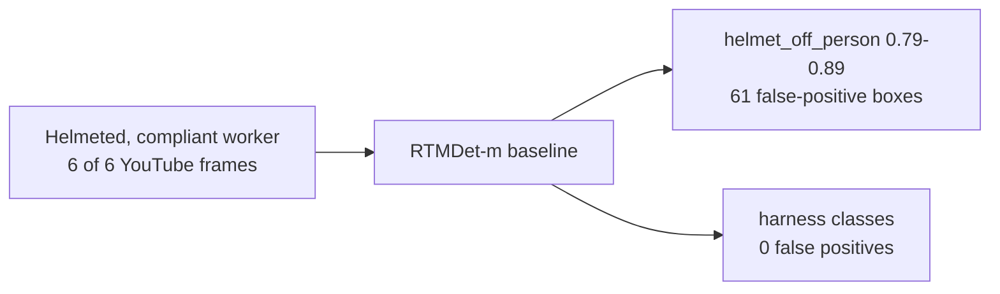
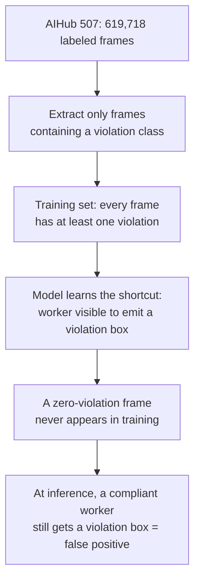
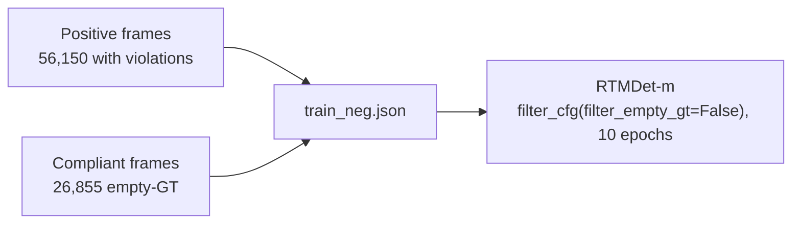

## Introduction

I trained an [RTMDet](https://arxiv.org/abs/2212.07784) object detector to flag two safety violations on construction sites — **no helmet** and **unhooked safety harness** — using AIHub's "high-altitude work site" video dataset (dataset 507). On AIHub's official validation split — frame-held-out, but *not* clip-disjoint (more on that later) — it scored **0.908 mAP** and **0.995 AP@50**. By the usual reading, the problem was solved.

It was not. The same model fired `helmet_off` on workers who were clearly **wearing white helmets**, with 0.79–0.89 confidence. A 0.91-mAP detector was confidently wrong on the easiest possible case.

This post is about the gap between that number and reality: how I diagnosed the failure (and ruled out the obvious explanation), why it traces back to a single data-extraction decision, and how adding **empty-GT negatives** cut external false positives by **66%** with no measured loss on the (in-clip) validation mAP. The headline lesson is the one this blog keeps relearning — **a high mAP can hide the failure mode that actually matters.**

> **Setup.** Model: RTMDet-m (OpenMMLab MMDetection 3.3.0), fine-tuned from COCO weights at 640×640, batch 4, on a single RTX 4060 Ti (8 GB). Data: AIHub 507, 4 classes (helmet/harness × part-box/worker-box). This was a solo research project on a licensed dataset, so the dataset frames are not redistributed here; the numbers, configs, and snippets below are the reproduction cues.
{: .prompt-info }

## Challenge 1: A Detector That Looked Solved

The dataset labels every violation at two box granularities — a small **part** box (`WO`, e.g. the bare head) and a large **whole-worker** box (`UA`). That gives four training classes:

| id | class | meaning | box |
|:--:|-------|---------|-----|
| 1 | `helmet_off_head` | no helmet | head / part (small) |
| 2 | `hook_off_part` | harness unhooked | part (small) |
| 3 | `helmet_off_person` | no helmet | worker (large) |
| 4 | `hook_off_person` | harness unhooked | worker (large) |

I extracted the ~63k frames containing these classes (~10% of the dataset; 56,150 train + 6,984 validation), fine-tuned RTMDet-m for 12 epochs (~10 h), and evaluated on the 6,984-frame official validation split (frame-held-out, not clip-disjoint):

| Metric | Value |
|--------|:-----:|
| mAP (IoU 0.50:0.95) | **0.908** |
| AP@50 | **0.995** |
| AP@75 | **0.990** |

Here mAP is the COCO primary metric, $\text{mAP} = \text{AP}$ averaged over IoU thresholds $0.50{:}0.05{:}0.95$. Per class, AP ranged from 0.875 (`helmet_off_head`) to 0.944 (`helmet_off_person`). At IoU 0.50 every class sat at 0.99–1.00. (That single mAP also macro-averages the harder part boxes, ~0.88, with the easy whole-worker boxes, ~0.93–0.94, so the headline is pulled up by the easy granularity — the per-class spread is the honest view.) Whether a worker is in violation was, on this validation set, essentially solved.

**Lesson:** AP@50 at 0.99 tells you the model separates the labeled classes well — it says nothing about what the model does on inputs the labels never contained.

## Challenge 2: It Fires on Compliant Workers

To sanity-check generalization, I pulled six frames from a YouTube construction-safety clip (a distribution the model never trained on) and ran inference. The result was not a subtle degradation:

- In **all 6 of 6 frames**, the model emitted `helmet_off_person` on a worker who was **wearing a helmet**, at 0.79–0.89 confidence.
- Across the six frames it produced **61 false-positive boxes** total.
- Harness violations: zero false positives — the failure was specific to the helmet classes.

A detector that scores 0.995 AP@50 in-distribution and hallucinates "no helmet" on a helmeted worker is not a small calibration issue. Something about *what the model learned to do when it sees a worker* was wrong.


_The failure is helmet-specific: the baseline invents `helmet_off` on a helmeted worker while correctly raising no harness alarm._

## Challenge 3: Is It Domain Shift? Reproducing the Failure In-Domain

The convenient explanation is **domain shift** — YouTube footage looks different from the training CCTV, so of course it breaks. If that were the cause, the fix would be "collect more diverse data" and move on. I wanted to falsify it before believing it.

Two facts argued against domain shift:

1. **The model has seen plenty of helmets.** Every harness-violation frame (~32k of them) contains a helmeted worker, labeled `hook_off`. And on validation, the model *distinguishes* helmet-state from harness-state cleanly (`helmet_off_person` 0.944 vs `hook_off_person` 0.932). It is not "blind to helmets."
2. **The failure reproduces in-domain.** I ran the model on `New_Sample` — the *same* fixed-CCTV style as training, helmeted compliant workers, no violation classes present. It still fired `helmet_off` at **0.44–0.76 confidence**, including `helmet_off_head` placed directly on the helmeted head.

The same failure on same-domain footage rules out domain shift as the root cause. The model is not confused by a new look; it is doing something structural — **on a worker with no violation it often fires anyway, defaulting to `helmet_off`** (harness false positives stayed at zero, so this is not a blanket "any worker → any violation" reflex).

## Challenge 4: The Real Root Cause — Every Training Frame Had a Violation

The cause is upstream of the model, in the data extraction. To save disk and training time, I extracted *only* frames that contained one of the four violation classes. That decision has a subtle consequence:



The model **never saw a zero-violation frame** — a worker present with no violation labeled. Since every training image contained at least one violation, the model never learned that a visible worker can warrant *no* box. So at inference it leans the same way — often firing on a compliant worker, and defaulting to `helmet_off` (the easier-to-localize cue) when it does. This is a textbook negative-space gap: the high validation mAP is real, but the validation set carries the *same* violation-only bias, so it cannot measure the compliant-worker false-positive rate at all.

**Lesson:** A dataset filtered to "only frames with the target" teaches presence, not discrimination. If the model will ever see the negative case in production, the negative case has to be in training.

## Challenge 5: The Fix — Empty-GT Negatives

The prescription follows directly from the diagnosis: show the model compliant workers with **no boxes to predict**. In object detection these are *empty-GT negatives* — images whose ground truth is an empty annotation list. Because such an image has no foreground target to match, any box the model proposes there is trained toward background, pushing its scores on compliant workers down. The only catch is that detection frameworks discard annotation-less images by default; you have to keep them explicitly.

```python
# configs/helmet_hook/rtmdet_m_helmet_hook_neg.py  (MMDetection config; overrides the RTMDet base)
train_dataloader = dict(
    dataset=dict(
        ann_file='train_neg.json',   # 56,150 positives + 26,855 compliant negatives
        # KEY: keep zero-annotation (compliant) frames — MMDetection 3.x filters them out by default
        filter_cfg=dict(filter_empty_gt=False, min_size=32),
    )
)
```

An empty-GT negative is just a COCO `images` entry with no matching `annotations`. Identifying them is a one-liner over the COCO file:

```python
import json

def find_empty_gt_images(coco_path: str) -> list:
    """Return image ids that have zero annotations (compliant-worker frames)."""
    with open(coco_path) as f:
        coco = json.load(f)
    # end with
    annotated = {a["image_id"] for a in coco["annotations"]}
    return [img["id"] for img in coco["images"] if img["id"] not in annotated]
# end def
```

I sourced negatives from compliant-worker frames in the *same* sites (so they are hard negatives, not trivially easy ones), then validated the idea before scaling it.

### First, a controlled A/B test (RTMDet-tiny)

Same architecture and schedule — the intended variable was the 2,250 empty-GT negatives added to model B (the seed was not pinned, so it varied too; see Limitations):

| | val mAP | FP images (of 50) | FP boxes | `helmet_off_head` boxes |
|---|:---:|:---:|:---:|:---:|
| **A** (no negatives) | 0.880 | 50 | 159 | 100 |
| **B** (+2,250 negatives) | 0.869 | **24** | **72** | **24** |
| change | −0.011 | **−52%** | **−55%** | **−76%** |

Adding negatives cut false-positive boxes by 55% while validation mAP barely moved (−0.011). Two caveats: (1) this A/B is RTMDet-**tiny**, so its absolute false-positive counts are lower than the full RTMDet-m run in the Results section (159 here vs 314 there for the same 50-frame probe); (2) these counts use the same in-domain probe that overlaps the training negatives, so read the A/B *magnitude* as directional — the clean cross-domain estimate is the YouTube −66% in the Results section. The direction was confirmed; the magnitude said "scale it up."

### Then, the full-scale run (RTMDet-m + 26,855 negatives)



The full negative set (26,855 compliant frames, ~0.48× the positives) trained cleanly for 10 epochs. Validation mAP rose monotonically across epochs 4→10 — 0.895 → 0.901 → 0.906 → 0.911 — with the final gain realized in the cosine-decay tail (loss 0.30 → 0.23):


_Training loss for the negative model. The flat fixed-LR region (~0.30) drops to ~0.23 once cosine decay kicks in (epochs 5–10), the same window where validation mAP climbs 0.906 → 0.911._

## Results

The headline comparison is on the **external YouTube probe** — six frames I manually checked as fully compliant (workers wearing helmets) — because it is the only set with no overlap with training data (see Limitations). Every count below is boxes scoring above the 0.3 threshold; on a compliant frame, any such box is a false positive:

| Probe | Baseline (no neg) | + Empty-GT negatives | Reduction |
|-------|:---:|:---:|:---:|
| **External YouTube** (6 compliant frames) | 61 boxes · 6 of 6 frames | **21 boxes · 6 of 6 frames** | **−66%** |
| In-domain `New_Sample` (50 frames) | 314 boxes · 50 of 50 | 22 boxes · 14 of 50 | −93% † |

_† The in-domain −93% is a training-distribution suppression rate, not a generalization estimate — the probe overlaps the training negatives. See Limitations._


_False-positive boxes, baseline vs + empty-GT negatives. The clean external probe (left) is the headline; the in-domain probe (right) is larger but contaminated. Independent y-axes._

And crucially, suppressing the false positives did **not** cost detection accuracy on real violations:

| Model | mAP | AP@50 |
|-------|:---:|:---:|
| baseline RTMDet-m (12 ep) | 0.908 | 0.995 |
| + empty-GT negatives (10 ep) | **0.911** | 0.995 |

The 0.908 → 0.911 move is within run-to-run seed noise, so the honest reading is **"detection held flat while false positives dropped by two-thirds,"** not "+0.003 mAP." Empty-GT negatives buy a large precision gain on compliant workers at no measured cost to the (near-train) in-clip validation mAP.

One counterintuitive result is worth showing, because it is a trap. Looked at per epoch, the *earliest* checkpoint seems to have the fewest false positives:

| neg checkpoint | det. mAP | in-domain FP (boxes/imgs) | YouTube FP (boxes/frames) |
|:---:|:---:|:---:|:---:|
| epoch 2 | 0.892 | 22 / 17 | 10 / 4 |
| epoch 6 | 0.901 | 60 / 27 | 56 / 6 |
| epoch 8 | 0.906 | 26 / 12 | 26 / 6 |
| **epoch 10** | **0.911** | 22 / 14 | 21 / 6 |


_Detection mAP (rising) vs false-positive count (non-monotonic) across epochs. Epoch 2's low FP count is a mirage._

Epoch 2's low false-positive count is an artifact of an under-confident model: too few of its boxes clear the 0.3 score threshold, so they simply do not get counted — and its detection mAP (0.892) is the *worst* of the run, meaning it also misses the most real violations. As training raises confidence, false positives spike at epoch 6, then the negative suppression plus cosine decay pull them back down. **The fully-trained checkpoint is the right one: best detection and lowest sustained false positives at once.**

## What Didn't Work / Limitations

This fix is real but partial, and two of the headline numbers need honest caveats.

- **External transfer is incomplete.** In-domain false positives nearly vanished, but the external YouTube probe still kept 21 boxes (−66%, not −100%). Every negative I added is from the AIHub domain, so it transfers only partially to out-of-domain footage. Fully closing the gap needs **external-domain compliant negatives**, which I do not have.
- **The external result is a small sanity probe, not a benchmark.** It is six frames from a single YouTube clip — enough to expose the failure and show the negatives clearly help, not enough to quantify a rate. Read the −66% as directional.
- **2,250 negatives were not enough.** In the A/B run, some compliant frames — different sites, orange helmets the negatives under-covered — still drew `helmet_off`. Negative *diversity*, not just count, matters.
- **The in-domain −93% is contaminated.** The 50-frame in-domain probe overlaps the training negatives (some frames are byte-identical, all are within ≤6 frames of a training negative). So −93% is a *training-distribution suppression rate*, not generalization. This is exactly why I lead with the clean external −66%.
- **Even the 0.91 mAP is near-train.** AIHub 507's official train/val split interleaves frames *within the same clip* — 94.2% of validation frames sit within ±1 label-index of a training frame from the same fixed-camera clip. So 0.908/0.911 reflects near-train performance, which is precisely why an external probe was able to expose a failure the validation set structurally could not. A clip-disjoint re-split would report a lower, more honest number — a future post in this series will dig into that.
- **No fixed seed.** MMDetection's training does not fix a seed by default, so ±0.003 mAP deltas are within run-to-run variance — another reason to read the detection result as "no loss," not "improvement."

## Conclusion

1. **A high mAP measures the labels, not the world.** 0.995 AP@50 coexisted with confident `helmet_off` calls on helmeted workers, because the validation set shared the training set's blind spot. Always probe the negative case the labels omit.
2. **Reproduce the failure before explaining it.** The "obvious" cause was domain shift; reproducing the false positive *in-domain* falsified that and pointed at the real cause — a violation-only extraction filter that erased the compliant-worker class.
3. **Empty-GT negatives are a cheap, targeted fix.** Adding compliant frames with `filter_cfg(filter_empty_gt=False)` cut external false positives 66% with no measured loss on the (near-train) validation mAP — but only as far as the negatives' domain reaches, so diversity and clean, disjoint evaluation are the next requirements.

## Reproduction

The dataset is licensed, so the frames are not redistributed here, but the evaluation is a handful of commands on the trained checkpoints — detection mAP (baseline and + negatives) through MMDetection's `test.py`, and the compliant-worker false-positive counts through a small probe script:

```bash
# Baseline (no negatives) detection mAP — its config already evaluates val.json (6,984 frames)
python tools/test.py configs/helmet_hook/rtmdet_m_helmet_hook.py \
    work_dirs/helmet_hook/best_coco_bbox_mAP_epoch_12.pth

# + negatives model on the SAME 6,984 real-violation frames (val.json).
# Its config defaults to val_neg.json (20,341 frames incl. negatives), so override it:
python tools/test.py configs/helmet_hook/rtmdet_m_helmet_hook_neg.py \
    work_dirs/helmet_hook_neg/epoch_10.pth \
    --cfg-options test_dataloader.dataset.ann_file=val.json \
        test_evaluator.ann_file=$HOME/repo/datasets/helmet_hook_coco/val.json

# Compliant-worker false positives, baseline vs + negatives (in-domain + YouTube probes)
python scripts/measure_fp.py \
    --baseline-cfg configs/helmet_hook/rtmdet_m_helmet_hook.py \
    --baseline-ckpt work_dirs/helmet_hook/best_coco_bbox_mAP_epoch_12.pth \
    --neg-cfg configs/helmet_hook/rtmdet_m_helmet_hook_neg.py \
    --neg-ckpt work_dirs/helmet_hook_neg/epoch_10.pth
```

## Resources

- **RTMDet** — *RTMDet: An Empirical Study of Designing Real-Time Object Detectors*, Lyu et al., 2022 ([arXiv:2212.07784](https://arxiv.org/abs/2212.07784))
- **Framework** — [OpenMMLab MMDetection](https://github.com/open-mmlab/mmdetection) (`configs/rtmdet/`)
- **Dataset** — [AIHub 고소작업 현장 실시간 영상 데이터 (No. 507)](https://aihub.or.kr/)
- **Negatives / dataset bias** — Liu et al., *SSD: Single Shot MultiBox Detector* (ECCV 2016) for hard-negative mining; Torralba & Efros, *Unbiased Look at Dataset Bias* (CVPR 2011)
