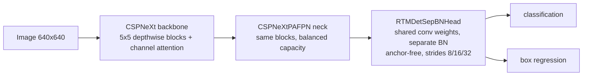

> **Note**: This is a review of **"RTMDet: An Empirical Study of Designing Real-Time Object Detectors"** (Lyu et al., 2022; [arXiv:2212.07784](https://arxiv.org/abs/2212.07784), [doi:10.48550/arXiv.2212.07784](https://doi.org/10.48550/arXiv.2212.07784)). Official code and models: [OpenMMLab MMDetection](https://github.com/open-mmlab/mmdetection/tree/3.x/configs/rtmdet).
>
> Unlike my other paper reviews, this one is an original write-up rather than a translation — it accompanies a hands-on project in which I fine-tuned RTMDet-m for construction-site safety-gear detection.
{: .prompt-info }

---

## Why I Read This Paper

I used RTMDet-m as the detector in a small safety-gear project (helmet / harness violations on a construction-site dataset), so I wanted to understand the model I was fine-tuning rather than treating it as a black box from a config file. Two things drew me in.

First, the title says **"an empirical study,"** not "a novel architecture." RTMDet does not introduce one headline module. It reaches what was, at publication, state-of-the-art real-time accuracy by making a *series* of careful, measured design choices — backbone/neck capacity balance, a large-kernel block, a soft-label matcher, a two-stage augmentation schedule — and ablating each one. That honest, engineering-first framing is rare and worth studying.

Second, it is the detector behind a large slice of OpenMMLab's `mmdetection`, so reading it pays off directly in practice. The same backbone and assignment recipe is reused for **detection, instance segmentation, and rotated detection** — a good test of whether the design is general or overfit to COCO boxes.

---

## Introduction

Real-time object detection has been dominated by the YOLO family (YOLOX, YOLOv5/6/7, PPYOLOE), which iterates aggressively on the same recipe. RTMDet asks a cleaner question: if you systematically study each component — the basic block, the capacity split between backbone and neck, the detection head, the label assignment, and the training pipeline — how far can a real-time detector go without inventing a new module?

The paper's stated answer (from the abstract): RTMDet reaches **52.8% AP on COCO at 300+ FPS** on an NVIDIA 3090, offers the best parameter-accuracy trade-off across tiny→extra-large sizes, and, at publication, set new state-of-the-art results for real-time instance segmentation and rotated detection. Its contributions are, in effect:

1. An efficient **macro architecture** with *compatible capacities* in the backbone and neck.
2. A basic building block based on **large-kernel depth-wise convolutions** (CSPNeXt).
3. **Soft labels** in the dynamic label-assignment cost, improving the matcher.
4. **Better training techniques** (cached Mosaic/MixUp + a two-stage schedule).
5. A single recipe that **extends to instance segmentation and rotated detection**.

## Context / Related Work

Where does this sit relative to prior real-time detectors?

- **vs. the YOLO series.** YOLOX introduced an anchor-free, decoupled-head design with SimOTA assignment; YOLOv6/v7/PPYOLOE pushed re-parameterization, training tricks, and scaling. RTMDet stays anchor-free and SimOTA-style but treats the whole pipeline as an ablation study, and it argues for *balancing* backbone and neck capacity instead of piling parameters into the backbone.
- **vs. large-kernel CNNs.** ConvNeXt and RepLKNet showed large kernels can rival transformers. RTMDet brings a moderate **5×5 depth-wise** kernel into a CSP-style block (CSPNeXt) rather than the very large kernels of RepLKNet, trading a little receptive field for latency.
- **vs. dynamic label assignment.** OTA / SimOTA frame assignment as optimal transport with hard matching costs. RTMDet's contribution is to **soften the labels** inside that cost, which is a small change with a measurable gain.

The framing — "an empirical study" inside the `mmdetection` ecosystem, reusing one design across three tasks — is the paper's real position: not a single trick, but a reproducible recipe.

## Method

### 1. Macro design: balance backbone and neck capacity

The central architectural claim is that a detector wastes capacity if the backbone is heavy and the neck is thin. RTMDet shifts parameters and compute toward the neck so the two stages have *compatible capacities*, using the **same basic block** in both.

### 2. The basic block: large-kernel depth-wise convolution (CSPNeXt)

Each block uses a **5×5 depth-wise convolution** to widen the effective receptive field cheaply, wrapped in a CSP (cross-stage partial) structure with a channel-attention (SE-style) module and SiLU activations. The paper picks 5×5 as the accuracy/latency sweet spot — not the single most accurate kernel (7×7 edges it out) but the best speed-for-accuracy balance.

### 3. Head: shared weights, separate BN

The detection head (`RTMDetSepBNHead`) **shares its convolution weights across the three feature scales** but keeps **separate Batch Normalization** per scale. Sharing weights cuts parameters; per-scale BN preserves the different feature statistics at strides 8/16/32. The head is anchor-free (point-based, with a distance-to-box coder).

### 4. Dynamic soft-label assignment

Assignment decides which predictions are matched to which ground-truth box during training. RTMDet keeps SimOTA's dynamic cost but injects **soft labels**: instead of a hard target of 1, the classification target is the prediction–GT **IoU**, so well-localized predictions get a stronger learning signal. The matching cost is a weighted sum of classification, regression, and center-prior terms:

$$
C = \lambda_1 C_{cls} + \lambda_2 C_{reg} + \lambda_3 C_{center}
$$

with the regression cost $C_{reg} = -\log(\text{IoU})$ and a soft classification cost of the form

$$
C_{cls} = \text{CE}(P,\, Y_{\text{soft}}) \cdot (Y_{\text{soft}} - P)^2, \qquad Y_{\text{soft}} = \text{IoU}(\text{pred}, \text{gt}).
$$

On training losses, the paper's assignment ablation uses **Focal Loss** + **GIoU**, while the released MMDetection RTMDet configs use **Quality Focal Loss** + GIoU — the soft IoU labels above are the GFL/QFL idea applied inside the matcher.

### 5. Training: cached augmentation + a two-stage schedule

Training runs for 300 epochs in two stages:

- **First ~280 epochs** — strong augmentation with **Cached Mosaic** and **Cached MixUp** (the cache makes the heavy mixing cheap).
- **Last ~20 epochs** — strong mixing is switched off and replaced with **Large-Scale Jittering (LSJ)**, letting the model settle on cleaner, more realistic images.

This staged schedule is one of the larger contributors to final accuracy, especially for the bigger models.

## Experiments / Results

### COCO object detection

The headline benchmark is the parameter-accuracy-latency trade-off across the five model sizes:

| Variant | Params (M) | FLOPs (G) | Latency (ms) | COCO box AP (%) |
|---------|:----------:|:---------:|:------------:|:---------------:|
| RTMDet-tiny | 4.8 | 8.1 | 0.98 | 41.1 |
| RTMDet-s | 8.99 | 14.8 | 1.22 | 44.6 |
| RTMDet-m | 24.7 | 39.3 | 1.62 | 49.4 |
| RTMDet-l | 52.3 | 80.2 | 2.40 | 51.5 |
| **RTMDet-x** | 94.9 | 141.7 | 3.10 | **52.8** |

_Table 1: RTMDet COCO results (numbers from the paper's Table 2; latency on an NVIDIA 3090 with TensorRT-FP16, batch size 1). The released MMDetection model zoo mostly matches, with small repo/paper discrepancies — e.g. RTMDet-l latency 2.44 ms (zoo) vs 2.40 (paper), and RTMDet-s params 8.89M (zoo) vs 8.99M (paper). The main claim, RTMDet-x at 52.8% AP and 3.10 ms (~300+ FPS), is the bold row._

_The accuracy-vs-size curve from the table above. Each step up the ladder buys diminishing AP for steadily more parameters and latency — yet even RTMDet-tiny clears 41% AP at 0.98 ms._

The 3.10 ms latency for RTMDet-x is where the "300+ FPS" claim comes from ($1000 \,/\, 3.10 \approx 322$ FPS). Even RTMDet-tiny, at 4.8M params, clears 41% AP at sub-millisecond latency.

### Key ablations

The paper's ablations are what justify the "empirical study" title. The most informative (numbers as reported in the paper's ablation tables):

- **Large kernel.** Moving the block to a 5×5 depth-wise conv raises AP to **50.9%** vs **50.0%** for 3×3. (7×7 reaches 51.1%, but 5×5 was chosen as the speed/accuracy trade-off.)
- **Soft-label assignment.** The full dynamic soft-label assignment beats plain SimOTA by about **+1.3 AP** on RTMDet-s; the soft classification cost in isolation accounts for ~+0.4 of that in the component ablation.
- **Training pipeline.** The cached-augmentation + two-stage schedule gives a clear lift, larger on the big models than the small ones — about **+1.5 AP** on RTMDet-l (≈49.8 → 51.3 in the paper's two-stage ablation).

### Beyond boxes: instance segmentation and rotated detection

The same recipe transfers:

- **Instance segmentation (RTMDet-Ins).** RTMDet-Ins-x reaches **52.4% box AP / 44.6% mask AP** at real-time speed (~180 FPS) — state-of-the-art for real-time instance segmentation at publication.
- **Rotated detection (RTMDet-R).** RTMDet-R-l reaches **81.33% mAP on DOTA-v1.0** with multi-scale testing plus COCO pre-training (80.54% multi-scale from ImageNet; 78.85% single-scale), state-of-the-art among real-time rotated detectors at publication.

That a single backbone + assignment design tops three task leaderboards is the strongest evidence that the choices are general, not COCO-specific.

---

## Conclusion & Insight

RTMDet is a refreshing kind of paper: it advanced the state of the art (at publication) not by proposing one clever module but by **measuring** a coherent set of design decisions and keeping the ones that pay. The result is a clean, reproducible family of real-time detectors that generalizes across detection, segmentation, and rotated boxes.

### Strengths

- **Empirical rigor.** Every claim (large kernel, capacity balance, soft labels, two-stage augmentation) is backed by an ablation rather than intuition.
- **Practical trade-off.** Five sizes covering 4.8M→94.9M params and sub-1 ms→3.1 ms latency mean there is a usable model for almost any deployment budget.
- **Generality.** One recipe → three tasks, all competitive, which is hard to fake.
- **Reproducibility.** Code, configs, and weights ship in `mmdetection`; the released model-zoo numbers reproduce the paper's (give or take a rounding-level latency difference).

### Limitations

- **Incremental by design.** The components (CSP blocks, SimOTA-style assignment, Mosaic/MixUp) are individually known; the contribution is the combination and the measurement, not a new primitive.
- **Latency is hardware- and runtime-specific.** The "300+ FPS" figure assumes a 3090 with TensorRT-FP16 at batch 1; on other GPUs, with FP32, or larger inputs, the picture shifts.
- **Benchmark-centric evaluation.** Results are COCO / DOTA mAP. The paper does not study failure modes that matter in deployment — class imbalance, domain shift, or false positives on out-of-distribution inputs.

### Open Questions / Future Work

The limitation I felt most directly is the last one. In my own project, an RTMDet-m fine-tune scored ~0.91 mAP on the in-domain validation set yet confidently fired `helmet_off` on workers who *were* wearing helmets — a failure the COCO-style metric never measures, and one that came from the **data distribution**, not the architecture. RTMDet's contribution is a strong, fast backbone; what it (reasonably) leaves open is how that backbone behaves once the training distribution is biased. A natural follow-up to an "empirical study of architecture" is an equally empirical study of **data and evaluation** for the same detector — which is exactly where the hands-on side of this project went.

### Where RTMDet sits in 2025

This reviews a 2022 paper, so it deserves a dated marker. RTMDet (52.8 COCO box AP at its largest) is no longer the top real-time number, and the field has made two structural moves it predates:

| detector | COCO AP (largest) | head |
|---|:---:|---|
| RTMDet-X (2022) | 52.8 | CNN, NMS |
| YOLO11-X (2024) | 54.7 | CNN, NMS |
| RT-DETRv2 (2024 report) | up to 54.3 | DETR, **NMS-free** |
| YOLOv10 (NeurIPS 2024) | — | CNN, **NMS-free** (dual assignment) |
| D-FINE-X (ICLR 2025) | 55.8 (59.3 w/ Objects365) | DETR, **NMS-free** |

Both shifts bear on this project: **NMS-free heads** (RT-DETR / YOLOv10 / D-FINE) remove the NMS/IoU duplicate-suppression step I tuned around — the confidence threshold itself still remains — and **DETR-style decoders** replace the dense head + label assignment. None of this makes RTMDet obsolete for a single-consumer-GPU project — it still trains comfortably on 8 GB where DETR-family defaults often assume far more — but a 2026 reader should know the COCO leaderboard moved on. A controlled head-to-head (accuracy *and* trainability on one GPU) is its own post.

> Cross-source caveat: these AP figures are each model's own paper/repo numbers, measured on different hardware and runtimes — read them as *placement*, not a controlled comparison. The hardware-specific-latency caveat in Limitations applies doubly across models.
{: .prompt-warning }

## Resources

- **Companion post** — [the hands-on side of this project: when this exact model still produced false positives, and how empty-GT negatives fixed it]({{ '/posts/rtmdet-safety-gear-false-positives/' | relative_url }})
- **Paper** — *RTMDet: An Empirical Study of Designing Real-Time Object Detectors*, Lyu et al., 2022 ([arXiv:2212.07784](https://arxiv.org/abs/2212.07784))
- **Code & model zoo** — [OpenMMLab MMDetection — `configs/rtmdet`](https://github.com/open-mmlab/mmdetection/tree/3.x/configs/rtmdet)
- **Related** — YOLOX (anchor-free + SimOTA), ConvNeXt / RepLKNet (large-kernel CNNs), OTA / SimOTA (dynamic label assignment)
- **Since RTMDet (2025 placement)** — RT-DETR, *DETRs Beat YOLOs* ([arXiv:2304.08069](https://arxiv.org/abs/2304.08069)) and RT-DETRv2 ([arXiv:2407.17140](https://arxiv.org/abs/2407.17140)); YOLOv10, NeurIPS 2024 ([repo](https://github.com/THU-MIG/yolov10)); D-FINE, ICLR 2025 ([repo](https://github.com/Peterande/D-FINE)); Ultralytics YOLO11
