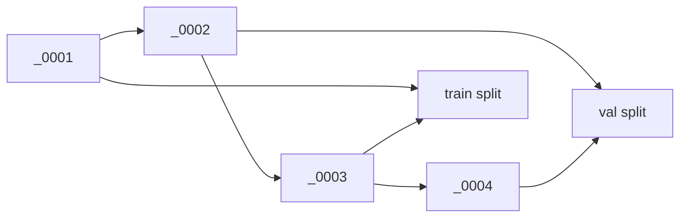

## Introduction

In an [earlier post]({{ '/posts/rtmdet-safety-gear-false-positives/' | relative_url }}) I reported some strong numbers for a construction-site safety-gear detector: **0.91 mAP** on the held-out validation set, and up to **−93%** fewer false positives (on an in-domain probe) after adding empty-GT negatives. Good numbers — so I went back and tried to *break* them before trusting them.

I found three problems in my own evaluation, and none is a code bug. **Two are data leakage** — the setup quietly let the model be measured on data too close to what it trained on — **and the third is a seed confound** that made a tiny delta look firmer than it is. This post is the honest correction: what each one is, how big it is, and **which number actually survives scrutiny**.

The short version:

| Reported number | Taken at face value | Verdict | How to cite it |
|-----------------|--------------------|---------|----------------|
| val mAP **0.908 / 0.911** | held-out generalization | 🔴 **near-train** (Leak 1) | say "AIHub official in-clip split" |
| in-domain FP **−93%** (314→22) | FP suppression | 🔴 probe overlaps training (Leak 2) | rename "training-distribution suppression" |
| external FP **−66%** (61→21) | out-of-domain generalization | ✅ uncontaminated (tiny probe) | **the cleanest estimate here (only 6 frames)** |
| +neg mAP **+0.003** | accuracy gain | 🟠 within seed noise (Confound 3) | read as "no measured loss" only |

## Leak 1: the "held-out" validation set shares clips with training

AIHub 507 ships an official Training/Validation split, and I used Validation as a held-out test set "never seen in training." That is true **per frame** — and false **per clip**.

The split doesn't separate *clips*; it **interleaves frames within the same clip**. In the source archive, a single fixed-camera clip's frames are dealt out alternately: `_0001`/`_0003` to train, `_0002`/`_0004` to val.

_Within one clip, frames alternate between the train and val splits — so most val frames sit between two of their own clip's training frames (quantified just below)._

Re-measuring the actual JSON files (train 56,150 / val 6,984):

| Measure | Value |
|---------|------:|
| Distinct clips | 55 in train **and** the same 55 in val (0 val-only clips) |
| val frames within ±1 label-index of a train frame | **94.2%** (6,579) |
| val frames within ±2 | 99.1% |

One honest caveat in the *other* direction: that "±1" is the **label-file index**, not a 33 ms video frame. Labels are sparsely sampled, so adjacent indices can be seconds apart, not milliseconds (in the one clip I checked, the median Δ at index-distance 1 was ~4.8 s). So it isn't literally the same frame twice — but it *is* the same fixed camera, same worker, same violation scene, a few seconds apart. Distributionally that's near-identical.

**So `0.908 / 0.911 mAP` is near-train accuracy, not held-out generalization.** That also explains why the model's **false-positive behavior degraded** on truly external footage (YouTube) and on a different site (`New_Sample`) — the validation number never measured that gap. This is a property of AIHub's official split, not a bug in my extraction.

**The fix I didn't do (yet):** a **clip-disjoint group split** — partition by clip ID (`raw_data_ID`), e.g. 45 train / 10 val clips, stratified by scenario, so no clip spans both sides. I expect the honest headline to land meaningfully below 0.91.

## Leak 2: the false-positive probe overlaps the training negatives

The −93% came from a 50-frame in-domain probe of compliant workers: how many false boxes the baseline vs the negative model emit. The catch: those probe frames overlap the empty-GT **negatives I trained on**. Comparing by file hash:

| Comparison | Overlap |
|------------|---------|
| A/B run — model B's 2,250 negatives vs the 50-frame probe | **26/50 byte-identical** (model A: 0) |
| Full-scale — 26,855 negatives vs the 50-frame probe | **8/50 byte-identical, and 50/50 within ≤6 frames** of a training negative |

The −93% is the full-scale RTMDet-m run, whose negatives overlap that probe directly (the full-scale row above). (The smaller RTMDet-tiny A/B cut, **−55%**, is even more overlapped — 26/50 byte-identical.) So a large part of both is **in-training-distribution suppression (partial memorization)**, not out-of-domain generalization. The number that *isn't* contaminated is the **external YouTube probe — −66% (61→21 boxes)** — which shares nothing with training. That's the cleanest, uncontaminated number in this audit — though, as noted next, it's a tiny 6-frame probe, so read it as directional too.

The probes are also statistically thin: the 50 in-domain frames come from effectively **2 clips**, and the 6 external frames from **1 video**. And the 0.3 score threshold is the visualizer's default, an **uncalibrated operating point** — so differences in each model's score distribution leak into the raw FP count.

**The fix:** hold out negative *clips* (not frames) for the probe, and use a few hundred frames. And since a compliant-only probe has no positives, you can't read recall off it — fix the score threshold on a *separate* clip-disjoint set that **does** contain real violations (or report a FROC curve — false positives per image vs. recall — over that mixed set), then count this probe's false positives at that fixed operating point, instead of an arbitrary 0.3.

> A subtler version of the same leak: the `val_neg.json` I used for a "penalty-included" mAP draws its 13,357 negative frames from the same 303 clips as the training negatives (median frame distance 2). So that cross-check isn't independent either — it includes partial memorization.
{: .prompt-info }

## Confound 3: no fixed seed, so small deltas are noise

Unlike the first two, this one isn't *data* leakage — it's an experimental confound — but it inflated my confidence in a tiny delta just the same.

MMDetection 3.3.0's `tools/train.py` has no seed flag, and I never set `randomness` in the config — so every run drew a **random seed**. The seeds that actually ran:

| Run | Seed |
|-----|------|
| baseline-m | 66114966 |
| neg-m | 142584584 |
| A/B exp_A / exp_B | 1626408629 / 1429965293 |

Two consequences:

- My "controlled" A/B (negatives on vs off) also **differed in seed**, so it wasn't a clean controlled experiment.
- A mAP delta of **±0.003** (0.908 → 0.911) is within what I'd treat as plausible run-to-run variance. The right reading is **"adding negatives cost no measured accuracy,"** *not* "+0.003 improvement."

Importantly, this cuts only the *small* deltas. The false-positive effects (−66% / −93% / −55%) are large — far bigger than the mAP wobble — and **unlikely to be explained by seed alone** (though I didn't measure FP-count variance across seeds). The available runs consistently show negatives reducing false positives; I just can't quantify it to the last point from one run.

**The fix:** set the seed via `--cfg-options randomness.seed=0 randomness.deterministic=True` (the `deterministic` flag costs some speed) so reruns are comparable.

## Bonus: the headline mAP is a flattering average

Even setting leakage aside, the single "0.908 mAP" macro-averages two box granularities of the *same* violation: a small part box (`WO`, e.g. the bare head) and a large whole-worker box (`UA`). The easy whole-worker classes (AP ~0.93–0.94) pull the average up; the harder part boxes sit at 0.875 / 0.880. If you care about localizing the *part*, quote the per-class AP, not the headline.

There's a second decomposition the headline hides: COCO also averages over object **size** — AP-small / AP-medium / AP-large (areas below 32², 32²–96², above 96² px). This dataset has *no* COCO-small objects — AP-small comes back as `-1` (undefined) — and the hook and whole-worker boxes are large, so AP-large (0.909) is what carries the headline. The soft bucket is **AP-medium, at 0.438**, and it is not the hooks: it is dominated by the bare-head part box (`helmet_off_head`), which shrinks to ~21 px at the 640×640 input, plus a two-sample `helmet_off_person` outlier at 0.0. So the size caveat is real, but it lives in AP-medium, not AP-small — report AP-medium next to the headline, and the fix when it lags is usually input resolution and assignment, not blindly deepening the head.

## What the honest numbers are

- **Detection accuracy:** "0.908 / 0.911 mAP on AIHub's official **in-clip** validation split" — near-train; a clip-disjoint number would be lower.
- **False positives, out-of-domain:** **−66%** — the cleanest, uncontaminated probe (but only 6 frames) — *not* −93%.
- **Effect of negatives on detection:** "no measured loss" (the +0.003 is seed noise).
- **A/B direction:** valid — negatives reduce false positives — but the magnitude is directional, not a calibrated rate.

## How not to fool yourself (the reusable part)

1. **Split by the unit that leaks, not the unit you have.** Frames from one clip aren't independent; split by clip/patient/scene (group split), not by row.
2. **Keep evaluation probes disjoint from training** — check by file hash, not by filename or folder.
3. **Fix the seed** before reading small deltas, and separate **"no loss"** from **"improvement."**
4. **Report an operating point or a curve**, not a single uncalibrated threshold.
5. **Lead with the uncontaminated number.** When two estimates disagree, the cleaner one (here, external −66%, with its 6-frame caveat) is the honest headline; the rosier one needs an asterisk.

> These rules aren't detection-specific. The same disease — a single scalar resting on an unstated pipeline assumption — shows up in generative metrics too: a [misconfigured FID]() read 0.24 when the real number was ~205. The cross-domain pattern, and how to report a metric so it survives scrutiny, is the [capstone]().
{: .prompt-info }

## Conclusion

The model is genuinely useful, and the negatives genuinely help — but my first numbers were softer than they read. The detector's "held-out" set wasn't clip-held-out, the false-positive probe overlapped training, and an unfixed seed blurred the small deltas. Re-labeling each number honestly (near-train mAP, external −66%, "no measured loss") costs nothing and is the difference between a result you can stand behind and one that quietly oversells. The most useful thing I did for this project was try to break my own evaluation.

## Resources

- Companion post: [the detector and the false-positive fix these numbers came from]({{ '/posts/rtmdet-safety-gear-false-positives/' | relative_url }})
- Background: clip/group-disjoint splitting — scikit-learn [`GroupKFold`](https://scikit-learn.org/stable/modules/generated/sklearn.model_selection.GroupKFold.html) and [`StratifiedGroupKFold`](https://scikit-learn.org/stable/modules/generated/sklearn.model_selection.StratifiedGroupKFold.html) — and Kaufman et al., *Leakage in Data Mining* (ACM TKDD, 2012) for the general failure mode — [ACM](https://dl.acm.org/doi/10.1145/2382577.2382579) · [Semantic Scholar](https://www.semanticscholar.org/paper/Leakage-in-data-mining:-formulation,-detection,-and-Kaufman-Rosset/381de4becac0910d1a74c905a3d579dda3571dbd)
