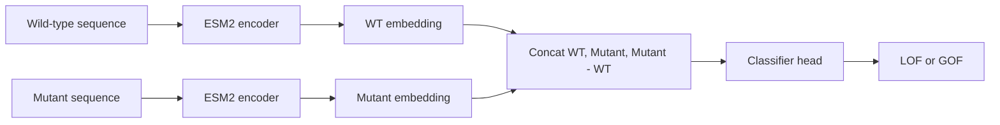

## Introduction

The goal of this project was to build a supervised protein variant classifier for **GOF/LOF** labels from a wild-type sequence, a mutant sequence, and an optional mutation position.

The first version of this idea was simple: run both sequences through ESM2, compare their embeddings, and train a classifier head. The practical version needed more engineering. ESM2 650M is large enough that repeated forward passes are expensive on an 8 GB local GPU, and a single amino-acid substitution can be diluted if the model only sees a whole-sequence representation.

This post is about making that pipeline more usable and more honest:

- use mutation-position embeddings when the variant position is known,
- cache frozen ESM2 features so head training becomes cheap,
- report tiny fixture metrics as implementation checks, not biological evidence.

The classifier uses `0 = LOF` and `1 = GOF` throughout.

## Challenge 1: Choosing the Right ESM2 Framing

ESM2 can be used in several different ways. The official ESM examples include zero-shot mutation-effect scoring with masked-language-model logits. That is useful, but it is not the same task as training a supervised GOF/LOF classifier.

This project uses ESM2 as a feature extractor:

1. encode the wild-type sequence,
2. encode the mutant sequence,
3. build a variant feature from both embeddings and their difference,
4. train a small classifier head on the GOF/LOF label.



This is closer to a frozen-feature linear-probe style workflow than full ESM2 fine-tuning. That trade-off is intentional: it keeps the pipeline small enough to test locally while still using ESM2's protein representation.

## Challenge 2: Using Mutation-Position Features

The first design question was how to represent the variant. A whole-sequence CLS embedding is convenient, but a point mutation is local. If the CSV has a 1-based `position` column, the model can read the residue embedding at the mutated position instead of relying only on the sequence-level token.

The feature is:

$$
x = [E_{wt}(p), E_{mut}(p), E_{mut}(p) - E_{wt}(p)]
$$

Where:

- $E_{wt}(p)$ is the wild-type ESM2 embedding at residue position $p$,
- $E_{mut}(p)$ is the mutant ESM2 embedding at the same residue position,
- the difference vector gives the classifier an explicit representation of the mutation-induced shift.

The implementation keeps a safe fallback: if no `position_col` is provided, it uses the CLS embedding. When `position_col` is provided, the loader validates that the position is 1-based, within sequence bounds, and identifies a token difference after tokenization.

```python
import torch

def variant_feature(
    wt_embedding: torch.Tensor,
    mut_embedding: torch.Tensor,
) -> torch.Tensor:
    diff = mut_embedding - wt_embedding
    return torch.cat((wt_embedding, mut_embedding, diff), dim=1)
# end def
```

This feature shape is also why the classifier head receives `hidden_size * 3` inputs. With `facebook/esm2_t33_650M_UR50D`, the hidden size is `1280`, so the cached feature dimension is `3840`.

## Challenge 3: Making ESM2 650M Usable with Cached Features

Running ESM2 forward passes every epoch is wasteful when the backbone is frozen. The practical fix is to precompute features once, store them with metadata, and train only the classifier head afterward.

The normal training command looks like this:

```bash
python code/train_esm_classifier.py \
  --train_csv data/train.csv \
  --val_csv data/val.csv \
  --position_col position \
  --output_dir runs/esm2_variant_real_position_head \
  --batch_size 1 \
  --max_len 512 \
  --epochs 30 \
  --embedding_cache on
```

The cache stores both the feature tensor and enough metadata to reject stale cache files:

- model and tokenizer name,
- requested model revision,
- resolved model commit hash when available,
- `max_len` and truncation policy,
- pooling policy,
- record hash,
- feature dimension.

One useful bug surfaced during cache-reuse testing: the script was still loading the 650M ESM2 model before checking whether valid cached features already existed. After moving the cache check earlier and using lightweight model config metadata first, valid cache hits can train the head without instantiating the ESM2 backbone.

| Run | Cache behavior | Elapsed | Max RSS |
|---|---|---:|---:|
| Position seed 13 | Build cache | 10.03s | 3,381,948 KB |
| Position seed 17 before fix | Reuse cache but still load ESM2 | 8.43s | 3,381,868 KB |
| Position seed 19 after fix | Reuse cache and skip ESM2 load | 6.53s | 1,189,564 KB |
| CLS seed 13, 100 epochs after fix | Reuse cache and skip ESM2 load | 14.12s | 1,189,584 KB |

The most important change is not just the elapsed time. The memory footprint drops from about 3.4 GB RSS to about 1.2 GB RSS on a cache hit, because the 650M backbone is not loaded.

## Challenge 4: Reporting Tiny-Fixture Results Honestly

The project includes a tiny assignment fixture that is useful for testing the implementation path:

| Variant | Label | Position | Count in train | Count in validation |
|---|---:|---:|---:|---:|
| `D26G` | 0 | 26 | 8 | 1 |
| `L25K` | 1 | 25 | 4 | 1 |

This fixture is intentionally small. The validation rows duplicate mutation patterns from training, so the results below should be read as an **in-sample smoke check**, not as a real validation result.

| Run | Epoch | Train loss | Validation loss | Validation accuracy | AUROC | AUPRC |
|---|---:|---:|---:|---:|---:|---:|
| Position seed 13 | 1 | 0.5533 | 0.4009 | 1.0000 | 1.0000 | 1.0000 |
| Position seed 13 | 5 | 0.0628 | 0.0537 | 1.0000 | 1.0000 | 1.0000 |
| Position seed 13 | 20 | 0.0045 | 0.0045 | 1.0000 | 1.0000 | 1.0000 |
| CLS seed 13 | 1 | 0.6966 | 0.7098 | 0.5000 | 1.0000 | 1.0000 |
| CLS seed 13 | 20 | 0.6088 | 0.7036 | 0.5000 | 1.0000 | 1.0000 |
| CLS seed 13, lr 1e-3 | 100 | 0.0308 | 0.0224 | 1.0000 | 1.0000 | 1.0000 |

These numbers are easy to misread. AUROC and AUPRC are `1.0` because the two validation examples are correctly ordered, but the two examples are not independent evidence. The CLS run also shows why ranking metrics and threshold metrics can diverge: it orders the examples correctly, while the default threshold stays at 50% accuracy through 20 epochs.

The right conclusion is modest:

- position-aware features cross the default threshold quickly on this tiny fixture,
- CLS features can eventually fit the same fixture with a changed learning rate and more epochs,
- this is not a controlled ablation and does not prove position pooling generalizes better on real GOF/LOF data.

For real data, I would report AUROC and AUPRC only with the split definition attached, such as "protein-disjoint validation" or "random-row validation." Without that split context, the metric is easy to overstate.

## Results

The useful result of this project is a working training pipeline, not a biological performance claim.

What the current implementation has exercised:

- real `facebook/esm2_t33_650M_UR50D` loading through Hugging Face Transformers,
- CUDA forward passes for wild-type and mutant sequences,
- optional mutation-position pooling,
- frozen feature cache generation and reuse,
- head-only classifier training from cached features,
- automatic class weights from the training label distribution,
- validation loss, accuracy, AUROC, and AUPRC reporting,
- checkpoint and metrics output.

The local 650M smoke run used this environment:

| Item | Value |
|---|---|
| GPU | NVIDIA GeForce RTX 2080 |
| GPU memory | 8192 MiB |
| PyTorch | 2.9.1+cu128 |
| Transformers | 4.57.3 |
| Model | `facebook/esm2_t33_650M_UR50D` |
| Fresh Hugging Face cache size | 2.5 GB |

That smoke run completed the download/cache path, ESM2 CUDA load, wt/mut forward passes, frozen feature cache writing, one epoch of head training, and checkpoint writing. Its validation set had only two synthetic examples, so its AUROC/AUPRC should not be interpreted as model quality.

## What Didn't Work / Limitations

- The current fixture does not prove biological generalization. It repeats two mutation patterns and has duplicated train/validation patterns.
- A random row split can leak protein, gene, family, patient, or source-dataset information. Real evaluation should use a group-aware split when possible.
- The position-aware path currently targets single substitutions. Insertions, deletions, and complex variants need a different representation policy.
- Long proteins can be truncated by `max_len`. When using `position_col`, the script fails explicitly if the variant residue is truncated, but a production pipeline should inspect truncation rates.
- The CLS-vs-position result is not a clean ablation because learning rate, conditioning, seed, and the tiny fixture design are all confounders.
- The backbone is frozen. LoRA, adapters, or partial unfreezing were not compared.

## Conclusion

This project changed how I would write about protein-language-model experiments. The code path matters, but so does the evidence level behind each claim.

1. For point mutations, mutation-position embeddings are a stronger engineering default than relying only on a whole-sequence CLS embedding.
2. Frozen embedding caches make ESM2 650M practical for repeated classifier-head experiments on limited hardware.
3. Tiny smoke-test metrics should be labeled as pipeline validation, not as biological or clinical validation.

The next meaningful experiment is not another tiny fixture run. It is a real GOF/LOF dataset with a protein-, gene-, family-, or patient-disjoint validation split and baselines that include both simple substitution features and ESM-style zero-shot scores.
