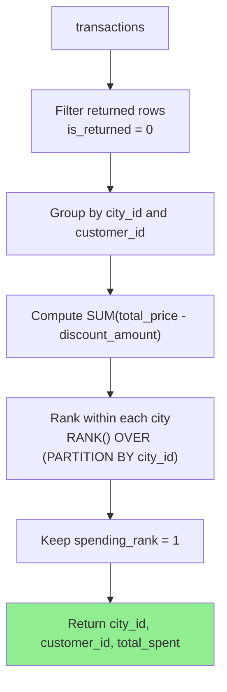

## Problem

> [SolveSQL VIP of Cities](https://solvesql.com/problems/vip-of-cities/)

Find the VIP customer for each city. A VIP is the customer with the highest total spending in that city, excluding returned transactions.

The important detail is that spending should be based on the net transaction amount, not just the raw price.

---

## Data Model

| Table | Columns Used | Meaning |
| --- | --- | --- |
| `transactions` | `city_id` | City where the transaction happened |
| `transactions` | `customer_id` | Customer who made the transaction |
| `transactions` | `total_price` | Original transaction amount |
| `transactions` | `discount_amount` | Discount applied to the transaction |
| `transactions` | `is_returned` | Whether the transaction was returned |

---

## Query Goal

Translate the problem into SQL steps:

1. Exclude returned transactions before aggregation.
2. Compute each customer's net spending in each city.
3. Rank customers inside each city by total spending.
4. Return only the top-ranked customer or customers for each city.

---

## Expected Result / Result Schema

| Column | Meaning |
| --- | --- |
| `city_id` | City identifier |
| `customer_id` | VIP customer identifier in that city |
| `total_spent` | Customer's total net spending in that city |

The result has one row per city-level VIP. If multiple customers tie for the highest spending in the same city, the query should return all tied VIP customers.

---

## Strategy

This is a **Top per Group** problem.

A common mistake is to compute `MAX(total_spent)` per city and then try to recover the matching customer. That approach becomes awkward when there are ties or when the result must include columns from the winning row.

Instead, split the query into two CTEs:

1. `customer_spending`: one row per `(city_id, customer_id)` with total net spending.
2. `ranked_spending`: one row per customer-city pair with a city-local spending rank.

Then the outer query keeps only `spending_rank = 1`.

---

## Step-by-Step Analysis



1. `WHERE is_returned = 0` removes returned transactions before they can affect the totals.
2. `SUM(total_price - discount_amount)` calculates net spending.
3. `GROUP BY city_id, customer_id` creates one spending total per customer per city.
4. `RANK()` assigns rank `1` to the highest spender or spenders in each city.
5. The outer query filters `spending_rank = 1`.

---

## Solution

```sql
WITH
  customer_spending AS (
    SELECT
      city_id,
      customer_id,
      SUM(total_price - discount_amount) AS total_spent
    FROM
      transactions
    WHERE
      is_returned = 0
    GROUP BY
      city_id,
      customer_id
  ),
  ranked_spending AS (
    SELECT
      city_id,
      customer_id,
      total_spent,
      RANK() OVER (
        PARTITION BY city_id
        ORDER BY
          total_spent DESC
      ) AS spending_rank
    FROM
      customer_spending
  )
SELECT
  city_id,
  customer_id,
  total_spent
FROM
  ranked_spending
WHERE
  spending_rank = 1
ORDER BY
  city_id,
  customer_id;
```

---

## Clause-by-Clause

### `customer_spending`

This CTE defines the row granularity for the ranking step: one row per customer in each city.

`WHERE is_returned = 0` belongs here because returned transactions should never be included in the spending total. The net spending expression is:

```sql
SUM(total_price - discount_amount) AS total_spent
```

This is the value that determines VIP status.

### `ranked_spending`

This CTE ranks customers within each city:

```sql
RANK() OVER (
  PARTITION BY city_id
  ORDER BY
    total_spent DESC
) AS spending_rank
```

`PARTITION BY city_id` restarts the ranking for every city, and `ORDER BY total_spent DESC` puts the highest spender first.

### Final Filter

The final query keeps `spending_rank = 1`.

This filter must happen in the outer query because window function results are not available to the same `SELECT` statement's `WHERE` clause. The CTE gives the window result a name first, then the outer query filters it.

---

## Pitfalls

- **Filtering returned transactions too late**: `is_returned = 0` must be applied before `GROUP BY`, otherwise returned orders can inflate spending.
- **Using gross spending**: VIP status depends on `total_price - discount_amount`, not `total_price` alone.
- **Using `ROW_NUMBER()` without a tie-breaker**: `ROW_NUMBER()` would keep only one customer when two customers tie. `RANK()` preserves tied VIPs.
- **Filtering window results in the wrong phase**: `spending_rank = 1` belongs in the outer query, not in the same query block that computes `RANK()`.
- **Omitting final ordering**: `ORDER BY city_id, customer_id` makes the output deterministic and easier to verify.

---

## Key Takeaways

| Point | Description |
| --- | --- |
| `Top per Group` | Rank rows inside each group, then keep rank `1` |
| `RANK()` | Preserves ties when multiple rows share the top value |
| `WHERE` before `GROUP BY` | Exclude rows that should not contribute to aggregates |
| Window filter phase | Compute window results in a CTE, then filter in the outer query |
