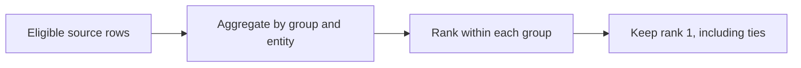

## Scope

This note documents a reusable **top-per-group** technique. It intentionally omits any platform-specific prompt, schema, data, expected output, and submitted answer. The names below are generic placeholders.

The abstract task is:

1. discard rows that should not contribute,
2. aggregate a numeric measure for each entity within each group,
3. rank the aggregated entities inside their group,
4. return every entity tied at the highest rank.

## Why `MAX()` Alone Is Awkward

`MAX(aggregate_value)` can find the winning value for each group, but it does not retain the entity associated with that value. Joining the maximum back to the aggregate is valid, but a window function usually states the intent more directly and makes tie behavior explicit.

The query has three logical stages:



## Generic Pattern

Assume a placeholder relation with these conceptual columns:

| Placeholder | Meaning |
|---|---|
| `group_key` | Partition whose winner is selected independently |
| `entity_key` | Candidate being compared within the group |
| `metric_value` | Numeric contribution to aggregate |
| `is_valid` | Whether the row may contribute |

```sql
WITH per_entity AS (
  SELECT
    group_key,
    entity_key,
    SUM(metric_value) AS aggregate_value
  FROM measurements
  WHERE is_valid = TRUE
  GROUP BY
    group_key,
    entity_key
),
ranked AS (
  SELECT
    group_key,
    entity_key,
    aggregate_value,
    RANK() OVER (
      PARTITION BY group_key
      ORDER BY aggregate_value DESC
    ) AS group_rank
  FROM per_entity
)
SELECT
  group_key,
  entity_key,
  aggregate_value
FROM ranked
WHERE group_rank = 1
ORDER BY
  group_key,
  entity_key;
```

This is a template, not a submission for a particular problem. Replace the relation, columns, filter, and aggregation rule with values from a schema you are permitted to document.

## Why `RANK()`

The choice of window function defines the tie policy:

| Function | Equal top values | Appropriate when |
|---|---|---|
| `RANK()` | Every tied row receives rank 1 | All co-winners must be returned |
| `DENSE_RANK()` | Same top-row result as `RANK()` | Later ranks are also consumed and gaps are unwanted |
| `ROW_NUMBER()` | Exactly one row receives 1 | A deterministic tie-break rule selects one winner |

For a single `WHERE group_rank = 1` filter, `RANK()` and `DENSE_RANK()` return the same top ties. `ROW_NUMBER()` is different: without a complete tie-break order, which tied row wins can be arbitrary.

If the requirement is exactly one row, encode that policy rather than discarding ties accidentally:

```sql
ROW_NUMBER() OVER (
  PARTITION BY group_key
  ORDER BY aggregate_value DESC, entity_key ASC
) AS group_row
```

## Query-Phase Details

The filter on source rows belongs before aggregation, because excluded rows must not affect the totals. The rank filter belongs in an outer query or CTE, because a window result is not available to the same query block's `WHERE` clause in portable SQL.

The order of operations is therefore:

```text
FROM / WHERE
  -> GROUP BY / aggregate
  -> window rank
  -> rank filter
  -> final presentation order
```

## Edge Cases to Decide Explicitly

- **Ties:** return every top tie with `RANK()`, or define a deterministic secondary key with `ROW_NUMBER()`.
- **Null measures:** decide whether `NULL` should be ignored by `SUM`, converted with `COALESCE`, or invalidate the row.
- **Empty groups:** groups with no eligible rows disappear; generate them from a separate group table if they must remain visible.
- **Numeric types:** use an exact decimal type for money-like values rather than binary floating point.
- **Final ordering:** window ranking does not guarantee output order, so add an explicit final `ORDER BY` when stable presentation matters.

## Key Takeaways

1. Aggregate at the entity-within-group grain before ranking.
2. Make the tie policy a deliberate choice of window function.
3. Filter source rows before aggregation and window results afterward.
4. Keep public examples generic when a source problem or dataset cannot be republished.
