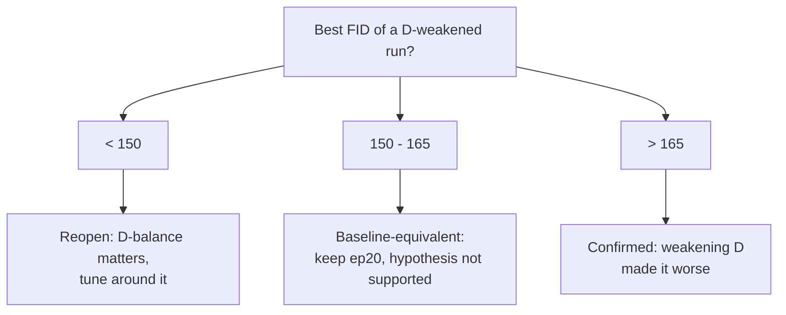

## Introduction

Once I trusted our GAN's FID (a [previous post]() explains why the original "FID 0.24" was a measurement artifact), a clear pattern showed up: the model's standard FID dropped to **163 at epoch 20**, then *climbed back up* to 270 by epoch 90. Training longer made it worse.

The loss curves told the textbook story — the discriminator's loss kept falling while the generator's kept rising. The obvious hypothesis: **the discriminator is overpowering the generator**, so the fix is to weaken D (TTUR, EMA, label smoothing, fewer D steps). It is the first thing every GAN tutorial reaches for.

Instead of assuming it, I tested it — cheaply. Four short runs that weaken D in different ways, against a pre-registered success threshold. The result was a clean negative: **weakening D never produced a robust FID improvement**, and best FID clustered at **159–183** no matter what. D-dominance was not the bottleneck. This post is about how a small, disciplined experiment killed a plausible hypothesis and saved me from a week of pointless balance tuning.

> **Setup.** Multi-stage CLIP-guided GAN (64→128→256, per-stage discriminators, CLIP ViT-B/32 text conditioning). 25% subset of MM-CelebA-HQ captions: 2,490 train / 510 test. Single RTX 4060 Ti (8 GB), batch 4, ~204 s/epoch, seed 42, PyTorch 2.4. FID is the standard torchmetrics 2048-d pool3, fakes conditioned on each test caption. Dataset is licensed, so only metric plots are shown.
{: .prompt-info }

## The Symptom: Best at Epoch 20, Then It Falls Apart

The baseline run (default config, 100 epochs) does not converge to its best — it *passes through* it:

| epoch | 0 | 10 | **20** | 30 | 50 | 70 | 90 |
|-------|:--:|:--:|:--:|:--:|:--:|:--:|:--:|
| FID ↓ | 328 | 180 | **163** | 164 | 173 | 253 | 270 |

The minimum is at epoch 20; after that, FID degrades with heavy oscillation. The loss plot explains why: the discriminator loss keeps falling (toward ~10) while the generator loss keeps climbing (~50 → ~90). That widening gap is the classic signature of a discriminator that is winning the game and starving the generator of useful gradients.


_Baseline run. Left: d_loss falls while g_loss rises — the "D is winning" signature. Right: FID bottoms at epoch 20 (163), then degrades. Best ≠ last._

**Lesson:** report your best checkpoint, not your last — but also ask *why* the model can't hold its peak, because that points at the real bottleneck.

## The Hypothesis: The Discriminator Is Winning

If D is too strong, the standard toolkit is to handicap it or stabilize G:

- **EMA on the generator** — track an exponential moving average of G's weights and sample from that; the single most reliable FID stabilizer for GANs.
- **TTUR** — give D a smaller learning rate than G (a two-time-scale update rule).
- **One-sided label smoothing** — train D toward 0.9 for reals instead of 1.0, so it can't saturate.
- **n_critic < 1** — update D once every *N* generator steps, so G takes more steps than D.

I added all four as **opt-in flags** (`--use_ema`, `--d_lr`, `--real_label_smooth`, `--d_update_every`) so the defaults reproduce the original behavior exactly. The EMA update is a few lines:

```python
import torch

@torch.no_grad()
def ema_update(ema_model, model, decay=0.999):
    """In-place EMA of generator weights: ema <- decay*ema + (1-decay)*model."""
    ema_params = dict(ema_model.named_parameters())
    for name, p in model.named_parameters():
        ema_params[name].mul_(decay).add_(p.detach(), alpha=1.0 - decay)
    # end for
# end def
```

## The Experiment: Four Runs, One Question

The question is binary — *does weakening D break the ~160 floor?* — so the design is: keep everything else fixed and turn the D-weakening knobs up across four runs, from off to aggressive.

| run | d_lr | D update | EMA | label smooth |
|-----|:---:|:---:|:---:|:---:|
| baseline | 2e-4 | every step | – | – |
| stable | 1e-4 | every step | 0.999 | 0.9 |
| swA_aggr | 2e-5 | every 3 steps | 0.999 | 0.9 |
| swB_mild | 5e-5 | every 2 steps | 0.999 | 0.9 |

```bash
# example: the most aggressive D-weakening run (others change only the four flags)
python scripts/train.py --name swA_aggr --data_path data/trainset_sub.zip \
    --use_ema --ema_decay 0.999 --d_lr 2e-5 --real_label_smooth 0.9 --d_update_every 3 \
    --num_epochs 40 --batch_size 4 --save_freq 5
```

Crucially, I **pre-registered** the decision rule before looking at results, so I couldn't rationalize whatever came out:



Each run is short (40 epochs covers the early peak/oscillation region that matters here) — about 1.5–2 h on the 8 GB GPU. The whole sweep is an afternoon, not a week.

## Results: Weakening D Didn't Help

| run | best FID | @ep | last FID |
|-----|:---:|:---:|:---:|
| **baseline** | **163** | 20 | 270 @90 |
| stable | 179 | 60 | 264 @90 |
| swA_aggr | 183 | 20 | 184 @35 |
| swB_mild | 159 | 35 | 159 @35 |


_All four runs overlaid. Best FIDs cluster at 159–183 with large epoch-to-epoch swings; no amount of D-weakening pulls a curve cleanly under the ~160 floor._

Reading against the pre-registered thresholds:

- The two genuinely aggressive D-weakenings (`stable`, `swA_aggr`) came out **worse** than baseline (179 and 183) — the opposite of the hypothesis.
- `swB_mild` hit **159**, which lands in the 150–165 "baseline-equivalent" band, not the < 150 "reopen" band. And it is fragile: that run swung 252 → 165 → 159 over epochs 25–35, so 159 is the bottom of a ±50 oscillation that happens to fall on the last epoch, not a stable new minimum.
- The d_loss/g_loss gap stayed wide in every run — even halving D's learning rate and updating it a third as often didn't rebalance the game.

So across four settings, weakening D never moved the peak later, never stabilized it, and never cleanly broke the baseline-equivalent band. The hypothesis is rejected.

## What Didn't Work / Limitations

The honest summary is that *the entire sweep "didn't work"* — and that is the result. A few caveats keep it honest:

- **This is a 25% subset, not the full dataset.** The ~160 floor could still be data-bound; an earlier 4× data increase improved best FID only modestly (189 → 163), which is *why* I suspected training dynamics — but that is suggestive, not proof.
- **A correctness fix made the task visually harder.** The original code trained on 64px-upsampled targets (an easier, low-detail objective that looks "clean"); the audited code trains on genuine 256px targets. More correct, but harder on little data — so the blurry samples are partly a data-budget symptom, not only an optimization one.
- **One 8 GB GPU bounds the search.** Batch 4 is near the memory ceiling, so I couldn't test large-batch effects, and didn't sweep architecture or the multi-loss weights.
- **I ruled out *D-balance*, not every cause.** The remaining suspects — objective-function composition, architecture capacity, data scale — are not separated here.

## Conclusion

1. **Weakening D did not robustly help, so D-dominance is ruled out.** The "discriminator is winning" loss signature was real but misleading; handicapping D (TTUR, EMA, label smoothing, n_critic) left FID in a 159–183 band and sometimes made it worse.
2. **The ~160 FID floor is a data/architecture/objective ceiling, not a balance problem.** Further gains will come from more data or model changes, not from more balance tuning.
3. **A cheaply-killed hypothesis is a real result.** Four short runs against a pre-registered threshold turned "D is too strong, let's tune it for a week" into a closed question in an afternoon. Negative results, obtained cheaply, are how you avoid expensive dead ends.

Future work follows directly: test whether the ceiling is data-bound with a full-data run, and only then reach for architectural changes.

## Reproduction

The stability levers are opt-in flags (defaults reproduce the original training), and the whole pipeline — data prep, train, FID/IS curve, plots — is scripted:

```bash
# one D-weakening config (vary the four flags for the others)
python scripts/train.py --name swB_mild --data_path data/trainset_sub.zip \
    --use_ema --ema_decay 0.999 --d_lr 5e-5 --real_label_smooth 0.9 --d_update_every 2 \
    --num_epochs 40 --batch_size 4 --save_freq 5

# standard 2048-d FID/IS curve over every saved checkpoint
python experiments/eval_curve.py data/testset_sub.zip checkpoints/swB_mild-*/ckpt auto out.json
```

Environment: PyTorch 2.4, CLIP ViT-B/32, single RTX 4060 Ti (8 GB), seed 42. The best checkpoint (baseline epoch 20, FID ≈ 163) is the one to keep.

## Resources

- **TTUR & FID** — Heusel et al., *GANs Trained by a Two Time-Scale Update Rule...*, NeurIPS 2017 ([arXiv:1706.08500](https://arxiv.org/abs/1706.08500))
- **EMA / generator averaging** — Yazıcı et al., *The Unusual Effectiveness of Averaging in GAN Training*, ICLR 2019 ([arXiv:1806.04498](https://arxiv.org/abs/1806.04498))
- **Multi-stage T2I GANs** — StackGAN++ ([arXiv:1710.10916](https://arxiv.org/abs/1710.10916)); LAFITE ([arXiv:2111.13792](https://arxiv.org/abs/2111.13792))
- **Prerequisite** — this experiment only means something because the FID was fixed first: ["Your FID of 0.24 Isn't Near-Perfect"]().
