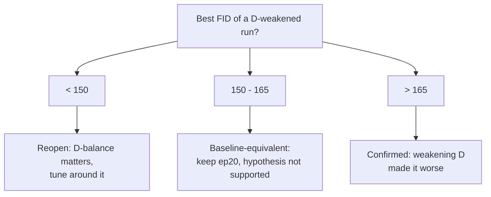

## Introduction

Once I replaced the non-standard feature extractor (a [previous post]() explains why the original "FID 0.24" was an artifact), a clear within-run pattern showed up: the model's 2048-d FID estimate dropped to **163 at epoch 20**, then *climbed back up* to 270 by epoch 90.

The loss curves suggested a familiar story — the discriminator's loss kept falling while the generator's kept rising. One plausible hypothesis was **the discriminator is overpowering the generator**, motivating a probe with separate learning rates, EMA, label smoothing, and fewer D steps. The loss magnitudes alone do not diagnose dominance, and EMA stabilizes G rather than weakening D directly.

Instead of assuming it, I tested it cheaply. Four configurations changed common balance/stability levers against a pre-registered success threshold. Best FID estimates clustered at **159–184**, so this sweep found **no robust improvement from the tested interventions**. That lowers the priority of the D-dominance hypothesis for this setup; it does not eliminate it, because the configurations bundle multiple changes, use one training seed, and inherit evaluation noise.

> **Setup.** Multi-stage CLIP-guided GAN (64→128→256, per-stage discriminators, CLIP ViT-B/32 text conditioning). 25% subset of MM-CelebA-HQ captions: 2,490 train / 510 test. Single RTX 4060 Ti (8 GB), batch 4, ~204 s/epoch, configured training/data-split seed 42, PyTorch 2.4. FID uses torchmetrics 2048-d pool3 with one fake per test image, conditioned on that image's first stored caption. With only 510 samples in a 2048-d space, the covariance estimate is rank-deficient and biased; these values support same-N comparisons inside this sweep, not direct comparison with 50k-sample literature FIDs. The historical curves predate even a run-level evaluation seed and include unrecorded sampling noise. The script as audited (`6fac9ec`, after `5d0de43`) seeded once before its checkpoint loop, so each checkpoint still received different noise when the epoch list or order changed. **Update (2026-07).** `experiments/eval_curve.py` now reseeds after loading each checkpoint, so the sample stream is checkpoint-order invariant; the curves below are unchanged and still carry the original noise. Dataset images are licensed, so only metric plots are shown.
{: .prompt-info }

For the model map behind this experiment, see the companion architecture note: ["MS-CLIP-GAN Architecture: How a CLIP-Guided Multi-Stage GAN Is Wired"](). Short version: this is a three-stage generator with three stage-wise discriminators, so the balance question was not abstract — it was specifically whether that discriminator stack was too strong for the generator refiners.

## The Symptom: Best at Epoch 20, Then It Falls Apart

The baseline run (default config, 100 epochs) does not converge to its best — it *passes through* it:

| epoch | 0 | 10 | **20** | 30 | 50 | 70 | 90 |
|-------|:--:|:--:|:--:|:--:|:--:|:--:|:--:|
| FID ↓ | 328 | 180 | **163** | 164 | 173 | 253 | 270 |

The minimum is at epoch 20; after that, FID degrades with heavy oscillation. Over the same interval, discriminator loss falls (toward ~10) while generator loss rises (~50 → ~90). That pattern motivated the D-dominance hypothesis, but raw adversarial loss magnitudes are not a calibrated diagnosis and do not establish that G was starved of useful gradients.


_Baseline run. Left: d_loss falls while g_loss rises, a pattern that motivated the D-dominance probe but does not prove it. Right: the N=510 FID estimate bottoms at epoch 20 (163), then degrades. Best ≠ last._

**Lesson:** report your best checkpoint, not your last — but also ask *why* the model can't hold its peak, because that points at the real bottleneck.

## The Hypothesis: The Discriminator Is Winning

If D is too strong, the standard toolkit is to handicap it or stabilize G:

- **EMA on the generator** — track an exponential moving average of G's weights and sample from that; a common GAN stabilization technique, not a direct weakening of D.
- **Separate learning rates** — TTUR means using different time scales for G and D; this probe specifically lowers D's learning rate relative to G, which is one direction rather than the definition of TTUR itself.
- **One-sided label smoothing** — train D toward 0.9 for reals instead of 1.0, so it can't saturate.
- **Reduced D-update frequency** — the custom `d_update_every=N` updates D once every N generator steps. This is an effective D:G ratio below 1, but not the conventional `n_critic` parameter, which usually counts D steps per G step.

I added all four as **opt-in flags** (`--use_ema`, `--d_lr`, `--real_label_smooth`, `--d_update_every`) so the defaults reproduce the original behavior exactly. The EMA update is a few lines:

```python
import torch

@torch.no_grad()
def ema_update(ema_model, model, decay=0.999):
    """In-place EMA of generator weights: ema <- decay*ema + (1-decay)*model."""
    ema_params = dict(ema_model.named_parameters())
    for name, p in model.named_parameters():
        ema_params[name].mul_(decay).add_(p.detach(), alpha=1.0 - decay)
    # end for
# end def
```

## The Experiment: Four Runs, One Question

The operational question is binary — *does one of these balance/stability configurations beat the pre-DiffAugment ~160 band?* The data, architecture, and base losses stay fixed, while the intervention runs bundle EMA, D learning rate, label smoothing, and D-update cadence to different degrees. This is a configuration sweep, not an ablation that identifies the effect of each lever.

| run | d_lr | D update | EMA | label smooth |
|-----|:---:|:---:|:---:|:---:|
| baseline | 2e-4 | every step | – | – |
| stable | 1e-4 | every step | 0.999 | 0.9 |
| swA_aggr | 2e-5 | every 3 steps | 0.999 | 0.9 |
| swB_mild | 5e-5 | every 2 steps | 0.999 | 0.9 |

```bash
# example: the most aggressive D-weakening run (others change only the four D-weakening levers)
PYTHONPATH="$(pwd)" python scripts/train.py --name swA_aggr --data_path data/trainset_sub.zip \
    --use_uncond_loss --use_contrastive_loss --use_mixed_loss \
    --use_ema --ema_decay 0.999 --d_lr 2e-5 --real_label_smooth 0.9 --d_update_every 3 \
    --num_epochs 40 --batch_size 4 --save_freq 5
```

Crucially, I **pre-registered** the decision rule before looking at results, so I couldn't rationalize whatever came out:



The two aggressive probes (`swA_aggr`, `swB_mild`) are short — 40 epochs covers the early peak/oscillation region that matters here, about 1.5–2 h each on the 8 GB GPU; `baseline` reuses the original 100-epoch run and `stable` extends to ~90. The whole sweep is an afternoon, not a week.

## Results: Weakening D Didn't Help

| run | best FID | @ep | last FID |
|-----|:---:|:---:|:---:|
| **baseline** | **163** | 20 | 270 @90 |
| stable | 179 | 60 | 264 @90 |
| swA_aggr | 183.6 | 20 | 184.4 @35 |
| swB_mild | 159 | 35 | 159 @35 |


_All four runs overlaid. Best estimates cluster at 159–184 with large epoch-to-epoch swings; none of these configurations pulls a curve cleanly under the pre-registered threshold._

Reading against the pre-registered thresholds, while remembering that no uncertainty interval or repeated training seed was available:

- The two runs that came out **worse** than baseline were `stable` (179) and `swA_aggr` (184) — the opposite of the hypothesis. (Note this isn't the aggressiveness ordering: `stable` is actually the *mildest* weakening — d_lr merely halved, D still updated every step — while the genuinely aggressive probes are `swA_aggr` and `swB_mild`, and `swB_mild`, which weakens D more than `stable` on both axes, was the *best* run at 159.)
- `swB_mild` hit **159**, which lands in the 150–165 "baseline-equivalent" band, not the < 150 "reopen" band. And it is fragile: that run swung 252 → 165 → 159 over epochs 25–35, so 159 is the bottom of a ±50 oscillation that happens to fall on the last epoch, not a stable new minimum.
- The d_loss/g_loss gap stayed wide in every run. That diagnostic did not respond cleanly even when D's learning rate and update frequency were reduced, but raw GAN loss magnitudes are not a calibrated measure of which network is "winning."

Across these four settings, there was no consistent stabilization and no clean break below the baseline-equivalent band. (`stable` reached its numerical minimum later, at epoch 60, so it would be inaccurate to say that no peak moved later.) The result does not support prioritizing these bundled interventions, but repeated seeds and one-factor ablations would be required to reject D-dominance more broadly.

## What Didn't Work / Limitations

The honest summary is that *the entire sweep "didn't work"* — and that is the result. A few caveats keep it honest:

- **This is a 25% subset, not the full dataset.** The ~160 floor could still be data-bound; an earlier 4× data increase improved best FID only modestly (189 → 163), which is *why* I suspected training dynamics — but that is suggestive, not proof.
- **A correctness fix made the task visually harder.** The original code trained on 64px-upsampled targets (an easier, low-detail objective that looks "clean"); the audited code trains on genuine 256px targets. More correct, but harder on little data — so the blurry samples are partly a data-budget symptom, not only an optimization one.
- **One 8 GB GPU bounds the search.** Batch 4 is near the memory ceiling, so I couldn't test large-batch effects, and didn't sweep architecture or the multi-loss weights.
- **The sweep only lowers the priority of these D-balance settings.** Objective composition, architecture capacity, data scale, other balance interventions, and seed variance are not separated here.
- **This sweep measures the pre-audit discriminator.** *(Update 2026-07: a later correctness audit changed D itself — the alignment head no longer sees the text condition (`alignment_mode=image_only`), the conditional D now gets a mismatched-caption negative by default, and G's BatchNorm buffers are rolled back during the D step while D itself is frozen during the G step. No run has been retrained under those defaults, so this negative result is about the D that existed in June, not the one on `main` today.)*

## Conclusion

1. **The tested balance/stability configurations did not robustly help.** In one-seed runs, EMA plus lower D learning rates, label smoothing, and reduced D-update frequency left the 510-sample FID estimates in a 159–184 band.
2. **The sweep does not identify the bottleneck.** It lowers the priority of these configurations, but data scale, objectives, architecture, D/G balance, and run variance remain confounded.
3. **A cheap negative probe is a prioritization result, not a proof.** It justified trying a different intervention next while preserving the need for repeated seeds and cleaner ablations before making a causal claim.

Future work follows directly: test a different limited-data intervention. DiffAugment and StyleGAN2-ADA apply augmentation to both real and fake discriminator inputs; in their reported setups this works much better than augmenting reals alone. That literature makes symmetric augmentation a reasonable next probe, not proof that this run is data-bound. The follow-up is ["Can DiffAugment Break the FID-160 Ceiling?"]().

## Reproduction

The three auxiliary losses (`--use_uncond_loss --use_contrastive_loss --use_mixed_loss`) are the shared base config for every run in the sweep; the D-weakening stability levers are opt-in flags layered on top, and the whole pipeline — data prep, train, FID/IS curve, plots — is scripted:

```bash
# audited source branch: fix/correctness-audit at 6fac9ec
git checkout 6fac9ec
export PYTHONPATH="$(pwd)"

# one D-weakening config (vary the four D-weakening levers for the others)
python scripts/train.py --name swB_mild --data_path data/trainset_sub.zip \
    --use_uncond_loss --use_contrastive_loss --use_mixed_loss \
    --use_ema --ema_decay 0.999 --d_lr 5e-5 --real_label_smooth 0.9 --d_update_every 2 \
    --num_epochs 40 --batch_size 4 --save_freq 5

# standard 2048-d FID/IS curve over the newest matching run
CKPT="$(ls -dt checkpoints/swB_mild-*/ckpt | head -n 1)"
[ -n "$CKPT" ] || { echo "no swB_mild checkpoint directory" >&2; exit 1; }
python experiments/eval_curve.py data/testset_sub.zip "$CKPT" auto out.json
```

Environment: PyTorch 2.4, CLIP ViT-B/32, single RTX 4060 Ti (8 GB). The sweep implementation/results entered at commit `5c9d75d`; `6fac9ec` is the commit these runs were audited against. **Update (2026-07).** `6fac9ec` has since been merged into `main` (via `origin/fix/correctness-audit` -> PR #1 -> `main`), so it is no longer a branch tip; check it out by SHA (as above), not by branch name, to reproduce this snapshot. The configured training/data split seed was 42, but the committed curves predate evaluator seed commit `5d0de43`. That commit calls `torch.manual_seed(42)` only once before the checkpoint loop, so results remain epoch-list/order dependent. Reset the generator per checkpoint or reuse explicit fixed latent tensors, then repeat sampling and training seeds before treating differences as reproducible. Baseline epoch 20 remains the promoted artifact **for this pre-DiffAugment sweep**; the later DiffAugment run measured a lower, not-yet-promoted estimate.

> **Source-report warning.** The linked commit's `experiments/RESULTS.md` predates this interpretation audit and still presents D-dominance as rejected and ruled out. Use that file for numeric artifact paths and implementation provenance; the single-seed, bundled-intervention, and evaluator caveats in this post supersede its causal wording.
{: .prompt-warning }

## Resources

- **Source snapshot** — [audited `fix/correctness-audit` commit `6fac9ec`](https://github.com/youngunghan/MS-CLIP-GAN-Multi-Stage-Text-to-Image-Generation-with-CLIP-Guided-Synthesis/tree/6fac9ec)
- **TTUR & FID** — Heusel et al., *GANs Trained by a Two Time-Scale Update Rule...*, NeurIPS 2017 ([arXiv:1706.08500](https://arxiv.org/abs/1706.08500))
- **EMA / generator averaging** — Yazıcı et al., *The Unusual Effectiveness of Averaging in GAN Training*, ICLR 2019 ([arXiv:1806.04498](https://arxiv.org/abs/1806.04498))
- **Multi-stage T2I GANs** — StackGAN++ ([arXiv:1710.10916](https://arxiv.org/abs/1710.10916)); LAFITE ([arXiv:2111.13792](https://arxiv.org/abs/2111.13792))
- **Limited-data GAN remedies (the next experiment)** — DiffAugment, Zhao et al., NeurIPS 2020 ([arXiv:2006.10738](https://arxiv.org/abs/2006.10738)); StyleGAN2-ADA, Karras et al., NeurIPS 2020 ([arXiv:2006.06676](https://arxiv.org/abs/2006.06676)); *GANs with Limited Data: A Survey* (2025) ([arXiv:2504.05456](https://arxiv.org/abs/2504.05456))
- **Prerequisites** — this experiment only means something because the FID was fixed first: ["Your FID of 0.24 Isn't Near-Perfect"](); and because the model structure makes the D-balance hypothesis precise: ["MS-CLIP-GAN Architecture: How a CLIP-Guided Multi-Stage GAN Is Wired"]().
