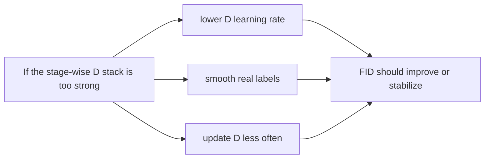

## Introduction

The previous post in this series fixed the feature extractor: our "FID 0.24" was not a near-perfect generator, but a non-standard 1000-d logit-space distance. The replacement 2048-d estimate used only 510 samples, so it is best suited to same-N comparisons rather than an absolute literature benchmark. The next question was architectural: **what kind of model was producing the pre-DiffAugment band of roughly FID 159-184 in those runs?**

This note is the model map I wanted before interpreting the training curves. MS-CLIP-GAN is not a diffusion model with one denoising U-Net. It is a **StackGAN++-style multi-stage GAN** with CLIP text conditioning, three generator stages, and three discriminators. That shape matters because the later stability experiment asks a very specific question: was the **stage-wise discriminator stack** too strong for the generator refiners?

> **Scope.** This is a structural explanation, not a performance claim. The experiment results live in the next post; the metric bug lives in the previous one. Dataset images are licensed, so the figure here is a license-clean architecture diagram rather than generated face samples.
{: .prompt-info }


_The system in one view: text is embedded by CLIP, compressed through conditioning augmentation, then used by a 64→128→256 generator and three matching discriminators._

## The Core Pipeline

At training time, each image-caption pair has already been preprocessed into CLIP features. The text side is a **CLIP ViT-B/32 embedding**:

```text
caption -> CLIP text encoder -> c_txt (512-d, L2-normalized)
```

That 512-d vector is not fed directly into every convolutional block. It first passes through a conditioning-augmentation module, inherited conceptually from StackGAN:

```text
c_txt -> linear/ReLU -> mu, log_sigma -> c_hat (128-d)
```

> **Update (2026-07).** A later correctness audit found this ReLU forced `mu >= 0` and `sigma >= 1`, and that the promoted checkpoint was saturated against those bounds (`mu` 76.0% exactly 0, `log_sigma` 99.85% exactly 0). The repo now defaults to `--conditioning_activation linear`; the ReLU path shown above is now the automatic fallback only for metadata-less legacy checkpoints, though it remains available as an explicit `--conditioning_activation relu` flag for fresh runs -- and legacy-fallback ReLU is what every run in this series used.
{: .prompt-info }

`c_hat` is a sampled conditioning vector, regularized with a KL term so the conditioning distribution does not drift arbitrarily. The model then combines `c_hat` with a 100-d noise vector and generates the image progressively:

| Stage | Role | Output |
|---|---|---|
| `G0` | maps text condition + noise into the first image | 64×64 |
| `G1` | refines the previous feature map with the same condition | 128×128 |
| `G2` | refines again into the final image | 256×256 |

That progressive design is the reason the model has a super-resolution flavor: later stages are not starting from scratch; they refine features from earlier stages while seeing the same text condition.

## The Discriminator Stack

The adversary is also multi-stage. Each generated image scale has its own discriminator:

| Discriminator | Input scale | What it checks |
|---|---:|---|
| `D0` | 64×64 | coarse realism and condition agreement |
| `D1` | 128×128 | mid-level refinement |
| `D2` | 256×256 | final high-resolution realism |

Each discriminator compresses its input into a shared feature representation and branches into heads:

- **Unconditional real/fake head**: is this image real at all?
- **Conditional real/fake head**: is it real given the text condition?
- **Alignment head**: does the image feature align with the text feature?

The unconditional head exists in the model, but its loss is opt-in via `--use_uncond_loss`; the subset experiments discussed in this series enabled it.

The generator also receives auxiliary guidance from a frozen CLIP image encoder at the 256px stage (opt-in via `--use_contrastive_loss`, enabled in these runs), plus an always-on KL term and an optional perceptual loss (`--use_mixed_loss`). So the training signal is not "just GAN loss"; it is adversarial realism plus semantic alignment and reconstruction-style pressure.

## Why the Balance Hypothesis Was Plausible

This architecture makes the discriminator-dominance hypothesis tempting. If one discriminator is too strong, the generator can lose useful gradients. If **three** discriminators are too strong at three scales, the effect can look even more convincing: D loss falls, G loss rises, and FID gets worse after an early peak.

That is exactly what the baseline curves showed. The model reached its best standard FID around epoch 20, then degraded. On the surface, this looked like a classic "D is winning" story.

The structure makes a clear prediction:



That prediction is what the next post probed. Across four bundled, single-seed configurations, lowering D's learning rate or update frequency alongside other stabilization changes did not robustly improve the same-N FID estimate. This lowers the priority of those configurations; it does not rule out every D/G-balance mechanism.

## Compared With RTMDet

This is where the RTMDet paper-review style is useful. RTMDet and MS-CLIP-GAN are different kinds of models, but the way to read them is similar: understand the architecture first, then ask whether the experiment actually tests the right part of that architecture.

| Aspect | RTMDet | MS-CLIP-GAN |
|---|---|---|
| Task | object detection | text-to-image generation |
| Core shape | backbone → neck → detection head | CLIP condition → staged generator → staged discriminators |
| Multi-scale role | feature pyramid for boxes at different strides | image synthesis/refinement at 64/128/256 |
| Main metric | COCO-style mAP | standard 2048-d FID / IS |
| Failure mode studied | false positives despite high mAP | FID plateau despite GAN-balance tuning |
| Lesson | architecture is strong, but evaluation/data can still hide deployment failures | the tested balance configurations did not help; the bottleneck remains unidentified without cleaner ablations |

RTMDet is a mature detector whose paper carefully ablates backbone, neck, head, label assignment, and training schedule. MS-CLIP-GAN is a project implementation that combines StackGAN++-style staging, CLIP conditioning, and auxiliary losses. So the standard of evidence is different. RTMDet's architecture is the thing the paper validates; MS-CLIP-GAN's architecture is the thing we must audit before trusting the experiment.

The common lesson is the same one this blog keeps coming back to: **a model diagram is not decoration**. It tells you what hypotheses are even meaningful. In RTMDet, the natural questions are about feature pyramids, assignment, and dataset leakage. In MS-CLIP-GAN, the natural question was whether the multi-scale discriminator stack was overpowering the generator.

## What This Architecture Does Not Prove

The diagram organizes hypotheses, but it does not establish their causes. In the pre-DiffAugment sweep, the best per-run estimates spanned a ~159-184 band and baseline epoch 20 remained the promoted checkpoint. A later DiffAugment run reached a lower historical estimate (~118.5 at epoch 90), so ~160 was never an architecture-wide ceiling.

The main limitations follow directly from the structure:

- The text condition is only a CLIP embedding, not a token-level cross-attention mechanism.
- The 256px stage is asked to learn real high-resolution detail from a small subset.
- Three discriminators create a more coupled optimization problem; the available runs do not isolate how much each stage contributes to noise or instability.
- CLIP guidance helps semantic alignment, but it is not a full image-quality objective.

The next experiments should compare interventions under matched seeds and evaluation: data scale or symmetric augmentation, stronger conditioning, objective changes, per-stage discriminator ablations, and modern generator baselines. The current architecture diagram alone cannot rank those causes.

## Resources

- **Previous in this series** — the metric fix that made the experiments meaningful: ["Your FID of 0.24 Isn't Near-Perfect"]()
- **Next in this series** — the stability sweep that tested the D-dominance hypothesis: ["Killing a Hypothesis Cheaply"]()
- **Architecture relatives** — StackGAN++ ([arXiv:1710.10916](https://arxiv.org/abs/1710.10916)), LAFITE ([arXiv:2111.13792](https://arxiv.org/abs/2111.13792)), and the RTMDet review's architecture-first framing: ["RTMDet: An Empirical Study of Designing Real-Time Object Detectors"]()
