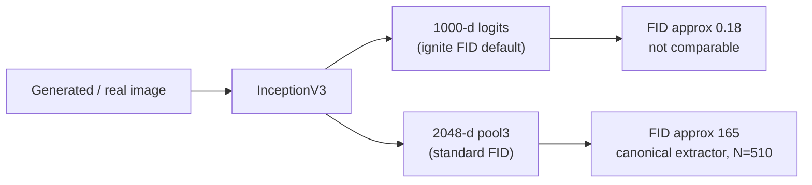

## Introduction

I inherited an evaluation notebook for a text-to-image GAN. It reported **FID 0.2423** and **IS 1.86**, and since FID is lower-is-better, 0.24 reads like a near-perfect generator.

That is precisely the problem. Published face-GAN FIDs are commonly in the single digits to tens, usually with much larger evaluation sets and a specified pipeline. Those values are not direct benchmarks for our N=510 run, but they make 0.24 incompatible with the visibly blurry samples and worth auditing before interpretation.

It was. This post walks through why **pytorch-ignite's default FID** returns a tiny, non-canonical number, demonstrates the feature-space effect on the same images, flags a second comparison bug, and shows a corrected implementation. It also separates fixing the extractor from a stronger claim the data cannot support: with only 510 samples, the replacement FID is still a noisy, biased estimate.

> **Setup.** The model is a multi-stage CLIP-guided GAN trained on an MM-CelebA-HQ subset, on a single RTX 4060 Ti (8 GB). Evaluation uses 510 real and 510 generated images. In a 2048-d feature space, a 510-sample covariance has rank at most 509, so the absolute FID has substantial finite-sample bias. The dataset is licensed, so no generated faces are shown here.
{: .prompt-info }

## The Symptom: An Impossibly Good FID

- **Expected:** an FID in the literature range (single digits for excellent, tens for mediocre) that tracks sample quality.
- **Actual:** **FID 0.2423**, while the samples were clearly low quality.
- **Reproduction:** the notebook computed FID with pytorch-ignite's metric, constructed with no feature extractor:

```python
from ignite.metrics import FID

fid_metric = FID(device=idist.device())   # the bug is hidden in this default
```

- **Environment:** `pytorch-ignite`, InceptionV3 weights downloaded by ignite, single CUDA device.

A score of 0.24 implies the two Gaussians FID compares are nearly coincident. The samples said otherwise. So the question is not "why is the model so good" — it is "what is this number actually measuring."

## Root Cause: ignite's Default FID Uses 1000-d Logits, Not 2048-d pool3

FID is the Fréchet distance between two Gaussians fit to **Inception features**:

$$\text{FID} = \lVert \mu_r - \mu_f \rVert^2 + \operatorname{Tr}\!\left(\Sigma_r + \Sigma_f - 2\left(\Sigma_r \Sigma_f\right)^{1/2}\right)$$

The subtlety lives in the word *features*. The canonical FID (Heusel et al., 2017) uses the **2048-dimensional `pool3`** activations of InceptionV3. But "Inception features" is a choice, and ignite makes a different one by default: with no `feature_extractor` argument, `FID(device=...)` falls back to ignite's `InceptionModel` wrapper, whose default output is the **1000-dimensional classification logits** (`num_features=1000`).

A Fréchet distance computed in a 1000-d classification-logit space and one computed in the 2048-d pool3 space are simply **different metrics**. The logit space is differently scaled and semantically transformed, so the distances can differ by orders of magnitude. The 1000-d value must not be compared with canonical pool3 FIDs.



The kicker: the pytorch-ignite GAN-evaluation tutorial the notebook was based on **does** build a custom 2048-d wrapper around InceptionV3 and passes it as `feature_extractor=...`. The notebook copied the `FID(...)` call but dropped the wrapper, silently inheriting the 1000-d default.

## Proof: Same Model, Two Scales (and No Conversion)

To show this is the metric and not the model, I took our shipped best checkpoint, generated one fake **per test caption** (510 test images), and scored the *same* fakes and reals two ways — ignite's default and the standard 2048-d FID:

| Inputs | ignite default (1000-d logits) | standard (2048-d pool3) |
|--------|:---:|:---:|
| fakes vs real | **0.181** | **164.9** |
| same real set vs itself (identity smoke test) | −0.000 | — |


_Same generator, same 510 image pairs — only the Inception feature space differs. The 1000-d default reports 0.181; the canonical 2048-d extractor reports 164.9. Scoring the identical real tensor set against itself returns approximately zero, which checks the accumulator's identity path but not the validity of the full preprocessing pipeline._

Two things to read off this:

1. **0.18 is the same tiny scale as the original 0.2423.** The notebook's "near-perfect" number was this 1000-d artifact all along. Recomputed with the canonical extractor, this checkpoint's historical N=510 estimate is ~165, and the original notebook model re-scores to approximately 205. These are high internal estimates, not directly comparable to large-sample published scores.
2. **You cannot convert one into the other.** There is no fixed multiplier: on an earlier run, the 2048-d / 1000-d ratio was **1343×** at one epoch and **1870×** at another. The ratio depends on the distributions, so the canonical value must be recomputed from images.

The same-set identity result needs a narrow interpretation. Any deterministic feature extractor, including the wrong one, should return approximately zero when fed the exact same samples through the exact same path. A useful pipeline control also compares **independent real splits** processed through the same loading/resize/range path and checks behavior after intentionally perturbing one side.

## A Second Bug: All Fakes From One Prompt

Even with the right extractor, the notebook's comparison was invalid. Its `generate_images_batch(128)` produced all 128 fakes from a **single fixed caption**, then compared them against real images spanning the whole test set. That pits a one-point fake distribution against a broad real distribution (with a real/fake value-range mismatch on top). FID is a distribution-to-distribution distance; the fakes have to be drawn from the **same caption distribution** as the reals, or the number is meaningless before the feature space even enters the picture.

## The Fix: Standard 2048-d FID, Fakes Per Caption

Use `torchmetrics` with `feature=2048` stated explicitly, accumulate over the whole test set, and condition each fake on its real caption:

```python
import torch
from torchmetrics.image.fid import FrechetInceptionDistance

fid = FrechetInceptionDistance(feature=2048, normalize=False).to(device)  # uint8 [0,255]
to_u8 = lambda x: (x.clamp(0, 1) * 255).to(torch.uint8)

with torch.no_grad():
    for real, captions in test_loader:                       # real in [0,1]
        fid.update(to_u8(real.to(device)), real=True)
        z = torch.randn(captions.size(0), noise_dim, device=device)
        fake = (generator(captions.to(device), z).clamp(-1, 1) + 1) / 2   # tanh [-1,1] -> [0,1]
        fid.update(to_u8(fake), real=False)
    # end for
# end with
print(f"standard FID = {fid.compute().item():.2f}")
```

A couple of details that bite people: pass `normalize=False` and feed **uint8** `[0, 255]` (as above), *or* pass `normalize=True` and feed **float** `[0, 1]` — mixing them (uint8 into `normalize=True`) silently corrupts the score. And `FrechetInceptionDistance` resizes to 299×299 internally, so don't pre-resize.

Those are the *implementation* traps; the **input pipeline** has its own, quantified by clean-fid (Parmar et al., CVPR 2022):

- **Resize backend.** PIL-bicubic vs OpenCV/PyTorch bilinear shifts FID by ~4 on real FFHQ (0 baseline → ~4.3) and ~4.5 on StyleGAN2 samples (2.98 → 7.45). Resize reals and fakes the same way.
- **JPEG round-trip.** Exporting samples as JPEG-75 instead of PNG moved real FFHQ FID to ~21 (8-bit PNG quantization alone is <0.01). Never save generated images as JPEG before scoring.
- **Sample count.** FID is a *biased* estimator whose bias is *model-dependent* (Chong & Forsyth, CVPR 2020), so comparing two models at different N can flip their ranking. Fix N and report it.

Holding the extractor, resize path, format, and N constant makes comparisons better specified. It does not make this historical 164.9 bitwise reproducible: the demo drew latent noise without recording an evaluation seed, and N=510 leaves substantial sampling variation.

On this historical draw it returned **164.9** — a high canonical-extractor estimate, not the uniquely "real" FID of the model. It is useful for checkpoint selection only when N, captions, evaluator code, preprocessing, checkpoint, and latent seeds are held fixed; repeated sampling seeds or KID should accompany close comparisons.

The audited source is the pushed branch `origin/fix/correctness-audit` at commit `6fac9ec`. Scripts in that repository import project-root modules, so direct invocations need `export PYTHONPATH="$(pwd)"`. The feature-space demo itself still needs an explicit latent seed before its exact generated sample set can be reproduced.

**Lesson:** the metric object's defaults are part of the metric. If you didn't choose the feature extractor, you don't know what you measured.

## Even the Right Extractor Has Limits

Fixing 1000-d logits → 2048-d pool3 aligns the **feature definition** with canonical FID. Direct literature comparison still requires a matched implementation and sample count; N=510 is far below common large-sample evaluations and yields a rank-deficient covariance estimate. Even after matching those conditions, the Inception-V3 pool3 backbone is trained on ImageNet, which creates a separate domain-validity limitation:

- Kynkäänniemi et al. (ICLR 2023) show FID's feature space is so close to ImageNet classification that you can **lower FID with no quality gain** by aligning generated images' top-N ImageNet-class histograms — an ImageNet-pretrained FastGAN can match StyleGAN2's FID while looking worse to humans. CLIP features largely resist this.
- Stein et al. (NeurIPS 2023) — the largest human-realism study to date — found **no common metric strongly correlates with human judgment**, blaming over-reliance on Inception-V3, and propose FD-DINOv2; CMMD (CVPR 2024) makes the same case and proposes a CLIP-MMD distance.

For a non-ImageNet domain like faces, that is another caveat on our number: 164.9 is a historical small-N estimate using the canonical extractor, while KID across repeated draws and an FD-DINOv2 cross-check would provide complementary evidence. Since MS-CLIP-GAN conditions on CLIP text features, a CLIP-based distance may share representation bias; DINOv2 is a more independent second view.

## Conclusion / Key Takeaways

1. **The feature space is part of FID.** Confirm you are on the 2048-d `pool3` features; a metric library's *default* extractor is not guaranteed to be the standard one (ignite's default is the 1000-d logits).
2. **A suspiciously tiny FID requires an audit, not celebration.** Verify the extractor, input range, sampling distribution, and accumulator before interpreting it. Published ranges are only diagnostic context unless N and the full pipeline match.
3. **Fix the comparison before the extractor.** Generate fakes from the real caption distribution and match input ranges, or the number is invalid no matter which features you use.
4. **The canonical extractor is not sufficient.** Report N and evaluation seeds, treat same-set real-vs-real as an identity smoke test, add independent controls, and use repeated draws or KID when N is small. Cross-check domain validity with a more independent representation such as DINOv2.

## Resources

- **Source snapshot** — [audited `fix/correctness-audit` commit `6fac9ec`](https://github.com/youngunghan/MS-CLIP-GAN-Multi-Stage-Text-to-Image-Generation-with-CLIP-Guided-Synthesis/tree/6fac9ec)
- **FID** — Heusel et al., *GANs Trained by a Two Time-Scale Update Rule Converge to a Local Nash Equilibrium*, NeurIPS 2017 ([arXiv:1706.08500](https://arxiv.org/abs/1706.08500))
- **torchmetrics** — [`FrechetInceptionDistance`](https://lightning.ai/docs/torchmetrics/stable/image/frechet_inception_distance.html) (2048-d pool3 by default)
- **pytorch-ignite** — [`FID` metric](https://pytorch.org/ignite/generated/ignite.metrics.FID.html) and the GAN-evaluation tutorial that builds the custom 2048-d extractor
- **Input-pipeline pitfalls** — Parmar et al., *On Aliased Resizing and Surprising Subtleties in GAN Evaluation* (clean-fid), CVPR 2022 ([arXiv:2104.11222](https://arxiv.org/abs/2104.11222)); Chong & Forsyth, *Effectively Unbiased FID and Inception Score*, CVPR 2020 ([arXiv:1911.07023](https://arxiv.org/abs/1911.07023))
- **The backbone itself** — Kynkäänniemi et al., *The Role of ImageNet Classes in Fréchet Inception Distance*, ICLR 2023 ([arXiv:2203.06026](https://arxiv.org/abs/2203.06026)); Stein et al., *Exposing flaws of generative model evaluation metrics*, NeurIPS 2023 ([arXiv:2306.04675](https://arxiv.org/abs/2306.04675)); CMMD, CVPR 2024 ([arXiv:2401.09603](https://arxiv.org/abs/2401.09603))
- **Next in this series** — before interpreting the training curves, map the model being measured: ["MS-CLIP-GAN Architecture: How a CLIP-Guided Multi-Stage GAN Is Wired"]().
