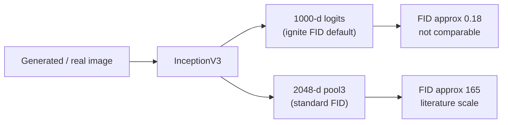

## Introduction

I inherited an evaluation notebook for a text-to-image GAN. It reported **FID 0.2423** and **IS 1.86**, and since FID is lower-is-better, 0.24 reads like a near-perfect generator.

That is precisely the problem. State-of-the-art face GANs (StyleGAN2 on FFHQ) land around **FID 3**; a mediocre one sits at 30–80. An FID of 0.24 would mean the generated and real distributions are *almost identical* — superhuman, from a model whose samples were visibly blurry. A number that good is almost never a great model; it is almost always a broken metric.

It was. This post walks through why **pytorch-ignite's default FID** returns a tiny, non-comparable number, proves it on our own model (same images, two feature spaces, a ~900× gap), flags a second bug that compounds it, and shows the fix.

> **Setup.** The model is a multi-stage CLIP-guided GAN trained on an MM-CelebA-HQ subset, on a single RTX 4060 Ti (8 GB). The dataset is licensed, so no generated faces are shown here — only metric values and plots, which are what this post is about anyway.
{: .prompt-info }

## The Symptom: An Impossibly Good FID

- **Expected:** an FID in the literature range (single digits for excellent, tens for mediocre) that tracks sample quality.
- **Actual:** **FID 0.2423**, while the samples were clearly low quality.
- **Reproduction:** the notebook computed FID with pytorch-ignite's metric, constructed with no feature extractor:

```python
from ignite.metrics import FID

fid_metric = FID(device=idist.device())   # the bug is hidden in this default
```

- **Environment:** `pytorch-ignite`, InceptionV3 weights downloaded by ignite, single CUDA device.

A score of 0.24 implies the two Gaussians FID compares are nearly coincident. The samples said otherwise. So the question is not "why is the model so good" — it is "what is this number actually measuring."

## Root Cause: ignite's Default FID Uses 1000-d Logits, Not 2048-d pool3

FID is the Fréchet distance between two Gaussians fit to **Inception features**:

$$\text{FID} = \lVert \mu_r - \mu_f \rVert^2 + \operatorname{Tr}\!\left(\Sigma_r + \Sigma_f - 2\left(\Sigma_r \Sigma_f\right)^{1/2}\right)$$

The subtlety lives in the word *features*. The canonical FID (Heusel et al., 2017) uses the **2048-dimensional `pool3`** activations of InceptionV3. But "Inception features" is a choice, and ignite makes a different one by default: with no `feature_extractor` argument, `FID(device=...)` falls back to ignite's `InceptionModel` wrapper, whose default output is the **1000-dimensional classification logits** (`num_features=1000`).

A Fréchet distance computed in a 1000-d softmax-logit space and one computed in the 2048-d pool3 space are simply **different metrics**. The logit space is lower-dimensional, differently scaled, and concentrated, so the distances come out 100–1000× smaller — and comparable to *nothing* in the literature.



The kicker: the pytorch-ignite GAN-evaluation tutorial the notebook was based on **does** build a custom 2048-d wrapper around InceptionV3 and passes it as `feature_extractor=...`. The notebook copied the `FID(...)` call but dropped the wrapper, silently inheriting the 1000-d default.

## Proof: Same Model, Two Scales (and No Conversion)

To show this is the metric and not the model, I took our shipped best checkpoint, generated one fake **per test caption** (510 test images), and scored the *same* fakes and reals two ways — ignite's default and the standard 2048-d FID:

| Inputs | ignite default (1000-d logits) | standard (2048-d pool3) |
|--------|:---:|:---:|
| fakes vs real | **0.181** | **164.9** |
| real vs real (sanity) | −0.000 | — |


_Same generator, same 510 image pairs — only the Inception feature space differs. The 1000-d default reports 0.181; the standard 2048-d FID reports 164.9 (a 910× gap). The real-vs-real control is ≈ 0, as it should be._

Two things to read off this:

1. **0.18 is the same tiny scale as the original 0.2423.** The notebook's "near-perfect" number was this 1000-d artifact all along; the real FID of this model is ~165 — high, because the model is genuinely weak.
2. **You cannot convert one into the other.** There is no fixed multiplier: on an earlier run, the 2048-d / 1000-d ratio was **1343×** at one epoch and **1870×** at another. The ratio depends on the model, so a 1000-d FID carries no recoverable information about the standard FID. You have to recompute from images.

## A Second Bug: All Fakes From One Prompt

Even with the right extractor, the notebook's comparison was invalid. Its `generate_images_batch(128)` produced all 128 fakes from a **single fixed caption**, then compared them against real images spanning the whole test set. That pits a one-point fake distribution against a broad real distribution (with a real/fake value-range mismatch on top). FID is a distribution-to-distribution distance; the fakes have to be drawn from the **same caption distribution** as the reals, or the number is meaningless before the feature space even enters the picture.

## The Fix: Standard 2048-d FID, Fakes Per Caption

Use `torchmetrics`, which defaults to the 2048-d pool3 features, accumulate over the whole test set, and condition each fake on its real caption:

```python
import torch
from torchmetrics.image.fid import FrechetInceptionDistance

fid = FrechetInceptionDistance(normalize=False).to(device)  # 2048-d pool3; expects uint8 [0,255]
to_u8 = lambda x: (x.clamp(0, 1) * 255).to(torch.uint8)

with torch.no_grad():
    for real, captions in test_loader:                       # real in [0,1]
        fid.update(to_u8(real.to(device)), real=True)
        z = torch.randn(captions.size(0), noise_dim, device=device)
        fake = (generator(captions.to(device), z).clamp(-1, 1) + 1) / 2   # tanh [-1,1] -> [0,1]
        fid.update(to_u8(fake), real=False)
    # end for
# end with
print(f"standard FID = {fid.compute().item():.2f}")
```

A couple of details that bite people: pass `normalize=False` and feed **uint8** `[0, 255]` (as above), *or* pass `normalize=True` and feed **float** `[0, 1]` — mixing them (uint8 into `normalize=True`) silently corrupts the score. And `FrechetInceptionDistance` resizes to 299×299 internally, so don't pre-resize.

Those are the *implementation* traps; the **input pipeline** has its own, quantified by clean-fid (Parmar et al., CVPR 2022):

- **Resize backend.** PIL-bicubic vs OpenCV/PyTorch bilinear shifts FID by ~4 on real FFHQ and ~7 on StyleGAN2 samples. Resize reals and fakes the same way.
- **JPEG round-trip.** Exporting samples as JPEG-75 instead of PNG moved real FFHQ FID to ~21 (8-bit PNG quantization alone is <0.01). Never save generated images as JPEG before scoring.
- **Sample count.** FID is a *biased* estimator whose bias is *model-dependent* (Chong & Forsyth, CVPR 2020), so comparing two models at different N can flip their ranking. Fix N and report it.

Our 164.9 is reproducible only because the pipeline pins the resize path, uses PNG, and holds N constant.

On our model this returns **164.9** — a high number, but the *real* one. And unlike the 1000-d artifact, it behaves like FID should: it falls as the model improves and rises as it degrades, so it is usable for checkpoint selection and ablations.

**Lesson:** the metric object's defaults are part of the metric. If you didn't choose the feature extractor, you don't know what you measured.

## Even the Right Extractor Has Limits

Fixing 1000-d logits → 2048-d pool3 makes FID *comparable to the literature* — but it does not make it *correct for your domain*. The standard Inception-V3 pool3 backbone is trained on ImageNet, and two recent results show that is a real limitation:

- Kynkäänniemi et al. (ICLR 2023) show FID's feature space is so close to ImageNet classification that you can **lower FID with no quality gain** by aligning generated images' top-N ImageNet-class histograms — an ImageNet-pretrained FastGAN can match StyleGAN2's FID while looking worse to humans. CLIP features largely resist this.
- Stein et al. (NeurIPS 2023) — the largest human-realism study to date — found **no common metric strongly correlates with human judgment**, blaming over-reliance on Inception-V3, and propose FD-DINOv2; CMMD (CVPR 2024) makes the same case and proposes a CLIP-MMD distance.

For a non-ImageNet domain like faces, that is a caveat on our own number: 164.9 is the honest *standard* FID, but a CLIP-FID or FD-DINOv2 cross-check would be a more faithful judge. One honest wrinkle: since MS-CLIP-GAN *conditions* on CLIP text features, a CLIP-based FID could be mildly self-favoring here — so DINOv2 is probably the cleaner second opinion. I fixed the bug that made FID *wrong*; this is the reason it may still be the *wrong tool*.

## Conclusion / Key Takeaways

1. **The feature space is part of FID.** Confirm you are on the 2048-d `pool3` features; a metric library's *default* extractor is not guaranteed to be the standard one (ignite's default is the 1000-d logits).
2. **A suspiciously tiny FID is a misconfigured extractor, not a great model.** Sanity-check against literature ranges (~3 excellent, tens mediocre) and a real-vs-real control (≈ 0).
3. **Fix the comparison before the extractor.** Generate fakes from the real caption distribution and match input ranges, or the number is invalid no matter which features you use.
4. **Even the correct extractor is ImageNet-tied.** A literature-comparable FID is not automatically the right judge for your domain — pin the input pipeline (resize/format/N) and cross-check faces with CLIP-FID / FD-DINOv2.

## Resources

- **FID** — Heusel et al., *GANs Trained by a Two Time-Scale Update Rule Converge to a Local Nash Equilibrium*, NeurIPS 2017 ([arXiv:1706.08500](https://arxiv.org/abs/1706.08500))
- **torchmetrics** — [`FrechetInceptionDistance`](https://lightning.ai/docs/torchmetrics/stable/image/frechet_inception_distance.html) (2048-d pool3 by default)
- **pytorch-ignite** — [`FID` metric](https://pytorch.org/ignite/generated/ignite.metrics.FID.html) and the GAN-evaluation tutorial that builds the custom 2048-d extractor
- **Input-pipeline pitfalls** — Parmar et al., *On Aliased Resizing and Surprising Subtleties in GAN Evaluation* (clean-fid), CVPR 2022 ([arXiv:2104.11222](https://arxiv.org/abs/2104.11222)); Chong & Forsyth, *Effectively Unbiased FID and Inception Score*, CVPR 2020 ([arXiv:1911.07023](https://arxiv.org/abs/1911.07023))
- **The backbone itself** — Kynkäänniemi et al., *The Role of ImageNet Classes in Fréchet Inception Distance*, ICLR 2023 ([arXiv:2203.06026](https://arxiv.org/abs/2203.06026)); Stein et al., *Exposing flaws of generative model evaluation metrics*, NeurIPS 2023 ([arXiv:2306.04675](https://arxiv.org/abs/2306.04675)); CMMD, CVPR 2024 ([arXiv:2401.09603](https://arxiv.org/abs/2401.09603))
- **Next in this series** — before interpreting the training curves, map the model being measured: ["MS-CLIP-GAN Architecture: How a CLIP-Guided Multi-Stage GAN Is Wired"]().
