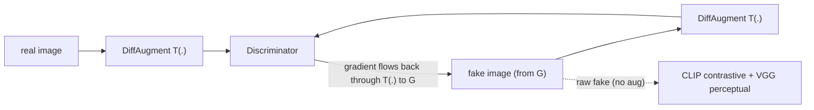

## Why this experiment

The [previous post]() found no robust improvement from four bundled balance/stability configurations using EMA, a lower D learning rate, label smoothing, and reduced D-update frequency. That single-seed sweep lowered the priority of those settings; it did not rule out discriminator dynamics in general.

That left a different testable hypothesis: with only ~2.5k images, symmetric discriminator-side augmentation might improve data efficiency. DiffAugment and StyleGAN2-ADA are established limited-data methods, but a gain from augmentation alone cannot diagnose discriminator memorization without direct train/validation diagnostics. This post asks the narrower question: does the intervention lower our same-N subset estimate in a matched-length run?

> **Setup.** Multi-stage CLIP-guided GAN (64→128→256, three stage-wise discriminators), 2,490 train / 510 test (25% of MM-CelebA-HQ captions), single RTX 4060 Ti (8 GB), batch 4, ~210 s/epoch, configured training/data-split seed 42, PyTorch 2.4. FID uses torchmetrics 2048-d pool3 with one fake per test caption. At N=510, the 2048-d covariance is rank-deficient and the estimator is biased, so the values are for same-N internal comparison rather than direct comparison with large-sample published FIDs. The historical JSON also predates a fixed evaluation latent seed, leaving additional one-shot sampling noise. Dataset images are licensed, so only metric plots are shown.
{: .prompt-info }

## What not to do

The tempting move is to uncomment the augmentation already sitting (disabled) in the dataloader:

```python
# dataset/dataloader.py — these are real-only transforms, not the symmetric intervention tested here
# T.RandomHorizontalFlip(p=0.5),
# T.ColorJitter(brightness=0.2, contrast=0.2, saturation=0.2),
# T.RandomAffine(degrees=15, translate=(0.1, 0.1), scale=(0.9, 1.1)),
```

That augments **reals only**, so it is not the intervention being evaluated. It can let the discriminator associate augmentation artifacts with the real class and create a real/fake preprocessing mismatch. In DiffAugment's reported CIFAR-10 BigGAN ablation, real-only augmentation worsened FID from 9.6 to as high as 49, while differentiable augmentation of both real and fake reached 8.6. That experiment motivates the symmetric design here; it does not imply every real-only transform must fail in every GAN.

## What I tested

DiffAugment with the standard `color,translation,cutout` policy, wired the GAN-correct way:



Concretely:
- **Discriminator sees `T(real)` and `T(fake)`** — the same differentiable transform on both, at all three stages.
- **Gradients flow to the generator through `T(fake)`** (the transforms are differentiable), so G learns to look real *under* augmentation.
- **The CLIP contrastive and VGG perceptual terms use the raw fake** — augmentation is a discriminator-side regularizer, not a change to the perceptual objective.
- **Everything else is the plain baseline** (no EMA/separate D learning rate), so DiffAugment is the only configured treatment difference. With one training run per condition, the observed delta is still an association, not a variance-controlled causal estimate.

And the part that keeps the result honest:

> DiffAugment was used only as a training-time discriminator-side augmentation. Evaluation used raw generator outputs, with no augmentation applied to fakes or reals.

## Decision rule (pre-registered)

Set before looking at the result:

- **FID < 150** → this run beats the pre-DiffAugment band; repeat it across seeds.
- **150–165** → baseline-equivalent at this resolution; inspect variance before claiming a gain.
- **> 165** → no observed benefit within this budget; do not infer which other factor is the ceiling.

A 50-epoch probe ran first and reached a best of **FID 173**. Its minimum sat near the end of the budget, so I extended the treatment to the same **100-epoch** horizon as the baseline before interpreting the trajectory. The later improvement is consistent with a delayed augmentation benefit; these runs did not directly measure discriminator overfitting.

## Result: One Run Crossed the Pre-DiffAugment Band


_Baseline vs DiffAugment, 2048-d FID estimated from 510 real/fake samples. The baseline reaches 163 at epoch 20 then degrades to 270; DiffAugment starts slower and reaches 118.5 at epoch 90, the last evaluated checkpoint._

| metric | baseline (no aug) | DiffAugment | 
|---|:---:|:---:|
| **best FID** | 163 @ ep20 | **118.5 @ ep90** |
| FID @ ep90 (last) | 270 (late degradation) | **118.5** |
| Inception Score @ ep90 (last) | 1.40 | **2.41** |

Reading against the rule, **118.5 < 150**: this historical run's estimate is **27% lower** than the baseline minimum. It also shows no baseline-like late degradation **through epoch 90**, the last evaluated checkpoint. That is not evidence that collapse was permanently eliminated; a longer trajectory was not measured. The exact Inception Score values in the table and the unshared visual inspection point in the same direction, but neither substitutes for repeated seeds or blinded evaluation.

The 50-epoch probe is the cautionary footnote: its last saved checkpoint was ep45 (FID 196), just before the matched-horizon 100-epoch run showed the later drop (ep50 = 163 → ep60 = 120). Only the longer run exposed that trajectory.

**The narrow headline: in one matched-horizon run, adding DiffAugment coincided with a lower same-N estimate and a different trajectory.** Repeated training and evaluation seeds are needed to estimate the size and reliability of that effect.

## What it does and does not prove

- **It does** show that symmetric, differentiable augmentation is a promising lever in this implementation: the configured DiffAugment run measured substantially lower than the configured baseline.
- **It does not** prove discriminator overfitting was the mechanism. That would require direct diagnostics or an ablation designed to separate regularization, stochastic variance, and other training effects.
- **It does not** prove the model is good in absolute terms. The estimate remains high, but direct comparison with published face-GAN scores is invalid without matching their much larger N and evaluation pipeline. The useful claim is relative and internal.
- **It is not a full-data run.** This tests whether a limited-data *remedy* lowers the *subset* ceiling; the direct test of *scale* is still training on the full dataset. DiffAugment lowering the 2.5k-image floor is consistent with — but not the same as — "more data would help."
- **The endpoint is not a convergence claim.** Epoch 90 is both the minimum and the last evaluated checkpoint. A longer run could improve, flatten, or degrade, so 118.5 is the best observed historical estimate, not a stable asymptote.

So the result supports a narrower conclusion: the pre-DiffAugment ~160 band was not an architecture-wide ceiling, and data-efficiency regularization is worth further study. It does not by itself separate data scarcity from discriminator overfitting or close the balance question universally.

## Reproduction

```bash
# audited source branch: fix/correctness-audit at 6fac9ec
git checkout 6fac9ec
export PYTHONPATH="$(pwd)"

# DiffAugment: same differentiable transform on real AND fake at the discriminator only
python scripts/train.py --name diffaug100 --data_path data/trainset_sub.zip \
    --use_uncond_loss --use_contrastive_loss --use_mixed_loss \
    --use_diffaugment --diffaugment_policy color,translation,cutout \
    --num_epochs 100 --batch_size 4 --save_freq 10

# standard 2048-d FID/IS curve over the newest matching run (raw fakes, no augmentation)
CKPT="$(ls -dt checkpoints/diffaug100-*/ckpt | head -n 1)"
[ -n "$CKPT" ] || { echo "no diffaug100 checkpoint directory" >&2; exit 1; }
python experiments/eval_curve.py data/testset_sub.zip "$CKPT" auto out.json
```

Environment: PyTorch 2.4, CLIP ViT-B/32, single RTX 4060 Ti (8 GB). DiffAugment and the historical result entered at commit `f64515f`; `6fac9ec` is the audited, pushed `origin/fix/correctness-audit` tip. The augmentation is opt-in (`--use_diffaugment`). Training/data split used configured seed 42, but the committed `eval.json` predates evaluator commit `5d0de43`. That commit adds one run-level `torch.manual_seed(42)` before the checkpoint loop, not a per-checkpoint reset: ep90 measured 117.50 when evaluated alone and 123.86 when evaluated after ep0 in the July 10 audit. Fix checkpoint-level latent reuse, then repeat sampling and training seeds before quoting a confidence interval or a small delta. The large baseline-vs-DiffAugment direction survived the isolated-checkpoint audit (164.25 vs 117.50), but its uncertainty remains unmeasured.

> **Source-report warning.** The linked commit's `experiments/RESULTS.md` predates this interpretation audit and describes augmentation as the only variable that moved FID. With one training run per condition and order-dependent evaluation noise, that is not a variance-controlled causal estimate. Use the report for artifact paths and implementation provenance; the limitations here supersede its stronger wording.
{: .prompt-warning }

## Resources

- **Source snapshot** — [audited `fix/correctness-audit` commit `6fac9ec`](https://github.com/youngunghan/MS-CLIP-GAN-Multi-Stage-Text-to-Image-Generation-with-CLIP-Guided-Synthesis/tree/6fac9ec)
- **DiffAugment** — Zhao et al., *Differentiable Augmentation for Data-Efficient GAN Training*, NeurIPS 2020 ([arXiv:2006.10738](https://arxiv.org/abs/2006.10738); [code](https://github.com/mit-han-lab/data-efficient-gans))
- **StyleGAN2-ADA** — Karras et al., *Training Generative Adversarial Networks with Limited Data*, NeurIPS 2020 ([arXiv:2006.06676](https://arxiv.org/abs/2006.06676))
- **Limited-data GANs** — *GANs with Limited Data: A Survey and Benchmarking*, 2025 ([arXiv:2504.05456](https://arxiv.org/abs/2504.05456))
- **Series** — the metric that made this measurable: ["Your FID of 0.24 Isn't Near-Perfect"](); the model: ["MS-CLIP-GAN Architecture"](); the hypothesis this one follows: ["Killing a Hypothesis Cheaply"]().
