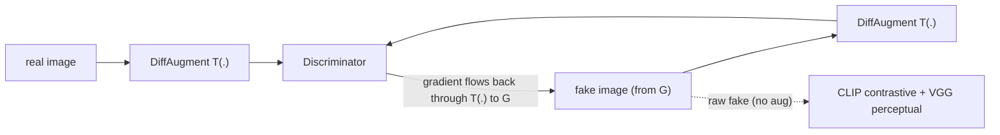

## Why this experiment

The [previous post]() ruled out the obvious hypothesis: weakening the discriminator (EMA, TTUR, label smoothing, n_critic) did **not** lower our multi-stage CLIP-GAN's standard FID, which sat around **163** on a 2,490-image MM-CelebA-HQ subset. The "D is winning" loss signature was real but misleading.

That left a different suspect. On only ~2.5k images, the more likely failure is **discriminator overfitting to a small training set** — the discriminator memorizes reals, stops giving the generator a useful gradient, and the model peaks early then degrades. The literature's first-line treatment for that is **data augmentation done the GAN-correct way**: DiffAugment (Zhao et al., NeurIPS 2020) and StyleGAN2-ADA (Karras et al., NeurIPS 2020), which take FFHQ-1k FID from ~100 to ~21. This post tests whether that remedy lowers *our* subset ceiling.

> **Setup.** Multi-stage CLIP-guided GAN (64→128→256, three stage-wise discriminators), 2,490 train / 510 test (25% of MM-CelebA-HQ captions), single RTX 4060 Ti (8 GB), batch 4, ~210 s/epoch, seed 42, PyTorch 2.4. FID is the standard torchmetrics 2048-d pool3, fakes conditioned on each test caption. Dataset is licensed, so only metric plots are shown.
{: .prompt-info }

## What not to do

The tempting move is to uncomment the augmentation already sitting (disabled) in the dataloader:

```python
# dataset/dataloader.py — these are commented out, and turning them on is the WRONG fix
# T.RandomHorizontalFlip(p=0.5),
# T.ColorJitter(brightness=0.2, contrast=0.2, saturation=0.2),
# T.RandomAffine(degrees=15, translate=(0.1, 0.1), scale=(0.9, 1.1)),
```

That augments **reals only**. In a GAN that *breaks the equilibrium*: the discriminator learns "augmented texture ⇒ real," the generator is pushed to reproduce augmentation artifacts, and FID gets **worse**. DiffAugment's Table 1 shows exactly this — augmenting reals only took CIFAR-10 BigGAN FID from 9.6 to as high as 49, while augmenting **both** real and fake gave 8.6. The fix has to be applied symmetrically and differentiably.

## What I tested

DiffAugment with the standard `color,translation,cutout` policy, wired the GAN-correct way:



Concretely:
- **Discriminator sees `T(real)` and `T(fake)`** — the same differentiable transform on both, at all three stages.
- **Gradients flow to the generator through `T(fake)`** (the transforms are differentiable), so G learns to look real *under* augmentation.
- **The CLIP contrastive and VGG perceptual terms use the raw fake** — augmentation is a discriminator-side regularizer, not a change to the perceptual objective.
- **Everything else is the plain baseline** (no EMA/TTUR), so the delta is attributable to DiffAugment alone.

And the part that keeps the result honest:

> DiffAugment was used only as a training-time discriminator-side augmentation. Evaluation used raw generator outputs, with no augmentation applied to fakes or reals.

## Decision rule (pre-registered)

Set before looking at the result:

- **FID < 150** → DiffAugment lowered the subset floor; the ceiling was at least partly data-bound.
- **150–165** → baseline-equivalent; it changes the dynamics but not the attainable floor.
- **> 165** → augmentation didn't take either; the objective/architecture/data-scale ceiling is reinforced.

A 50-epoch probe ran first and reached a best of **FID 173** — which would have meant ">165, didn't help." But DiffAugment *delays* the payoff (it slows discriminator overfitting), and the probe's minimum sat near the end of its budget. So I ran the fair, symmetric **100-epoch** comparison before concluding. That mattered.

## Result: it broke the floor


_Baseline vs DiffAugment, standard 2048-d FID. The baseline peaks at epoch 20 (163) then collapses to 270. DiffAugment is slower early, crosses near epoch 45, and keeps falling to ~118 — no late collapse._

| metric | baseline (no aug) | DiffAugment | 
|---|:---:|:---:|
| **best FID** | 163 @ ep20 | **118.5 @ ep90** |
| FID @ ep90 (last) | 270 (collapsed) | **118.5** |
| Inception Score (range) | ~1.6–1.9 | ~2.2–2.4 |

Reading against the rule, **118.5 < 150** — DiffAugment lowered the floor by **27%** and, just as importantly, **erased the late collapse**: the baseline peaks at epoch 20 and falls apart, while DiffAugment keeps improving through epoch 90. Higher Inception Score and visibly more coherent samples (checked, not shown — licensed data) track the same direction.

The 50-epoch probe is the cautionary footnote: its last saved checkpoint was ep45 (FID 196), just before the fair 100-epoch run revealed the late drop (ep50 = 163 → ep60 = 120). An early probe already hinted at the *delayed-but-improving* shape; only the full run showed that DiffAugment crossed the floor.

**The headline: DiffAugment changed the training dynamics *and* the attainable floor.** That is the difference from the discriminator-balance experiment, where the dynamics shifted but the floor did not.

## What it does and does not prove

- **It does** show the subset ceiling was, at least in part, a **data-efficiency / discriminator-overfitting** problem — the exact thing DiffAugment targets — and that the GAN-correct (both-sides, differentiable) application is what unlocked it.
- **It does not** prove the model is good in absolute terms. FID ~118 is still high (strong face GANs are single digits); the win is *relative* — the subset ceiling moved, not the state of the art.
- **It is not a full-data run.** This tests whether a limited-data *remedy* lowers the *subset* ceiling; the direct test of *scale* is still training on the full dataset. DiffAugment lowering the 2.5k-image floor is consistent with — but not the same as — "more data would help."
- **The number is an upper bound.** DiffAugment's FID is still near its minimum at epoch 90 (the last checkpoint), so a longer run, ADA's adaptive schedule, or more data could push it further. Those are the next experiments.

So the series' open question — *is the FID-160 ceiling data-bound?* — closes in the affirmative: partly yes. Discriminator balance was a dead end; data efficiency was a live lever.

## Reproduction

```bash
# DiffAugment: same differentiable transform on real AND fake at the discriminator only
python scripts/train.py --name diffaug100 --data_path data/trainset_sub.zip \
    --use_uncond_loss --use_contrastive_loss --use_mixed_loss \
    --use_diffaugment --diffaugment_policy color,translation,cutout \
    --num_epochs 100 --batch_size 4 --save_freq 10

# standard 2048-d FID/IS curve over every saved checkpoint (raw fakes, no augmentation)
python experiments/eval_curve.py data/testset_sub.zip checkpoints/diffaug100-*/ckpt auto out.json
```

Environment: PyTorch 2.4, CLIP ViT-B/32, single RTX 4060 Ti (8 GB), seed 42. The augmentation is an opt-in flag (`--use_diffaugment`); defaults reproduce the original training.

## Resources

- **DiffAugment** — Zhao et al., *Differentiable Augmentation for Data-Efficient GAN Training*, NeurIPS 2020 ([arXiv:2006.10738](https://arxiv.org/abs/2006.10738); [code](https://github.com/mit-han-lab/data-efficient-gans))
- **StyleGAN2-ADA** — Karras et al., *Training Generative Adversarial Networks with Limited Data*, NeurIPS 2020 ([arXiv:2006.06676](https://arxiv.org/abs/2006.06676))
- **Limited-data GANs** — *GANs with Limited Data: A Survey and Benchmarking*, 2025 ([arXiv:2504.05456](https://arxiv.org/abs/2504.05456))
- **Series** — the metric that made this measurable: ["Your FID of 0.24 Isn't Near-Perfect"](); the model: ["MS-CLIP-GAN Architecture"](); the hypothesis this one follows: ["Killing a Hypothesis Cheaply"]().
