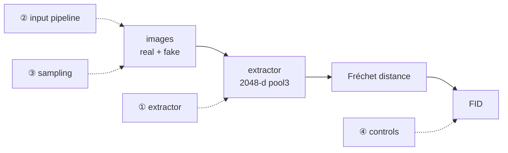

## Why a checklist

Across this series, the first requirement was to fix the FID **feature definition**. An [earlier post]() caught a generator reported at "FID 0.24" because the metric used the wrong feature space; the canonical-extractor re-evaluation was approximately 205 at N=510. That correction made internal comparisons meaningful, but it did not remove finite-sample bias or missing evaluation-seed provenance. Later posts use those estimates as exploratory same-N evidence, not definitive causal measurements.

The lesson generalizes past that one bug: **FID is a single scalar with several silent knobs.** Reproducibility requires pinning all of them; comparability additionally requires a compatible implementation, preprocessing path, sample distribution, and sample count. This checklist also records missing provenance instead of retroactively inventing it.

## What FID is, in one line

FID is the Fréchet distance between two Gaussians fit to **Inception features** of real and generated images:

$$\text{FID} = \lVert \mu_r - \mu_f \rVert^2 + \operatorname{Tr}\!\left(\Sigma_r + \Sigma_f - 2\left(\Sigma_r \Sigma_f\right)^{1/2}\right)$$

Every knob below is just a way that "Inception features of real and generated images" can quietly mean something different in your code than in the paper you're comparing to. (The feature-space derivation lives in the [first post](); here we make it operational.)

## The four things that silently move FID



1. **Feature extractor — use 2048-d `pool3`, and log it.** The standard FID uses InceptionV3's 2048-d pool3 activations. Library defaults are *not* guaranteed to be that (pytorch-ignite's default is the 1000-d logits — the original bug). One line of insurance:

   ```python
   from torchmetrics.image.fid import FrechetInceptionDistance

   fid = FrechetInceptionDistance(feature=2048, normalize=False)  # 2048-d pool3, uint8 inputs
   print("FID feature extractor: InceptionV3 pool3 / 2048-d")
   # end
   ```

2. **Input pipeline — resize backend, format, range/dtype.** clean-fid (Parmar et al., CVPR 2022) quantifies the traps: PIL-bicubic vs OpenCV/PyTorch bilinear shifts FID by ~4–7; exporting samples as JPEG instead of PNG pushed real FFHQ FID to ~21. Match the resize for real and fake, never JPEG-round-trip generated images, and match range/dtype to the FID flag (uint8 `[0,255]` with `normalize=False`, *or* float `[0,1]` with `normalize=True` — not mixed). Details and numbers in the [first post]().

3. **Sampling — same N, the right distribution, accumulate over the full set.** Generate fakes from the **real caption/label distribution** (one fake per real test item — e.g. one per test image, conditioned on that image's caption), not a single fixed prompt. Accumulate over the whole test set and `compute()` once — never average per-batch FIDs. Fix N and report it: FID is a *biased* estimator whose bias is model-dependent (Chong & Forsyth, CVPR 2020), so comparing models at different N can flip the ranking. Here N=510 is smaller than the 2048 feature dimension, so each empirical covariance has rank at most 509; close differences need repeated draws and a small-sample complement such as KID.

4. **Controls and provenance — identity, independent splits, seeds, checkpoint, code.** Scoring the exact same real tensor set against itself should be approximately zero, but that is only an identity/accumulator smoke test: a wrong deterministic extractor also passes it. Add a comparison between independent real splits that traverse the real loading pipeline, and a deliberately perturbed-input check when debugging preprocessing. Record the training seed, **evaluation latent seed**, checkpoint hash/path, evaluator commit, and library version separately.

## A worked example (our own numbers, no new run)

Why trust these four knobs? Because they explain every FID surprise in this series — on one RTX 4060 Ti (8 GB), one model, no new experiments:

| evidence | what it shows | knob |
|---|---|---|
| ignite-default = **0.18**, standard 2048-d = **164.9** (same model, same images) | the extractor alone moves FID ~900× | ① extractor |
| same real tensors vs themselves = **≈ 0.0** | the accumulator identity path behaves; full-pipeline validity remains untested | ④ controls |
| baseline 163 → DiffAugment **118.5** | one matched-horizon run gives a promising same-N difference | (exploratory payoff) |

The canonical-extractor estimate moved in the same direction as the unshared visual inspection in this run, unlike the tiny 1000-d number. That makes it more useful, but does not establish that the model "actually got better" by a known amount: the visual check was not blinded, the training was not repeated, and the historical evaluator did not record its latent seed.

## A reporting table you can copy

Put this next to any FID you publish. The example deliberately exposes the missing historical provenance rather than filling it with the configured training seed:

| field | example value |
|---|---|
| feature extractor | InceptionV3 `pool3`, **2048-d** |
| FID implementation | torchmetrics `FrechetInceptionDistance`; **version not recorded** |
| resize | library-internal → 299×299 (no pre-resize) |
| image format | PNG (no JPEG round-trip) |
| input range / dtype | uint8 `[0,255]`, `normalize=False` |
| samples N | 510 real / 510 fake, full-set accumulation |
| fake conditioning | one fake per test image, conditioned on that image's **first stored caption** (not every caption, not a fixed prompt) |
| training/data-split seed | 42 |
| evaluation latent seed | **not recorded for historical JSON** |
| checkpoint | `diffaug100`, `epoch_90` (raw local checkpoint, not promoted) |
| evaluator source | result introduced at `f64515f`; audited branch `6fac9ec` |
| **historical FID estimate** | **118.5** |
| control: same real tensors vs themselves | ≈ 0.0 (identity smoke only) |
| control: independent real splits | not reported |

Because the historical evaluation latent seed and distributable checkpoint are missing, this table documents a historical result rather than a fully re-derivable artifact. Branch `origin/fix/correctness-audit` at `6fac9ec` adds a run-level seed, but it does **not** reset or reuse noise per checkpoint: changing the epoch list changes later checkpoints' inputs. Fix that by resetting a dedicated generator per checkpoint or precomputing fixed latent tensors; then re-evaluate the old checkpoints.

> **Update (2026-07).** This is fixed and merged. That branch advanced (`c50baaa`, `1076caa`) and merged into `main` via PR #1 (`0548b72`); `main` is now at `2dee0b1`. `experiments/eval_curve.py` calls `seed_fix(seed)` *after loading each checkpoint* (not once before the loop), so a checkpoint's generated sample stream is invariant to which other epochs are in the same invocation; the module docstring now states the RNG "is reset after loading every checkpoint." The old checkpoints were re-evaluated under this fix (see `experiments/RESULTS.md`).
{: .prompt-info }

Direct script calls also need `export PYTHONPATH="$(pwd)"`.

## The limits even a clean FID has

Pinning the knobs can make a run reproducible; it does not automatically make it comparable or statistically precise. At N=510, report the result as a same-N estimate, repeat the fake draw, and add KID or another small-sample analysis. The 2048-d pool3 backbone is also ImageNet-trained: Kynkäänniemi et al. (ICLR 2023) show FID is gameable by aligning ImageNet-class histograms, and Stein et al. (NeurIPS 2023) show it under-tracks human realism, recommending FD-DINOv2; CMMD (CVPR 2024) proposes CLIP-MMD. For faces, add an **FD-DINOv2 cross-check**. A CLIP-based metric is less independent here because the model itself uses CLIP conditioning.

## The checklist

```text
[ ] extractor = 2048-d pool3 (NOT logits) — print num_features
[ ] real and fake resized the same way; don't pre-resize (library does 299 internally)
[ ] PNG, not JPEG; range/dtype matches the FID flag (uint8+normalize=False OR float[0,1]+normalize=True)
[ ] fakes from the real caption/label distribution, not one fixed prompt
[ ] fixed N, accumulate over the full set, compute() once — report N and whether N < feature dimension
[ ] same-set real-vs-real identity smoke ≈ 0; do not call it full-pipeline validation
[ ] independent real splits and an intentional preprocessing perturbation behave as expected
[ ] training seed and evaluation latent seed recorded separately
[ ] exact checkpoint + evaluator commit + library version recorded
[ ] small N? repeat fake draws and add KID/uncertainty analysis
[ ] report extractor + library + N alongside the number
[ ] non-ImageNet domain? add a CLIP-FID / FD-DINOv2 cross-check
```

## And it's not just FID

None of this is specific to generative models. A detector's **mAP** has the same disease: in [a parallel self-audit](), a "0.91 mAP" turned out near-train because the "held-out" split shared clips with training — a *sampling* bug, the detection analogue of "fakes from one prompt." The general law: **a single-scalar metric is a compression of the truth, and the compression artifacts live in the pipeline.** That cross-domain pattern is the subject of the [capstone]().

## Resources

- **FID** — Heusel et al., NeurIPS 2017 ([arXiv:1706.08500](https://arxiv.org/abs/1706.08500))
- **Input-pipeline pitfalls** — clean-fid, Parmar et al., CVPR 2022 ([arXiv:2104.11222](https://arxiv.org/abs/2104.11222)); unbiased FID, Chong & Forsyth, CVPR 2020 ([arXiv:1911.07023](https://arxiv.org/abs/1911.07023))
- **Backbone limits** — Kynkäänniemi et al., ICLR 2023 ([arXiv:2203.06026](https://arxiv.org/abs/2203.06026)); Stein et al., NeurIPS 2023 ([arXiv:2306.04675](https://arxiv.org/abs/2306.04675)); CMMD, CVPR 2024 ([arXiv:2401.09603](https://arxiv.org/abs/2401.09603))
- **Tools** — [torchmetrics FID](https://lightning.ai/docs/torchmetrics/stable/image/frechet_inception_distance.html), [clean-fid](https://github.com/GaParmar/clean-fid), [torch-fidelity](https://github.com/toshas/torch-fidelity)
- **Series** — the bug this distills: ["Your FID of 0.24 Isn't Near-Perfect"]()
