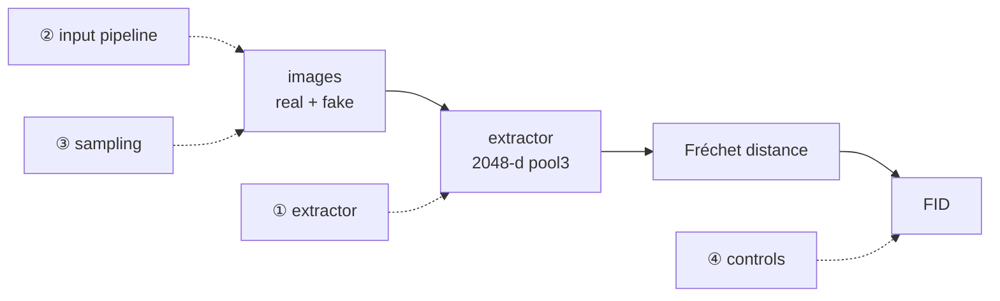

## Why a checklist

Across this series, the one asset everything else leans on is that we **measured FID correctly**. An [earlier post]() caught a generator reported at "FID 0.24" whose real FID was ~205 — the metric was computed in the wrong feature space. Later, that trustworthy FID is what let us [rule out a hypothesis]() and then [break a ceiling with DiffAugment]().

The lesson generalizes past that one bug: **FID is a single scalar with several silent knobs, and if you don't pin all of them, your number is not reproducible and not comparable to anyone else's.** This post is the reusable protocol — a reporting table and a checklist — distilled from the bug story so you don't have to relive it. It needs no new experiment; every number below is from runs already in this series.

## What FID is, in one line

FID is the Fréchet distance between two Gaussians fit to **Inception features** of real and generated images:

$$\text{FID} = \lVert \mu_r - \mu_f \rVert^2 + \operatorname{Tr}\!\left(\Sigma_r + \Sigma_f - 2\left(\Sigma_r \Sigma_f\right)^{1/2}\right)$$

Every knob below is just a way that "Inception features of real and generated images" can quietly mean something different in your code than in the paper you're comparing to. (The feature-space derivation lives in the [first post](); here we make it operational.)

## The four things that silently move FID



1. **Feature extractor — use 2048-d `pool3`, and log it.** The standard FID uses InceptionV3's 2048-d pool3 activations. Library defaults are *not* guaranteed to be that (pytorch-ignite's default is the 1000-d logits — the original bug). One line of insurance:

   ```python
   from torchmetrics.image.fid import FrechetInceptionDistance

   fid = FrechetInceptionDistance(feature=2048, normalize=False)  # 2048-d pool3, uint8 inputs
   print("FID feature extractor: InceptionV3 pool3 / 2048-d")
   # end
   ```

2. **Input pipeline — resize backend, format, range/dtype.** clean-fid (Parmar et al., CVPR 2022) quantifies the traps: PIL-bicubic vs OpenCV/PyTorch bilinear shifts FID by ~4–7; exporting samples as JPEG instead of PNG pushed real FFHQ FID to ~21. Match the resize for real and fake, never JPEG-round-trip generated images, and match range/dtype to the FID flag (uint8 `[0,255]` with `normalize=False`, *or* float `[0,1]` with `normalize=True` — not mixed). Details and numbers in the [first post]().

3. **Sampling — same N, the right distribution, accumulate over the full set.** Generate fakes from the **real caption/label distribution** (one fake per test caption), not a single fixed prompt. Accumulate over the whole test set and `compute()` once — never average per-batch FIDs. Fix N and report it: FID is a *biased* estimator whose bias is model-dependent (Chong & Forsyth, CVPR 2020), so comparing models at different N can flip the ranking.

4. **Controls — a real-vs-real ≈ 0 sanity check, plus a fixed seed and checkpoint.** Score real-vs-(shuffled)-real; it should be ≈ 0. If it isn't, your pipeline is broken before the model enters. Then fix the seed and name the exact checkpoint, so the number is re-derivable.

## A worked example (our own numbers, no new run)

Why trust these four knobs? Because they explain every FID surprise in this series — on one RTX 4060 Ti (8 GB), one model, no new experiments:

| evidence | what it shows | knob |
|---|---|---|
| ignite-default = **0.18**, standard 2048-d = **164.9** (same model, same images) | the extractor alone moves FID ~900× | ① extractor |
| real-vs-real control = **≈ 0.0** | the pipeline is sound; the 164.9 is real | ④ controls |
| baseline 163 → DiffAugment **118** | a correctly-measured FID *tracks real improvement* | (the payoff) |

That last row is the point of getting it right: a broken FID (the 1000-d 0.18) is a flat, meaningless artifact; the **correct FID went down when the model actually got better and up when it collapsed.** A metric is only useful for decisions once it behaves — and it only behaves once the four knobs are pinned.

## A reporting table you can copy

Put this next to any FID you publish. If a reader can't reproduce your number from it, it isn't a measurement:

| field | example value |
|---|---|
| feature extractor | InceptionV3 `pool3`, **2048-d** |
| FID implementation | torchmetrics `FrechetInceptionDistance` |
| resize | library-internal → 299×299 (no pre-resize) |
| image format | PNG (no JPEG round-trip) |
| input range / dtype | uint8 `[0,255]`, `normalize=False` |
| samples N | 510 real / 510 fake, full-set accumulation |
| fake conditioning | one fake per real test caption |
| seed / checkpoint | seed 42, `epoch_90` |
| **FID** | **118.5** |
| control: real-vs-real | ≈ 0.0 |

## The limits even a clean FID has

Pinning the four knobs makes FID *reproducible and comparable* — not *correct for your domain*. The 2048-d pool3 backbone is ImageNet-trained: Kynkäänniemi et al. (ICLR 2023) show FID is gameable by aligning ImageNet-class histograms, and Stein et al. (NeurIPS 2023) show it under-tracks human realism, recommending FD-DINOv2; CMMD (CVPR 2024) proposes CLIP-MMD. For a non-ImageNet domain (e.g. faces), add a **CLIP-FID or FD-DINOv2 cross-check**. One caveat if your model conditions on CLIP: a CLIP-based FID can be mildly self-favoring, so DINOv2 is the cleaner second opinion.

## The checklist

```text
[ ] extractor = 2048-d pool3 (NOT logits) — print num_features
[ ] real and fake resized the same way; don't pre-resize (library does 299 internally)
[ ] PNG, not JPEG; range/dtype matches the FID flag (uint8+normalize=False OR float[0,1]+normalize=True)
[ ] fakes from the real caption/label distribution, not one fixed prompt
[ ] fixed N, accumulate over the full set, compute() once — report N
[ ] real-vs-real control ≈ 0
[ ] fixed seed + named checkpoint
[ ] report extractor + library + N alongside the number
[ ] non-ImageNet domain? add a CLIP-FID / FD-DINOv2 cross-check
```

## And it's not just FID

None of this is specific to generative models. A detector's **mAP** has the same disease: in [a parallel self-audit](), a "0.91 mAP" turned out near-train because the "held-out" split shared clips with training — a *sampling* bug, the detection analogue of "fakes from one prompt." The general law: **a single-scalar metric is a compression of the truth, and the compression artifacts live in the pipeline.** That cross-domain pattern is the subject of the [capstone]().

## Resources

- **FID** — Heusel et al., NeurIPS 2017 ([arXiv:1706.08500](https://arxiv.org/abs/1706.08500))
- **Input-pipeline pitfalls** — clean-fid, Parmar et al., CVPR 2022 ([arXiv:2104.11222](https://arxiv.org/abs/2104.11222)); unbiased FID, Chong & Forsyth, CVPR 2020 ([arXiv:1911.07023](https://arxiv.org/abs/1911.07023))
- **Backbone limits** — Kynkäänniemi et al., ICLR 2023 ([arXiv:2203.06026](https://arxiv.org/abs/2203.06026)); Stein et al., NeurIPS 2023 ([arXiv:2306.04675](https://arxiv.org/abs/2306.04675)); CMMD, CVPR 2024 ([arXiv:2401.09603](https://arxiv.org/abs/2401.09603))
- **Tools** — [torchmetrics FID](https://lightning.ai/docs/torchmetrics/stable/image/frechet_inception_distance.html), [clean-fid](https://github.com/GaParmar/clean-fid), [torch-fidelity](https://github.com/toshas/torch-fidelity)
- **Series** — the bug this distills: ["Your FID of 0.24 Isn't Near-Perfect"]()
