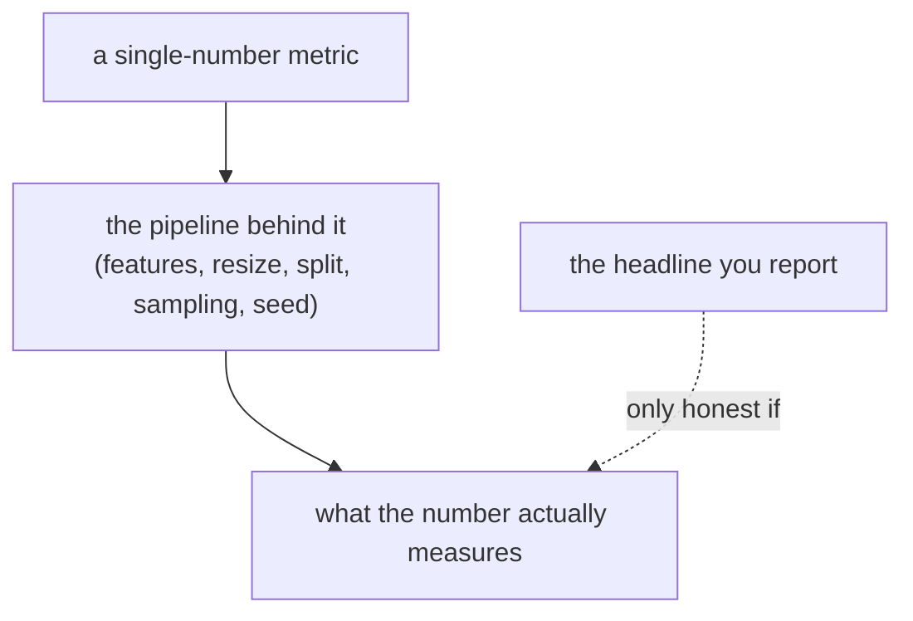

## The pattern

Two unrelated projects on this blog — a safety-gear **object detector** and a text-to-image **GAN** — converged on the same lesson, the hard way. In each, the headline number looked impressive but did not support the conclusion initially attached to it. The fix began with a better *understanding of what the number was made of*.

- The detector scored **0.91 mAP**. It also fired `helmet_off` on workers wearing helmets.
- The GAN scored **FID 0.24** in a non-standard feature space. A canonical 2048-d re-evaluation on one N=510 draw was **~205**.

Neither result was fabricated by the model. Both were **pipeline-dependent measurements presented without enough scope** — and the habit that caught that problem is portable across domains. This post pulls the two threads together and shows how a cheap experiment can reprioritize a hypothesis without pretending to prove its cause.

## Failure mode #1 — a non-comparable generative metric

The GAN's evaluation notebook computed FID with a library default that scored in the wrong feature space — 1000-d Inception *logits* instead of the conventional 2048-d `pool3`. The number it produced (0.24) was on a non-comparable scale; a canonical-extractor N=510 draw for the original model was ~205 (the ratio is model-dependent, so the two do not convert). That estimate is useful for same-N internal diagnosis, not a uniquely "real" or literature-comparable FID. The [full diagnosis is here](), and the reusable [reporting protocol here]().

The tell was a mismatch between the tiny number and visibly blurry samples. Published face-GAN ranges were a reason to audit the pipeline, not a direct benchmark because sample count and preprocessing differed. **A number that contradicts every qualitative check needs an audit before celebration.**

## Failure mode #2 — a near-train detection split

The detector's "held-out" validation split wasn't held out the way it looked: AIHub's official split interleaves frames *within the same clip*, so ~94% of validation frames sat within ±1 label-index of a training frame from the same fixed camera. The 0.91 was a **near-train** number. A second probe (false positives) overlapped the training negatives, and an unfixed seed blurred the small deltas. The [self-audit is here]().

Same shape as the first failure mode: the scalar could be computed correctly while answering the wrong deployment question. "Fakes from one fixed prompt" (a second FID sampling bug) and "validation frames from training clips" (the mAP split issue) both narrow the evaluated distribution without making that scope obvious.

## The common law: numbers eat pipelines

A single-scalar metric is a **compression of the truth**, and the compression artifacts live in the pipeline that produced it — not in the scalar:

| | generative (FID) | detection (mAP) |
|---|---|---|
| headline | 0.24 (non-standard; canonical N=510 draw ~205) | 0.91 (near-train) |
| where it broke | feature space + input pipeline | the train/val split (sampling) |
| the smell | "too good vs literature" | "too good vs reality (false positives)" |
| the fix | pin extractor/pipeline/N | split by clip, disjoint probes, fixed seed |
| reusable artifact | [FID checklist]() | [anti-fooling rules]() |

The practical rule both projects converged on: **never quote a metric you have not tried to break.** A same-tensor real-vs-real score near zero checks only the accumulator identity path; add independent splits and preprocessing perturbations. Split by the unit that leaks, check probe overlap by file hash, and use literature ranges only as audit triggers unless protocols match. The number is a claim; the pipeline is the evidence.

## The other half: kill wrong hypotheses cheaply

Distrust applies to your *explanations*, not just your *measurements*. Once the GAN used the canonical feature definition, its historical N=510 estimates plateaued around ~160 and its losses suggested a tempting hypothesis: **D may be too strong**. The raw loss magnitudes were not themselves a calibrated dominance diagnostic.

So I [tested it instead of assuming it](): four single-seed configurations bundled EMA, separate learning rates, label smoothing, and reduced D-update frequency against a pre-registered decision rule. None robustly broke the baseline-equivalent band, which lowered the priority of those settings but did not reject D-dominance generally. A later single DiffAugment run produced a lower same-N estimate, [163 → 118.5](); without repeated seeds or overfitting diagnostics, that supports a promising intervention rather than proving its mechanism.

The economics still matter. A cheap screen can tell you whether to spend the next week on a direction, and the evaluation-leakage audit is the same move pointed inward: **challenging your own evaluation is cheaper than having a reviewer or production challenge it for you.** A causal rejection needs one-factor ablations, repeated seeds, uncertainty and mechanism-specific diagnostics; this sweep was a prioritization result, not that stronger experiment.

## A portable discipline

Strip the domains away and the same checklist-of-checklists is left:

1. **Distrust the metric.** Know what the scalar compresses; pin the pipeline; use same-set identity and independent-split controls; sanity-check against literature without claiming comparability. ([FID]() / [mAP]() versions.)
2. **Distrust the split.** Split by the unit that leaks (clip, patient, scene), and verify disjointness by hash, not by name.
3. **Distrust the explanation.** Pre-register a decision rule and use a cheap screen to reprioritize; change one variable and repeat seeds before making a causal rejection.
4. **Lead with the uncontaminated number**, and label the rosier one with an asterisk.

None of this starts with a bigger GPU. It starts by treating the first number as provisional until its scope and failure modes have been tested.

## Conclusion

The most useful thing I did in either project was audit what each output meant: the FID that read 0.24, the near-train mAP that read 0.91, and the "obvious" reason the GAN was stuck. **Numbers eat pipelines.** Measure the pipeline, not just the scalar, and design experiments that distinguish screening evidence from causal evidence. That habit transferred between a detector and a GAN with little else in common.

## Resources

- **Generative-metric thread** — ["Your FID of 0.24 Isn't Near-Perfect"]() and the ["FID reporting checklist"]()
- **Detection-metric thread** — ["Held-Out in Name Only" (evaluation self-audit)]() and ["When 0.91 mAP Still Fails"]()
- **Cheap hypothesis screening** — ["Testing a Hypothesis Cheaply"]()
- **Leakage, generally** — Kaufman et al., *Leakage in Data Mining* (ACM TKDD, 2012) ([ACM](https://dl.acm.org/doi/10.1145/2382577.2382579))
