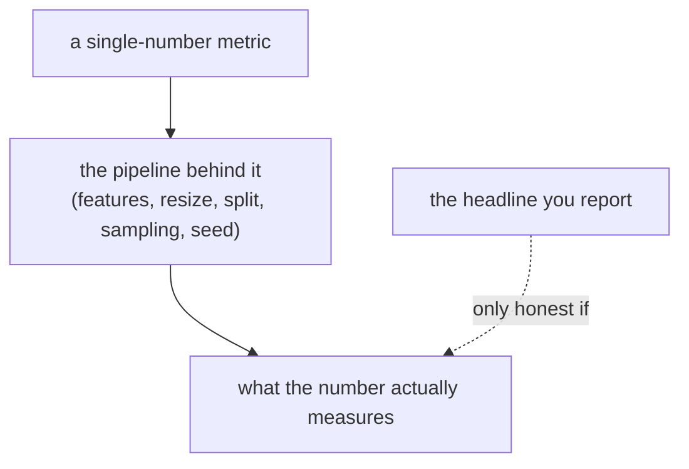

## The pattern

Two unrelated projects on this blog — a safety-gear **object detector** and a text-to-image **GAN** — converged on the same lesson, the hard way. In each, the headline number looked great and was wrong, and in each the fix was not a better model but a better *understanding of what the number was made of*.

- The detector scored **0.91 mAP**. It also fired `helmet_off` on workers wearing helmets.
- The GAN scored **FID 0.24**. Its real FID was **~165**.

Neither number was a lie the *model* told. Both were lies the **pipeline** told — and the habit that caught them is portable across domains. This post pulls the two threads together: how the numbers lied, why "numbers eat pipelines," and the companion habit of killing wrong hypotheses cheaply before they cost you a week.

## Lie #1 — a generative metric (FID 0.24 → 165)

The GAN's evaluation notebook computed FID with a library default that scored in the wrong feature space — 1000-d Inception *logits* instead of the standard 2048-d `pool3`. The number it produced (0.24) was ~900× smaller than the real FID (164.9 on the same model and images), on a non-comparable scale. It wasn't "near-perfect"; it was misconfigured. The [full diagnosis is here](), and the reusable [reporting protocol here]().

The tell was domain knowledge: face GANs land around FID 3 — not 0.24 for a visibly blurry generator. **A number too good to be true usually is — and the cause is upstream of the model.**

## Lie #2 — a detection metric (0.91 mAP, near-train)

The detector's "held-out" validation split wasn't held out the way it looked: AIHub's official split interleaves frames *within the same clip*, so ~94% of validation frames sat within ±1 label-index of a training frame from the same fixed camera. The 0.91 was a **near-train** number. A second probe (false positives) overlapped the training negatives, and an unfixed seed blurred the small deltas. The [self-audit is here]().

Same shape as Lie #1: the model was fine, but the *sampling* — which frames count as "test" — quietly broke the number. "Fakes from one fixed prompt" (the FID bug) and "test frames from the training clips" (the mAP bug) are the same mistake in two costumes.

## The common law: numbers eat pipelines

A single-scalar metric is a **compression of the truth**, and the compression artifacts live in the pipeline that produced it — not in the scalar:

| | generative (FID) | detection (mAP) |
|---|---|---|
| headline | 0.24 (→ really 165) | 0.91 (near-train) |
| where it broke | feature space + input pipeline | the train/val split (sampling) |
| the smell | "too good vs literature" | "too good vs reality (false positives)" |
| the fix | pin extractor/pipeline/N | split by clip, disjoint probes, fixed seed |
| reusable artifact | [FID checklist]() | [anti-fooling rules]() |

The practical rule both projects converged on: **never quote a metric you haven't tried to break.** Score real-vs-real and expect ≈ 0; split by the unit that leaks; check probe overlap by file hash; sanity-check against literature ranges. The number is a claim; the pipeline is the evidence.

## The other half: kill wrong hypotheses cheaply

Distrust applies to your *explanations*, not just your *measurements*. Once the GAN's FID was trustworthy, it plateaued at ~160 with a textbook "discriminator is winning" loss signature. The tempting hypothesis — **D is too strong** — is the first thing every GAN tutorial reaches for.

So I [tested it instead of believing it](): four short runs (EMA, TTUR, label smoothing, n_critic) against a **pre-registered** decision rule. Weakening D never robustly broke the baseline-equivalent band — the hypothesis died in an afternoon, not a week. That cleared the way to the hypothesis that *did* hold: limited-data discriminator overfitting, where [DiffAugment cut FID 163 → 118]().

The economics matter. A hypothesis you can falsify in four 90-minute runs is worth more than one you can't, and the eval-leakage audit is the same move pointed inward: **breaking your own evaluation is cheaper than having a reviewer (or production) break it for you.** Negative results, obtained cheaply, are how you avoid expensive dead ends — and they're only credible when the test was designed to be decisive (one variable, a pre-registered threshold) rather than a list of things that didn't work.

## A portable discipline

Strip the domains away and the same checklist-of-checklists is left:

1. **Distrust the metric.** Know what the scalar compresses; pin the pipeline; add a control that must read ≈ 0; sanity-check against the literature. ([FID]() / [mAP]() versions.)
2. **Distrust the split.** Split by the unit that leaks (clip, patient, scene), and verify disjointness by hash, not by name.
3. **Distrust the explanation.** Pre-register a decision rule, change one variable, and let a cheap experiment kill the hypothesis.
4. **Lead with the uncontaminated number**, and label the rosier one with an asterisk.

None of this needs a bigger GPU. It needs the assumption that your first number is wrong until you've tried to make it wrong.

## Conclusion

The most useful thing I did in either project wasn't training a model — it was distrusting its outputs: the FID that read 0.24, the mAP that read 0.91, and the "obvious" reason the GAN was stuck. **Numbers eat pipelines.** Measure the pipeline, not just the scalar, and design your experiments so the wrong answers die cheaply. That habit transferred between a detector and a GAN with nothing else in common — which is the best sign it's worth keeping.

## Resources

- **Generative-metric thread** — ["Your FID of 0.24 Isn't Near-Perfect"]() and the ["FID reporting checklist"]()
- **Detection-metric thread** — ["Held-Out in Name Only" (evaluation self-audit)]() and ["When 0.91 mAP Still Fails"]()
- **Cheap-hypothesis-killing** — ["Killing a Hypothesis Cheaply"]()
- **Leakage, generally** — Kaufman et al., *Leakage in Data Mining* (ACM TKDD, 2012) ([ACM](https://dl.acm.org/doi/10.1145/2382577.2382579))
