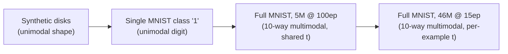

## Introduction

I audited a public PyTorch reimplementation of Sohl-Dickstein et al. 2015, ["Deep Unsupervised Learning using Nonequilibrium Thermodynamics"](https://arxiv.org/abs/1503.03585) (arXiv:1503.03585) -- the paper that introduced the forward/reverse diffusion process DDPM later popularized. The repo's swiss-roll toy demo trained fine. Its MNIST path did not: validation loss oscillated in a tight band, 0.9424-0.9426, for thousands of batches, and stayed there.

That number looks like convergence if you only watch it decrease and then flatten. It is not. **0.9425 is the exact analytic negative log-likelihood of the best constant two-scalar Gaussian fit to the data** -- a model with two learnable numbers, a mean and a standard deviation, and nothing else. The network being trained had 329,452,500 parameters. It had learned to output a constant.

The root cause: the forward posterior $q(x^{(t-1)} \mid x^{(t)}, x^{(0)})$ -- the term the paper's entire training loss is built from -- appeared **nowhere** in the image-model code path. The swiss-roll demo was a separate, correct implementation that didn't even import the image model. This post walks through how that surfaced in the loss curve, what was actually in the code instead of the paper's math, and what happened after fixing it: the denoiser demonstrably works on a reconstruction test, but full unconditional MNIST generation still produces speckle. A diagnostic ladder across easier datasets is used to tell "still broken" from "genuinely hard problem" apart.

> **Setup.** Single RTX 4060 Ti (8 GB), conda env from the repo's own `environment.yml` (Python 3.9.23, PyTorch 2.5.1). $T=1000$ diffusion steps, $\beta_t = 1/\mathrm{linspace}(T, 2, T)$ as in the reference. Full hardware/software/config table is in [Results](#results).
{: .prompt-info }

## Challenge 1: The Plateau That Was a Baseline

The first tell should have been obvious in hindsight: a validation loss that stops moving isn't necessarily a converged model -- it can also be a model that found the cheapest constant answer available and stopped looking for a better one. The way to tell the two apart is to compute what that cheapest constant answer actually costs, and check whether the plateau matches it.

MNIST test images, normalized to $[-1, 1]$ as the training pipeline does, have global mean $-0.7350$ and standard deviation $0.6210$. For a Gaussian $\mathcal{N}(\mu, \sigma^2)$ fit by maximum likelihood to a set with that mean and variance, the average per-pixel NLL reduces to a closed form because the quadratic term evaluates to exactly $\tfrac{1}{2}$ at the ML estimate:

$$
\mathrm{NLL}(\mu, \sigma) = \frac{1}{2}\log(2\pi\sigma^2) + \frac{1}{2}
$$

```python
import numpy as np

def constant_gaussian_nll(std: float) -> float:
    """Analytic per-pixel NLL of the best constant N(mean, std) baseline,
    evaluated at its own maximum-likelihood mean/std (the quadratic term
    collapses to exactly 0.5)."""
    return 0.5 * np.log(2 * np.pi * std ** 2) + 0.5
# end def

def gaussian_nll_against(mean: float, std: float, data_mean: float, data_std: float) -> float:
    """NLL of N(mean, std) evaluated against a distribution with the given
    (data_mean, data_std) -- used for the mu=0, sigma=1 reference row below."""
    mse = data_std ** 2 + (data_mean - mean) ** 2
    return 0.5 * np.log(2 * np.pi * std ** 2) + mse / (2 * std ** 2)
# end def

print(f"{constant_gaussian_nll(0.6210):.4f}")                       # 0.9425
print(f"{gaussian_nll_against(0.0, 1.0, -0.7350, 0.6210):.4f}")     # 1.3818
```

| Baseline | NLL (same units as the reported validation loss) |
|---|---:|
| Per-pixel empirical marginal (true histogram, not Gaussian) | -0.8938 |
| **Best constant $\mathcal{N}(-0.7350, 0.6210^2)$ -- two learnable scalars** | **0.9425** |
| $\mathcal{N}(0, 1)$ -- no fitting at all | 1.3818 |
| **Observed validation plateau** | **0.9424-0.9426** |

The plateau sits on top of the two-scalar row to four significant figures. A 329,452,500-parameter network was scoring exactly where a model with two parameters scores.

**Lesson:** before reading a flattening validation curve as convergence, compute what a trivial constant predictor costs on the same loss. If the plateau matches it, the model didn't converge to a solution -- it converged to the cheapest non-solution the loss function admits.

## Challenge 2: Reading the Reference Line by Line

A matching plateau is a symptom, not a diagnosis. To find the cause, I pulled the [original Theano reference implementation](https://github.com/Sohl-Dickstein/Diffusion-Probabilistic-Models) the paper's authors published and diffed it against the audited repo's image-model path, term by term.

The paper's training objective is a KL divergence between the model's predicted reverse-step Gaussian and the **true forward posterior** $q(x^{(t-1)} \mid x^{(t)}, x^{(0)})$ -- the distribution you get by conditioning the forward noising process on both endpoints. Everything downstream depends on that posterior being computed and fed into the loss. (For the full derivation of this bound -- why it's a lower bound on the log-likelihood, and why the training sum starts at $t=2$ -- see [the companion paper review]().) Here is the reference, `model.py`, doing exactly that:

```text
def cost_single_t(self, X_noiseless):
    X_noisy, t, mu_posterior, sigma_posterior = \
        self.generate_forward_diffusion_sample(X_noiseless)
    mu, sigma = self.get_mu_sigma(X_noisy, t)
    negL_bound = self.get_negL_bound(mu, sigma, mu_posterior, sigma_posterior)
    return negL_bound
```

```text
# the KL divergence itself
KL = (  T.log(sigma) - T.log(sigma_posterior)
        + (sigma_posterior**2 + (mu_posterior-mu)**2)/(2*sigma**2)
        - 0.5)
```

The audited MNIST path had none of this. Instead: `loss = -Normal(mu, sigma).log_prob(x0)`, computed directly against the **clean image** $x^{(0)}$ -- not the posterior mean, not even the noisy input's relationship to it. `mu_posterior` and `sigma_posterior` were never computed. The forward posterior formula the reference uses,

```text
# model.py -- forward posterior, mixes the two noise sources by precision
mu = (X_uniformnoise * mu1_scl / cov1 + X_noisy * mu2_scl / cov2) / lam
sigma = T.sqrt(1./lam)
```

had no counterpart anywhere in the image code. Diffing further turned up seven distinct defects, cross-checked against eight citations from the reference implementation -- four quoted verbatim (`cost_single_t`, the KL formula, the forward-posterior mu/sigma, and the sampler's reverse loop below), four abbreviated for width in the table below (`T` for `trajectory_length`, `beta` for `beta_baseline`, `uniform(...)` for the full `rng.uniform(size=(1,1), low=1, high=self.trajectory_length, ...)` call, and `sigma = sqrt(beta_reverse)` paraphrasing the sigmoid form) -- plus one uncitable absence: an added output activation on the mean prediction where the reference uses a plain linear readout has no line to quote, since an *absence* of an activation function isn't something you can cite:

| # | Reference (paper-faithful) | Audited MNIST path |
|---|---|---|
| 1 | Loss is the KL to the forward posterior $q(x^{(t-1)}\mid x^{(t)}, x^{(0)})$ | Loss regressed the mean directly against clean $x^{(0)}$; posterior never computed |
| 2 | `mu = X_noisy*sqrt(1-beta) + mu_coeff*sqrt(beta)` -- reverse mean depends on $x^{(t)}$ | Predicted mean had no $x^{(t)}$ term at all |
| 3 | `sigma = sqrt(beta_reverse)`, a learned sigmoid-parameterized variance | `sigma = exp(logsigma).clamp(min=sqrt(beta_t))` behind a trailing `tanh` that floors sigma at $e^{-1}=0.3679$ -- while $\sqrt{\beta_t}$ ranges only 0.100-0.224, so the clamp is dead code, never binding |
| 4 | `beta = 1./linspace(T, 2, T)` -> $\beta_0=0.001$, $\beta_{T-1}=0.5$ | `beta = linspace(0.01, 0.05, 1000)`, driving $\bar\alpha_T$ (the cumulative signal-retention product $\bar\alpha_t = \prod_{s=1}^{t}(1-\beta_s)$) to $5.5\times10^{-14}$ -- 79% of trained timesteps had $\sqrt{\bar\alpha_t} < 0.1$ |
| 5 | `t = floor(uniform(low=1, high=T))` -- every timestep from 1 trainable | An invented `min_t=100` excluded $t=0..99$ from training entirely -- no counterpart in paper or reference |
| 6 | Reverse loop runs `t = T-1 ... 0`, noise added at every step down to the final noise-free branch | Sampler truncated at `t=min_t`; the noise-free final branch was unreachable dead code |
| 7 | Linear readout on the predicted mean (no output nonlinearity) | An added `sigmoid`/`tanh`-style activation squashed the mean prediction -- established by code comparison, not a quotable line |

The sampler's reverse loop, for reference, is the paper-faithful ancestral chain that this fix has to reproduce down to $t=1$ before the noise-free final step:

```text
for t in xrange(model.trajectory_length-1, 0, -1):
    Xmid = diffusion_step(Xmid, t, get_mu_sigma, denoise_sigma, mask, XT, rng)
# inside diffusion_step: Xmid = mu + sigma*rng.normal(size=Xmid.shape)
```

### Where the drift came from

The audited repo is not a from-scratch implementation -- it is a refactor of a single-notebook study-group submission by **최민서 (Choi Min-seo)**: [`2025-OUTTA-Gen-AI`, `Reviews/Diffusion/Deep_Unsupervised_Learning_using_Nonequilibrium_Thermodynamics_mschoi.ipynb`](https://github.com/youngunghan/2025-OUTTA-Gen-AI/blob/main/Reviews/Diffusion/Deep_Unsupervised_Learning_using_Nonequilibrium_Thermodynamics_mschoi.ipynb), a seven-cell PyTorch notebook. Nine of its defined names -- including `MultiscaleConvolution`, `DiffusionModel`, `get_mu_sigma`, `cost_single_t`, and `diffusion_step` -- reappear in the multi-file repo audited above. That is a derivation, not a coincidence. Choi also published a prior Korean review of the same paper, ["Deep Unsupervised Learning using Nonequilibrium Thermodynamics" 논문 리뷰](https://outta.tistory.com/109) (OUTTA AI Tech Blog, 2025-01-03), covering the abstract through the algorithm and experiments with the derivations spelled out.

Symbol counts across the two sources make the shape of the drift precise:

| Symbol | Notebook (mschoi) | Refactored repo, pre-fix |
|---|---:|---:|
| `get_negL_bound` | 4 | 0 |
| `mu_posterior` / `sigma_posterior` | 5 / 6 | 0 / 0 |
| `KL` | 3 | 0 |
| `log_prob` | 0 | 1 (`dpm.py:327`) |
| `min_t` | 0 | 5 (`min_t: int = 100`, plus the training gate) |

The notebook was faithful -- it computed the KL against the true forward posterior, same as the reference. The refactor into a cleaner-looking multi-file project is what replaced that with `-Normal(mu, sigma).log_prob(x0).mean()` against the clean image and introduced the `min_t=100` gate that exists in neither the paper, the reference implementation, nor the notebook. So the story here is not "someone implemented the paper wrong" -- it is **a faithful notebook refactored into a multi-file project, and the refactor silently dropped the paper's objective**. That is a failure mode with nothing diffusion-specific about it: it happens whenever a working prototype gets restructured for readability before the tests that would have caught the regression exist.

**Lesson:** a working demo elsewhere in the same repo is not evidence that the path you care about is correct. The swiss-roll model and the MNIST model shared a paper citation and a README, not a code path.

## Challenge 3: Fixing It -- Does the Denoiser Actually Work?

With the forward posterior wired in, the correct KL loss, the paper's beta schedule, and `min_t` removed, the plateau broke: validation loss hit a floor around 0.001 within 3 epochs and stayed there. That is a much healthier-looking curve, but **it is not the same number as the 0.9425 plateau, and it should not be read against it.** Defect #1 changed the loss *function*, not just its value: pre-fix, the reported number was a per-pixel NLL of the clean image $x^{(0)}$; post-fix, it is a per-step KL to the forward posterior, which is naturally tiny at the high-SNR timesteps that dominate a random $t$ draw. Two different objectives, two different scales -- on a post whose whole thesis is "numbers eat pipelines," stacking 0.9425 and 0.001 as if they were the same measurement would be exactly the mistake this post is about. Nor is the low post-fix number, by itself, proof of anything about generation quality -- a low **per-step** KL only says the model's one-step reverse prediction is locally accurate. Ancestral sampling chains 999 of those one-step predictions together, and small per-step errors compound over the chain in ways a per-step loss cannot see.

So the useful next question isn't "did the loss go down" -- it's "does the learned reverse step actually point toward the data." The test: take a real digit, forward-diffuse it to a fixed timestep $t$, then run the **learned reverse chain** from there back to $t=0$, and measure how close the reconstruction is to the original.

> **Reading the grids in this post.** Every rendered grid below uses $\mathrm{clamp}\!\left(\frac{x+1}{2}, 0, 1\right)$ -- a fixed, honest mapping from the model's $[-1,1]$ output space to displayable $[0,1]$. This is **not** `torchvision.utils.make_grid(..., normalize=True)`, which independently min-max-stretches each image to full contrast. That stretch is exactly what let this failure hide from visual inspection for a while: it makes degenerate, low-variance noise output look like a normal-contrast image.
{: .prompt-warning }


_Rows top to bottom: corrupted at t=100, reconstruction at t=100, corrupted at t=300, reconstruction at t=300, corrupted at t=600, reconstruction at t=600, clean originals. Row 2 clearly recovers the digits 7 2 1 0 4 1 4 9 from row-1 noise -- the reverse chain is doing real denoising work, not passing noise through._

| Corruption timestep | Reconstruction MSE, 5M @ 100 epochs |
|---|---:|
| constant-mean predictor (Challenge 1's baseline, replayed here: $\sigma^2 = 0.6210^2 = 0.386$) | 0.386 |
| $t=100$ | 0.050 |
| $t=300$ | 0.237 |
| $t=600$ | 0.620 |

Reconstruction degrades with $t$, which is expected -- less of the original signal survives further into the forward process, so there's less for the reverse chain to recover from. The constant-mean row is Challenge 1's move applied to this table: emitting the data's own mean everywhere, with no model at all, costs 0.386 MSE. Read as multiples of that trivial floor, $t=100$ is **0.13x** trivial (real denoising happening), $t=300$ is **0.61x** trivial (still better than the floor, weaker), and **$t=600$ is 1.61x trivial -- worse than emitting the constant mean.** By $t=600$ the reverse chain has less useful signal to work with than doing nothing at all. This is the same test this post opened with, turned on its own result, and it should be read with the same skepticism: a model can look like it is denoising while, at high enough $t$, doing worse than the two-scalar baseline the whole post is built on.

**Lesson:** "the per-step loss is low" and "the model denoises real corrupted inputs" and "ancestral sampling from pure noise reaches the data manifold" are three different claims. The first two can both be true while the third fails -- which is exactly what happens next.

## Challenge 4: A Diagnostic Ladder Across Data Difficulty

Full unconditional MNIST generation -- sampling from pure Gaussian noise with no conditioning -- stayed speckle at epoch 8, 40, and 100 of the 5M-parameter run, despite the reconstruction test above working and the validation loss sitting at its floor since epoch 3.

That leaves an ambiguous result: is the sampler/architecture still broken in some way the reconstruction test doesn't exercise, or is 10-class MNIST from pure noise just a hard generation problem for this size of model and training budget? A single failing run can't distinguish those. So the same architecture and training loop were pointed at two easier problems and two runs at full difficulty, and the samples were read qualitatively as well as by pixel histogram:



```python
import numpy as np

def honest_pixel_stats(x: np.ndarray) -> dict:
    """x: model output samples in [-1, 1]. Uses the same fixed HONEST mapping
    as every grid in this post -- (x+1)/2 clamped to [0,1], no per-image
    min-max stretch."""
    px = np.clip((x + 1.0) / 2.0, 0.0, 1.0)
    return {
        "background_frac": float((px < 0.1).mean()),
        "ink_frac": float((px > 0.9).mean()),
        "mid_tone_frac": float(((px >= 0.4) & (px <= 0.6)).mean()),
        "raw_std": float(x.std()),
    }
# end def
```

| Run | Loss floor | Raw std | bg (&lt;0.1) | ink (&gt;0.9) | mid (0.4-0.6) | Qualitative |
|---|---:|---:|---:|---:|---:|---|
| Synthetic disks, 5M, per-example t | 2e-4 | 0.593 | 0.901 | 0.096 | 0.000 | Solid but irregular, off-scale blobs |
| Single MNIST class "1", 5M, per-example t | 4e-4 | 0.429 | 0.917 | 0.030 | 0.010 | Correctly oriented but fragmented strokes |
| Full MNIST, 5M @ 8ep, shared t | -- | -- | 0.699 | 0.082 | 0.027 | Speckle |
| Full MNIST, 5M @ 40ep, shared t | -- | -- | 0.792 | 0.042 | 0.015 | Speckle |
| Full MNIST, 5M @ 100ep, shared t | ~0.001 | -- | 0.703 | 0.127 | 0.027 | Speckle |
| Full MNIST, 46M @ 15ep, per-example t | -- | 0.997 | 0.470 | 0.063 | 0.123 | Denser grey noise |
| Real MNIST (test split) | -- | 0.6210 | 0.843 | 0.073 | 0.021 | -- |


_Synthetic disks: solid but irregular, off-scale generated blobs (top rows) next to real disks (bottom row) under the same honest mapping._


_Single-class "1": correctly oriented but fragmented strokes -- a clear step down in coherence from the disks -- next to real "1"s (bottom row)._


_Full MNIST, 5M model at epoch 8 -- speckle. bg 0.699 / ink 0.082 / mid 0.027._


_Full MNIST, 5M model at epoch 40 -- still speckle. bg 0.792 / ink 0.042 / mid 0.015._


_Full MNIST, 5M model at epoch 100 -- still speckle. bg 0.703 / ink 0.127 / mid 0.027._

Between epoch 8 and epoch 100 the pixel fractions drift -- background wanders 0.699 to 0.792 to 0.703, ink and mid-tone wobble along with it -- but none of the three epochs approaches the real-MNIST background fraction of 0.843, and the qualitative read never leaves speckle. More epochs did not trend this run toward the data; it moved around inside the same failure mode.

Reading down the full table, only **mid-tone fraction** moves monotonically with difficulty: 0.000 (disks) to 0.010 (single "1") to 0.027 (full MNIST). Background fraction does not -- it rises from 0.901 to 0.917 and then falls to 0.703, so "background falls monotonically as the problem gets harder" is not a claim this data supports; only the mid-tone trend is. The mid-tone trend, together with the qualitative read -- solid blob, to thin stroke, to speckle -- is still the pattern you'd expect if the sampler and architecture are fundamentally sound and the full-MNIST failure is a **data-difficulty** problem (a 999-step ancestral chain has to resolve 10-way multimodality plus thin-stroke precision from pure noise) rather than a leftover code bug from Challenge 2.

Three axes are confounded together in this ladder, not just one. **T-sampling regime:** disks and the single-digit run used per-example timestep sampling (a deliberate DDPM-style deviation from the paper), while the 5M full-MNIST run used the paper-faithful shared timestep per minibatch; the 46M run switched full MNIST to per-example t and *still* produced non-generative output, which weighs against t-sampling regime being the dominant variable, but no easy dataset was run under the shared-t regime, so the two are not fully decoupled here. **Learning rate:** disks, single-"1", and the 46M run all used 3e-4, while the 5M full-MNIST run used 1e-3 -- a real difference this ladder does not isolate either. **Step budget**, and this one cuts *in favor* of the data-difficulty reading: the failing run (5M full MNIST) trained for 46,900 steps; the succeeding easy-data runs trained for only 5,000 steps each, about 9x fewer. If under-training were the explanation for full MNIST's failure, the run that failed is the one that got the *most* steps of any run in this ladder, not the fewest.

A second, important caveat: the pixel-histogram summary can be fooled. Salt-and-pepper speckle also produces a low mid-tone fraction, since speckle is itself bimodal (near-black background, near-white specks) even though it looks nothing like a digit. The bg/ink/mid numbers in the table above are a useful *cross-check*, not a substitute for looking at the images -- **the images are the judge, not the statistics**.

## Challenge 5: A 46M-Parameter Rewrite Didn't Fix It -- And That's Not a Contradiction

Alongside the fidelity fixes, two architectural changes were tried: per-example timestep sampling (raising the number of distinct $t$ values touched per batch of 128 from 1 to a measured 120 -- close to the ~120 the birthday-problem estimate $N(1-e^{-k/N})$ predicts for drawing 128 samples with replacement from ~1000 timesteps), and residual connections to stop signal collapse through a deep stack. Two distinct measurements support this, and this post keeps them distinct rather than welding them into one ratio: the old 200-layer non-residual stack's **measured per-layer spatial std** collapsed from $3.10\times10^{-2}$ to $1.13\times10^{-8}$ by layer 7 alone, then plateaus at that fp32 floor for the remaining layers -- a real, directly measured number, and one that stops moving right where a naive endpoint-to-endpoint extrapolation from just the first 7 layers would keep going. Separately measured per-layer activation contraction under PyTorch's default init: about $0.574\times$ absent residual connections (close to the standard $1/\sqrt{3}\approx0.577$ result for this init family) -- a different quantity from the spatial-std series above, not derived from it and not to be read as its per-layer rate. Both are real, measured numbers; they are not the same measurement, and this post does not combine them into a single implied per-layer rate -- doing that from just the two endpoints of the (already-plateaued) spatial-std series is exactly the kind of unwarranted extrapolation this paragraph exists to head off. The new 8-layer residual stack instead **grows**, $4.84\times10^{-2}$ to $4.35\times10^{-1}$. Parameter count went from 4,989,396 to 46,405,524.

It did not fix unconditional full-MNIST generation at the budget this was run at (Challenge 4's "denser grey noise" row).


_Full MNIST, 46M model at epoch 15 -- not the same failure mode as the 5M grids: less binary salt-and-pepper, more diffuse grey. Still not digits._

And it shouldn't be read as a regression either: the 46M run trained for 15 epochs, which at this dataset size is 7,035 gradient steps -- against the 5M run's 46,900 steps over 100 epochs. The 46M model's reconstruction MSE at $t=100$ is 0.197, clearly worse than the 5M model's 0.050, but with 6.7x fewer gradient updates that comparison is confounded by training budget, not evidence the deeper residual architecture denoises worse per step. Both explanations -- "residual connections didn't help" and "the model wasn't trained long enough to show it" -- remain open; this run cannot separate them.

## Results

| Metric | Value |
|---|---:|
| Pre-fix validation plateau (per-pixel NLL of clean $x^{(0)}$) | 0.9424-0.9426 |
| Analytic NLL, best constant 2-scalar Gaussian (same objective as the row above) | 0.9425 |
| Pre-fix model size | 329,452,500 params |
| Post-fix validation floor (per-step KL to forward posterior -- a *different objective*, see below) | ~0.001 (by epoch 3) |
| Reconstruction MSE, 5M @100ep, $t=100$ (vs. 0.386 constant-mean floor) | 0.050 |
| Reconstruction MSE, 5M @100ep, $t=600$ (vs. 0.386 constant-mean floor) | 0.620 |
| Full MNIST unconditional generation | Speckle / grey noise at all checkpoints tested |
| Synthetic-disk unconditional generation | Solid but irregular, off-scale blobs |

*The pre-fix and post-fix "validation loss" rows are not on the same scale -- Defect #1 (Challenge 2) changed the loss function itself, not just its value; see Challenge 3 for why 0.9425 and 0.001 must not be read as before/after on one curve.*

**Reproducibility.**

- GPU: NVIDIA GeForce RTX 4060 Ti, 8,188 MiB VRAM, driver 591.86 (single GPU), no fixed seed (the repo has no `--seed` flag).
- Env: conda env from the repo's `environment.yml` -- Python 3.9.23, PyTorch 2.5.1, torchvision 0.20.1, TensorBoard 2.21.0, NumPy 2.0.2, SciPy 1.13.1.
- Diffusion: $T=1000$; $\beta_t = 1/\mathrm{linspace}(T, 2, T)$, so $\beta_0 = 0.001$, $\beta_{T-1} = 0.5$. Preprocessing: `ToTensor` + `Normalize((0.5,), (0.5,))` -> $[-1, 1]$. Adam, no LR scheduler.

| Run | Arch | Params | Batch | LR | Epochs (steps) | t regime |
|---|---|---:|---:|---:|---:|---|
| MNIST 5M | 4 layers / 128 hidden | 4,989,396 | 128 | 1e-3 | 100 (46,900) | shared per minibatch (paper-faithful) |
| MNIST 46M | 8 layers / 256 hidden | 46,405,524 | 128 | 3e-4 | 15 (7,035) | per-example |
| Disks / single-"1" | 4 layers / 128 hidden | -- | 128 | 3e-4 | -- (5,000) | per-example |

| Cost (idle GPU) | 5M | 46M |
|---|---:|---:|
| Train step | 192.9 ms | 1,124.4 ms |
| Train epoch (469 steps) | 90.5 s (check: $192.9\times469=90{,}470\,\mathrm{ms}\approx90.5\,\mathrm{s}$) | 527.3 s (check: $1124.4\times469=527{,}343.6\,\mathrm{ms}\approx527.3\,\mathrm{s}$) |
| Reverse step | 34.3 ms | 208.9 ms |
| Full 999-step chain, 64 images | 34.2 s / 535 ms per image | 208.7 s / 3,261 ms per image |
| Peak VRAM, train / sample | 1,301 / 179 MiB | 5,577 / 637 MiB |

The 5M end-to-end `sample(64)` call measured 34.4 s against 34.2 s extrapolated from the per-step reverse cost -- consistent. Observed wall clock including per-epoch validation, sampling, and checkpoint writes: 5M ran 77 epochs in 2h11m38s (102.6 s/epoch; timing logged at epoch 77, training continued to 100, so 100 epochs $\approx$ 2h51m at the same rate); 46M ran 15 epochs in $\approx$3h17m ($\approx$13 min/epoch, 557 MB checkpoint per epoch); disks took 1,161 s over 5,000 steps (232 ms/step); single-"1" took 980 s over 5,000 steps (196 ms/step). Inference is 999 sequential network evaluations -- the 2015 formulation predates DDIM-style step skipping, so there is no shortcut available here.

## What Didn't Work / Limitations

- **Full unconditional MNIST generation does not produce recognizable digits**, at any checkpoint tested (5M at epochs 8/40/100; 46M at epoch 15). This is the headline negative result of this audit, not a caveat to it.
- **The fixes are local, unpushed commits** (local `main` at `960e153`). The [public repo linked below](https://github.com/youngunghan/Deep-Unsupervised-Learning-using-Nonequilibrium-Thermodynamics) still contains the code audited in Challenge 2 -- the seven defects, not the fix. There is currently no way for a reader to clone the corrected version.
- **No fixed seed.** The repo has no `--seed` flag; none of the runs above are bit-reproducible as reported.
- **At $t=600$, reconstruction MSE (0.620) exceeds the constant-mean trivial baseline (0.386)** -- past that corruption level, the reverse chain currently does worse than emitting nothing. That is a real ceiling on how far into the forward process the denoiser is presently useful, not smoothed over in Results.
- **The pixel-histogram diagnostic can be fooled** by salt-and-pepper speckle, which is itself bimodal. It's a cross-check on the qualitative read, not a replacement for it.
- **T-sampling regime, learning rate, and step budget are all confounded together** in the Challenge 4 ladder, not just one axis -- no easy dataset was run under the paper-faithful shared-t/1e-3-lr regime the 5M full-MNIST run used. The step-budget confound cuts in the conclusion's favor (the failing run trained longest), but the other two remain open.
- **The 46M-vs-5M comparison is confounded by gradient steps** (7,035 vs. 46,900); it cannot distinguish "the deeper residual architecture underperforms" from "it wasn't trained long enough."
- Not tested: longer full-MNIST training budgets for either model size, conditional/class-guided generation, or any inference-time speedup.

## Conclusion

1. A validation loss that stops moving is not evidence of convergence by itself -- compute what the cheapest constant predictor costs on the same loss function and check the plateau against it. Here, 0.9425 was both "the training curve flattened" and "a 329M-parameter model matched a 2-parameter baseline to four significant figures."
2. A low per-step loss and a working reconstruction test are necessary but not sufficient for good unconditional generation -- 999 chained sampling steps compound errors a per-step KL cannot see.
3. When a model partially fails, a difficulty ladder (synthetic shapes -> one class -> the full multimodal target) is a cheap way to tell "still broken" from "genuinely hard," and it's worth running before assuming either.

The reimplementation now trains something close to the right objective, and the denoiser genuinely denoises. It does not yet generate MNIST digits from noise. Both of those are true at once, and the second one is the more important sentence in this post.

## Resources

- **Companion post** -- [the paper review: what the 2015 paper actually says, read from an implementer's seat]()
- **Audited repo (pre-fix, as described in Challenge 2)**: [github.com/youngunghan/Deep-Unsupervised-Learning-using-Nonequilibrium-Thermodynamics](https://github.com/youngunghan/Deep-Unsupervised-Learning-using-Nonequilibrium-Thermodynamics)
- **Original notebook** -- 최민서 (Choi Min-seo), [`Deep_Unsupervised_Learning_using_Nonequilibrium_Thermodynamics_mschoi.ipynb`](https://github.com/youngunghan/2025-OUTTA-Gen-AI/blob/main/Reviews/Diffusion/Deep_Unsupervised_Learning_using_Nonequilibrium_Thermodynamics_mschoi.ipynb), `2025-OUTTA-Gen-AI`
- **Prior review** -- 최민서, ["Deep Unsupervised Learning using Nonequilibrium Thermodynamics" 논문 리뷰](https://outta.tistory.com/109), OUTTA AI Tech Blog, 2025-01-03
- **Reference implementation**: [Sohl-Dickstein/Diffusion-Probabilistic-Models](https://github.com/Sohl-Dickstein/Diffusion-Probabilistic-Models) (Theano)
- **Paper**: Sohl-Dickstein et al., *Deep Unsupervised Learning using Nonequilibrium Thermodynamics*, ICML 2015 ([arXiv:1503.03585](https://arxiv.org/abs/1503.03585))
- Related on this blog: ["Numbers Eat Pipelines"]() -- the same lesson (a headline number that looked fine was a pipeline artifact) from a GAN's FID and a detector's mAP.
