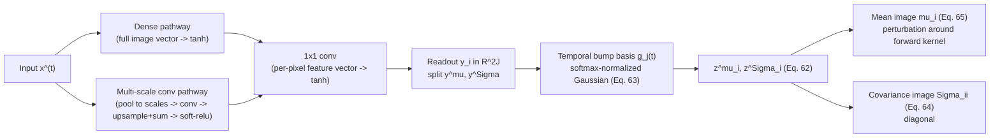

> **Note**: This is a review of **"Deep Unsupervised Learning using Nonequilibrium Thermodynamics"** (Sohl-Dickstein, Weiss, Maheswaranathan & Ganguli; ICML 2015, PMLR v37 pp. 2256-2265; [arXiv:1503.03585](https://arxiv.org/abs/1503.03585), [doi:10.48550/arXiv.1503.03585](https://doi.org/10.48550/arXiv.1503.03585)).
>
> **Code**: [Sohl-Dickstein/Diffusion-Probabilistic-Models](https://github.com/Sohl-Dickstein/Diffusion-Probabilistic-Models) (the original Theano/Blocks reference implementation).
>
> For a thorough Korean walkthrough, see 최민서 (Choi Min-seo)'s **["Deep Unsupervised Learning using Nonequilibrium Thermodynamics" 논문 리뷰](https://outta.tistory.com/109)** (OUTTA AI Tech Blog, 2025-01-03). This post doesn't retread that ground -- see below.
>
> All figures here are original -- the paper's arXiv license (`nonexclusive-distrib/1.0`) is not Creative Commons, and one figure is separately licensed from a third party, so nothing is reproduced from the PDF. Tables and equations are retyped from the source (facts/equations aren't copyrightable expression).
{: .prompt-info }

## Why I Read This Paper

I came to this paper backwards. A few days ago I published [an audit of a PyTorch reimplementation of this exact paper]() -- a repo whose MNIST path trained a 329-million-parameter network down to a loss that turned out to be the analytic likelihood of a two-parameter constant Gaussian, because the forward posterior the paper's entire objective is built from was missing from the code. Fixing that meant reading the 2015 paper closely enough to know exactly which quantity was missing, and why the training sum starts at $t=2$, not $t=1$ -- a different kind of reading than a first-pass summary, and one that turns up things a plain walkthrough skips.

최민서's OUTTA review linked above covers the abstract, algorithm, and experiments end to end, derivations included, so I'm not re-deriving what it already derives well. This review is written from the seat of someone who has tried to run the thing: what a reader intending to *implement* the paper needs and a summary tends to smooth over -- an architectural detail that's a common source of bugs, a footnote that quietly kills half of DDPM's design space, a table cell that disagrees with the text next to it, and a sentence in Appendix C that is classifier guidance five to six years before anyone called it that.

---

## Introduction

The paper opens from an old tension in generative modeling: **tractability versus flexibility**. A model flexible enough to fit any data distribution usually has an intractable normalizing constant $Z$, so $p(x) = \phi(x)/Z$ can't be evaluated, sampled cheaply, or fit by maximum likelihood without an approximation. The introduction surveys the existing menu -- mean field, variational Bayes, contrastive divergence, minimum probability flow, score matching, pseudolikelihood, loopy belief propagation, non-parametric methods -- then proposes a different escape hatch.

The idea in one sentence: build a Markov chain that slowly destroys structure in the data with a simple diffusion kernel until the data distribution has become a known one (isotropic Gaussian, or independent Bernoulli), then **learn to run that chain backwards**. Because the forward chain is restricted to a simple, tractable functional form, the reverse chain can share that same form -- so the generative model becomes, layer by layer, a sequence of regressions.

The paper's stated payoff (§1.1): extreme flexibility, **exact sampling** (no MCMC, no rejection), easy multiplication with other distributions (posteriors like inpainting fall out almost free), and cheap log-likelihood evaluation. Against the contemporaneous VAE line (§1.2) it claims five distinguishing features: a physics/quasi-static/AIS framing rather than variational Bayes; easy distribution multiplication; no separate inference network to train, since the forward process *is* the inference process; **thousands of layers** instead of a handful; and analytic entropy-production bounds per step. Two of those five -- the shared forward/reverse form and the entropy bounds -- matter more in hindsight than the paper's framing suggests, and I return to both below.

There is no boxed Algorithm 1 anywhere -- training and sampling are described entirely in prose, unlike DDPM's two algorithm boxes. A small but real difference in reconstruction work before writing code.

## Context / Related Work

The paper positions itself against three neighborhoods of prior work. First, the **classical intractability toolbox** above -- MCMC-adjacent and pseudo-likelihood methods that approximate the partition function rather than sidestepping it. Second, **wake-sleep and the VAE family** (Kingma & Welling; Gregor, Danihelka, Mnih, Blundell & Wierstra; Rezende, Mohamed & Wierstra), which the paper distinguishes itself from: no separate inference network, since the forward diffusion process plays that role by construction, and the framing is statistical physics (quasi-static processes, Jarzynski's equality, annealed importance sampling) rather than variational Bayes. Third, a **physics lineage**: Jarzynski's equality and AIS, Burda et al.'s reverse-AIS estimator, Langevin dynamics and the Fokker-Planck equation, and the Kolmogorov forward/backward equations (Feller, 1949) that justify why a reverse chain can share the forward chain's functional form in the small-step limit.

Worth stating plainly, since this paper is now read almost exclusively through its successor: **this is not a review of DDPM**, which postdates it by five years and is never mentioned here. But because much of what follows will sound familiar to DDPM readers, I flag the connection at each relevant point rather than deferring it all to the end.

---

## Method

### 1. Forward and reverse trajectories, in two flavors

Superscripts index diffusion timesteps: $x^{(0)}$ is a data point, $x^{(T)}$ is pure noise, and $q$/$p$ denote the forward and reverse processes. The forward step (Eq. 2) applies a fixed kernel $T_\pi(x^{(t)} \mid x^{(t-1)}; \beta_t)$ at rate $\beta_t$, chosen so the kernel's own invariant distribution $\pi$ (Eq. 1) is the chain's endpoint. The paper works out two instantiations, side by side in Table App.1:

| | Gaussian | Binomial |
|---|---|---|
| Base distribution $\pi(x^{(T)})$ | $\mathcal{N}(x^{(T)}; 0, I)$ | $B(x^{(T)}; 0.5)$ |
| Forward kernel $q(x^{(t)}\mid x^{(t-1)})$ | $\mathcal{N}\!\left(x^{(t)}; x^{(t-1)}\sqrt{1-\beta_t},\, I\beta_t\right)$ | $B\!\left(x^{(t)}; x^{(t-1)}(1-\beta_t) + 0.5\beta_t\right)$ |
| Reverse kernel $p(x^{(t-1)}\mid x^{(t)})$ | $\mathcal{N}\!\left(x^{(t-1)}; f_\mu(x^{(t)}, t),\, f_\Sigma(x^{(t)}, t)\right)$ | $B\!\left(x^{(t-1)}; f_b(x^{(t)}, t)\right)$ |
| Training targets | $f_\mu,\, f_\Sigma,\,$ and $\beta_{1\ldots T}$ | $f_b$ only |

_Table App.1 (partial, retyped): the paper's own cheat-sheet, between Appendices B and C. Row order and cell content are exact; I've kept only the rows relevant here._

The Gaussian forward kernel here is byte-for-byte what DDPM later calls its forward process. What is *not* in this paper is the closed-form marginal $q(x^{(t)}\mid x^{(0)})$ DDPM writes explicitly in terms of $\bar\alpha_t = \prod_{s\le t}(1-\beta_s)$ -- there is no $\bar\alpha$ notation anywhere here. The paper only asserts that the relevant entropies and KLs "can be analytically computed given $x^{(0)}$ and $x^{(t)}$" (end of Appendix B.4); DDPM's contribution is making that closed form explicit and reparameterizing on top of it.

Look at the **Training targets** row. For the Gaussian case, the schedule $\beta_{1\ldots T}$ is itself a training target -- learned, not fixed. I return to this in Section 3, the row this paper most directly disagrees with itself over.

For the binomial case $\beta$ cannot be learned this way at all: "the discrete state space makes gradient ascent with frozen noise impossible" (§2.4.1), so it is set analytically to erase a constant fraction $1/T$ of signal per step, $\beta_t = (T-t+1)^{-1}$.

Sampling (§2.2, Eq. 5) draws $x^{(T)} \sim \pi$ and runs the learned reverse kernel down to $x^{(0)}$, $T$ sequential network evaluations, no shortcuts. The paper is explicit these are **true samples**, not the final Gaussian's posterior mean -- a distinction its Figure App.1 caption calls out for MNIST.

### 2. From an intractable integral to a trainable bound

The model likelihood (Eq. 6) is $p(x^{(0)}) = \int dx^{(1\ldots T)}\, p(x^{(0\ldots T)})$, an integral the paper calls naively intractable. The move (Eqs. 7-9) is the standard AIS trick: multiply and divide by the forward conditional $q(x^{(1\ldots T)}\mid x^{(0)})$, turning the integral into an importance-weighted expectation over forward-process samples,

$$
p(x^{(0)}) = \int dx^{(1\ldots T)}\; q(x^{(1\ldots T)}\mid x^{(0)}) \cdot p(x^{(T)}) \prod_{t=1}^{T} \frac{p(x^{(t-1)}\mid x^{(t)})}{q(x^{(t)}\mid x^{(t-1)})}. \tag{9}
$$

The training objective is the expected log-likelihood over the data distribution,

$$
L = \int dx^{(0)}\, q(x^{(0)}) \log p(x^{(0)}), \tag{10}
$$

with Eq. 9 substituted inside the log (Eq. 11, not reproduced here). Jensen's inequality then moves the log inside the expectation over the *whole trajectory* rather than just $x^{(0)}$, which can only decrease the bound:

$$
L \;\ge\; \int dx^{(0\ldots T)}\, q(x^{(0\ldots T)}) \, \log\!\left[\, p(x^{(T)}) \prod_{t=1}^{T} \frac{p(x^{(t-1)}\mid x^{(t)})}{q(x^{(t)}\mid x^{(t-1)})} \,\right] \;=:\; K, \tag{12,13}
$$

so $L \ge K$, and Appendix B reduces $K$ (via the entropy identities in B.1, the edge-effect trick in B.2 below, and the Bayes-rule swap in B.3-B.4) to the form the paper actually trains against:

$$
K = -\sum_{t=2}^{T} \int dx^{(0)}\,dx^{(t)}\; q\!\left(x^{(0)}, x^{(t)}\right) \, D_{\mathrm{KL}}\!\Big(\, q(x^{(t-1)}\mid x^{(t)}, x^{(0)}) \;\Big\|\; p(x^{(t-1)}\mid x^{(t)}) \,\Big) \; + \; H_q\!\left(X^{(T)} \mid X^{(0)}\right) - H_q\!\left(X^{(1)} \mid X^{(0)}\right) - H_p\!\left(X^{(T)}\right). \tag{14}
$$

Read that KL term slowly, because it is the whole paper: it matches the learned reverse kernel $p(x^{(t-1)}\mid x^{(t)})$ to the **forward posterior conditioned on the clean data**, $q(x^{(t-1)}\mid x^{(t)}, x^{(0)})$ -- exactly the object DDPM calls $L_{t-1}$ five years later. DDPM's addition is the closed form of that posterior (via $\bar\alpha_t$) and an $\epsilon$-reparameterization on top, not the objective itself.

Two details worth carrying into an implementation. First, **why the sum starts at $t=2$, not $t=1$**: Appendix B.2 handles the $t=0$ edge case by *defining* the final reverse step to equal the forward step run backwards,

$$
p(x^{(0)} \mid x^{(1)}) \;=\; q(x^{(1)} \mid x^{(0)}) \, \frac{\pi(x^{(0)})}{\pi(x^{(1)})} \;=\; T_\pi\!\left(x^{(0)} \mid x^{(1)}; \beta_1\right), \tag{44}
$$

removing that step from the sum entirely -- it's a fixed identity, not learned -- which is why Eq. 14's KL sum runs $t = 2 \ldots T$. Second, the bound is tight ($L = K$, equality in Eq. 13) only in the **quasi-static limit** of infinitesimal $\beta$, where forward and reverse trajectory distributions coincide. Every reported number is a *lower bound*, and the smaller $\beta$ can be made (at the cost of a longer trajectory), the tighter it gets.

### 3. Setting the diffusion rate $\beta_t$ -- the single most under-quoted footnote in this paper

Table App.1's "Training targets" row says the Gaussian case learns $\beta_{1\ldots T}$. Section 2.4.1's text is more careful: "we **learn** the forward diffusion schedule $\beta_{2\ldots T}$ by gradient ascent on $K$. The variance $\beta_1$ of the first step is fixed to a small constant to prevent overfitting." That's already a small inconsistency -- the table's blanket $\beta_{1\ldots T}$ vs. the text's $\beta_{2\ldots T}$ with $\beta_1$ held out -- the first of three collected at the end of this section.

But the sentence that matters most is a footnote on the word "learn" in that same paragraph, easy to skip past:

> "Recent experiments suggest that it is just as effective to instead use the same fixed $\beta_t$ schedule as for binomial diffusion."

The paper spends a page justifying gradient ascent on $\beta$ with the reparameterization trick and "frozen noise," then, in a footnote, says it probably didn't need to. This is the direct textual ancestor of DDPM's decision, five years later, to fix $\beta_t$ to a hand-set schedule and drop it from the learned parameters entirely -- DDPM states that design choice without citing this footnote, but the idea is here first.

That gives a natural comparison: the paper's own analytic schedule, apparently just as good for Gaussian diffusion per the footnote, is $\beta_t = (T-t+1)^{-1}$, i.e. `1/linspace(T, 2, T)`. DDPM's schedule is linear from $10^{-4}$ to $0.02$. Both are "fixed" in the sense the footnote endorses, but they look nothing alike:

```python
"""Compare the 2015 paper's schedule against DDPM's (2020) linear schedule.
Self-contained: run with numpy installed."""
import numpy as np


def sohl_dickstein_2015_schedule(T: int) -> np.ndarray:
    """beta_t = 1 / linspace(T, 2, T), Sec. 2.4.1 (beta_t = (T-t+1)^-1)."""
    return 1.0 / np.linspace(T, 2, T)
# end def


def ddpm_2020_schedule(T: int, beta_start: float = 1e-4, beta_end: float = 0.02) -> np.ndarray:
    """beta_t linearly spaced, Ho, Jain & Abbeel 2020 (DDPM), Sec. 4."""
    return np.linspace(beta_start, beta_end, T)
# end def


def alpha_bar(beta_t: np.ndarray) -> np.ndarray:
    """Cumulative signal-retention product bar-alpha_t = prod_{s=1..t}(1 - beta_s)."""
    return np.cumprod(1.0 - beta_t)
# end def


T = 1000
beta_2015, beta_ddpm = sohl_dickstein_2015_schedule(T), ddpm_2020_schedule(T)
print(f"2015: beta_1={beta_2015[0]:.4f} beta_T={beta_2015[-1]:.2f} alpha_bar_T={alpha_bar(beta_2015)[-1]:.2e}")
print(f"DDPM: beta_1={beta_ddpm[0]:.4f} beta_T={beta_ddpm[-1]:.2f} alpha_bar_T={alpha_bar(beta_ddpm)[-1]:.2e}")
# 2015: beta_1=0.0010 beta_T=0.50 alpha_bar_T=9.94e-04
# DDPM: beta_1=0.0001 beta_T=0.02 alpha_bar_T=4.04e-05
```

_This is the schedule math behind this post's cover image; the full plot (matplotlib, two stacked panels rather than one dual-axis panel, since $\beta_t$ and $\sqrt{\bar\alpha_t}$ live on incompatible scales) adds only plotting calls on top of the arrays above._


_Same Gaussian forward kernel, two very different $\beta_t$ schedules (original chart, computed and rendered for this post). The 2015 schedule ($\beta_1{\approx}0.001 \to \beta_{1000}{\approx}0.5$) holds more signal for the first 800-900 steps than DDPM's linear schedule does, then collapses almost all of it in the last ~1% of steps; DDPM's schedule bleeds signal away more evenly across the whole trajectory. Both reach $\bar\alpha_T$ near $10^{-3}$-$10^{-5}$, i.e. essentially no signal left by $t=T$, but by very different routes._

Worth being precise here: the companion audit post reports a third number easy to conflate with either schedule above, $\bar\alpha_T \approx 5.5\times10^{-14}$ with 79% of trained timesteps at $\sqrt{\bar\alpha_t} < 0.1$. That belongs to **neither** schedule above -- it's what the audited repo's pre-fix code actually ran, `beta = linspace(0.01, 0.05, 1000)`, steeper at both ends than DDPM's own schedule and unrelated to this paper's analytic form. Exactly the kind of mix-up worth checking directly against the source, not the first schedule-shaped array you find in someone's fork.

### 4. The architecture: two pathways, and time is not an input

Appendix D.2.1 describes one shared architecture for all four image datasets (MNIST, CIFAR-10, dead leaves, bark), built from two parallel pathways feeding a shared readout:


_Redrawn from the paper's Appendix D.2.1 description of Figure D.1 (original diagram; the paper's own figure is not reproduced here). The paper states the pathway rule explicitly only for two of its four image datasets: for **CIFAR-10** the dense pathway ran **in parallel with** the multi-scale convolutional pathway; for **MNIST** the dense pathway was used **to the exclusion of** the convolutional pathway (so the published MNIST model is effectively a dense/MLP model). The Figure D.1 caption does not state the pathway choice for bark or dead leaves._

Two things matter for anyone implementing this from scratch. First, §2.2 flatly states "For all results in this paper, multi-layer perceptrons are used to define these functions" -- directly contradicting the convolutional, multi-scale architecture Appendix D.2.1 spends a full page describing. Treat §2.2 as the paper's own loose overstatement; D.2.1 is the specific, correct source. Internal inconsistency #2 of the three collected below.

Second, and this is the detail most likely to trip up a reimplementation: **the network itself is not a function of $t$.** At each timestep the conv/dense stack runs on $x^{(t)}$ alone and emits a per-pixel coefficient vector $y_i \in \mathbb{R}^{2J}$ -- no timestep embedding enters the network. Time enters only at readout, as a fixed, softmax-normalized Gaussian "bump" basis:

$$
z^{\mu}_i = \sum_{j=1}^{J} y^{\mu}_{ij}\, g_j(t), \qquad g_j(t) = \frac{\exp\!\big(-(t-\tau_j)^2 / 2w^2\big)}{\sum_{k=1}^{J} \exp\!\big(-(t-\tau_k)^2 / 2w^2\big)}, \tag{62,63}
$$

with bump centers $\tau_j$ spread across $(0,T)$ and shared width $w$. This is a learned-coefficient, fixed-basis interpolation across timesteps -- the opposite of DDPM's approach, which shares one network across all $t$ and injects a sinusoidal position embedding into every residual block. A reimplementation that embeds $t$ as a network input, DDPM-style, builds the wrong architecture. Neither $J$ nor $w$ is ever given a numeric value in the paper -- treat both as unspecified.

The mean and diagonal covariance outputs are parameterized as small perturbations around the forward kernel itself, $\Sigma_{ii} = \sigma\big(z^\Sigma_i + \sigma^{-1}(\beta_t)\big)$ and $\mu_i = (x_i - z^\mu_i)(1-\Sigma_{ii}) + z^\mu_i$ (Eqs. 64-65) -- a network outputting all zeros reproduces the forward kernel exactly, so the network's job is only to predict a correction.

### 5. Two ideas that resurfaced later, under different names

Both rediscovered under new names well after 2015, and this paper rarely gets cited for either.

**The entropy bound.** Section 2.6 (Eq. 24) gives an analytic two-sided bound on each reverse step's conditional entropy, purely in terms of the forward process:

$$
H_q(X^{(t)}\mid X^{(t-1)}) + H_q(X^{(t-1)}\mid X^{(0)}) - H_q(X^{(t)}\mid X^{(0)}) \;\le\; H_q(X^{(t-1)}\mid X^{(t)}) \;\le\; H_q(X^{(t)}\mid X^{(t-1)}). \tag{24}
$$

DDPM cites exactly this result to justify its two fixed choices of reverse variance, $\sigma_t^2 \in \{\beta_t, \tilde\beta_t\}$, as "the two extreme choices corresponding to upper and lower bounds on reverse process entropy" -- one of the few places DDPM cites this paper for a specific technical result rather than as general prior art.

**Classifier guidance, six years early.** Appendix C derives sampling from a *perturbed* model $\tilde p(x^{(0)}) \propto p(x^{(0)})\, r(x^{(0)})$ -- multiplying the learned distribution by another function $r$, e.g. a delta function on observed pixels for inpainting, or a likelihood term for denoising. Table App.1's perturbed Gaussian reverse kernel, derived at Eq. 61, is:

$$
\tilde p(x^{(t-1)}\mid x^{(t)}) = \mathcal{N}\!\Big(x^{(t-1)};\; f_\mu(x^{(t)},t) + f_\Sigma(x^{(t)},t)\, \nabla \log r(x^{(t-1)})\Big|_{x^{(t-1)} = f_\mu(x^{(t)},t)},\;\; f_\Sigma(x^{(t)},t)\Big).
$$

Strip the notation and this says: **shift the reverse-step mean by the covariance times the gradient of $\log r$.** That is, structurally, classifier guidance -- the technique commonly cited to Dhariwal & Nichol's 2021 "Diffusion Models Beat GANs," where $r$ is a classifier's class-conditional likelihood and the same $\Sigma \cdot \nabla \log r$ shift steers sampling toward a target class. This paper derives the general mechanism in 2015, six years before the name existed, for multiplying a diffusion model by *any* smooth function -- inpainting and denoising are just the two instances its experiments happen to use.

## Experiments / Results

### Table 1: the log-likelihood lower bound, six datasets

| Dataset | K | K − L_null |
|---|---:|---:|
| Swiss Roll | 2.35 bits | 6.45 bits |
| Binary Heartbeat | −2.414 bits/seq. | 12.024 bits/seq. |
| Bark | −0.55 bits/pixel | 1.5 bits/pixel |
| Dead Leaves | 1.489 bits/pixel | 3.536 bits/pixel |
| **CIFAR-10** | **5.4 ± 0.2 bits/pixel** | **11.5 ± 0.2 bits/pixel** |
| MNIST | see Table 2 | see Table 2 |

_Table 1 (numbers from the paper, Table 1; see Eq. 12 in the paper for the definition of $K$). $L_{\mathrm{null}}$ is the log-likelihood of the base distribution $\pi(x^{(0)})$ scored on the same data -- the right column is the improvement over that null model. All datasets except Binary Heartbeat were rescaled to unit variance before computing log-likelihood, and CIFAR-10 is the only row carrying an error bar (from the released reference implementation's standard-error report). CIFAR-10 is bold as the paper's main quantitative comparison point for natural images._

Two caveats. These are differential-entropy-style bounds on unit-variance-rescaled continuous data, so **they are not on the same scale as modern bits/dim figures** on 8-bit discrete pixels (DDPM's $\le 3.75$ bits/dim on CIFAR-10) -- don't compare directly.

And footnote 3, on the CIFAR-10 row: "An earlier version of this paper reported higher log likelihood bounds on CIFAR-10. These were the result of the model learning the 8-bit quantization of pixel values... The log likelihood bounds reported here are instead for data that has been pre-processed by adding uniform noise to remove pixel quantization." The superseded numbers -- **11.895 / 18.037 bits/pixel** -- survive only as a commented-out LaTeX line; they were the model exploiting a measurement artifact, caught and retracted before this version. **Do not cite 11.895/18.037 as a result of this paper** -- 5.4 ± 0.2 above is the corrected, published figure.

### Table 2: MNIST and dead leaves against other models

| Model | Log Likelihood |
|---|---:|
| **Dead Leaves** | |
| MCGSM | 1.244 bits/pixel |
| **Diffusion** | **1.489 bits/pixel** |
| **MNIST** | |
| Stacked CAE | 174 ± 2.3 bits |
| DBN | 199 ± 2.9 bits |
| Deep GSN | 309 ± 1.6 bits |
| Diffusion | 317 ± 2.7 bits |
| Adversarial net | 325 ± 2.9 bits |
| Perfect model | 349 ± 3.3 bits |

_Table 2 (numbers from the paper, Table 2). Dead leaves uses identical train/test data to Theis et al. 2012, so the MCGSM row is a like-for-like comparison and the paper's clearest state-of-the-art claim (bold: 1.489 vs. 1.244 bits/pixel). MNIST numbers are Parzen-window estimates, computed with the code released alongside Goodfellow et al. 2014's GAN paper, converted to bits._

The MNIST block deserves a second look: the diffusion model is *not* the best row, beating Deep GSN but sitting below "Adversarial net" (317 vs. 325 bits). More interesting is the row below that: **"Perfect model," 349 ± 3.3 bits, is not a model at all** -- it's the same Parzen-window estimator applied directly to samples *from the training data itself*, so it measures the ceiling of the evaluation metric, not of any generative model. The paper reports this without comment, but it's a tacit admission that Parzen-window log-likelihood is a weak, noisy metric: even ground-truth data doesn't score much above a working model (349 vs. 317), which says the metric has limited resolving power at this scale.

### Three places where the paper disagrees with itself

Working through the text, tables, and appendices side by side turns up three internal inconsistencies worth flagging for anyone treating the paper as a spec.

1. **The $\beta$-learning target.** Already noted above: Table App.1 lists the Gaussian training target as $\beta_{1\ldots T}$; §2.4.1's prose is more specific and says only $\beta_{2\ldots T}$ is learned, with $\beta_1$ fixed "to prevent overfitting." The prose is the more authoritative statement.
2. **"Multi-layer perceptrons," except when they're convolutions.** §2.2 says all reported results use MLPs to define $f_\mu$/$f_\Sigma$/$f_b$; Appendix D.2.1 describes a genuinely convolutional, multi-scale architecture for every image dataset. D.2.1 wins -- it's the specific, detailed description; §2.2 is the paper's own loose summary.
3. **The binomial base rate: 0.5 in the table, 0.2 in the appendix -- and the arithmetic proves which one actually ran.** Table App.1 states the binomial base distribution is $B(x^{(T)}; 0.5)$. Appendix D.1.2, describing the binary-heartbeat experiment, initializes at $p(x_i^{(T)}=1) = 0.2$, "the same mean activity as the data." Both can't be what ran -- Table 1's own numbers settle it. Table 1 reports, for Binary Heartbeat, $K = -2.414$ and $K - L_{\mathrm{null}} = 12.024$ bits/sequence, so $L_{\mathrm{null}} = -14.438$ bits/sequence. The sequences are 20 bits long, and $H(0.2) = -0.2\log_2 0.2 - 0.8\log_2 0.8 = 0.72193$ bits, so twenty independent bits at that rate cost

$$
20 \times H(0.2) = 20 \times 0.72193 = 14.4386 \text{ bits} \;\approx\; -L_{\mathrm{null}} = 14.438.
$$

An exact match to four significant figures. Twenty independent Bernoulli($0.5$) bits would instead cost exactly 20 bits, not 14.4386 -- the arithmetic rules that out. **0.2 is what actually ran**; Table App.1's "0.5" is the error. (The paper's own prose description of this initialization, "with identical mean activation rate to the training data," is present in the LaTeX source but commented out of the published PDF -- the appendix's 0.2 is the only place the correct value survives in print.)

### The two conditional demonstrations

The paper exercises the Eq. 61 machinery twice. On CIFAR-10 (Figure 3), holdout images corrupted with Gaussian noise at SNR = 1 are run through the perturbed reverse chain to produce a **sample** from the posterior over denoised images -- an actual draw, not a MAP estimate or conditional mean. On bark textures (Figure 5, Lazebnik et al. 2005), a 100×100 center region replaced with isotropic Gaussian noise is inpainted the same way, $r(x^{(0)})$ a delta function on known pixels and a constant on missing ones -- the exact-multiplication case §2.5.3 covers cleanly. Neither figure is reproduced here for the licensing reasons noted at the top.

---

## Conclusion & Insight

This paper reads, nine years later, less like "one interesting idea" and more like a blueprint built out piece by piece by other people -- the forward/reverse Gaussian process, the per-step KL objective, the entropy bounds, and the guidance mechanism are all here in 2015 form, years before each became a headline result under someone else's name.

### Strengths

- **The core argument is genuinely elegant.** Restricting the forward process to a simple form, and arguing the reverse can share that form (Feller's small-step result), sidesteps the "train a good inference network" problem VAEs wrestle with -- by construction, not regularization.
- **The math is more complete than it gets credit for.** The variational bound (Eqs. 10-14), the entropy bounds (Eq. 24), and the guidance mechanism (Eq. 61) are all derived rigorously in the appendices, not asserted.
- **It's honest about being a lower bound.** Every reported number is framed as $K \le L$, tight only in the quasi-static limit -- no attempt to present $K$ as the likelihood.
- **The retraction (footnote 3) is a good look, not a bad one.** Catching and correcting a measurement artifact before publication, and leaving a footnote explaining exactly what happened, is rigor a lot of papers skip.

### Limitations

- **No dedicated limitations section, no algorithm box.** The Conclusion is one paragraph with no critique of the method; every limitation here was assembled from scattered caveats, not a place the authors put together themselves.
- **Cost scales linearly with trajectory length**, and the paper's own flexibility argument (smaller $\beta$ needs a longer trajectory) works directly against sampling speed -- 1000 sequential network evaluations for the image experiments, no shortcut available (this predates DDIM-style step-skipping by five years).
- **The MNIST evaluation metric is weak**, and the paper's own "Perfect model" row proves it: ground-truth data scores only marginally above a working model, so the metric has limited power to separate good models from great ones.
- **Key hyperparameters are simply missing.** $J$ and $w$ of the bump basis are never given numeric values; nor are parameter counts, learning rates, batch sizes, or wall-clock time for any image experiment. A from-scratch reproduction has to guess.
- **Internal inconsistencies**, cataloged above, mean the paper can't quite be read as an unambiguous spec -- Table App.1 and the prose disagree twice, and one number (0.2 vs. 0.5) is only resolvable by doing the arithmetic yourself.

### Open Questions / My Take

The implementer's-seat framing of this review exists because of [the companion audit]() mentioned at the top, and it's worth being honest about the connection: the reimplementation audited there does **not** currently produce recognizable MNIST digits from pure noise, even after fixing the missing-forward-posterior defect this paper's Eq. 14 is built around. The denoiser genuinely denoises -- a reconstruction test recovers real digit structure from corrupted inputs -- but full unconditional generation still comes out as speckle. That gap isn't evidence against anything in this paper; if anything, rereading it closely surfaced *more* places a from-scratch implementation can silently diverge than expected -- the bump-basis time-conditioning, the exact $\beta$ schedule, the two-pathway architecture, the $\beta_1$ edge case -- each a place where "close enough" code trains without erroring and still doesn't do what the math says it should.

What I'd want to see next: a from-scratch, paper-faithful (not DDPM-flavored) reimplementation reporting the same *unnormalized*, unit-variance-rescaled bits/pixel numbers this paper reports, so the 5.4 ± 0.2 CIFAR-10 and 1.489 dead-leaves figures above are checkable against a modern run rather than only against the paper's own 2015-era Theano code. I'm not aware of anyone who has done that.

## Resources

- **Companion post** -- [the implementer's audit: what a broken reimplementation of this exact paper looked like from the inside]()
- **Paper** -- Sohl-Dickstein, Weiss, Maheswaranathan & Ganguli, *Deep Unsupervised Learning using Nonequilibrium Thermodynamics*, ICML 2015 ([arXiv:1503.03585](https://arxiv.org/abs/1503.03585))
- **Reference implementation** -- [Sohl-Dickstein/Diffusion-Probabilistic-Models](https://github.com/Sohl-Dickstein/Diffusion-Probabilistic-Models) (Theano/Blocks)
- **Korean review** -- 최민서, ["Deep Unsupervised Learning using Nonequilibrium Thermodynamics" 논문 리뷰](https://outta.tistory.com/109), OUTTA AI Tech Blog, 2025-01-03
- **Successor** -- Ho, Jain & Abbeel, *Denoising Diffusion Probabilistic Models*, NeurIPS 2020 ([arXiv:2006.11239](https://arxiv.org/abs/2006.11239)) -- keeps this paper's forward kernel and variational bound; fixes $\beta$ (footnote 2 said that was fine); replaces the learned reverse variance with two fixed choices justified by this paper's Eq. 24; reparameterizes the mean as noise prediction
- **Related** -- Dhariwal & Nichol, *Diffusion Models Beat GANs on Image Synthesis*, NeurIPS 2021 ([arXiv:2105.05233](https://arxiv.org/abs/2105.05233)) -- the paper usually credited for classifier guidance, structurally identical to this paper's Eq. 61
