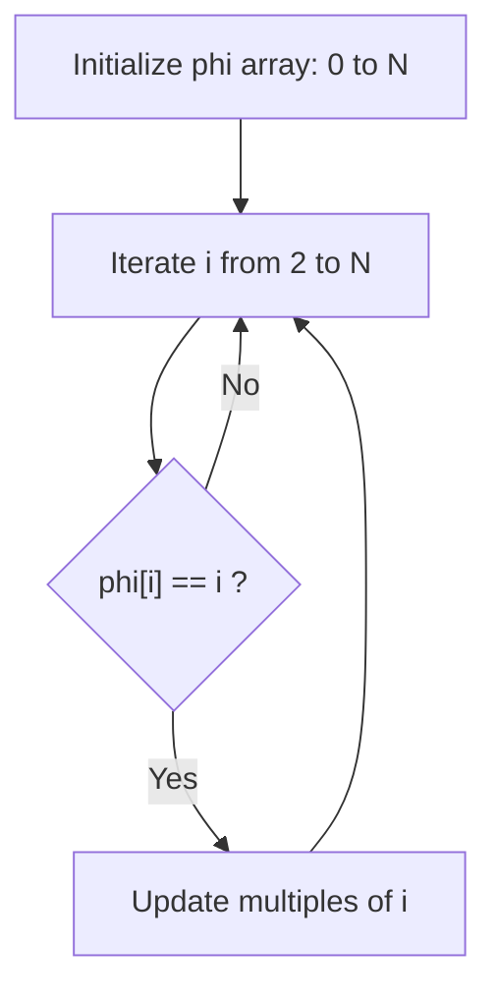
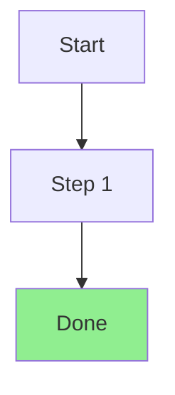

# 알고리즘 풀이 글 작성 가이드 (LeetCode / BOJ)

LeetCode·백준(BOJ) 문제 풀이 글의 **내용 구조와 스타일**을 다루는 작성자용 문서입니다. 파일명·front matter 같은 공통 규칙은 [../guide/03-writing-posts.md](../guide/03-writing-posts.md)에 정의되어 있으니 여기서는 반복하지 않고, 알고리즘 글 특유의 **섹션 구성·제목 규칙·코드 스타일·검증 절차**에 집중합니다.

> 이 문서가 속한 `docs/blog_post/`와 `docs/guide/`는 [_config.yml](../../_config.yml)의 `exclude`에 포함되어 Jekyll 빌드에서 제외됩니다. 즉 게시되지 않는 **작성자용 내부 문서**입니다.

> **언어 정책**: 모든 **블로그 글**([_posts/*.md](../../_posts/))은 **영어**로 씁니다. 작성자용 문서(`docs/guide`, `docs/blog_post`)만 한국어입니다. 따라서 알고리즘 글의 본문·주석·표는 전부 영어입니다.

## 섹션 구조 (핵심 흐름 + 문제 유형별 가감)

알고리즘 글은 아래 **핵심 흐름**을 공통으로 따르되, 섹션의 가짓수·강조점은 **문제 유형에 맞춰 가감**합니다. **고정 7단계가 아닙니다** — 모든 문제에 억지로 "실패한 접근"을 끼워 넣지 않습니다. 모든 본문 헤더는 `## `(H2)에서 시작하고, 단일 `#`은 쓰지 않으며, 섹션 사이는 `---`(수평선)로 구분합니다.

| 섹션 (H2) | 필수? | 목적 |
| --- | --- | --- |
| `## Problem` | 필수 | 문제 요약 + 원문 링크(`>` 인용) + 샘플 입출력 |
| `## Initial Thought (Failed)` | **유형별** | 단순 접근이 **왜 실패하는지**(시간 초과 등). *최적화형*에선 사실상 필수, *구현·애드혹형*에선 생략 |
| `## Key Insight` | 필수 | 풀이를 가능케 한 핵심 관찰(한두 문장) |
| `## Alternative Approaches` | **선택** | 여러 풀이(`brute → 개선 → 최적`)를 비교. 접근이 뚜렷이 나뉘면 LeetCode식 `## Approach 1` / `## Approach 2`로 **분리** (각 접근 복잡도 비교 — 풀이 글의 강한 관행) |
| `## Step-by-Step Analysis` | 권장 | 작은 예제로 동작 추적 (` ```mermaid ``` ` 다이어그램) |
| `## Why It Works (Correctness)` | **선택** | 그리디·비자명 알고리즘의 **정당성/불변식 논증** (cp-algorithms·USACO는 Proof를 별도 축으로 둠) |
| `## Solution` | 필수 | 실제 코드 (` ```python ``` ` 블록) |
| `## Complexity` | 필수 | 시간·공간 복잡도(Big-O)와 근거 |
| `## Edge Cases / Pitfalls` | **선택** | 빈 입력·중복·오버플로·경계 등 코드가 틀리기 쉬운 지점 |
| `## Key Takeaways` | 선택 | 배운 점 요약 표(블로그용 — 에디토리얼 정전엔 없지만 블로그엔 유용) |

### 문제 유형별 권장 조합

- **최적화형**(DP·수학·자료구조 — 느린 풀이 → 최적): `Problem → Initial Thought (Failed) → Key Insight → (Alternative Approaches) → Step-by-Step → Solution → Complexity`. *기존 7단계가 여기에 해당합니다.*
- **구현·시뮬레이션·애드혹**([BOJ 1018](../../_posts/2025-09-17-algo-boj-1018-체스판-다시-칠하기.md), [격자판 위험구역](../../_posts/2026-02-18-algo-practice-grid-danger-zone-detection.md) — 완전탐색이 곧 정답): `Initial Thought (Failed)`를 **생략**하고 `## Approach`(또는 `## Idea`)로 엽니다. 억지 "실패" 프레임을 만들지 않습니다.
- **구성적·그리디**(정당성이 핵심): `## Why It Works (Correctness)`를 넣어 교환 논증/불변식을 답니다.

> `## Step-by-Step` 헤더는 문제에 맞춰 구체화해도 됩니다(예: [BOJ 1920](../../_posts/2024-02-04-algo-boj-1920-수-찾기.md)의 `` ## Step-by-Step: Finding `5` ``). 핵심은 **흐름과 각 섹션의 역할**이며, 순서는 위 권장 조합을 따릅니다.

각 섹션의 작성 요령은 다음과 같습니다.

- **Problem**: 문제를 1~2문단으로 요약하고, 맨 위에 `>` 인용으로 원문 링크를 둡니다(원문 전문을 복붙하지 않습니다). 제약($N \le 50{,}000$ 등)을 명시하면 다음 섹션에서 연산량 계산이 자연스럽습니다. 샘플 입출력은 펜스 코드블록(언어 미지정)에 그대로 붙여 넣습니다.
- **Initial Thought (Failed)** *(최적화형)*: 단순 완전 탐색을 먼저 제시하고, 제약을 대입해 **구체적 연산량**($25 \times 10^8$ 등)을 계산한 뒤 "Time Limit Exceeded"로 귀결시킵니다. 독자가 왜 더 나은 풀이가 필요한지 납득하게 만드는 단계입니다. **구현·애드혹형**(완전탐색이 정답)에서는 이 섹션을 생략하고 `## Approach`로 엽니다.
- **Key Insight**: 본론의 전환점. 핵심 아이디어 한 가지만 짚습니다. 정의가 필요하면 `>` 인용으로 간단히 설명합니다.
- **Alternative Approaches** *(선택)*: 의미 있는 여러 풀이가 있으면 비교합니다(예: `O(N^2) → O(N log N) → O(N)`). 접근이 뚜렷이 나뉘면 LeetCode 에디토리얼처럼 `## Approach 1` / `## Approach 2`로 **각각 섹션**을 두고, 가벼우면 한 섹션에 묶어도 됩니다.
- **Step-by-Step Analysis**: 작은 입력 하나를 골라 상태 변화를 추적합니다. mermaid `flowchart TD`로 단계 흐름을 그리면 좋습니다(아래 [다이어그램](#다이어그램과-수식) 참고).
- **Why It Works (Correctness)** *(선택)*: 그리디·구성적 풀이는 "왜 이게 최적인가"를 교환 논증·불변식으로 답니다. `Key Insight`(한두 문장)로는 부족한 문제에 둡니다.
- **Solution**: 바로 다음 절의 코드 스타일을 따릅니다.
- **Complexity**: 시간/공간을 각각 한 줄로 적고, 그 아래 들여쓰기로 근거를 답니다.
- **Edge Cases / Pitfalls** *(선택)*: 빈 입력·중복·`int` 오버플로·경계($N$ 최소·최대) 등 주의점을 명시합니다.
- **Key Takeaways**: `| Point | Description |` 2열 표로 3개 내외의 교훈을 정리합니다.

---

## 제목 규칙

front matter `title`은 **영어**로, 출처별로 아래 형식을 지킵니다.

| 출처 | 제목 형식 | 예시 |
| --- | --- | --- |
| LeetCode | `[LeetCode] <num>. <English name>` | `[LeetCode] 3. Longest Substring Without Repeating Characters` |
| BOJ | `[BOJ] <num>. <English name>` | `[BOJ] 23832. Coprime Graph` |

- 백준의 한국어 문제명은 **영어로 번역**해 제목에 씁니다(예: `서로소 그래프` → `Coprime Graph`, `수 찾기` → `Finding a Number`).
- 단, **본문 `## Problem`의 링크는 acmicpc.net 원문**으로 연결합니다. 번역 제목 + 원문 링크 조합입니다.

```markdown
## Problem

> [BOJ 23832. Coprime Graph](https://www.acmicpc.net/problem/23832)
```

LeetCode도 동일하게 영어 제목 + leetcode.com 원문 링크입니다.

```markdown
## Problem

> [LeetCode 3. Longest Substring Without Repeating Characters](https://leetcode.com/problems/longest-substring-without-repeating-characters/)
```

> **파일명 슬러그**는 제목과 별개입니다. URL 안정성을 위해 기존 한글 슬러그를 그대로 둬도 됩니다(예: `2024-10-10-algo-boj-23832-서로소-그래프.md`). 새 글은 영문 슬러그가 URL상 더 안전합니다. 자세한 파일명·permalink 규칙은 [../guide/03-writing-posts.md](../guide/03-writing-posts.md#파일명-규칙)를 참고하세요.

`categories`/`tags`/`image` 등 나머지 front matter는 [../guide/03-writing-posts.md](../guide/03-writing-posts.md#front-matter-스키마)를 따릅니다. 알고리즘 글의 관례만 짚으면:

- `categories`: LeetCode는 `['Algorithm', 'LeetCode']`, BOJ는 `['Algorithm', 'Baekjoon']`.
- `tags`: 기법(`Sliding Window`, `Binary Search`, `Number Theory` 등)을 넣고, 난이도는 출처에 맞게 — **LeetCode**는 `Easy`/`Medium`/`Hard`, **BOJ**는 solved.ac 티어(`Bronze`~`Diamond`) 또는 생략.
- `image.path`: 공용 대표 이미지 재사용 — LeetCode `assets/img/posts/algo/leetcode_new.png`, BOJ `assets/img/posts/algo/baekjoon_new.png` (맨 앞 `/` 없음).

---

## 코드 스타일

- **모든 주석은 영어**로 작성합니다.
- LeetCode는 `class Solution:` 시그니처를 그대로 쓰고, BOJ는 `import sys` + `input = sys.stdin.readline` 패턴으로 빠른 입력을 사용합니다.
- 이 블로그는 블록 종료 지점에 `# end for` / `# end if` / `# end def`(필요 시 `# end while`) **하우스 마커**를 답니다.

> **하우스 마커에 대한 솔직한 주의**: `# end for` 같은 블록 종료 주석은 **표준이 아닙니다**. [PEP 8](https://peps.python.org/pep-0008/)·[Google Python Style Guide](https://google.github.io/styleguide/pyguide.html) 어디에도 없고, 대표 알고리즘 repo(TheAlgorithms/Python, doocs/leetcode 등)도 쓰지 않으며 들여쓰기로 블록을 구분합니다. 또 `black`/`ruff`가 이 마커를 관리하지 않아 **리팩터·재들여쓰기 후 stale돼 오해를 줄 수 있습니다**. 이 블로그의 의도적 스타일로 유지하되, 새로 합류하는 글에는 강제하지 않아도 됩니다. 마커를 둘 때는 닫는 블록의 **헤더와 같은 들여쓰기**에 맞춥니다.

[BOJ 23832](../../_posts/2024-10-10-algo-boj-23832-서로소-그래프.md)의 실제 코드입니다(마커 위치에 주목).

```python
import sys
input = sys.stdin.readline

def count_coprime_edges(n):
    """
    Count the number of edges in the coprime graph
    Total edges = Sum of phi(i) for i in 2..N
    Time complexity: O(N log log N)
    """
    phi = list(range(n + 1))

    for i in range(2, n + 1):
        # If phi[i] == i, it means i is a prime number
        if phi[i] == i:
            for j in range(i, n + 1, i):
                phi[j] -= phi[j] // i
            # end for
        # end if
    # end for

    return sum(phi[i] for i in range(2, n + 1))
# end def

n = int(input())
print(count_coprime_edges(n))
```

> 중첩 루프에서는 안쪽 `# end for`가 먼저, 바깥 `# end for`가 나중에 옵니다.

---

## 다이어그램과 수식

- **다이어그램**: front matter에 `mermaid: true`를 넣고 ` ```mermaid ``` ` 블록을 씁니다. `## Step-by-Step Analysis`에서 `flowchart TD`로 단계 흐름을 그리는 것이 관례입니다(공식 문서가 선호하는 키워드; `graph TD`는 동등한 옛 별칭이라 기존 글은 그대로 둬도 됩니다). 강조 노드는 `style` 지시로 색을 줍니다(예: 성공 `fill:#90EE90`, 실패/중복 `fill:#ffaaaa`).
- mermaid 라벨 안에서 `<`/`>`는 깨질 수 있으니 `&lt;`/`&gt;`로 이스케이프하고, 줄바꿈은 `<br>`를 씁니다([BOJ 1920](../../_posts/2024-02-04-algo-boj-1920-수-찾기.md)의 `3 &lt; 5?` 참고). 자세한 함정은 [troubleshooting-mermaid-diagram-syntax](../../_posts/2025-12-24-troubleshooting-mermaid-diagram-syntax.md) 글에 있습니다.
- **수식**: front matter에 `math: true`를 넣고 인라인 `$...$`, 블록 `$$...$$`를 씁니다. 복잡도($O(N \log \log N)$)나 정의($\phi(i)$)를 적을 때 사용합니다.



---

## 검증 (게시 전 필수)

알고리즘 글에서 가장 흔하고 치명적인 실수는 **샘플 출력을 잘못 적는 것**입니다.

> **교훈 사례 — BOJ 23832**: 과거 이 글의 `## Problem` 샘플 출력이 `7`로 잘못 적혀 있었습니다. 실제 정답은 `9`입니다($N=5$일 때 $\phi(2)+\phi(3)+\phi(4)+\phi(5) = 1+2+2+4 = 9$, 직접 세어도 서로소 쌍이 9개). 손으로만 채우면 이런 오류가 그대로 게시됩니다.

게시 전 아래를 반드시 확인합니다.

1. **샘플을 코드로 직접 돌려본다.** 글의 `## Solution` 코드를 그대로 실행해 `## Problem`의 샘플 입력 → 샘플 출력이 **정확히 일치**하는지 확인합니다. 손 계산으로는 [BOJ 23832]처럼 틀리기 쉽습니다.

   ```bash
   # BOJ: stdin으로 샘플 입력 주입 후 출력 비교
   echo "5" | python solution.py    # expect: 9
   ```

2. **여러 케이스를 검증한다.** 다중 출력(예: [BOJ 1920]의 `1 1 0 0 1`)은 줄 수·순서까지 맞는지 확인합니다. 경계값(최소·최대 $N$), 빈 입력·중복·오버플로 같은 엣지도 한 번 넣어 봅니다(주의점이 있으면 본문 `## Edge Cases / Pitfalls`에 적습니다).

3. **본문 손 계산과 코드 결과가 같은지 교차 확인한다.** [BOJ 23832]처럼 "공식으로 9, 직접 세어도 9"라고 본문에 적었다면, 그 숫자가 코드 출력과도 같아야 합니다. 세 값(샘플 출력·본문 손 계산·코드 실행)이 전부 일치해야 합니다.

4. **복잡도 Big-O를 검증한다.** `## Complexity`에 적은 시간/공간 복잡도가 코드 구조와 맞는지 확인합니다.
   - 중첩 루프 → $O(N^2)$인지, 안쪽이 조기 종료/조화급수면 더 작은지.
   - 에라토스테네스류 체는 $O(N \log \log N)$ ([BOJ 23832]).
   - 정렬 후 이분 탐색은 $O((N+M)\log N)$ ([BOJ 1920]).
   - 제약을 대입한 추정 연산량이 시간 제한 안에 들어오는지. **주의 — "$\sim 10^8$/초"는 C/C++ 기준입니다.** 이 블로그는 Python 코드라 **CPython은 10~100배 느려 $\sim 10^6$–$10^7$/초**로 잡습니다. 시간 제한은 **채점 환경마다 다릅니다** — BOJ는 문제별로 Python 시간 제한을 더 넉넉히 주는 경우가 있지만(언어별 보정이 일률적이진 않음), LeetCode는 BOJ 같은 명시적 언어별 보정이 잘 보이지 않아, Python TLE 여부는 제출 결과로 확인하는 편입니다. Python 풀이의 시간 추정은 이 점을 반영합니다.

| 점검 항목 | 무엇을 확인 | 실패 사례 |
| --- | --- | --- |
| 샘플 출력 | 코드 실행 결과 == 글의 Output | BOJ 23832: 7로 오기 (정답 9) |
| 다중/경계 케이스 | 줄 수·순서·최소/최대 $N$·엣지 | 멀티라인 출력 누락 |
| 손 계산 일치 | 본문 설명값 == 코드 출력 | 공식과 본문 숫자 불일치 |
| 복잡도 | Big-O가 코드 구조와 일치 (Python 상수 감안) | 조기 종료 무시·C++ 기준 과대 추정 |

---

## 영어 복붙 템플릿

새 글은 아래 골격을 [_posts/](../../_posts/)에 복사해 채웁니다. 본문은 **영어**로 작성합니다. 아래는 *최적화형* 기본 골격이며, `## Alternative Approaches` · `## Why It Works (Correctness)` · `## Edge Cases / Pitfalls`는 **문제에 맞춰 켜는 선택 섹션**입니다 — 각각 제자리에 **주석 처리된 섹션 블록**으로 들어 있으니, 여는/닫는 주석 줄만 지우면 바로 살아납니다. (front matter 상세는 [../guide/03-writing-posts.md](../guide/03-writing-posts.md#front-matter-스키마) 참고.)

````markdown
---
title: "[LeetCode] <num>. <English Name>"
date: YYYY-MM-DD HH:MM:SS +0900
categories: ['Algorithm', 'LeetCode']
tags: ['Algorithm', 'LeetCode', '<Difficulty>', '<Technique>']
description: "Solution for LeetCode <num>: <English Name>"
image:
  path: assets/img/posts/algo/leetcode_new.png
  alt: "[LeetCode] <num>. <English Name>"
author: seoultech
math: true
mermaid: true
---

## Problem

> [LeetCode <num>. <English Name>](https://leetcode.com/problems/<slug>/)

<One or two sentence problem summary. State constraints, e.g. 1 <= N <= 50000.>

```
Input: <sample input>
Output: <sample output>
Explanation: <why>
```

---

## Initial Thought (Failed)
<!-- Optimization-type problems only. For implementation/ad-hoc problems
     where brute force IS the answer, delete this and use "## Approach". -->

<Naive / brute-force approach.>

- **Complexity**: $O(N^2)$ (or worse).
- Plug in the constraints: this leads to **Time Limit Exceeded**.

---

## Key Insight

<The single observation that unlocks the efficient solution.>

<!-- OPTIONAL — enable by deleting this line and the closing comment line below. Use when the problem has multiple approaches worth comparing.
## Alternative Approaches

<Compare approaches, e.g. O(N^2) -> O(N log N) -> O(N). For clearly distinct
 approaches use separate "## Approach 1" / "## Approach 2" sections (LeetCode style).>
-->

---

## Step-by-Step Analysis

Example: `<small input>`



1. <Step 1>
2. <Step 2>

<!-- OPTIONAL — enable by deleting this line and the closing comment line below. Use for greedy / constructive algorithms.
## Why It Works (Correctness)

<Argue optimality via an exchange argument or a loop invariant.>
-->

---

## Solution

```python
from typing import List


class Solution:
    def methodName(self, nums: List[int]) -> int:
        # ... your solution ...
        for i, num in enumerate(nums):
            if condition:
                return result
            # end if
        # end for
        return default
    # end def
```

---

## Complexity

- **Time Complexity**: $O(N)$
    - <reason>
- **Space Complexity**: $O(N)$
    - <reason>

<!-- OPTIONAL — enable by deleting this line and the closing comment line below.
## Edge Cases / Pitfalls

- <Empty input, duplicates, integer overflow, min/max N, off-by-one.>
-->

---

## Key Takeaways

| Point | Description |
|-------|-------------|
| **<Concept>** | <What you learned> |
| **<Concept>** | <What you learned> |
````

> BOJ 글은 `title`/`categories`/`image`/링크를 BOJ 형식으로 바꾸고, `## Solution` 코드를 `import sys` + `input = sys.stdin.readline` 패턴으로 시작하면 됩니다. `class Solution` 시그니처는 LeetCode에만 씁니다.

---

## 게시 전 체크리스트

1. 제목이 `[LeetCode] <num>. <Name>` / `[BOJ] <num>. <Name>` 형식인가(영어, BOJ는 번역).
2. `## Problem` 링크가 원문(leetcode.com / acmicpc.net)을 가리키는가.
3. **문제 유형에 맞는 섹션 구성**인가 — 핵심 흐름 + 필요한 선택 섹션(헤더는 `## `, 구분은 `---`). *구현·애드혹형*은 `Initial Thought (Failed)`를 생략하고, *그리디·구성적*이면 `Why It Works`를 넣었는가.
4. 코드 주석이 영어인가(블록 종료 마커는 하우스 스타일 — 선택).
5. **샘플 입력을 코드로 돌려 출력이 글의 Output과 정확히 일치하는가**(BOJ 23832 교훈).
6. 본문 손 계산값·샘플 출력·코드 실행 결과 세 값이 모두 일치하는가.
7. `## Complexity`의 Big-O가 코드 구조와 맞고, Python 상수(약 $10^6$–$10^7$/초)를 감안해도 시간 제한 안에 드는가.
8. `math: true`/`mermaid: true`가 필요에 따라 켜져 있는가.
9. `bash tools/run.sh`로 로컬 미리보기, (선택) `bash tools/test.sh`로 링크 검사.

> 공통 글 작성 절차·이미지 경로·permalink는 [../guide/03-writing-posts.md](../guide/03-writing-posts.md)에 있습니다. 이 문서는 알고리즘 글의 **내용 구조와 검증**만 다룹니다.
